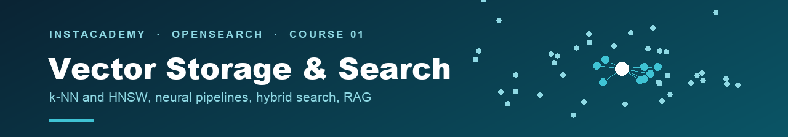

← [InstAcademy](../../README.md) · [OpenSearch track](../README.md)

# Optimizing OpenSearch Vector Storage and Search for Faster AI Applications

🎯 Intermediate to Advanced · 🧪 **68 steps across 5 chapters** · 🔧 Dev Tools console or Bruno fast mode · 💰 Free 30-day trial cluster

**Course version 1.0** · validated end to end on **OpenSearch 3.5.0** · [changelog](CHANGELOG.md)

Build a production vector-search system on OpenSearch, one working piece at a time. You'll create k-NN indexes by hand, deploy an embedding model inside your cluster, run semantic and hybrid searches over real book data, tune a RAG retrieval layer until you can measure the improvement, and finish by connecting an AI agent to the index you built.

Everything is hands-on: every step is a real request against your own cluster.

> [!IMPORTANT]
> Every **Expected** response printed in this course is the actual output from a live OpenSearch 3.5.0 run, not an idealized example. If a step doesn't do what the page says, that's worth [an issue](https://github.com/instaclustr/instacademy/issues/new/choose).

## Start here

| | |
|---|---|
| **1. [Set up your cluster](CLUSTER-SETUP.md)** | Sign up for a free trial, create an OpenSearch cluster with the AI Search Plugin, open the firewall, and collect your connection details. About 15 minutes |
| **2. [Learn how to run the labs](HANDS-ON-GUIDE.md)** | How a chapter is laid out, how to reach Dev Tools, and the two ways to run each step. Read this once |
| **3. [Start Chapter 1](chapters/01-configuring-vector-search/README.md)** | Build your first vector index and search it |

## 📚 The five chapters

| # | Chapter | What you build | Steps |
|---|---|---|---|
| **1** | [Configuring and optimizing vector search](chapters/01-configuring-vector-search/README.md) | k-NN indexes from scratch: HNSW and IVF, quantization, storage modes, and the memory and shard levers everything else builds on | 16 |
| **2** | [Building neural search pipelines](chapters/02-neural-search-pipelines/README.md) | Deploy a real embedding model inside the cluster, embed documents at ingest time, and search by meaning instead of keywords | 13 |
| **3** | [Mastering hybrid search](chapters/03-hybrid-search/README.md) | Sparse encoding, then hybrid search: compare lexical, sparse, dense, and two ways of fusing them side by side on the same query | 13 |
| **4** | [RAG optimization](chapters/04-rag-optimization/README.md) | A production retrieval layer: chunking, filtered k-NN, reranking with business rules, measured quality, and an AI agent querying your index over MCP | 15 |
| **5** | [Production optimizations](chapters/05-production-optimizations/README.md) | Break a cluster and triage it back to green, automate the index lifecycle, prove what fp16 quantization saves, and tune queries with real measurements | 11 |

Work the chapters in order. Each one reuses indexes, models, or pipelines built in the last.

## 💰 What this costs

> [!NOTE]
> **Nothing.** The course is free, and the NetApp Instaclustr platform it runs on is provided as a free 30-day trial. Anything still running when the trial ends is removed automatically, so there is no bill to avoid and nothing to cancel.
>
> Every chapter still ends with a **Cleanup** section. That is housekeeping, not cost. A trial cluster is small, and models and indexes left deployed from one chapter take up node memory the next chapter wants.

## 🧪 Two ways through every lab

| Mode | How | Use it when |
|---|---|---|
| **Dev Tools** | Paste each request into the OpenSearch Dashboards console | First time through, so you see every request and every response |
| **Fast mode** | Run the matching `.bru` from [`bruno/`](bruno/) | Re-running, demoing, or checking a fix |

The chapter README is the source of truth. Bulk payloads are printed in full so you can copy any block and run it as written; the `.ndjson` beside each Bruno request is a byte-identical mirror.

## What's in this folder

| Path | What it is |
|---|---|
| [`chapters/`](chapters/01-configuring-vector-search/) | The five chapter workshops. This is the course |
| [`bruno/`](bruno/) | Fast mode: every request in the course as a Bruno collection, with the bulk data each chapter sends |
| [`assets/`](assets/) | Diagrams and console captures used by the chapters |
| [`scripts/`](scripts/) | `validate.sh`, which checks the course is internally consistent |
| [`CLUSTER-SETUP.md`](CLUSTER-SETUP.md) | Sign-up, cluster creation, firewall, connection details |
| [`HANDS-ON-GUIDE.md`](HANDS-ON-GUIDE.md) | How to run the labs |
| [`CHANGELOG.md`](CHANGELOG.md) | Course versions and which OpenSearch version each was validated on |

## What you need

- An OpenSearch cluster with the **AI Search Plugin**, which bundles k-NN and ML Commons. [Cluster setup](CLUSTER-SETUP.md) walks through creating one on the NetApp Instaclustr free trial.
- **OpenSearch 3.5 or later**, from the Instaclustr platform.
- No Python required. Chapter 4's final step is **optional** and needs Claude Desktop and Node 18+.

> [!NOTE]
> **You do not have to use the Instaclustr trial.** Any OpenSearch 3.5+ cluster works, self-hosted or managed elsewhere, as long as **k-NN** and **ML Commons** are available and you can reach it over HTTPS with basic auth. The trial is simply the fastest way to get one, and it is what the course was validated on.
>
> If you are bringing your own cluster, skip to [Collect your connection details](CLUSTER-SETUP.md#4-collect-your-connection-details) — the screens before it are specific to the Instaclustr console. Everything from Chapter 1 onward is plain OpenSearch API calls.

## 🏅 Finished the course?

Badges are issued from the **InstAcademy library**, and completion has two halves: the video series and these hands-on labs.

When you've done both: [request your badge](https://github.com/instaclustr/instacademy/issues/new?template=course-completion.yml) with your name and a tick against each half, then fill in the badge form it links to. The form is where your email goes. Issues here are public, so we don't collect it in them.

## Contributing

Found a step that doesn't work? Please [open an issue](https://github.com/instaclustr/instacademy/issues/new/choose). See [`CONTRIBUTING.md`](../../CONTRIBUTING.md) for what to include and the house rules for changes, and [`SECURITY.md`](../../SECURITY.md) for credential handling and the lab shortcuts that are not production practice.

---

🚀 **Next:** [Chapter 1 · Configuring and optimizing vector search](chapters/01-configuring-vector-search/README.md)
← [OpenSearch track](../README.md) · [InstAcademy](../../README.md)
