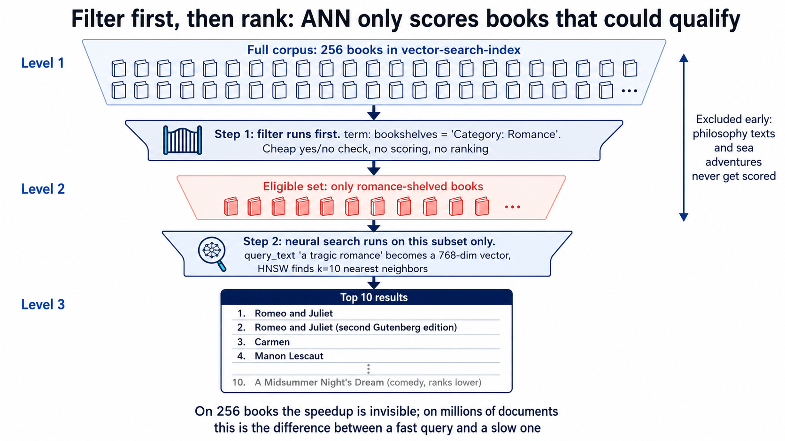

← **Previous:** [Chapter 1](../01-configuring-vector-search/README.md) · [Course index](../../README.md) · [How to run labs](../../HANDS-ON-GUIDE.md) · **Next:** [Chapter 3](../03-hybrid-search/README.md) →
# Chapter 2 — Building neural search pipelines

🎯 Chapter 2 of 5 · 🧪 **13 steps** · 🔧 Dev Tools console or [Bruno fast mode](../../bruno/02-neural-search-pipelines/) · 💰 Cluster must be `RUNNING`

In Chapter 1 you built vector indexes by hand, typing 8-dimensional vectors
This chapter removes the pre-created vectors. You'll deploy a real 
sentence-transformer model **inside your cluster**, and from that point on 
OpenSearch does the translation for you: every document you index gets embedded 
automatically as it arrives, and every search you run (plain English, no vectors 
in sight) gets embedded the same way and matched by *meaning*.

That unlocks the moment this course has been building toward: you'll type
*"an ambitious scientist who comes to regret his own creation"* into a
256-book index and watch **Frankenstein** climb into the top handful of
results on the strength of its meaning alone. Along the way you'll learn the ML Commons
lifecycle (register, deploy, infer) that every production neural-search
deployment is built on, wire the model into an ingest pipeline so embedding
happens invisibly at write time, and finish by tuning the cluster, index, and
query layers so all of it stays fast under real load.

Let's get started!

## 🎯 What you will build

```
Raw text ─▶ Ingest pipeline (text_embedding) ─▶ 768-dim vector ─▶ k-NN index
                                                                      │
Natural-language query ─▶ same model ─▶ query vector ─▶ ANN search ─▶ semantic results
```

By the end you will have registered and deployed a sentence-transformer model with ML Commons, wired it into an ingest pipeline, bulk-loaded books, run semantic and hybrid queries, compared dense vs. sparse embeddings, inspected the model lifecycle, and tuned the cluster/index/query layers for neural search.

## 📋 Prerequisites

- [Cluster setup](../../CLUSTER-SETUP.md) — an Instaclustr cluster with the **AI Search / ML Commons** plugin and your IP on the firewall.
- **Dev Tools** open (or Bruno fast mode: [`bruno/02-neural-search-pipelines/`](../../bruno/02-neural-search-pipelines/)).
- A notepad (or the Bruno **Local** environment) for ids returned by ML Commons:

---

## Lesson 2-1 — Setting up your pipeline

We will start by registering and deploying `msmarco-distilbert-base-tas-b` with ML Commons, then smoke-test the embedding inference.

Neural search needs a model that turns text into vectors **inside** the cluster. ML Commons is OpenSearch's built-in framework for that: you **register** a model (metadata + artifact download), **deploy** it (load weights into node memory), and then any ingest pipeline or query can call it — no external model server to host, scale, or monitor.


### Step 1 — Enable ML Commons cluster settings


A few persistent settings make model registration/deployment reliable on a small managed cluster:

- **`allow_registering_model_via_url`** — lets ML Commons fetch model artifacts from external URLs. Not strictly required for OpenSearch-provided pretrained models registered by *name + version*, but needed if you later register a custom `model_url`, so we turn it on now.
- **`only_run_on_ml_node: false`** — our cluster has **no dedicated ML nodes**. This lets the model load on data nodes; otherwise deploy fails with "no ML node found." ([docs](https://docs.opensearch.org/latest/ml-commons-plugin/pretrained-models/))
- **`model_access_control_enabled: false`** — keeps model-group access simple for the lab (no backend-role wiring).
- **`native_memory_threshold: 99`** — raises the guard that blocks deployment when native memory is scarce, so a trial cluster doesn't refuse a small model.

**Request:**

```http
PUT _cluster/settings
{
  "persistent": {
    "plugins.ml_commons.allow_registering_model_via_url": true,
    "plugins.ml_commons.only_run_on_ml_node": false,
    "plugins.ml_commons.model_access_control_enabled": false,
    "plugins.ml_commons.native_memory_threshold": 99
  }
}
```

**Expected** - `acknowledged: true` with the four keys echoed under `ml_commons`.

```http
{
  "acknowledged": true,
  "persistent": {
    "plugins": {
      "ml_commons": {
        "only_run_on_ml_node": "false",
        "model_access_control_enabled": "false",
        "native_memory_threshold": "99",
        "allow_registering_model_via_url": "true"
      }
    }
  },
  "transient": {}
}
```

**Fast mode** `bruno/02-neural-search-pipelines/02-enable-url-model-registration.bru`

### Step 2 — Register a model group

Every ML Commons model belongs to a **model group** — the unit of organization and access control. Create it once, then pass its id into the model registration.

**Request:**

```http
POST _plugins/_ml/model_groups/_register
{
  "name": "huggingface-models",
  "description": "A group for Hugging Face transformer models"
}
```

**Expected Output:**

```json
{
  "model_group_id": "*************",
  "status": "CREATED"
}
```

**IMPORTANT** Save the `model_group_id` for Step 3.

**Fast mode** `bruno/02-neural-search-pipelines/03-register-model-group.bru`

### Step 3 — Register the embedding model

Registering the model downloads and validates the pretrained **`msmarco-distilbert-base-tas-b`** artifact on the cluster and assigns it a **`model_id`**. `TORCH_SCRIPT` selects the TorchScript serialization. This runs asynchronously and returns a `task_id`.


Replace `YOUR_MODEL_GROUP_ID` with the id from Step 2.

**Request:**

```http
POST _plugins/_ml/models/_register
{
  "name": "huggingface/sentence-transformers/msmarco-distilbert-base-tas-b",
  "version": "1.0.3",
  "model_group_id": "YOUR_MODEL_GROUP_ID",
  "model_format": "TORCH_SCRIPT"
}
```

**Expected Output:**

```json
{
  "task_id": "*********************",
  "status": "CREATED"
}
```

**Poll** every few minutes until complete (it should only take 2-3 minutes):

```http
GET _plugins/_ml/tasks/YOUR_TASK_ID
```

**Expected** - The state should be **COMPLETED**.

```json
{
  "model_id": "reTaWZ8BjIhEDJv_aMk7",
  "task_type": "REGISTER_MODEL",
  "function_name": "TEXT_EMBEDDING",
  "state": "COMPLETED",
  "worker_node": [
    "w5pYbppFT6-lxuh62xqkmw"
  ],
  "create_time": 1783918912487,
  "last_update_time": 1783918970486,
  "is_async": true
}
```

**IMPORTANT** Save the `model_id`. This is your dense **`ML_MODEL_ID`** for the rest of the chapter.

> **Note.** `version: 1.0.3` and `model_format: TORCH_SCRIPT` are the current values for this model in the OpenSearch pretrained-model repository, which outputs **768-dimensional** vectors. ([docs](https://docs.opensearch.org/latest/ml-commons-plugin/pretrained-models/)) The video's "384-dimensional" line is a *generic* example — always match your index `dimension` to the model you actually deploy (768 here).

**Fast mode** `bruno/02-neural-search-pipelines/04-register-model.bru`, then poll with `05-poll-ml-task.bru` (set `taskId`).

### Step 4 — Deploy the model

Registration stores the artifact on disk; **deploy** loads it into node memory so `_predict`, ingest pipelines, and neural queries can run inference. The model moves `DEPLOYING → DEPLOYED`.

Replace `YOUR_MODEL_ID` with the id from Step 3.

**Request:**

```http
POST _plugins/_ml/models/YOUR_MODEL_ID/_deploy
```

**Expected** - "DEPLOY_MODEL" should appear as "CREATED"

```json
{
  "task_id": "hBveWZ8BCKwDOnnOhxwG",
  "task_type": "DEPLOY_MODEL",
  "status": "CREATED"
}
```

**Poll** the deploy task the same way until it shows `"state":"COMPLETED"`:

```http
GET _plugins/_ml/tasks/YOUR_TASK_ID
```

**Expected** - The task **Completes** successfully.

```json
{
  "model_id": "reTaWZ8BjIhEDJv_aMk7",
  "task_type": "DEPLOY_MODEL",
  "function_name": "TEXT_EMBEDDING",
  "state": "COMPLETED",
  "worker_node": [
    "SEDgR4UkS96_RaYdAdJMMw",
    "w5pYbppFT6-lxuh62xqkmw",
    "F9CA3Sq3ReSvZdflXArfzA"
  ],
  "create_time": 1783919183571,
  "last_update_time": 1783919223726,
  "is_async": true
}
```

**IMPORTANT** Write down the `model_id`. Every later step that says `YOUR_MODEL_ID` means this value (in Bruno, set `modelId` in the **Local** environment).

**Fast mode** `bruno/02-neural-search-pipelines/06-deploy-model.bru`, then `07-poll-ml-task-deploy.bru`.

### Step 5 — Smoke-test embedding inference

The smoke-test proves the deployed model returns vectors **before** you attach it to a pipeline. Text-embedding models are dispatched by algorithm, so they use the `/_predict/text_embedding/{model_id}` route (mixing this up returns a 400).

Let's give it a try:

**Request:**

```http
POST _plugins/_ml/_predict/text_embedding/YOUR_MODEL_ID
{
  "text_docs": ["Some example text to embed.", "Another sentence for testing."],
  "return_number": true,
  "target_response": ["sentence_embedding"]
}
```

**Expected** - `inference_results` should have one `sentence_embedding` per input, each is a **768-float** dense vector (every position populated).

```json
{
  "inference_results": [
    {
      "output": [
        {
          "name": "sentence_embedding",
          "data_type": "FLOAT32",
          "shape": [
            768
          ],
          "data": [
            0.2732729,
            -0.050631694,
            -0.2571997,
            0.17102742,
            0.064087264,
            0.13233605,...
```

**Fast mode** `bruno/02-neural-search-pipelines/08-text-embedding-predict.bru`

---

## Lesson 2-2 — Ingesting data and running queries

*In this lesson you'll wire the deployed model into an ingest pipeline, bulk-load a 256-book catalog, and run your first semantic and hybrid queries against `vector-search-index`.*

Think of an ingest pipeline as a checkpoint that every document passes through on its way into an index. It is a named, server-side chain of **processors**, and each processor gets a chance to transform the document before it is stored. Ours will hold a single `text_embedding` processor: it reads the document's text, calls the model you just deployed, and writes the resulting 768-dimension vector into the document alongside the original text.

Attach that pipeline to an index as its `default_pipeline` and the whole embedding workflow disappears from view: clients write plain text, exactly as they would to any ordinary index, and OpenSearch quietly embeds every document as it arrives. There is no application-side embedding code to maintain and no batch job to schedule, and it behaves identically whether you index one document or bulk-insert thousands.


**IMPORTANT** Order matters: We need to create the **pipeline** before the **index** (the index references it in `default_pipeline`).

### Step 6 — Create the ingest pipeline

Time to put your model to work. This pipeline holds a single **`text_embedding`** processor, and its job is simple: every time a document arrives, read the `passage_text` field, hand it to your deployed model, and tuck the returned vector into a new `passage_embedding` field. The `field_map` is where you spell that out, in the form `{ source_field: vector_field }`. You define this once, and from here on you never have to think about embeddings at index time again.

Replace `YOUR_MODEL_ID` with the `ML_MODEL_ID` you saved in Step 3.

> **Lost your `ML_MODEL_ID`?** No need to re-register anything. Search the model registry for it:
>
> ```http
> POST _plugins/_ml/models/_search
> {
>   "query": {
>     "bool": {
>       "must": [ { "match": { "name": "msmarco-distilbert-base-tas-b" } } ],
>       "must_not": [ { "exists": { "field": "chunk_number" } } ]
>     }
>   },
>   "_source": ["name", "model_state", "model_version", "algorithm"],
>   "size": 5
> }
> ```
>
> You should get exactly **one hit** — its `_id` is your `model_id`, and `model_state` should say `DEPLOYED`. 

**Request:**

```http
PUT _ingest/pipeline/vector-search-embeddings-pipeline
{
  "description": "Generate passage_embedding from passage_text at index time",
  "processors": [
    {
      "text_embedding": {
        "model_id": "YOUR_MODEL_ID",
        "field_map": {
          "passage_text": "passage_embedding"
        }
      }
    }
  ]
}
```

**Expected** - 'acknowledged = true'

```json
{
  "acknowledged": true
}
```

**Fast mode** `bruno/02-neural-search-pipelines/09-create-ingest-pipeline.bru`

### Step 7 — Create the vector search index

Now you need somewhere for those embedded documents to live. This index looks a
lot like the ones you built in Chapter 1 (a `knn_vector` field with an HNSW
method), but with two important upgrades. First, the `dimension` is no longer a
just a number you picked: it is **768**, dictated by the model, and it has to match
exactly. Second, and this is the magic line, the index names your pipeline as
its `default_pipeline`. That single setting is what connects the plumbing:
documents written to this index automatically flow through the pipeline from
Step 6 and come out the other side with their embeddings attached. Notice the
mapping declares `passage_embedding` even though your documents won't contain
it; the pipeline fills it in.

**Why each setting matters:** 

- **`index.knn: true`** — enables ANN query support for `knn_vector` fields.
- **`default_pipeline`** — every document indexed here runs through the embeddings pipeline automatically.
- **`dimension: 768`** — must match the model's output; a mismatch fails ingestion.
- **`engine: lucene`, `name: hnsw`, `space_type: l2`** — a solid, easy-to-operate HNSW baseline.

**Request:**

```http
PUT vector-search-index
{
  "settings": {
    "index.knn": true,
    "default_pipeline": "vector-search-embeddings-pipeline"
  },
  "mappings": {
    "properties": {
      "id": { "type": "text" },
      "title": { "type": "text" },
      "authors": { "type": "object", "enabled": false },
      "subjects": { "type": "keyword" },
      "bookshelves": { "type": "keyword" },
      "passage_text": { "type": "text" },
      "passage_embedding": {
        "type": "knn_vector",
        "dimension": 768,
        "method": {
          "engine": "lucene",
          "space_type": "l2",
          "name": "hnsw",
          "parameters": {}
        }
      }
    }
  }
}
```

**Expected** - results should look like the output below:

```json
{
  "acknowledged": true,
  "shards_acknowledged": true,
  "index": "vector-search-index"
}
```

**Fast mode** `bruno/02-neural-search-pipelines/10-create-vector-search-index.bru`

### Step 8 — Bulk-index the book dataset

This is where your pipeline earns its keep. You're about to load 256 real book summaries, and notice what the payload does *not* contain: a single vector. Every document is plain text, and as each one lands, the default pipeline hands its `passage_text` to the model and stores the embedding for you. That also means this is the slowest command in the chapter: 256 documents means 256 model inferences, so expect **several minutes** on a trial cluster. A good moment to stretch your legs while the cluster does the work you used to do by hand.

**Request** - Paste this full command to insert all 256 documents.

```http
POST _bulk?timeout=600s
{"index": {"_index": "vector-search-index", "_id": "45304"}}
{"id": "45304", "title": "The City of God, Volume I", "authors": [{"name": "Augustine, of Hippo, Saint", "birth_year": 354, "death_year": 430}], "subjects": ["Apologetics -- Early works to 1800", "Kingdom of God -- Early works to 1800"], "passage_text": "\"The City of God, Volume I\" by Bishop of Hippo Saint Augustine is a work of Christian philosophy written in Latin in the early 5th century AD. Composed in response to Rome's sack by the Visigoths in 410, Augustine defends Christianity against accusations that it caused Rome's decline. He presents human history as a conflict between the Earthly City\u2014those pursuing worldly pleasures\u2014and the City of God\u2014those dedicated to eternal truths. Through theological argument and historical analysis, Augustine refutes pagan religion and philosophy while expounding on suffering, evil, free will, and original sin. (This is an automatically generated summary.)", "bookshelves": ["Category: History - Ancient", "Category: Philosophy & Ethics", "Category: Religion/Spirituality"]}
{"index": {"_index": "vector-search-index", "_id": "84"}}
{"id": "84", "title": "Frankenstein; or, the modern prometheus", "authors": [{"name": "Shelley, Mary Wollstonecraft", "birth_year": 1797, "death_year": 1851}], "subjects": ["Frankenstein's monster (Fictitious character) -- Fiction", "Frankenstein, Victor (Fictitious character) -- Fiction", "Gothic fiction", "Horror tales", "Monsters -- Fiction", "Science fiction", "Scientists -- Fiction"], "passage_text": "\"Frankenstein; Or, The Modern Prometheus\" by Mary Wollstonecraft Shelley is a Gothic novel published in 1818. It tells the story of Victor Frankenstein, a young scientist who creates a living creature from assembled body parts in an unorthodox experiment. When the creature awakens, Victor flees in horror, abandoning his creation. The conscious being must navigate a world that fears him, learning language and seeking connection, only to face repeated rejection. Embittered and alone, the creature confronts his creator with a desperate request that will set both on a dark path of vengeance and tragedy. (This is an automatically generated summary.)", "bookshelves": ["Category: British Literature", "Category: Classics of Literature", "Category: Novels", "Category: Science-Fiction & Fantasy", "Gothic Fiction", "Movie Books", "Precursors of Science Fiction", "Science Fiction by Women"]}
{"index": {"_index": "vector-search-index", "_id": "2701"}}
{"id": "2701", "title": "Moby Dick; Or, The Whale", "authors": [{"name": "Melville, Herman", "birth_year": 1819, "death_year": 1891}], "subjects": ["Adventure stories", "Ahab, Captain (Fictitious character) -- Fiction", "Mentally ill -- Fiction", "Psychological fiction", "Sea stories", "Ship captains -- Fiction", "Whales -- Fiction", "Whaling -- Fiction", "Whaling ships -- Fiction"], "passage_text": "\"Moby Dick; Or, The Whale\" by Herman Melville is an epic novel published in 1851. Sailor Ishmael narrates the obsessive quest of Captain Ahab, who commands the whaling ship Pequod in pursuit of Moby Dick, a giant white sperm whale that destroyed his leg. Ahab's monomaniacal hunt for vengeance drives the ship and its diverse crew across the world's oceans, blending realistic whaling details with profound explorations of good, evil, fate, and human nature in this cornerstone of American literature. (This is an automatically generated summary.)", "bookshelves": ["Best Books Ever Listings", "Category: Adventure", "Category: American Literature", "Category: Classics of Literature", "Category: Novels"]}
{"index": {"_index": "vector-search-index", "_id": "1342"}}
{"id": "1342", "title": "Pride and Prejudice", "authors": [{"name": "Austen, Jane", "birth_year": 1775, "death_year": 1817}], "subjects": ["Courtship -- Fiction", "Domestic fiction", "England -- Fiction", "Love stories", "Sisters -- Fiction", "Social classes -- Fiction", "Young women -- Fiction"], "passage_text": "\"Pride and Prejudice\" by Jane Austen is a novel published in 1813. It follows Elizabeth Bennet, who must learn to see past first impressions and hasty judgments. With five daughters and an estate that can only pass to male heirs, the Bennet family faces financial pressure to marry well. When wealthy Mr. Darcy arrives in their countryside neighborhood, his pride and Elizabeth's prejudice set the stage for misunderstandings, hidden truths, and unexpected revelations about character and love. (This is an automatically generated summary.)", "bookshelves": ["Best Books Ever Listings", "Category: British Literature", "Category: Classics of Literature", "Category: Novels", "Category: Romance", "Harvard Classics"]}
{"index": {"_index": "vector-search-index", "_id": "2554"}}
{"id": "2554", "title": "Crime and Punishment", "authors": [{"name": "Dostoyevsky, Fyodor", "birth_year": 1821, "death_year": 1881}], "subjects": ["Crime -- Psychological aspects -- Fiction", "Detective and mystery stories", "Murder -- Fiction", "Psychological fiction", "Saint Petersburg (Russia) -- Fiction"], "passage_text": "\"Crime and Punishment\" by Fyodor Dostoevsky is a novel published in 1866. It follows Rodion Raskolnikov, an impoverished former law student in Saint Petersburg who plans to murder an unscrupulous pawnbroker. He convinces himself that certain crimes are justifiable if committed by \"extraordinary\" men pursuing higher goals. Once the deed is done, however, he is consumed by confusion, paranoia, and guilt as his theoretical justifications crumble and he faces the internal and external consequences of his actions. (This is an automatically generated summary.)", "bookshelves": ["Best Books Ever Listings", "Category: Classics of Literature", "Category: Crime, Thrillers and Mystery", "Category: Novels", "Category: Russian Literature", "Crime Fiction", "Harvard Classics"]}
{"index": {"_index": "vector-search-index", "_id": "1513"}}
{"id": "1513", "title": "Romeo and Juliet", "authors": [{"name": "Shakespeare, William", "birth_year": 1564, "death_year": 1616}], "subjects": ["Conflict of generations -- Drama", "Juliet (Fictitious character) -- Drama", "Romeo (Fictitious character) -- Drama", "Tragedies (Drama)", "Vendetta -- Drama", "Verona (Italy) -- Drama", "Youth -- Drama"], "passage_text": "\"Romeo and Juliet\" by William Shakespeare is a tragedy written between 1591 and 1595. Two young lovers from feuding Italian families meet and fall secretly in love in Verona. Their forbidden romance leads them to marry in secret with a friar's help, hoping to unite their warring households. But family hatred, violent duels, and tragic misunderstandings threaten to destroy their bond. This tale of star-crossed lovers has become the archetypal story of young love and remains one of Shakespeare's most frequently performed plays. (This is an automatically generated summary.)", "bookshelves": ["Category: British Literature", "Category: Classics of Literature", "Category: Plays/Films/Dramas", "Category: Romance"]}
{"index": {"_index": "vector-search-index", "_id": "11"}}
{"id": "11", "title": "Alice's Adventures in Wonderland", "authors": [{"name": "Carroll, Lewis", "birth_year": 1832, "death_year": 1898}], "subjects": ["Alice (Fictitious character from Carroll) -- Juvenile fiction", "Children's stories", "Fantasy fiction", "Imaginary places -- Juvenile fiction"], "passage_text": "\"Alice's Adventures in Wonderland\" by Lewis Carroll is a children's novel published in 1865. When a curious girl named Alice spots a White Rabbit with a pocket watch, she tumbles down a rabbit hole into an extraordinary fantasy world filled with peculiar anthropomorphic creatures. This pioneering work of literary nonsense plays with logic and language, creating a whimsical tale that delights both children and adults. Illustrated by John Tenniel, it helped transform children's literature from didactic instruction to pure entertainment. (This is an automatically generated summary.)", "bookshelves": ["Category: British Literature", "Category: Children & Young Adult Reading", "Category: Classics of Literature", "Category: Novels", "Children's Literature"]}
{"index": {"_index": "vector-search-index", "_id": "52106"}}
{"id": "52106", "title": "The origin and development of the moral ideas", "authors": [{"name": "Westermarck, Edward", "birth_year": 1862, "death_year": 1939}], "subjects": ["Ethics", "Ethics -- History", "Prehistoric peoples"], "passage_text": "\"The Origin and Development of the Moral Ideas\" by Edward Westermarck is a scientific publication written in the early 20th century. The work explores the emotional basis of moral judgments and concepts like right, wrong, and duty, examining the psychological and cultural factors influencing moral opinions across different societies. Westermarck aims to provide insights into moral consciousness by analyzing the roots of morality rather than establishing a definitive ethical guideline.  The opening of the text introduces Westermarck's motivation for writing, stemming from a discussion about moral treatment of individuals with differing ethical views. He expresses curiosity about the origins of varying moral ideas, leading to his extensive research over many years. The first chapter delves into the emotional origins of moral judgments, arguing that these judgments are ultimately expressions of emotions\u2014namely, disapproval and approval. Westermarck promotes the idea that moral concepts are generalizations of tendencies to elicit emotional responses, positioning moral psychology as the crux of ethical discourse. (This is an automatically generated summary.)", "bookshelves": ["Category: Philosophy & Ethics", "Category: Psychiatry/Psychology", "Category: Sociology"]}
{"index": {"_index": "vector-search-index", "_id": "2641"}}
{"id": "2641", "title": "A Room with a View", "authors": [{"name": "Forster, E. M. (Edward Morgan)", "birth_year": 1879, "death_year": 1970}], "subjects": ["British -- Italy -- Fiction", "England -- Fiction", "Florence (Italy) -- Fiction", "Humorous stories", "Young women -- Fiction"], "passage_text": "\"A Room with a View\" by E. M. Forster is a novel published in 1908. Young Lucy Honeychurch travels to Italy with her uptight cousin as chaperone, where an unexpected encounter with the unconventional George Emerson stirs confusing emotions. Back in England, Lucy becomes engaged to the sophisticated but pompous Cecil Vyse. When the Emersons move nearby, Lucy must confront her true feelings and decide between societal expectations and genuine passion in Edwardian England's restrained culture. (This is an automatically generated summary.)", "bookshelves": ["Category: British Literature", "Category: Novels", "Category: Romance", "Italy"]}
{"index": {"_index": "vector-search-index", "_id": "43"}}
{"id": "43", "title": "The strange case of Dr. Jekyll and Mr. Hyde", "authors": [{"name": "Stevenson, Robert Louis", "birth_year": 1850, "death_year": 1894}], "subjects": ["Horror tales", "London (England) -- Fiction", "Multiple personality -- Fiction", "Physicians -- Fiction", "Psychological fiction", "Science fiction", "Self-experimentation in medicine -- Fiction"], "passage_text": "\"The Strange Case of Dr. Jekyll and Mr. Hyde\" by Robert Louis Stevenson is a Gothic horror novella published in 1886. When London lawyer Gabriel John Utterson investigates strange occurrences involving his old friend Dr. Henry Jekyll and a murderous criminal named Edward Hyde, he uncovers a disturbing mystery. This defining work of Gothic horror explores the duality of human nature and has profoundly influenced popular culture, making \"Jekyll and Hyde\" synonymous with hidden evil beneath respectable appearances. (This is an automatically generated summary.)", "bookshelves": ["Category: British Literature", "Category: Classics of Literature", "Category: Crime, Thrillers and Mystery", "Category: Novels", "Horror", "Movie Books", "Precursors of Science Fiction"]}
{"index": {"_index": "vector-search-index", "_id": "100"}}
{"id": "100", "title": "The Complete Works of William Shakespeare", "authors": [{"name": "Shakespeare, William", "birth_year": 1564, "death_year": 1616}], "subjects": ["English drama -- Early modern and Elizabethan, 1500-1600"], "passage_text": "\"The Complete Works of William Shakespeare\" by William Shakespeare is a comprehensive collection containing all of Shakespeare's plays and poems. This standard volume gathers the playwright's entire output, including histories, tragedies, and comedies that have shaped literature for centuries. Some editions feature collaborative works with other writers, though their authorship remains debated. Published by numerous academic presses and major publishers, these collected editions have become prized possessions for book collectors, often released in luxurious leather-bound formats that preserve Shakespeare's timeless literary legacy. (This is an automatically generated summary.)", "bookshelves": ["Category: British Literature", "Category: Classics of Literature", "Category: Plays/Films/Dramas", "Category: Poetry", "Plays"]}
{"index": {"_index": "vector-search-index", "_id": "1184"}}
{"id": "1184", "title": "The Count of Monte Cristo", "authors": [{"name": "Dumas, Alexandre", "birth_year": 1802, "death_year": 1870}, {"name": "Maquet, Auguste", "birth_year": 1813, "death_year": 1888}], "subjects": ["Adventure stories", "Dant\u00e8s, Edmond (Fictitious character) -- Fiction", "France -- History -- 19th century -- Fiction", "Historical fiction", "Pirates -- Fiction", "Prisoners -- Fiction", "Revenge -- Fiction"], "passage_text": "\"The Count of Monte Cristo\" by Alexandre Dumas and Auguste Maquet is an adventure novel serialized from 1844 to 1846. When sailor Edmond Dant\u00e8s is falsely accused and imprisoned on his wedding day, he spends fourteen years in solitary confinement. After a daring escape and the discovery of a vast hidden treasure, he reinvents himself as the wealthy Count of Monte Cristo. Returning to Paris, he methodically infiltrates high society to confront the three men who destroyed his life, exploring themes of justice, vengeance, mercy, and forgiveness. (This is an automatically generated summary.)", "bookshelves": ["Adventure", "Category: Adventure", "Category: Classics of Literature", "Category: French Literature", "Category: Novels", "Movie Books"]}
{"index": {"_index": "vector-search-index", "_id": "8492"}}
{"id": "8492", "title": "The King in Yellow", "authors": [{"name": "Chambers, Robert W. (Robert William)", "birth_year": 1865, "death_year": 1933}], "subjects": ["Horror tales, American", "Short stories, American", "United States -- Social life and customs -- 19th century -- Fiction"], "passage_text": "\"The King in Yellow\" by Robert W. Chambers is a collection of short stories published in 1895. The book opens with supernatural horror tales connected by a forbidden play that drives readers to madness. A mysterious entity called the King in Yellow, an eerie Yellow Sign, and the cursed play itself haunt the first four stories, set in a future 1920s America and Paris. The collection gradually shifts tone, ending with romantic tales, but the opening horror stories have earned acclaim as classics of weird fiction. (This is an automatically generated summary.)", "bookshelves": ["Category: American Literature", "Category: Crime, Thrillers and Mystery", "Category: Science-Fiction & Fantasy", "Category: Short Stories", "Horror"]}
{"index": {"_index": "vector-search-index", "_id": "145"}}
{"id": "145", "title": "Middlemarch", "authors": [{"name": "Eliot, George", "birth_year": 1819, "death_year": 1880}], "subjects": ["Bildungsromans", "City and town life -- Fiction", "Didactic fiction", "Domestic fiction", "England -- Fiction", "Love stories", "Married people -- Fiction", "Young women -- Fiction"], "passage_text": "\"Middlemarch\" by George Eliot is a novel published in 1871-1872. Set in a fictional English Midlands town from 1829 to 1832, it weaves together multiple intersecting stories exploring the status of women, marriage, idealism, and political reform. The narrative follows Dorothea Brooke's search for purpose, Dr. Lydgate's medical ambitions, and several other inhabitants navigating love, debt, scandal, and social change against the backdrop of the approaching Reform Act of 1832. (This is an automatically generated summary.)", "bookshelves": ["Best Books Ever Listings", "Category: British Literature", "Category: Classics of Literature", "Category: Novels", "Historical Fiction"]}
{"index": {"_index": "vector-search-index", "_id": "64317"}}
{"id": "64317", "title": "The Great Gatsby", "authors": [{"name": "Fitzgerald, F. Scott (Francis Scott)", "birth_year": 1896, "death_year": 1940}], "subjects": ["First loves -- Fiction", "Long Island (N.Y.) -- Fiction", "Married women -- Fiction", "Psychological fiction", "Rich people -- Fiction"], "passage_text": "\"The Great Gatsby\" by F. Scott Fitzgerald is a novel published in 1925. Set in the Jazz Age on Long Island, it follows narrator Nick Carraway as he becomes drawn into the world of his mysterious neighbor, Jay Gatsby, a wealthy millionaire who throws extravagant parties. Gatsby harbors an obsession with reuniting with Daisy Buchanan, a woman from his past now married to the affluent Tom. The story captures the glamour, excess, and moral complexities of 1920s America. (This is an automatically generated summary.)", "bookshelves": ["Category: American Literature", "Category: Classics of Literature", "Category: Novels"]}
{"index": {"_index": "vector-search-index", "_id": "1260"}}
{"id": "1260", "title": "Jane Eyre: An Autobiography", "authors": [{"name": "Bront\u00eb, Charlotte", "birth_year": 1816, "death_year": 1855}], "subjects": ["Bildungsromans", "Charity-schools -- Fiction", "Country homes -- Fiction", "England -- Fiction", "Fathers and daughters -- Fiction", "Governesses -- Fiction", "Love stories", "Married people -- Fiction", "Mentally ill women -- Fiction", "Orphans -- Fiction", "Young women -- Fiction"], "passage_text": "\"Jane Eyre: An Autobiography\" by Charlotte Bront\u00eb is a novel published in 1847. It follows the life of Jane Eyre from her oppressed childhood through her education and into adulthood, where she becomes governess at Thornfield Hall and falls in love with the mysterious Mr. Rochester. Told through intimate first-person narrative, this groundbreaking bildungsroman explores moral and spiritual development while addressing class, religion, sexuality, and feminism. The story unfolds across five distinct stages, each shaping Jane's journey toward independence and belonging. (This is an automatically generated summary.)", "bookshelves": ["Category: British Literature", "Category: Classics of Literature", "Category: Novels", "Category: Romance"]}
{"index": {"_index": "vector-search-index", "_id": "67979"}}
{"id": "67979", "title": "The Blue Castle: a novel", "authors": [{"name": "Montgomery, L. M. (Lucy Maud)", "birth_year": 1874, "death_year": 1942}], "subjects": ["Canada -- History -- 1914-1945 -- Fiction", "Choice (Psychology) -- Fiction", "Love -- Fiction", "Romance fiction", "Self-actualization (Psychology) -- Fiction", "Single women -- Fiction", "Young adult fiction"], "passage_text": "\"The Blue Castle: a novel by L. M. Montgomery\" is a novel published in 1926. Twenty-nine-year-old Valancy Stirling has spent her entire life suffocated by her controlling family's expectations. When she receives a shocking medical diagnosis, she decides to finally break free and live on her own terms. She scandalizes her relatives by speaking her mind, moving out, and eventually proposing marriage to the mysterious and supposedly disreputable Barney Snaith. Together they build a new life on a remote island\u2014but secrets still linger. (This is an automatically generated summary.)", "bookshelves": ["Category: Novels", "Category: Romance"]}
{"index": {"_index": "vector-search-index", "_id": "58031"}}
{"id": "58031", "title": "Report of the President's Commission on the Assassination of President John F. Kennedy", "authors": [{"name": "United States. Warren Commission", "birth_year": null, "death_year": null}], "subjects": ["Kennedy, John F. (John Fitzgerald), 1917-1963 -- Assassination", "Oswald, Lee Harvey"], "passage_text": "\"Report of the President's Commission on the Assassination of President John F. Kennedy\" by the Warren Commission is a historical account written in the mid-20th century. The report documents the investigation into the assassination of U.S. President John F. Kennedy, focusing on the events surrounding the shooting and the subsequent apprehension of the accused assassin, Lee Harvey Oswald. The text covers the assassination\u2019s impact on the nation and presents findings regarding Oswald's actions and motivations, as well as broader implications for presidential security.  The opening of the report outlines the commission's formation following Kennedy's assassination on November 22, 1963, detailing its responsibilities to investigate and present the factual narrative surrounding this tragic event. It describes the immediate chaos following the assassination, the involvement of local authorities, and the swift actions taken by investigative agencies leading to the arrest of Lee Harvey Oswald. Important details about the timeline of events and the evidence collected are laid out, setting the stage for a systematic exploration of the facts leading to the assassination and its aftermath. The commission emphasizes its objective to provide a thorough account while exploring the circumstances that led to such a national tragedy. (This is an automatically generated summary.)", "bookshelves": ["Category: History - American", "Category: History - Modern (1750+)", "Category: Reports & Conference Proceedings"]}
{"index": {"_index": "vector-search-index", "_id": "37106"}}
{"id": "37106", "title": "Little Women; Or, Meg, Jo, Beth, and Amy", "authors": [{"name": "Alcott, Louisa May", "birth_year": 1832, "death_year": 1888}], "subjects": ["Autobiographical fiction", "Bildungsromans", "Domestic fiction", "Family life -- New England -- Fiction", "March family (Fictitious characters) -- Fiction", "Mothers and daughters -- Fiction", "New England -- Fiction", "Sisters -- Fiction", "Young women -- Fiction"], "passage_text": "\"Little Women; Or, Meg, Jo, Beth, and Amy\" by Louisa May Alcott is a coming-of-age novel published in 1868-1869. The story follows four sisters\u2014Meg, Jo, Beth, and Amy March\u2014as they navigate the passage from childhood to womanhood in Civil War-era Massachusetts. Loosely based on Alcott's own family, the novel explores themes of domesticity, work, and love while depicting the joys and struggles of nineteenth-century women's lives. Through their adventures and challenges, the March sisters embody different aspects of young American womanhood. (This is an automatically generated summary.)", "bookshelves": ["Category: American Literature", "Category: Children & Young Adult Reading", "Category: Classics of Literature", "Category: Novels"]}
{"index": {"_index": "vector-search-index", "_id": "5197"}}
{"id": "5197", "title": "My Life \u2014 Volume 1", "authors": [{"name": "Wagner, Richard", "birth_year": 1813, "death_year": 1883}], "subjects": ["Composers -- Germany -- Biography", "Wagner, Richard, 1813-1883"], "passage_text": "\"My Life \u2014 Volume 1\" by Richard Wagner is an autobiography written between 1865 and 1880, covering his life from birth in 1813 to 1864. Dictated to his mistress Cosima von B\u00fclow at the request of King Ludwig II of Bavaria, Wagner recounts his tempestuous career, friendships, and controversies in surprisingly frank detail. Originally printed in limited editions for private circulation, the memoir sparked rumors due to its restricted availability. The work offers a racy, readable account of Wagner's development and the musical world of his era, though his subjective perspective reveals condescending views toward contemporaries and attacks on rival composers. (This is an automatically generated summary.)", "bookshelves": ["Category: Biographies", "Category: Music"]}
{"index": {"_index": "vector-search-index", "_id": "844"}}
{"id": "844", "title": "The Importance of Being Earnest: A Trivial Comedy for Serious People", "authors": [{"name": "Wilde, Oscar", "birth_year": 1854, "death_year": 1900}], "subjects": ["Comedy plays", "England -- Drama", "Foundlings -- Drama", "Identity (Psychology) -- Drama"], "passage_text": "\"The Importance of Being Earnest: A Trivial Comedy for Serious People\" by Oscar Wilde is a play first performed in 1895. Two young gentlemen lead double lives, each pretending to be named Ernest to escape social duties and win the hearts of their beloveds. Filled with sharp wit and clever wordplay, the farcical comedy gently mocks Victorian society through memorable characters including the formidable Lady Bracknell. The play parodies theatrical conventions while exploring themes of identity, deception, and the absurdities of proper society. (This is an automatically generated summary.)", "bookshelves": ["Category: British Literature", "Category: Plays/Films/Dramas", "Plays"]}
{"index": {"_index": "vector-search-index", "_id": "345"}}
{"id": "345", "title": "Dracula", "authors": [{"name": "Stoker, Bram", "birth_year": 1847, "death_year": 1912}], "subjects": ["Dracula, Count (Fictitious character) -- Fiction", "Epistolary fiction", "Gothic fiction", "Horror tales", "Transylvania (Romania) -- Fiction", "Vampires -- Fiction", "Whitby (England) -- Fiction"], "passage_text": "\"Dracula\" by Bram Stoker is a Gothic horror novel published in 1897. Told through letters, diary entries, and newspaper articles, the story follows solicitor Jonathan Harker's terrifying encounter with Count Dracula in Transylvania. When the vampire Count travels to England and begins preying on victims in Whitby, a small group led by Professor Abraham Van Helsing must hunt him down. This seminal work of Gothic fiction has become the centrepiece of vampire literature, profoundly shaping the popular conception of vampires for generations. (This is an automatically generated summary.)", "bookshelves": ["Category: British Literature", "Category: Classics of Literature", "Category: Crime, Thrillers and Mystery", "Category: Novels", "Category: Science-Fiction & Fantasy", "Gothic Fiction", "Horror", "Movie Books", "Mystery Fiction"]}
{"index": {"_index": "vector-search-index", "_id": "768"}}
{"id": "768", "title": "Wuthering Heights", "authors": [{"name": "Bront\u00eb, Emily", "birth_year": 1818, "death_year": 1848}], "subjects": ["Domestic fiction", "Foundlings -- Fiction", "Heathcliff (Fictitious character : Bront\u00eb) -- Fiction", "Love stories", "Psychological fiction", "Rejection (Psychology) -- Fiction", "Revenge -- Fiction", "Rural families -- Fiction", "Triangles (Interpersonal relations) -- Fiction", "Yorkshire (England) -- Fiction"], "passage_text": "\"Wuthering Heights\" by Emily Bront\u00eb is a novel published in 1847. Set on the Yorkshire moors, it follows two landowning families and their turbulent relationships with Heathcliff, a mysterious foster son. Driven by obsessive love, possession, and revenge that spans generations, the story unfolds through dark passion and cruelty. This Gothic tale challenged Victorian morality with its depictions of abuse and class conflict, ultimately becoming a cornerstone of English literature despite its initially polarized reception. (This is an automatically generated summary.)", "bookshelves": ["Best Books Ever Listings", "Category: British Literature", "Category: Classics of Literature", "Category: Novels", "Gothic Fiction", "Movie Books"]}
{"index": {"_index": "vector-search-index", "_id": "76"}}
{"id": "76", "title": "Adventures of Huckleberry Finn", "authors": [{"name": "Twain, Mark", "birth_year": 1835, "death_year": 1910}], "subjects": ["Adventure stories", "Bildungsromans", "Boys -- Fiction", "Finn, Huckleberry (Fictitious character) -- Fiction", "Fugitive slaves -- Fiction", "Humorous stories", "Male friendship -- Fiction", "Mississippi River -- Fiction", "Missouri -- Fiction", "Race relations -- Fiction", "Runaway children -- Fiction"], "passage_text": "\"Adventures of Huckleberry Finn\" by Mark Twain is a picaresque novel published in 1884-1885. Told in vernacular English, it follows young Huck Finn as he escapes his abusive father and flees down the Mississippi River with Jim, an enslaved man seeking freedom. Their journey brings encounters with feuding families, con artists, and moral dilemmas that challenge Huck's conscience. Set in the antebellum South, this sequel to \"Tom Sawyer\" is celebrated for its portrayal of boyhood and its satirical examination of racism and society. (This is an automatically generated summary.)", "bookshelves": ["Banned Books List from the American Library Association", "Banned Books from Anne Haight's list", "Best Books Ever Listings", "Category: Adventure", "Category: American Literature", "Category: Classics of Literature", "Category: Novels"]}
{"index": {"_index": "vector-search-index", "_id": "174"}}
{"id": "174", "title": "The Picture of Dorian Gray", "authors": [{"name": "Wilde, Oscar", "birth_year": 1854, "death_year": 1900}], "subjects": ["Appearance (Philosophy) -- Fiction", "Conduct of life -- Fiction", "Didactic fiction", "Great Britain -- History -- Victoria, 1837-1901 -- Fiction", "London (England) -- History -- 1800-1950 -- Fiction", "Paranormal fiction", "Portraits -- Fiction", "Supernatural -- Fiction"], "passage_text": "\"The Picture of Dorian Gray\" by Oscar Wilde is a philosophical fiction and Gothic horror novel published in 1890. When a beautiful young man wishes that his portrait would age instead of himself, his desire becomes terrifyingly real. As Dorian pursues a life of pleasure and moral corruption, he remains eternally youthful while his painted image transforms into a horrifying record of his sins. Wilde explores beauty, morality, and the dangerous influence of hedonistic philosophy in this tale of vanity and its consequences. (This is an automatically generated summary.)", "bookshelves": ["Category: British Literature", "Category: Classics of Literature", "Category: Novels", "Gothic Fiction", "Movie Books"]}
{"index": {"_index": "vector-search-index", "_id": "1259"}}
{"id": "1259", "title": "Twenty years after", "authors": [{"name": "Dumas, Alexandre", "birth_year": 1802, "death_year": 1870}, {"name": "Maquet, Auguste", "birth_year": 1813, "death_year": 1888}], "subjects": ["France -- History -- Louis XIV, 1643-1715 -- Fiction"], "passage_text": "\"Twenty years after\" by Alexandre Dumas and Auguste Maquet is a novel serialized from January to August 1845. D'Artagnan, still a lowly lieutenant after two decades, is summoned by the despised Cardinal Mazarin during France's brewing rebellion. Tasked with reuniting the legendary musketeers, he tracks down his old friends\u2014now scattered across vastly different lives. As political turmoil engulfs both France and England during the English Civil War, the four heroes must navigate their conflicting loyalties and set aside their differences for one last mission. (This is an automatically generated summary.)", "bookshelves": ["Adventure", "Category: Adventure", "Category: French Literature", "Category: Historical Novels", "Category: Novels", "Historical Fiction", "Movie Books"]}
{"index": {"_index": "vector-search-index", "_id": "1661"}}
{"id": "1661", "title": "The Adventures of Sherlock Holmes", "authors": [{"name": "Doyle, Arthur Conan", "birth_year": 1859, "death_year": 1930}], "subjects": ["Detective and mystery stories, English", "Holmes, Sherlock (Fictitious character) -- Fiction", "Private investigators -- England -- Fiction"], "passage_text": "\"The Adventures of Sherlock Holmes\" by Arthur Conan Doyle is a collection of short stories first published in 1892. These twelve tales feature the legendary consulting detective Sherlock Holmes and his companion Dr. Watson, narrated from Watson's perspective. Each mystery explores social injustices while showcasing Holmes's brilliant deductive methods and unconventional approach to justice. The stories introduce memorable characters and cases that have captivated readers for over a century, establishing Holmes as one of literature's most enduring detectives. (This is an automatically generated summary.)", "bookshelves": ["Banned Books from Anne Haight's list", "Category: British Literature", "Category: Crime, Thrillers and Mystery", "Category: Short Stories", "Contemporary Reviews", "Detective Fiction"]}
{"index": {"_index": "vector-search-index", "_id": "2542"}}
{"id": "2542", "title": "A Doll's House : a play", "authors": [{"name": "Ibsen, Henrik", "birth_year": 1828, "death_year": 1906}], "subjects": ["Man-woman relationships -- Drama", "Marriage -- Drama", "Norwegian drama -- Translations into English", "Wives -- Drama"], "passage_text": "\"A Doll's House : a play by Henrik Ibsen\" is a three-act play written in 1879. Set in a Norwegian town, it follows Nora Helmer, a married woman navigating life in a male-dominated society where opportunities for self-fulfillment are scarce. When a figure from her past threatens to expose a secret financial transgression, Nora faces a crisis that challenges everything she knows about her marriage and identity. The play sparked outraged controversy upon its premiere and remains one of the most performed works in theater history. (This is an automatically generated summary.)", "bookshelves": ["Best Books Ever Listings", "Category: Classics of Literature", "Category: Plays/Films/Dramas"]}
{"index": {"_index": "vector-search-index", "_id": "6761"}}
{"id": "6761", "title": "The Adventures of Ferdinand Count Fathom \u2014 Complete", "authors": [{"name": "Smollett, T. (Tobias)", "birth_year": 1721, "death_year": 1771}], "subjects": ["Adventure stories", "Gothic fiction"], "passage_text": "\"The Adventures of Ferdinand Count Fathom\" by Tobias Smollett is a satirical novel written in the mid-18th century. The narrative follows the cunning and morally ambiguous character of Ferdinand Count Fathom, a man of mysterious parentage armed with an extraordinary talent for deception and manipulation. The story sets the stage for themes of vice and virtue, exploring Fathom\u2019s escapades and schemes as he navigates a world ripe for exploitation.  The opening of the novel introduces Fathom in an unusual light\u2014born under strange circumstances to a mother who flitted between roles in military encampments and armies. We explore the early influence of his mother, an adventurous and fierce figure whose exploits paint a picture of a wild and unrestrained environment. As Fathom grows, he exhibits a blend of charisma and villainy, drawing the attention of powerful patrons while developing ambitions of his own. With a sharp wit and an ability to adapt, he becomes both an object of admiration and contempt, preparing the reader for a complex journey through deceit, ambition, and the nature of morality. (This is an automatically generated summary.)", "bookshelves": ["Best Books Ever Listings", "Category: British Literature", "Category: Novels"]}
{"index": {"_index": "vector-search-index", "_id": "16389"}}
{"id": "16389", "title": "The Enchanted April", "authors": [{"name": "Von Arnim, Elizabeth", "birth_year": 1866, "death_year": 1941}], "subjects": ["British -- Italy -- Fiction", "Domestic fiction", "Female friendship -- Fiction", "Italy -- Fiction", "Love stories"], "passage_text": "\"The Enchanted April\" by Elizabeth von Arnim is a novel published in 1922. Four dissimilar women escape their dreary lives in 1920s England for a month-long holiday at a medieval Italian castle. Mrs. Arbuthnot and Mrs. Wilkins struggle with unhappy marriages, Lady Caroline seeks refuge from shallow London society, and elderly Mrs. Fisher clings to her Victorian past. Despite initial tensions, the tranquil Mediterranean setting begins to work its magic on each woman, offering possibilities for transformation and renewal. (This is an automatically generated summary.)", "bookshelves": ["Bestsellers, American, 1895-1923", "Category: British Literature", "Category: Novels"]}
{"index": {"_index": "vector-search-index", "_id": "98"}}
{"id": "98", "title": "A Tale of Two Cities", "authors": [{"name": "Dickens, Charles", "birth_year": 1812, "death_year": 1870}], "subjects": ["British -- France -- Paris -- Fiction", "Executions and executioners -- Fiction", "France -- History -- Revolution, 1789-1799 -- Fiction", "French -- England -- London -- Fiction", "Historical fiction", "London (England) -- History -- 18th century -- Fiction", "Lookalikes -- Fiction", "Paris (France) -- History -- 1789-1799 -- Fiction", "War stories"], "passage_text": "\"A Tale of Two Cities\" by Charles Dickens is a historical novel published in 1859. Set in London and Paris during the tumultuous French Revolution, it follows Dr. Alexandre Manette after his mysterious 18-year imprisonment in the Bastille and his reunion with his daughter Lucie. Their lives become entangled with a French aristocrat fleeing his heritage and a dissolute English lawyer who harbors secret devotion. Against the backdrop of revolutionary terror and violence, personal sacrifices and hidden connections shape their intertwined fates. (This is an automatically generated summary.)", "bookshelves": ["Category: British Literature", "Category: Classics of Literature", "Category: Historical Novels", "Historical Fiction"]}
{"index": {"_index": "vector-search-index", "_id": "2160"}}
{"id": "2160", "title": "The Expedition of Humphry Clinker", "authors": [{"name": "Smollett, T. (Tobias)", "birth_year": 1721, "death_year": 1771}], "subjects": ["Epistolary fiction", "Great Britain -- Fiction", "Travelers -- Fiction"], "passage_text": "\"The Expedition of Humphry Clinker\" by Tobias Smollett is an epistolary novel published in 1771. Six correspondents\u2014including a gouty Welsh squire, his husband-hunting sister, and their servants\u2014chronicle a journey through England and Scotland's fashionable spa towns and resorts. Through wildly contrasting letters describing the same events, Smollett satirizes eighteenth-century British society, class pretensions, and urban life. The mysterious ostler Humphry Clinker joins their travels, bringing comic misadventures, romantic entanglements, and surprising revelations that transform the expedition. (This is an automatically generated summary.)", "bookshelves": ["Best Books Ever Listings", "Category: British Literature", "Category: Classics of Literature", "Category: Essays, Letters & Speeches", "Category: Humour", "Category: Novels", "Category: Travel Writing", "Historical Fiction"]}
{"index": {"_index": "vector-search-index", "_id": "394"}}
{"id": "394", "title": "Cranford", "authors": [{"name": "Gaskell, Elizabeth Cleghorn", "birth_year": 1810, "death_year": 1865}], "subjects": ["England -- Fiction", "Female friendship -- Fiction", "Older women -- Fiction", "Pastoral fiction", "Sisters -- Fiction", "Villages -- Fiction"], "passage_text": "\"Cranford\" by Elizabeth Cleghorn Gaskell is an episodic novel published in 1853. Set in a small English country town, the work affectionately portrays a society of elderly women navigating genteel poverty and rigid social codes in a world slowly changing around them. Through the eyes of visitor Mary Smith, readers encounter the \"Amazons\" of Cranford\u2014widows and spinsters maintaining appearances through \"elegant economy\" while resisting the industrial age creeping beyond their boundaries. This gentle chronicle explores class, tradition, and the gradual shift from rank-based society toward human kindness. (This is an automatically generated summary.)", "bookshelves": ["Category: British Literature", "Category: Novels"]}
{"index": {"_index": "vector-search-index", "_id": "6593"}}
{"id": "6593", "title": "History of Tom Jones, a Foundling", "authors": [{"name": "Fielding, Henry", "birth_year": 1707, "death_year": 1754}], "subjects": ["Bildungsromans", "England -- Fiction", "Foundlings -- Fiction", "Humorous stories", "Identity (Psychology) -- Fiction", "Young men -- Fiction"], "passage_text": "\"History of Tom Jones, a Foundling\" by Henry Fielding is a comic novel published in 1749. This picaresque tale follows Tom, an abandoned baby raised by the wealthy Squire Allworthy, as he grows into a spirited youth who falls in love with his neighbor's daughter, Sophia Western. When jealous schemes and his status as a foundling threaten their romance, Tom is banished and embarks on adventurous travels across Britain. Mysteries of birth, cases of mistaken identity, and unexpected revelations converge in this intricately plotted story of love and fortune. (This is an automatically generated summary.)", "bookshelves": ["Banned Books from Anne Haight's list", "Best Books Ever Listings", "Category: British Literature", "Category: Classics of Literature", "Category: Novels", "Harvard Classics", "Movie Books"]}
{"index": {"_index": "vector-search-index", "_id": "4085"}}
{"id": "4085", "title": "The Adventures of Roderick Random", "authors": [{"name": "Smollett, T. (Tobias)", "birth_year": 1721, "death_year": 1771}], "subjects": ["England -- Fiction", "Impressment -- Fiction", "Picaresque literature", "Rogues and vagabonds -- Fiction", "Sailors -- Fiction", "Scots -- England -- Fiction", "Sea stories", "Warships -- Fiction"], "passage_text": "\"The Adventures of Roderick Random\" by T. Smollett is a picaresque novel published in 1748. Born to a Scottish gentleman and cast out by his family, young Roderick Random must survive by his wits alone in eighteenth-century Britain. From London to the West Indies, he encounters malice, deception, and hypocrisy at every turn while pursuing wealthy women and seeking his rightful place as a gentleman. Drawing on Smollett's own naval experience, this satirical tale exposes the brutality and corruption of its age. (This is an automatically generated summary.)", "bookshelves": ["Best Books Ever Listings", "Category: British Literature", "Category: Novels", "Historical Fiction"]}
{"index": {"_index": "vector-search-index", "_id": "28054"}}
{"id": "28054", "title": "The Brothers Karamazov", "authors": [{"name": "Dostoyevsky, Fyodor", "birth_year": 1821, "death_year": 1881}], "subjects": ["Brothers -- Fiction", "Didactic fiction", "Fathers and sons -- Fiction", "Russia -- Social life and customs -- 1533-1917 -- Fiction"], "passage_text": "\"The Brothers Karamazov\" by Fyodor Dostoevsky is a novel published between 1879 and 1880. Set in 19th-century Russia, this passionate philosophical work explores profound questions of God, free will, and morality. The story revolves around the volatile Karamazov family: a disreputable father and his three sons\u2014sensual Dmitri, intellectual Ivan, and idealistic Alyosha. As tensions escalate over inheritance and romantic entanglements, the novel delves into faith, doubt, and reason, with patricide at the heart of its dramatic plot. (This is an automatically generated summary.)", "bookshelves": ["Best Books Ever Listings", "Category: Classics of Literature", "Category: Novels", "Category: Russian Literature"]}
{"index": {"_index": "vector-search-index", "_id": "68348"}}
{"id": "68348", "title": "England under the Angevin Kings, Volumes I and II", "authors": [{"name": "Norgate, Kate", "birth_year": 1853, "death_year": 1935}], "subjects": ["Anjou, House of", "England -- Civilization -- 1066-1485", "Great Britain -- History -- Angevin period, 1154-1216"], "passage_text": "\"England under the Angevin Kings\" by Kate Norgate is a historical account written in the late 19th century. This work explores the tumultuous period of English history under the rule of the Angevin kings, focusing on key figures and events that shaped the nation during this time. The narrative promises a detailed analysis of political dynamics, societal changes, and the impact of major personalities, such as Henry I and his successors.  At the start of the narrative, Norgate lays the groundwork for understanding the context and significance of the Angevin rule, beginning with the reign of Henry I from 1100 to 1135. The opening portion discusses prophesies surrounding the monarchy, the conditions under which Henry came to power, and the challenges he faced as he consolidated authority after a period of instability marked by rival claims to the throne. It establishes the intrigue of political machinations and alliances, introduces the complications with the Norman lords, and sets the stage for Henry's efforts to stabilize England while navigating foreign interests and internal conflicts. This detailed setup not only introduces historical facts but infuses the narrative with a sense of drama that may captivate readers interested in medieval history. (This is an automatically generated summary.)", "bookshelves": ["Category: History - British", "Category: History - Medieval/Middle Ages"]}
{"index": {"_index": "vector-search-index", "_id": "1080"}}
{"id": "1080", "title": "A Modest Proposal: For preventing the children of poor people in Ireland, from being a burden on their parents or country, and for making them beneficial to the publick", "authors": [{"name": "Swift, Jonathan", "birth_year": 1667, "death_year": 1745}], "subjects": ["Ireland -- Politics and government -- 18th century -- Humor", "Political satire, English", "Religious satire, English"], "passage_text": "\"A Modest Proposal\" by Jonathan Swift is a satirical essay written and published in 1729. The work shockingly suggests that Ireland's poor could solve their economic troubles by selling their children as food to the wealthy. Through sustained irony and deadpan humor, Swift uses this outrageous premise to mock hostile attitudes toward the poor and expose the dehumanizing policies of British colonial rule. The essay remains celebrated for its dark wit and biting social commentary. (This is an automatically generated summary.)", "bookshelves": ["Category: British Literature", "Category: Classics of Literature", "Category: Essays, Letters & Speeches"]}
{"index": {"_index": "vector-search-index", "_id": "3296"}}
{"id": "3296", "title": "The Confessions of St. Augustine", "authors": [{"name": "Augustine, of Hippo, Saint", "birth_year": 354, "death_year": 430}], "subjects": ["Augustine, of Hippo, Saint, 354-430", "Bishops -- Algeria -- Hippo (Extinct city) -- Biography", "Catholic Church -- Bishops -- Biography", "Christian saints -- Algeria -- Hippo (Extinct city) -- Biography"], "passage_text": "\"The Confessions of St. Augustine\" by Bishop of Hippo Saint Augustine is an autobiographical work written between AD 397 and 400. In thirteen books composed as prayers to God, Augustine recounts his turbulent journey from a sinful youth to Christian conversion. He reflects on his immoral past, his time following Manichaeism, and the influential figures who guided him toward faith. Considered the first Western autobiography, this intimate spiritual memoir explores themes of sin, redemption, and humanity's restless search for divine truth. (This is an automatically generated summary.)", "bookshelves": ["Category: Biographies", "Category: Classics of Literature", "Category: Philosophy & Ethics", "Category: Religion/Spirituality", "Christianity", "Classical Antiquity", "Harvard Classics"]}
{"index": {"_index": "vector-search-index", "_id": "74"}}
{"id": "74", "title": "The Adventures of Tom Sawyer, Complete", "authors": [{"name": "Twain, Mark", "birth_year": 1835, "death_year": 1910}], "subjects": ["Adventure stories", "Bildungsromans", "Boys -- Fiction", "Child witnesses -- Fiction", "Humorous stories", "Male friendship -- Fiction", "Mississippi River Valley -- Fiction", "Missouri -- Fiction", "Runaway children -- Fiction", "Sawyer, Tom (Fictitious character) -- Fiction"], "passage_text": "\"The Adventures of Tom Sawyer, Complete\" by Mark Twain is a novel published in 1876 about a mischievous boy growing up along the Mississippi River in the 1830s-1840s. Tom Sawyer and his friend Huckleberry Finn navigate childhood adventures that take increasingly dangerous turns when they witness a murder in a graveyard. Sworn to secrecy and living in fear, the boys must decide whether to speak the truth as an innocent man faces trial, while a vengeful killer remains free. (This is an automatically generated summary.)", "bookshelves": ["Banned Books List from the American Library Association", "Banned Books from Anne Haight's list", "Category: Adventure", "Category: American Literature", "Category: Classics of Literature", "Category: Novels"]}
{"index": {"_index": "vector-search-index", "_id": "2680"}}
{"id": "2680", "title": "Meditations", "authors": [{"name": "Marcus Aurelius, Emperor of Rome", "birth_year": 121, "death_year": 180}], "subjects": ["Ethics", "Life", "Stoics"], "passage_text": "\"Meditations\" by Emperor of Rome Marcus Aurelius is a series of personal writings composed between 170-180 CE. Written in Greek as private notes to himself, this work captures the Roman Emperor's reflections on Stoic philosophy and self-improvement during military campaigns. Never intended for publication, these intimate musings explore finding one's place in the universe, maintaining ethical principles, and achieving inner harmony through reason. The twelve books reveal how one of history's most powerful rulers sought to guide his own character and judgment. (This is an automatically generated summary.)", "bookshelves": ["Category: Biographies", "Category: Classics of Literature", "Category: Philosophy & Ethics", "Harvard Classics"]}
{"index": {"_index": "vector-search-index", "_id": "16328"}}
{"id": "16328", "title": "Beowulf: An Anglo-Saxon Epic Poem", "authors": [], "subjects": ["Dragons -- Poetry", "Epic poetry, English (Old)", "Monsters -- Poetry"], "passage_text": "\"Beowulf: An Anglo-Saxon Epic Poem\" by J. Lesslie Hall is an epic poem written in the late 19th century. The narrative focuses on the heroic figure Beowulf, a warrior from Geatland, who seeks to help Hrothgar, the Danish king, rid his land of the monstrous creature Grendel that has been terrorizing his mead-hall. This tale weaves themes of heroism, loyalty, and the struggle between good and evil, set against the backdrop of the early medieval period.  The opening of the poem introduces the legacy of Scyld, the founding king of the Danes, and his great lineage, leading up to Hrothgar's reign. After building Heorot, a grand mead-hall, Hrothgar faces despair as Grendel attacks nightly, slaughtering his warriors. Word of Hrothgar's plight reaches Beowulf, who decides to journey to the Danes with a band of fourteen warriors to confront Grendel. The scene is set for a monumental clash between the might of Beowulf and the terror of Grendel, emphasizing the values of strength, courage, and honor that define the epic tradition. (This is an automatically generated summary.)", "bookshelves": ["Category: British Literature", "Category: Classics of Literature", "Category: Mythology, Legends & Folklore", "Category: Poetry", "Poetry"]}
{"index": {"_index": "vector-search-index", "_id": "24141"}}
{"id": "24141", "title": "\u8b66\u4e16\u901a\u8a00", "authors": [{"name": "Feng, Menglong", "birth_year": 1574, "death_year": 1646}], "subjects": ["Chinese fiction -- Ming dynasty, 1368-1644", "Short stories, Chinese"], "passage_text": "\"\u8b66\u4e16\u901a\u8a00\" by Menglong Feng is a collection of vernacular stories published in 1624. This second installment of the celebrated Ming dynasty \"Sanyan\" trilogy contains forty short novels spanning tales from Chinese history and Confucian classics. Once banned and nearly lost to history, the collection survived through a single copy discovered in 1930s Japan. These cautionary tales proved so compelling they inspired Chinese operas and were adapted into Japanese stories, cementing their place as masterworks of ancient Chinese vernacular literature. (This is an automatically generated summary.)", "bookshelves": ["Category: Mythology, Legends & Folklore", "Category: Short Stories"]}
{"index": {"_index": "vector-search-index", "_id": "1998"}}
{"id": "1998", "title": "Thus Spake Zarathustra: A Book for All and None", "authors": [{"name": "Nietzsche, Friedrich Wilhelm", "birth_year": 1844, "death_year": 1900}], "subjects": ["Philosophy, German", "Superman (Philosophical concept)"], "passage_text": "\"Thus Spake Zarathustra: A Book for All and None\" by Friedrich Wilhelm Nietzsche is a work of philosophical fiction published between 1883 and 1885. Through the voice of the ancient prophet Zarathustra, Nietzsche delivers discourses on subjects ranging from the mundane to the metaphysical. The work introduces core Nietzschean concepts including the \u00dcbermensch, the death of God, the will to power, and eternal recurrence. Written in analogical and figurative language, it emerged from decades of accumulated insight during solitary mountain walks. (This is an automatically generated summary.)", "bookshelves": ["Category: Classics of Literature", "Category: German Literature", "Category: Philosophy & Ethics", "Philosophy"]}
{"index": {"_index": "vector-search-index", "_id": "26471"}}
{"id": "26471", "title": "Spoon River Anthology", "authors": [{"name": "Masters, Edgar Lee", "birth_year": 1868, "death_year": 1950}], "subjects": ["American poetry"], "passage_text": "", "bookshelves": []}
{"index": {"_index": "vector-search-index", "_id": "1400"}}
{"id": "1400", "title": "Great Expectations", "authors": [{"name": "Dickens, Charles", "birth_year": 1812, "death_year": 1870}], "subjects": ["Benefactors -- Fiction", "Bildungsromans", "England -- Fiction", "Ex-convicts -- Fiction", "Man-woman relationships -- Fiction", "Orphans -- Fiction", "Revenge -- Fiction", "Young men -- Fiction"], "passage_text": "\"Great Expectations\" by Charles Dickens is a novel first published serially from 1860 to 1861. The story follows Pip, a young orphan living with his sister and her blacksmith husband on England's coastal marshes. After a terrifying encounter with an escaped convict and strange visits to the bitter Miss Havisham and her cold adopted daughter Estella, Pip's life transforms when he mysteriously receives a fortune from an unknown benefactor. This bildungsroman explores wealth and poverty, love and rejection, through vivid characters and dramatic scenes that have captivated readers for generations. (This is an automatically generated summary.)", "bookshelves": ["Best Books Ever Listings", "Category: British Literature", "Category: Classics of Literature", "Category: Novels"]}
{"index": {"_index": "vector-search-index", "_id": "28942"}}
{"id": "28942", "title": "The Junior Classics, Volume 1: Fairy and wonder tales", "authors": [{"name": "Neilson, William Allan", "birth_year": 1869, "death_year": 1946}], "subjects": ["Children's literature"], "passage_text": "", "bookshelves": []}
{"index": {"_index": "vector-search-index", "_id": "57336"}}
{"id": "57336", "title": "Ancient Britain and the Invasions of Julius Caesar", "authors": [{"name": "Holmes, T. Rice (Thomas Rice)", "birth_year": 1855, "death_year": 1933}], "subjects": ["Britons", "Caesar, Julius -- Military leadership", "Ethnology -- Great Britain", "Generals -- Rome", "Great Britain -- Antiquities, Celtic", "Great Britain -- History -- Invasions", "Great Britain -- History -- To 449", "Romans -- Great Britain"], "passage_text": "\"Ancient Britain and the Invasions of Julius Caesar\" by T. Rice Holmes is a historical account written in the early 20th century. This work delves into the prehistoric culture of Britain and the subsequent invasions by Julius Caesar, painting a picture of the life and development of early British society leading up to Roman influence. The author aims to enrich our understanding of the social and cultural transitions that occurred in Britain before the Roman conquests.  The opening of the book introduces the complexity of reconstructing Britain's prehistory, emphasizing the challenges posed by the limited available written records. It details Julius Caesar's initial inquiries into Britain and the scant knowledge he acquired about its peoples, tribes, and customs. The author explains the rich archaeological evidence that exists to tell the story of early British life, offering insights into a variety of subjects, from prehistoric artifacts to the evolution of culture through time. Holmes highlights the importance of this archaeological framework for understanding the influence of early invasions on the island. (This is an automatically generated summary.)", "bookshelves": ["Category: Archaeology & Anthropology", "Category: History - Ancient", "Category: History - British"]}
{"index": {"_index": "vector-search-index", "_id": "2591"}}
{"id": "2591", "title": "Grimms' Fairy Tales", "authors": [{"name": "Grimm, Jacob", "birth_year": 1785, "death_year": 1863}, {"name": "Grimm, Wilhelm", "birth_year": 1786, "death_year": 1859}], "subjects": ["Fairy tales -- Germany"], "passage_text": "\"Grimms' Fairy Tales\" by Jacob Grimm and Wilhelm Grimm is a German collection of fairy tales first published in 1812. Beginning with 86 stories and eventually expanding to 210 tales across seven editions, this seminal work transformed oral folklore into written literature. The brothers collected stories from friends, acquaintances, and old books to preserve German cultural history. What started as a scholarly project evolved through decades of revisions, with tales added and removed, content adjusted for young readers, and illustrations incorporated to become a cornerstone of Western children's literature. (This is an automatically generated summary.)", "bookshelves": ["Category: Children & Young Adult Reading", "Category: German Literature", "Category: Mythology, Legends & Folklore", "Category: Short Stories"]}
{"index": {"_index": "vector-search-index", "_id": "25344"}}
{"id": "25344", "title": "The Scarlet Letter", "authors": [{"name": "Hawthorne, Nathaniel", "birth_year": 1804, "death_year": 1864}], "subjects": ["Adultery -- Fiction", "Boston (Mass.) -- History -- Colonial period, ca. 1600-1775 -- Fiction", "Clergy -- Fiction", "Historical fiction", "Illegitimate children -- Fiction", "Married women -- Fiction", "Psychological fiction", "Puritans -- Fiction", "Revenge -- Fiction", "Triangles (Interpersonal relations) -- Fiction", "Women immigrants -- Fiction"], "passage_text": "\"The Scarlet Letter\" by Nathaniel Hawthorne is a historical novel published in 1850. Set in Puritan Massachusetts during the 1640s, it follows Hester Prynne, who bears a child out of wedlock and must wear a scarlet \"A\" as punishment for adultery. While she refuses to name the father, her long-lost husband arrives in town seeking revenge. The story explores themes of sin, guilt, and redemption as secrets threaten to destroy lives in this unforgiving community. (This is an automatically generated summary.)", "bookshelves": ["Banned Books from Anne Haight's list", "Category: American Literature", "Category: Classics of Literature", "Category: Novels"]}
{"index": {"_index": "vector-search-index", "_id": "47715"}}
{"id": "47715", "title": "The Works of William Shakespeare [Cambridge Edition] [Vol. 7 of 9]", "authors": [{"name": "Shakespeare, William", "birth_year": 1564, "death_year": 1616}], "subjects": ["English drama"], "passage_text": "\"The Works of William Shakespeare [Cambridge Edition] [Vol. 7 of 9]\" by Shakespeare is a critical edition published between 1863 and 1866. This volume forms part of the landmark Cambridge Shakespeare series, edited by William George Clark, William Aldis Wright, and John Glover. Using the First Folio as their base text, the editors collated multiple early sources and modernized spelling while preserving Shakespeare's original grammar and metre. Each play includes detailed textual notes and variant readings from different early editions. (This is an automatically generated summary.)", "bookshelves": ["Category: British Literature", "Category: Classics of Literature", "Category: Plays/Films/Dramas"]}
{"index": {"_index": "vector-search-index", "_id": "205"}}
{"id": "205", "title": "Walden, and On The Duty Of Civil Disobedience", "authors": [{"name": "Thoreau, Henry David", "birth_year": 1817, "death_year": 1862}], "subjects": ["Authors, American -- 19th century -- Biography", "Civil disobedience", "Government, Resistance to", "Natural history -- Massachusetts -- Walden Woods", "Solitude", "Thoreau, Henry David, 1817-1862 -- Homes and haunts -- Massachusetts -- Walden Woods", "Walden Woods (Mass.) -- Social life and customs", "Wilderness areas -- Massachusetts -- Walden Woods"], "passage_text": "\"Walden, and On The Duty Of Civil Disobedience\" by Henry David Thoreau is a philosophical essay and social critique written in the mid-19th century. This work reflects Thoreau's reflections on simple living in natural surroundings, drawing from his personal experiment of living alone in the woods near Walden Pond. Thoreau emphasizes themes of self-sufficiency, the critique of materialism, and the importance of individual conscience and civil disobedience in the face of unjust laws.  The opening of \"Walden\" begins with Thoreau recounting his two years of solitude in a self-built house by Walden Pond, where he lived simply and engaged in manual labor. He addresses the curiosity of his townsfolk about his lifestyle choices and presents his views on the societal pressures that guide people into lives of \"quiet desperation.\" Through vivid imagery and philosophical musings, Thoreau discusses the burdens of inherited possessions and societal expectations, asserting that many people live unexamined lives. He calls for a re-evaluation of what is considered necessary for a fulfilling life, suggesting that true happiness derives from simplicity, individual thought, and an intimate connection with nature. (This is an automatically generated summary.)", "bookshelves": ["Category: American Literature", "Category: Essays, Letters & Speeches", "Category: Philosophy & Ethics"]}
{"index": {"_index": "vector-search-index", "_id": "1232"}}
{"id": "1232", "title": "The Prince", "authors": [{"name": "Machiavelli, Niccol\u00f2", "birth_year": 1469, "death_year": 1527}], "subjects": ["Political ethics -- Early works to 1800", "Political science -- Philosophy -- Early works to 1800", "State, The -- Early works to 1800"], "passage_text": "\"The Prince\" by Niccol\u00f2 Machiavelli is a political treatise written in 1513 and published in 1532. Presented as an instruction guide for new rulers, this controversial work suggests that immoral acts may be necessary to achieve political power and glory. Written in vernacular Italian rather than Latin, it breaks from traditional advice literature by focusing on practical effectiveness over abstract ideals. Its worldview challenged dominant Catholic doctrines of the time, making \"Machiavellian\" synonymous with political cunning and contributing to modern negative connotations of politics itself. (This is an automatically generated summary.)", "bookshelves": ["Banned Books from Anne Haight's list", "Category: History - Early Modern (c. 1450-1750)", "Category: Philosophy & Ethics", "Category: Politics", "Harvard Classics", "Philosophy", "Politics"]}
{"index": {"_index": "vector-search-index", "_id": "120"}}
{"id": "120", "title": "Treasure Island", "authors": [{"name": "Stevenson, Robert Louis", "birth_year": 1850, "death_year": 1894}], "subjects": ["Pirates -- Fiction", "Sea stories", "Treasure Island (Imaginary place) -- Fiction", "Treasure troves -- Fiction"], "passage_text": "\"Treasure Island\" by Robert Louis Stevenson is an adventure novel published in 1883. When young Jim Hawkins discovers a mysterious treasure map in a dead pirate's sea chest, he sets sail with a crew to find Captain Flint's legendary buried gold. But aboard the ship Hispaniola lurks danger: the charming one-legged cook Long John Silver leads a band of mutinous pirates with their own deadly plans. On a remote island filled with treachery and violence, Jim must navigate shifting alliances and mortal threats to survive this perilous quest for fortune. (This is an automatically generated summary.)", "bookshelves": ["Best Books Ever Listings", "Category: Adventure", "Category: British Literature", "Category: Classics of Literature", "Category: Novels", "Children's Literature", "Historical Fiction", "Pirates, Buccaneers, Corsairs, etc."]}
{"index": {"_index": "vector-search-index", "_id": "3207"}}
{"id": "3207", "title": "Leviathan", "authors": [{"name": "Hobbes, Thomas", "birth_year": 1588, "death_year": 1679}], "subjects": ["Political science -- Early works to 1800", "State, The -- Early works to 1800"], "passage_text": "\"Leviathan\" by Thomas Hobbes is a philosophical treatise published in 1651. Written during the English Civil War, it explores the structure of society and legitimate government through social contract theory. Hobbes argues that humanity's natural state is a brutal \"war of all against all,\" driven by individual appetites and the fear of violent death. Only a strong, absolute sovereign can prevent civil war and chaos by uniting both secular and spiritual power. This influential work presents a materialistic view of human nature and political order. (This is an automatically generated summary.)", "bookshelves": ["Category: History - Early Modern (c. 1450-1750)", "Category: Philosophy & Ethics", "Harvard Classics", "Politics"]}
{"index": {"_index": "vector-search-index", "_id": "5200"}}
{"id": "5200", "title": "Metamorphosis", "authors": [{"name": "Kafka, Franz", "birth_year": 1883, "death_year": 1924}], "subjects": ["Metamorphosis -- Fiction", "Psychological fiction"], "passage_text": "\"Metamorphosis\" by Franz Kafka is a novella published in 1915. It tells the story of Gregor Samsa, a traveling salesman who wakes one morning to find himself inexplicably transformed into a monstrous insect. Trapped in his room and unable to work, Gregor struggles to adjust to his new body while his horrified family grapples with the burden of his existence. As Gregor adapts to his condition, the relationships within his household shift in unexpected and devastating ways. (This is an automatically generated summary.)", "bookshelves": ["Category: Classics of Literature", "Category: German Literature", "Category: Novels", "Horror"]}
{"index": {"_index": "vector-search-index", "_id": "1952"}}
{"id": "1952", "title": "The Yellow Wallpaper", "authors": [{"name": "Gilman, Charlotte Perkins", "birth_year": 1860, "death_year": 1935}], "subjects": ["Feminist fiction", "Married women -- Psychology -- Fiction", "Mentally ill women -- Fiction", "Psychological fiction", "Sex role -- Fiction"], "passage_text": "\"The Yellow Wallpaper\" by Charlotte Perkins Gilman is a short story published in January 1892. This landmark work of feminist literature and horror fiction follows a woman confined to a nursery by her physician husband as treatment for \"temporary nervous depression.\" Forbidden from working or writing, she documents her experience through secret journal entries. With nothing to occupy her mind but the room's disturbing yellow wallpaper, she descends into madness, becoming obsessed with its strange patterns and the figures she perceives within it. (This is an automatically generated summary.)", "bookshelves": ["Category: American Literature", "Category: Short Stories", "Gothic Fiction"]}
{"index": {"_index": "vector-search-index", "_id": "67792"}}
{"id": "67792", "title": "A History of Magic and Experimental Science, Volume 1 (of 2): During the First Thirteen Centuries of Our Era", "authors": [{"name": "Thorndike, Lynn", "birth_year": 1882, "death_year": 1965}], "subjects": ["Magic -- History", "Science -- History"], "passage_text": "\"A History of Magic and Experimental Science, Volume 1\" by Lynn Thorndike is a historical account written in the early 20th century. The book explores the evolution and interrelationship of magic and experimental science during the first thirteen centuries of our era, particularly focusing on their influence on Christian thought. It aims to illuminate the development of these fields, highlighting their complex ties to cultural and religious practices.  The opening of the text sets the foundation for a comprehensive exploration of magic and experimental science, articulating the author's intent to define magic broadly, encompassing occult arts and superstitions. Thorndike emphasizes the significance of understanding magic within the context of historical thought and elaborates on its origins, notably in ancient cultures such as Egypt and Babylon. He suggests that exploring both magic and science together provides a richer understanding of their historical contexts and impact. The introductory chapter lays out the book's scope and methodology, outlining the key themes that will be examined in subsequent chapters. (This is an automatically generated summary.)", "bookshelves": ["Category: History - Ancient", "Category: History - Medieval/Middle Ages", "Category: History - Other", "Category: Religion/Spirituality"]}
{"index": {"_index": "vector-search-index", "_id": "50559"}}
{"id": "50559", "title": "The Works of William Shakespeare [Cambridge Edition] [Vol. 3 of 9]", "authors": [{"name": "Shakespeare, William", "birth_year": 1564, "death_year": 1616}], "subjects": ["English drama"], "passage_text": "\"The Works of William Shakespeare [Cambridge Edition] [Vol. 3 of 9]\" by Shakespeare is a collection of plays written in the early 17th century. This volume includes prominent works such as \"The Taming of the Shrew,\" \"All's Well That Ends Well,\" \"Twelfth Night; or, What You Will,\" and \"The Winter's Tale,\" showcasing Shakespeare's mastery in comedy and drama. The likely topics revolve around themes of love, power dynamics in relationships, and societal expectations, along with richly drawn characters who navigate the complexities of courtship and familial duty.  At the start of the volume, the opening scenes of \"The Taming of the Shrew\" introduce Christopher Sly, a drunken tinker who is the subject of a playful ruse by a lord and his servants, who seek to convince him that he is, in fact, a nobleman. This leads into the main narrative that focuses on the tempestuous relationship between Petruchio and Katharina, highlighting their initial conflicts and fiery exchanges. Meanwhile, Lucentio arrives in Padua, infatuated with Katharina's sister Bianca, setting the stage for a web of courtship entanglements influenced by the shrewish elder sister and her suitors. The juxtaposition of Sly\u2019s comedic predicament and the serious romantic pursuits establishes a fascinating interplay between class, gender roles, and the dynamics of love. (This is an automatically generated summary.)", "bookshelves": ["Category: British Literature", "Category: Classics of Literature", "Category: Plays/Films/Dramas"]}
{"index": {"_index": "vector-search-index", "_id": "245"}}
{"id": "245", "title": "Life on the Mississippi", "authors": [{"name": "Twain, Mark", "birth_year": 1835, "death_year": 1910}], "subjects": ["Authors, American -- 19th century -- Biography", "Mississippi River -- Description and travel", "Mississippi River Valley -- Social life and customs -- 19th century", "Pilots and pilotage -- Mississippi River", "Twain, Mark, 1835-1910 -- Travel -- Mississippi River"], "passage_text": "\"Life on the Mississippi\" by Mark Twain is a memoir and travel book published in 1883. It recounts Twain's experiences as a young steamboat pilot's apprentice on the Mississippi River before the Civil War, detailing the art of navigating the ever-changing waters. The second half chronicles his return journey decades later, observing how railroads, growing cities, and time have transformed the river and its culture. Blending personal history with tall tales and social commentary, Twain captures a vanishing era of American river life. (This is an automatically generated summary.)", "bookshelves": ["Category: American Literature", "Category: Biographies", "Category: History - American", "Category: Travel Writing"]}
{"index": {"_index": "vector-search-index", "_id": "4300"}}
{"id": "4300", "title": "Ulysses", "authors": [{"name": "Joyce, James", "birth_year": 1882, "death_year": 1941}], "subjects": ["Alienation (Social psychology) -- Fiction", "Artists -- Fiction", "City and town life -- Fiction", "Domestic fiction", "Dublin (Ireland) -- Fiction", "Epic literature", "Jewish men -- Fiction", "Male friendship -- Fiction", "Married people -- Fiction", "Psychological fiction"], "passage_text": "\"Ulysses\" by James Joyce is a modernist novel published in 1922. It chronicles one day in Dublin\u2014June 16, 1904\u2014following three characters whose experiences mirror Homer's Odyssey. Leopold Bloom parallels Odysseus, his wife Molly echoes Penelope, and Stephen Dedalus reflects Telemachus. Through experimental prose styles and stream of consciousness technique, Joyce explores themes of identity, Irish life, and human consciousness. The novel's complexity, literary allusions, and revolutionary approach to depicting thought have made it one of modernism's most celebrated and debated works. (This is an automatically generated summary.)", "bookshelves": ["Banned Books List from the American Library Association", "Banned Books from Anne Haight's list", "Best Books Ever Listings", "Category: British Literature", "Category: Classics of Literature", "Category: Novels", "Erotic Fiction"]}
{"index": {"_index": "vector-search-index", "_id": "161"}}
{"id": "161", "title": "Sense and Sensibility", "authors": [{"name": "Austen, Jane", "birth_year": 1775, "death_year": 1817}], "subjects": ["Domestic fiction", "England -- Fiction", "England -- Social life and customs -- 19th century -- Fiction", "Gentry -- England -- Fiction", "Inheritance and succession -- Fiction", "Love stories", "Mate selection -- Fiction", "Regency fiction", "Sisters -- Fiction", "Social classes -- Fiction", "Young women -- Fiction"], "passage_text": "\"Sense and Sensibility\" by Jane Austen is a novel published in 1811. When the Dashwood sisters are forced from their family estate into reduced circumstances, they face romantic trials that test their contrasting natures. Sensible Elinor guards her feelings while passionate Marianne wears her heart openly. Both encounter love, disappointment, and betrayal as suitors prove honorable or false. Through heartbreak and revelation, the sisters must navigate society's demands while discovering what truly matters in matters of the heart. (This is an automatically generated summary.)", "bookshelves": ["Category: British Literature", "Category: Classics of Literature", "Category: Novels", "Category: Romance"]}
{"index": {"_index": "vector-search-index", "_id": "2852"}}
{"id": "2852", "title": "The Hound of the Baskervilles", "authors": [{"name": "Doyle, Arthur Conan", "birth_year": 1859, "death_year": 1930}], "subjects": ["Blessing and cursing -- Fiction", "Dartmoor (England) -- Fiction", "Detective and mystery stories", "Dogs -- Fiction", "Holmes, Sherlock (Fictitious character) -- Fiction", "Private investigators -- England -- Fiction"], "passage_text": "\"The Hound of the Baskervilles\" by Arthur Conan Doyle is a crime novel serialized from 1901 to 1902. Sherlock Holmes and Watson investigate a centuries-old legend of a demonic hound haunting the Baskerville family on the desolate moors of Dartmoor. When Sir Charles Baskerville dies under mysterious circumstances, his heir Sir Henry arrives from Canada to claim his inheritance\u2014only to face strange threats and supernatural dangers. Holmes must determine whether the curse is real or if a cunning murderer lurks behind the legend. (This is an automatically generated summary.)", "bookshelves": ["Bestsellers, American, 1895-1923", "Category: British Literature", "Category: Classics of Literature", "Category: Crime, Thrillers and Mystery", "Category: Novels", "Detective Fiction"]}
{"index": {"_index": "vector-search-index", "_id": "244"}}
{"id": "244", "title": "A Study in Scarlet", "authors": [{"name": "Doyle, Arthur Conan", "birth_year": 1859, "death_year": 1930}], "subjects": ["Detective and mystery stories", "England -- Fiction", "Holmes, Sherlock (Fictitious character) -- Fiction", "Private investigators -- England -- Fiction"], "passage_text": "\"A Study in Scarlet\" by Arthur Conan Doyle is a detective novel published in 1887. This groundbreaking work introduces Sherlock Holmes and Dr. Watson as they investigate a mysterious murder in London. When a man is found dead with the word \"RACHE\" written in blood, Holmes must unravel the scarlet thread of murder running through the case. The investigation leads to a dramatic tale of revenge spanning two continents, connecting a London crime scene to events in Utah's Salt Lake Valley decades earlier. (This is an automatically generated summary.)", "bookshelves": ["Category: British Literature", "Category: Crime, Thrillers and Mystery", "Category: Novels", "Detective Fiction"]}
{"index": {"_index": "vector-search-index", "_id": "45"}}
{"id": "45", "title": "Anne of Green Gables", "authors": [{"name": "Montgomery, L. M. (Lucy Maud)", "birth_year": 1874, "death_year": 1942}], "subjects": ["Bildungsromans", "Canada -- History -- 1867-1914 -- Fiction", "Country life -- Prince Edward Island -- Fiction", "Friendship -- Fiction", "Girls -- Fiction", "Islands -- Fiction", "Orphans -- Fiction", "Prince Edward Island -- History -- 20th century -- Fiction", "Shirley, Anne (Fictitious character) -- Fiction"], "passage_text": "\"Anne of Green Gables\" by L. M. Montgomery is a novel published in 1908. When eleven-year-old orphan Anne Shirley arrives at Green Gables farm by mistake, the Cuthbert siblings had requested a boy to help with farmwork. Imaginative, talkative, and eager to belong, Anne must prove herself worthy of staying. The story follows her adventures in the village of Avonlea\u2014making friends, excelling at school, clashing with rival Gilbert Blythe, and transforming the lives of everyone around her. (This is an automatically generated summary.)", "bookshelves": ["Canada", "Category: Children & Young Adult Reading", "Category: Classics of Literature", "Category: Novels", "Children's Literature"]}
{"index": {"_index": "vector-search-index", "_id": "26184"}}
{"id": "26184", "title": "Simple Sabotage Field Manual", "authors": [{"name": "United States. Office of Strategic Services", "birth_year": null, "death_year": null}], "subjects": ["Sabotage"], "passage_text": "\"Simple Sabotage Field Manual\" by United States. Office of Strategic Services is a historical publication written during the early 1940s, amid World War II. This manual acts as a guide for ordinary civilians to conduct simple acts of sabotage against enemy operations without the need for specialized training or equipment. Its main topic revolves around promoting small, accessible forms of resistance that could collectively disrupt the enemy's war effort.  The manual outlines various strategies and techniques for citizens to engage in sabotage that could be executed discreetly and with minimal risk. It provides specific suggestions for targeting transportation, communication, and industrial facilities to create delays and inefficiencies in enemy operations. The manual emphasizes the power of many individuals acting independently to contribute to a larger campaign of disruption, encouraging simple acts such as misplacing tools, delaying communication, or damaging equipment with household items. Overall, the \"Simple Sabotage Field Manual\" serves as a unique historical artifact that illustrates grassroots resistance efforts and the belief in the collective power of ordinary people during wartime. (This is an automatically generated summary.)", "bookshelves": ["Category: History - Modern (1750+)", "Category: History - Warfare"]}
{"index": {"_index": "vector-search-index", "_id": "8800"}}
{"id": "8800", "title": "The divine comedy", "authors": [{"name": "Dante Alighieri", "birth_year": 1265, "death_year": 1321}], "subjects": ["Epic poetry, Italian -- Translations into English", "Italian poetry -- To 1400 -- Translations into English"], "passage_text": "\"The divine comedy\" by Dante Alighieri is an Italian narrative poem written between 1308 and 1321. The work follows Dante's journey through the three realms of the afterlife: Hell, Purgatory, and Heaven. Guided by the poet Virgil and his idealized woman Beatrice, Dante encounters souls receiving divine justice based on their earthly actions. The poem allegorically represents the soul's journey toward God through recognition of sin, penance, and spiritual ascent, drawing on medieval Catholic theology and philosophy. (This is an automatically generated summary.)", "bookshelves": ["Best Books Ever Listings", "Category: Classics of Literature", "Category: Poetry", "Italy"]}
{"index": {"_index": "vector-search-index", "_id": "2600"}}
{"id": "2600", "title": "War and Peace", "authors": [{"name": "Tolstoy, Leo, graf", "birth_year": 1828, "death_year": 1910}], "subjects": ["Aristocracy (Social class) -- Russia -- Fiction", "Historical fiction", "Napoleonic Wars, 1800-1815 -- Campaigns -- Russia -- Fiction", "Russia -- History -- Alexander I, 1801-1825 -- Fiction", "War stories"], "passage_text": "\"War and Peace\" by graf Leo Tolstoy is a literary work published in 1869. Set during the Napoleonic Wars, it chronicles the French invasion of Russia through five interlocking narratives following different Russian aristocratic families. The work blends fictional storytelling with philosophical discussions about history, war, and power. Tolstoy himself hesitated to classify it, saying it is \"not a novel, even less is it a poem, and still less a historical chronicle.\" It remains one of the most praised classics of world literature. (This is an automatically generated summary.)", "bookshelves": ["Best Books Ever Listings", "Category: Classics of Literature", "Category: Historical Novels", "Category: Novels", "Category: Russian Literature", "Historical Fiction", "Movie Books", "Napoleonic(Bookshelf)", "Opera"]}
{"index": {"_index": "vector-search-index", "_id": "23"}}
{"id": "23", "title": "Narrative of the Life of Frederick Douglass, an American Slave", "authors": [{"name": "Douglass, Frederick", "birth_year": 1818, "death_year": 1895}], "subjects": ["Abolitionists -- United States -- Biography", "African American abolitionists -- Biography", "Douglass, Frederick, 1818-1895", "Enslaved persons -- United States -- Biography"], "passage_text": "\"Narrative of the Life of Frederick Douglass, an American Slave\" by Frederick Douglass is a memoir written in 1845. This powerful firsthand account chronicles Douglass's experiences in bondage and his determination to gain freedom. From his early separation from his mother to brutal physical abuse under various masters, Douglass recounts the dehumanizing realities of slavery. His secret pursuit of literacy becomes a turning point, opening his mind to the possibility of escape and fueling his journey toward liberation and self-determination. (This is an automatically generated summary.)", "bookshelves": ["African American Writers", "Category: Biographies", "Category: History - American", "Slavery"]}
{"index": {"_index": "vector-search-index", "_id": "36034"}}
{"id": "36034", "title": "White nights, and other stories", "authors": [{"name": "Dostoyevsky, Fyodor", "birth_year": 1821, "death_year": 1881}], "subjects": ["Dostoyevsky, Fyodor, 1821-1881 -- Translations into English", "Russian fiction -- Translations into English"], "passage_text": "\"White Nights and Other Stories\" by Fyodor Dostoyevsky is a collection of short stories written in the mid-19th century. The title story, \"White Nights,\" revolves around an unnamed narrator who leads a solitary life in St. Petersburg and unexpectedly finds connection with a mysterious young woman named Nastenka. The collection explores themes of loneliness, longing, and the complexities of human relationships through the lens of Dostoyevsky's profound psychological insight.  At the start of \"White Nights,\" the narrator describes his feelings of desolation as he wanders through St. Petersburg, reflecting on his profound loneliness as the city empties out for the summer. He encounters Nastenka, who is weeping at the canal, and in their interaction, a delicate bond begins to form. The narrator, filled with shyness, provides her a sense of safety in the face of an unwanted advance from a drunken gentleman. Their conversation reveals much about their longing for connection and inner turmoil, setting the stage for a passionate, albeit complex, relationship marked by unspoken emotions and dreams intertwined with reality. As the night unfolds, the narrator's infatuation with Nastenka deepens, but her heart seems already tethered to someone else, creating a poignant tension that is typical of Dostoyevsky's compelling storytelling. (This is an automatically generated summary.)", "bookshelves": ["Category: Russian Literature", "Category: Short Stories"]}
{"index": {"_index": "vector-search-index", "_id": "829"}}
{"id": "829", "title": "Gulliver's Travels into Several Remote Nations of the World", "authors": [{"name": "Swift, Jonathan", "birth_year": 1667, "death_year": 1745}], "subjects": ["Fantasy fiction", "Gulliver, Lemuel (Fictitious character) -- Fiction", "Satire", "Travelers -- Fiction", "Voyages, Imaginary -- Early works to 1800"], "passage_text": "\"Gulliver's Travels into Several Remote Nations of the World\" by Jonathan Swift is a satirical prose novel published in 1726. Ship surgeon Lemuel Gulliver embarks on extraordinary voyages to bizarre lands\u2014encountering tiny people obsessed with trivial disputes, giants who mock European society, impractical intellectuals, and rational horses living among savage human-like creatures. Through these strange encounters, Swift crafts a biting satire of human nature and civilization's flaws. Originally written as political commentary rather than children's fare, this enduring classic continues to challenge readers with its sharp critique of society. (This is an automatically generated summary.)", "bookshelves": ["Banned Books from Anne Haight's list", "Best Books Ever Listings", "Category: Adventure", "Category: British Literature", "Category: Classics of Literature", "Category: Novels", "Category: Science-Fiction & Fantasy"]}
{"index": {"_index": "vector-search-index", "_id": "67691"}}
{"id": "67691", "title": "Pharmacographia: A history of the principal drugs of vegetable origin, met with in Great Britain and British India", "authors": [{"name": "Fl\u00fcckiger, Friedrich A. (Friedrich August)", "birth_year": 1828, "death_year": 1894}, {"name": "Hanbury, Daniel", "birth_year": 1825, "death_year": 1875}], "subjects": ["Botany, Medical", "Materia medica, Vegetable", "Materia medica, Vegetable -- Great Britain", "Materia medica, Vegetable -- India"], "passage_text": "\"Pharmacographia\" by Friedrich A. Fl\u00fcckiger and Daniel Hanbury is a scientific publication written in the late 19th century. This detailed work serves as a comprehensive history of the principal drugs derived from plants, particularly focusing on those found in Great Britain and British India. The authors aim to explore the botanical origins, medicinal uses, and properties of various vegetable drugs, offering insights from their own research alongside existing literature.  The opening of \"Pharmacographia\" introduces the authors' intentions and the structure of the work. It outlines their goal to provide a focused examination of drugs derived from the vegetable kingdom without veering into broader subjects such as Pharmacy and Therapeutics. The preface emphasizes the importance of original research and historical context, with each drug entry featuring its Latin name, a discussion of its botanical origin, historical significance, descriptions, and details about its chemical composition. This methodological approach sets the stage for a thorough exploration of each drug\u2019s significance in both historical and contemporary contexts. (This is an automatically generated summary.)", "bookshelves": ["Category: Drugs/Alcohol/Pharmacology", "Category: History - Other", "Category: Science - Biology"]}
{"index": {"_index": "vector-search-index", "_id": "1727"}}
{"id": "1727", "title": "The Odyssey: Rendered into English prose for the use of those who cannot read the original", "authors": [{"name": "Homer", "birth_year": -750, "death_year": -650}], "subjects": ["Epic poetry, Greek -- Translations into English", "Homer -- Translations into English", "Odysseus, King of Ithaca (Mythological character)"], "passage_text": "\"The Odyssey\" by Homer is an ancient Greek epic composed around the 8th or 7th century BC. It follows Odysseus, king of Ithaca, on his perilous ten-year journey home after the Trojan War. While he battles monsters and loses all his crewmates, his wife Penelope and son Telemachus face aggressive suitors at home who presume him dead. This foundational work of Western literature explores themes of homecoming, wandering, and loyalty through a tale of extraordinary adventure and perseverance. (This is an automatically generated summary.)", "bookshelves": ["Category: Classics of Literature", "Category: Mythology, Legends & Folklore", "Category: Poetry", "Classical Antiquity", "Harvard Classics"]}
{"index": {"_index": "vector-search-index", "_id": "4363"}}
{"id": "4363", "title": "Beyond Good and Evil", "authors": [{"name": "Nietzsche, Friedrich Wilhelm", "birth_year": 1844, "death_year": 1900}], "subjects": ["Ethics", "Philosophy, German"], "passage_text": "\"Beyond Good and Evil\" by Friedrich Wilhelm Nietzsche is a philosophical work published in 1886. Nietzsche launches a fierce attack on traditional philosophy, accusing past thinkers of disguising moral prejudices as objective truth. He challenges fundamental concepts like good versus evil, knowledge, and free will, proposing instead his theory of \"will to power.\" The book calls for new philosophers who will move beyond conventional morality to embrace a more dangerous, perspectival understanding of existence and create new values for the future. (This is an automatically generated summary.)", "bookshelves": ["Atheism", "Category: Philosophy & Ethics", "Philosophy"]}
{"index": {"_index": "vector-search-index", "_id": "49008"}}
{"id": "49008", "title": "The Works of William Shakespeare [Cambridge Edition] [Vol. 8 of 9]", "authors": [{"name": "Shakespeare, William", "birth_year": 1564, "death_year": 1616}], "subjects": ["English drama"], "passage_text": "\"The Works of William Shakespeare [Cambridge Edition] [Vol. 8 of 9]\" by Shakespeare is a historical and literary collection of theatrical works written in the early 17th century. This volume specifically includes iconic plays such as \"Hamlet,\" \"King Lear,\" and \"Othello,\" among others. The works explore themes of ambition, power struggles, love, and betrayal, with complex characters that resonate across time, such as the troubled Hamlet and the tragic King Lear.  At the start of the volume, the section from \"Hamlet\" unfolds with a dark, atmospheric setting in Elsinore, where guards, including Francisco and Bernardo, encounter a ghost resembling the deceased King Hamlet. The tension builds as they summon Horatio to witness the spectral figure. The scene sets a tone of unease and raises questions about fate and the supernatural, laying the groundwork for the epic tragedy that follows as Hamlet grapples with the implications of his father's death and the unrest within Denmark. The opening introduces a political and emotional conflict that will drive the narrative forward, immersing readers in a world steeped in mystery and existential inquiry. (This is an automatically generated summary.)", "bookshelves": ["Category: British Literature", "Category: Classics of Literature", "Category: Plays/Films/Dramas"]}
{"index": {"_index": "vector-search-index", "_id": "3268"}}
{"id": "3268", "title": "The Mysteries of Udolpho", "authors": [{"name": "Radcliffe, Ann Ward", "birth_year": 1764, "death_year": 1823}], "subjects": ["Castles -- Fiction", "Gothic fiction", "Guardian and ward -- Fiction", "Horror tales", "Inheritance and succession -- Fiction", "Italy -- Fiction", "Orphans -- Fiction", "Young women -- Fiction"], "passage_text": "\"The Mysteries of Udolpho\" by Ann Radcliffe is a Gothic novel published in 1794. Young Emily St. Aubert endures a cascade of misfortunes after her parents' deaths, finding herself trapped in a sinister Italian castle controlled by the menacing Montoni. Surrounded by mysterious terrors, hidden secrets, and supernatural phenomena, Emily must navigate perilous intrigues while separated from her beloved Valancourt. This archetypal Gothic tale weaves romance, suspense, and dark mysteries through remote castles and haunted landscapes. (This is an automatically generated summary.)", "bookshelves": ["Category: British Literature", "Category: Classics of Literature", "Category: Crime, Thrillers and Mystery", "Category: Novels", "Category: Romance", "Gothic Fiction", "Italy"]}
{"index": {"_index": "vector-search-index", "_id": "51960"}}
{"id": "51960", "title": "The Ancient Stone Implements, Weapons and Ornaments, of Great Britain: Second Edition, Revised", "authors": [{"name": "Evans, John", "birth_year": 1823, "death_year": 1908}], "subjects": ["Great Britain -- Antiquities", "Stone age -- Great Britain"], "passage_text": "\"The Ancient Stone Implements, Weapons and Ornaments, of Great Britain\" by John Evans is a scientific publication written in the late 19th century. The work serves as an extensive examination of prehistoric stone artifacts in Great Britain, detailing their classifications, uses, and methods of manufacture. It draws comparisons with similar artifacts from other regions, showcasing the advancements and practices of early human civilization.  The opening of the book presents the author's preface and introductory remarks regarding the importance of studying stone implements and their place in archeological history. Evans expresses gratitude to several contributors and highlights the goal of providing comprehensive information on prehistoric tools, weapons, and ornaments. He outlines the organization of the text, indicating that it will first cover Neolithic antiquities before progressing to the Pal\u00e6olithic era, and emphasizes the significant attention being given to these artifacts by archaeologists at the time. This initial section sets a scholarly tone and prepares readers for a detailed exploration of Great Britain's ancient stone heritage. (This is an automatically generated summary.)", "bookshelves": ["Category: Archaeology & Anthropology", "Category: History - Ancient"]}
{"index": {"_index": "vector-search-index", "_id": "37683"}}
{"id": "37683", "title": "Chambers's Twentieth Century Dictionary (part 1 of 4: A-D)", "authors": [], "subjects": ["English language -- Dictionaries"], "passage_text": "\"Chambers's Twentieth Century Dictionary (part 1 of 4: A-D)\" by Thomas Davidson is a comprehensive reference dictionary written in the early 20th century. This work focuses on the English language, providing definitions, etymologies, technical terms, colloquialisms, and compound phrases that enrich vocabulary and understanding. The dictionary is aimed at users seeking a deeper knowledge of words from various fields, including literature and science, making it a valuable resource for students, writers, and language enthusiasts.  The opening of Chambers's Twentieth Century Dictionary introduces the book's structure and purpose. It begins with a preface by the editor, Thomas Davidson, who explains his motivation and experience in compiling the work. He emphasizes the aim to include both contemporary vocabulary and historical usages from notable literary sources, as well as technical terms across different sciences. The preface also outlines the organization of the dictionary, the approach to phonetic pronunciation, and the complexities of English spelling and etymology, all important considerations for readers seeking to navigate the intricacies of the English language. (This is an automatically generated summary.)", "bookshelves": ["Category: Encyclopedias/Dictionaries/Reference", "Category: Language & Communication"]}
{"index": {"_index": "vector-search-index", "_id": "55"}}
{"id": "55", "title": "The Wonderful Wizard of Oz", "authors": [{"name": "Baum, L. Frank (Lyman Frank)", "birth_year": 1856, "death_year": 1919}], "subjects": ["Courage -- Juvenile fiction", "Cowardly Lion (Fictitious character) -- Juvenile fiction", "Cyclones -- Juvenile fiction", "Dreams -- Juvenile fiction", "Fantasy literature", "Gale, Dorothy (Fictitious character) -- Juvenile fiction", "Good and evil -- Juvenile fiction", "Home -- Juvenile fiction", "Oz (Imaginary place) -- Juvenile fiction", "Scarecrow (Fictitious character from Baum) -- Juvenile fiction", "Tin Woodman (Fictitious character) -- Juvenile fiction", "Toto (Fictitious character) -- Juvenile fiction", "Witches -- Juvenile fiction", "Wizard of Oz (Fictitious character) -- Juvenile fiction"], "passage_text": "\"The Wonderful Wizard of Oz\" by L. Frank Baum is a children's novel written in 1900. When a cyclone sweeps young Dorothy and her dog Toto from Kansas to the magical Land of Oz, she discovers only one way home: she must destroy the Wicked Witch of the West. Joined by a Scarecrow seeking brains, a Tin Woodman wanting a heart, and a Cowardly Lion desiring courage, Dorothy follows the yellow brick road to seek help from the mysterious Wizard of Oz. (This is an automatically generated summary.)", "bookshelves": ["Category: Adventure", "Category: American Literature", "Category: Children & Young Adult Reading", "Category: Science-Fiction & Fantasy", "Children's Literature", "Fantasy"]}
{"index": {"_index": "vector-search-index", "_id": "72679"}}
{"id": "72679", "title": "The lesser Key of Solomon, Goetia, the book of evil spirits : $b contains two hundred diagrams and seals for invocation and convocation of spirits, necromancy, witchcraft and black art", "authors": [], "subjects": ["Magic", "Occultism"], "passage_text": "\"The Lesser Key of Solomon, Goetia, the book of evil spirits: contains two\u2026\" is an anonymously authored grimoire compiled in the mid-17th century from older materials. This sorcery manual divides into five books, with the Ars Goetia cataloging seventy-two demons summoned through ritual magic. Drawing from Renaissance occult sources, the text details spirits, seals, and invocations for controlling supernatural entities. The work bridges medieval demonology and ceremonial magic, offering practitioners detailed instructions for summoning and commanding evil spirits through elaborate rituals and protective measures. (This is an automatically generated summary.)", "bookshelves": ["Category: Religion/Spirituality"]}
{"index": {"_index": "vector-search-index", "_id": "28189"}}
{"id": "28189", "title": "My Friends the Savages: Notes and Observations of a Perak settler (Malay Peninsula)", "authors": [{"name": "Cerruti, Giovanni Battista", "birth_year": 1850, "death_year": 1914}], "subjects": ["Malay Peninsula -- Description and travel", "Senoi (Southeast Asian people)"], "passage_text": "\"My Friends the Savages\" by Captain G. B. Cerruti is an ethnographic account written in the early 20th century. The book documents the author\u2019s experiences and observations as a settler in the Perak region of the Malay Peninsula and aims to shed light on the lifestyle and customs of the indigenous Sakai people. With a focus on cultural contrasts, the narrative provides insights into the primitive simplicity of the Sakais and the corrupting influence of the surrounding civilized societies.  The opening of the work introduces readers to the author's longing to escape the \"civilized\" world for a simpler life among the Sakais, whom he views as both fascinating and free from the corruptions of modern society. After arriving in the Peninsula, Cerruti reflects on his decision to explore the interior jungles, motivated by a desire for adventure and the hope of finding gold. He details his initial preparations, the challenges he faces traveling through the jungle, including dealing with treachery among his hired escorts, and his first encounters with the Sakais. Through these early experiences, Cerruti sets the stage for a deep exploration of the cultural and existential contrasts between \"civilized\" life and that of the indigenous peoples, framing the Sakais as a symbol of untainted humanity. (This is an automatically generated summary.)", "bookshelves": ["Category: Adventure", "Category: Archaeology & Anthropology", "Category: Travel Writing"]}
{"index": {"_index": "vector-search-index", "_id": "2148"}}
{"id": "2148", "title": "The Works of Edgar Allan Poe \u2014 Volume 2", "authors": [{"name": "Poe, Edgar Allan", "birth_year": 1809, "death_year": 1849}], "subjects": ["American fiction -- 19th century", "Fantasy fiction", "Horror tales, American", "Short stories"], "passage_text": "\"The Works of Edgar Allan Poe \u2014 Volume 2\" by Edgar Allan Poe is a collection of literary works, including short stories and essays, written during the early to mid-19th century. This volume contains a range of tales that delve into themes of mystery, horror, and the uncanny, showcasing Poe's mastery of suspenseful and psychological storytelling. Notable pieces include \"The Purloined Letter,\" which features the brilliant detective C. Auguste Dupin as he solves a complex crime involving a stolen letter of great importance, highlighting both the ingenuity of the detective and the folly of the authorities.  The opening of the volume features \"The Purloined Letter,\" where the narrator and Dupin engage in deep contemplation over previous mysteries when they are visited by Monsieur G, the Prefect of the Parisian police. The Prefect brings details of a perplexing case involving a missing letter that holds significant political power, stolen by the Minister D. As the Prefect describes his failed attempts to recover the letter, Dupin's insights reveal that the straightforward nature of the theft has eluded the authorities. The narrative sets a tone of intellectual intrigue as Dupin prepares to outsmart both the Prefect and the clever Minister, emphasizing Poe\u2019s exploration of human intellect and the nature of perception. (This is an automatically generated summary.)", "bookshelves": ["Category: American Literature", "Category: Crime, Thrillers and Mystery", "Category: Short Stories", "Detective Fiction", "Gothic Fiction", "Horror", "Mystery Fiction"]}
{"index": {"_index": "vector-search-index", "_id": "33283"}}
{"id": "33283", "title": "Calculus Made Easy: Being a very-simplest introduction to those beautiful methods which are generally called by the terrifying names of the Differential Calculus and the Integral Calculus", "authors": [{"name": "Thompson, Silvanus P. (Silvanus Phillips)", "birth_year": 1851, "death_year": 1916}], "subjects": ["Calculus"], "passage_text": "\"Calculus Made Easy\" by Silvanus P. Thompson is a book on infinitesimal calculus originally published in 1910. Rather than relying on the traditional epsilon-delta definition of limits, Thompson takes a revolutionary approach by using direct approximation methods in the spirit of Leibniz. The book aims to demystify what are often considered terrifying mathematical concepts, making differential and integral calculus accessible through simplified explanations. Its enduring popularity is evidenced by multiple editions and numerous reprints spanning over half a century. (This is an automatically generated summary.)", "bookshelves": ["Mathematics"]}
{"index": {"_index": "vector-search-index", "_id": "16"}}
{"id": "16", "title": "Peter Pan : $b [Peter and Wendy]", "authors": [{"name": "Barrie, J. M. (James Matthew)", "birth_year": 1860, "death_year": 1937}], "subjects": ["Fairies -- Fiction", "Fantasy literature", "Never-Never Land (Imaginary place) -- Fiction", "Peter Pan (Fictitious character) -- Fiction", "Pirates -- Fiction"], "passage_text": "\"Peter Pan: [Peter and Wendy]\" by J. M. Barrie is a work that began as a play in 1904 and became a novel in 1911. It tells the story of Peter Pan, a mischievous boy who can fly and never grows up. He whisks Wendy Darling and her brothers away to Neverland, a magical island inhabited by mermaids, fairies, and pirates. There, they encounter the Lost Boys and face off against the villainous Captain Hook, all while navigating adventures that blur the line between childhood wonder and danger. (This is an automatically generated summary.)", "bookshelves": ["Category: Adventure", "Category: British Literature", "Category: Children & Young Adult Reading", "Category: Classics of Literature", "Category: Novels", "Children's Literature", "Movie Books"]}
{"index": {"_index": "vector-search-index", "_id": "71046"}}
{"id": "71046", "title": "Modern English biography, volume 2 (of 4), I-Q", "authors": [{"name": "Boase, Frederic", "birth_year": 1843, "death_year": 1916}], "subjects": ["Great Britain -- Biography -- Dictionaries"], "passage_text": "\"Modern English Biography, Volume 2 (of 4), I-Q\" by Frederic Boase is a comprehensive collection of biographical entries written in the late 19th century. This work contains numerous concise memoirs of notable individuals who passed away after the year 1850, providing an extensive overview of their lives and contributions. The likely topic of the volume centers around documenting the achievements and impacts of prominent figures from various fields, including arts, politics, science, and literature.  The opening of this volume presents an organized format, listing individual biographies with succinct details about each person's life, accomplishments, and the legacy they left behind. Each entry includes essential biographical information, such as birth and death dates, educational background, significant career milestones, and notable works or recognitions. This section establishes the book's purpose as a reference for researchers, historians, and anyone interested in the lives of influential personalities from the specified period, showcasing the breadth of contributions made by individuals across a diverse array of professions. (This is an automatically generated summary.)", "bookshelves": ["Category: Biographies", "Category: Encyclopedias/Dictionaries/Reference"]}
{"index": {"_index": "vector-search-index", "_id": "26225"}}
{"id": "26225", "title": "Fifteen Thousand Useful Phrases", "authors": [{"name": "Kleiser, Grenville", "birth_year": 1868, "death_year": 1953}], "subjects": ["English language -- Terms and phrases"], "passage_text": "", "bookshelves": []}
{"index": {"_index": "vector-search-index", "_id": "20968"}}
{"id": "20968", "title": "Three Hundred Tang Poems, Volume 1", "authors": [{"name": "Various", "birth_year": null, "death_year": null}], "subjects": ["Chinese poetry -- Tang dynasty, 618-907"], "passage_text": "", "bookshelves": []}
{"index": {"_index": "vector-search-index", "_id": "2465"}}
{"id": "2465", "title": "Carmen", "authors": [{"name": "M\u00e9rim\u00e9e, Prosper", "birth_year": 1803, "death_year": 1870}], "subjects": ["Carmen (Fictitious character) -- Fiction", "Spain -- Social life and customs -- 19th century -- Fiction"], "passage_text": "\"Carmen\" by Prosper M\u00e9rim\u00e9e is a novella written and first published in 1845. In the lonely hills of Andalusia, a scholar meets a notorious outlaw named Don Jos\u00e9, who tells the tale of his tragic downfall. His story revolves around Carmen, a captivating Romani woman whose fierce independence and refusal to be tamed leads to jealousy, violence, and death. This dark narrative of passion and fate later inspired Bizet's famous opera. (This is an automatically generated summary.)", "bookshelves": ["Category: Crime, Thrillers and Mystery", "Category: French Literature", "Category: Novels", "Category: Romance", "Opera"]}
{"index": {"_index": "vector-search-index", "_id": "22788"}}
{"id": "22788", "title": "The Federalist Papers", "authors": [{"name": "Hamilton, Alexander", "birth_year": 1757, "death_year": 1804}, {"name": "Jay, John", "birth_year": 1745, "death_year": 1829}, {"name": "Madison, James", "birth_year": 1751, "death_year": 1836}], "subjects": ["Constitutional history -- United States -- Sources", "Constitutional law -- United States"], "passage_text": "", "bookshelves": ["United States"]}
{"index": {"_index": "vector-search-index", "_id": "408"}}
{"id": "408", "title": "The Souls of Black Folk", "authors": [{"name": "Du Bois, W. E. B. (William Edward Burghardt)", "birth_year": 1868, "death_year": 1963}], "subjects": ["African Americans"], "passage_text": "\"The Souls of Black Folk\" by W. E. B. Du Bois is a collection of essays published in 1903. This groundbreaking work explores the African-American experience through personal observations and social analysis. Du Bois introduces influential concepts like \"double consciousness\"\u2014the experience of viewing oneself through both one's own eyes and those of a prejudiced society\u2014and \"the veil\" that separates black and white Americans. Through essays on education, freedom, and justice, he examines the color line dividing races and argues for voting rights, quality education, and equal treatment. (This is an automatically generated summary.)", "bookshelves": ["African American Writers", "Category: Essays, Letters & Speeches", "Category: History - American", "Category: Politics", "Category: Sociology"]}
{"index": {"_index": "vector-search-index", "_id": "61792"}}
{"id": "61792", "title": "Olympic Victor Monuments and Greek Athletic Art", "authors": [{"name": "Hyde, Walter Woodburn", "birth_year": 1871, "death_year": 1966}], "subjects": ["Olympics", "Sculpture, Greek", "Sports -- Greece"], "passage_text": "\"Olympic Victor Monuments and Greek Athletic Art\" by Walter Woodburn Hyde is a historical account written in the early 20th century. The work delves into the genre of Greek sculpture, focusing specifically on the monuments erected at Olympia and throughout the Greek world to honor victorious athletes of the Olympic games. This examination is framed by an in-depth analysis of the artistic, cultural, and historical contexts surrounding these monuments.  At the start of the text, Hyde introduces the purpose of his study, which is to reconstruct the various types and poses of surviving remnants of these victor statues, as well as to explore the literary and archaeological sources that inform this research. He emphasizes the challenges present due to the limited number of surviving artifacts and the complexities involved in identifying these monuments, which were often destroyed or lost over time. The opening chapters set the stage for an exploration of early Greek athletics, the significance of victor monuments, and the stylistic and material aspects of the art form, outlining the structure and themes that will be explored in greater detail throughout the book. (This is an automatically generated summary.)", "bookshelves": ["Category: Archaeology & Anthropology", "Category: Art", "Category: History - Ancient"]}
{"index": {"_index": "vector-search-index", "_id": "34901"}}
{"id": "34901", "title": "On Liberty", "authors": [{"name": "Mill, John Stuart", "birth_year": 1806, "death_year": 1873}], "subjects": ["Liberty"], "passage_text": "\"On Liberty\" by John Stuart Mill is an essay published in 1859. Mill applies utilitarian ethics to explore the relationship between individual freedom and governmental authority. He warns against the \"tyranny of the majority\" in democracies and argues that personal liberty should only be restricted to prevent harm to others. Mill outlines three basic freedoms and champions individuality as essential to human flourishing. This influential work, shaped significantly by his collaboration with his wife Harriet Taylor Mill, remains a cornerstone of liberal political thought. (This is an automatically generated summary.)", "bookshelves": ["Category: Philosophy & Ethics", "Philosophy"]}
{"index": {"_index": "vector-search-index", "_id": "27673"}}
{"id": "27673", "title": "Oedipus King of Thebes: Translated into English Rhyming Verse with Explanatory Notes", "authors": [{"name": "Sophocles", "birth_year": -496, "death_year": -406}], "subjects": ["Oedipus (Greek mythological figure) -- Drama", "Tragedies (Drama)"], "passage_text": "\"Oedipus King of Thebes\" by Sophocles is an Athenian tragedy written around 429 BC. When a plague ravages Thebes, King Oedipus vows to find and punish the murderer of the previous king, Laius. As he investigates, the blind prophet Tiresias warns him to abandon his search. But Oedipus persists, unaware that his quest for truth will uncover devastating secrets about his own identity and past\u2014secrets connected to an ancient prophecy about patricide and incest. (This is an automatically generated summary.)", "bookshelves": ["Category: Classics of Literature", "Category: Mythology, Legends & Folklore", "Category: Plays/Films/Dramas"]}
{"index": {"_index": "vector-search-index", "_id": "65238"}}
{"id": "65238", "title": "The Secret of Chimneys", "authors": [{"name": "Christie, Agatha", "birth_year": 1890, "death_year": 1976}], "subjects": ["Battle, Superintendent (Fictitious character) -- Fiction", "Detective and mystery stories", "Police -- England -- Fiction"], "passage_text": "\"The Secret of Chimneys\" by Agatha Christie is a suspenseful detective novel written in the early 20th century. The story introduces the charming Anthony Cade, who finds himself embroiled in a web of intrigue involving royal secrets and political machinations in a fictional Balkan nation known as Herzoslovakia. As he sets off on a journey to deliver a manuscript of memoirs, he stumbles into a world of blackmail, missing persons, and a potential restoration of a monarchy.  At the start of the novel, we meet Anthony Cade while he is working as a tour guide in Africa, where he encounters an old friend, Jimmy McGrath. After a light-hearted exchange, McGrath reveals a plan that involves the delivery of Count Stylptitch's memoirs to a publisher in London, which promises a reward of a thousand pounds. Intrigued, Anthony agrees to take on the task, unaware of the dangerous implications, including confrontation with various factions, including a mysterious former royal and potential assassins. The opening sets the stage for a captivating interplay of romance, adventure, and the classic whodunit elements that Agatha Christie is known for. (This is an automatically generated summary.)", "bookshelves": ["Category: Adventure", "Category: British Literature", "Category: Crime, Thrillers and Mystery", "Category: Novels", "Category: Romance"]}
{"index": {"_index": "vector-search-index", "_id": "57493"}}
{"id": "57493", "title": "The Natural History of Pliny, Volume 1 (of 6)", "authors": [{"name": "Pliny, the Elder", "birth_year": 23, "death_year": 79}], "subjects": ["Natural history -- Pre-Linnean works"], "passage_text": "\"The Natural History of Pliny, Volume 1 (of 6)\" by the Elder Pliny is an encyclopedic work published beginning in AD 77. The largest single work surviving from the Roman Empire, it compiles knowledge on an astonishing range of subjects\u2014from astronomy and geography to zoology, botany, mining, and art. Pliny defines his scope as \"the natural world, or life,\" presenting nature as a coherent whole serving humanity. Written at night while he served Emperor Vespasian, this ambitious compilation became a model for all later encyclopedias. (This is an automatically generated summary.)", "bookshelves": ["Category: Archaeology & Anthropology", "Category: Encyclopedias/Dictionaries/Reference", "Category: History - Ancient"]}
{"index": {"_index": "vector-search-index", "_id": "3011"}}
{"id": "3011", "title": "The Lady of the Lake", "authors": [{"name": "Scott, Walter", "birth_year": 1771, "death_year": 1832}], "subjects": ["Arthurian romances", "Lady of the Lake (Legendary character) -- Romances"], "passage_text": "\"The Lady of the Lake\" by Walter Scott is a narrative poem first published in 1810. Set in the Scottish Highlands, it weaves together three dramatic plots: a romantic rivalry among three men vying for Ellen Douglas's love, a conflict between an exiled noble and King James V of Scotland, and a brewing war between Lowland and Highland forces. This influential work unfolds across six cantos, each capturing a single day's action in the wild Trossachs region, where love, loyalty, and ancient feuds collide. (This is an automatically generated summary.)", "bookshelves": ["Category: Adventure", "Category: British Literature", "Category: Historical Novels", "Category: Poetry", "Category: Romance"]}
{"index": {"_index": "vector-search-index", "_id": "60230"}}
{"id": "60230", "title": "The Natural History of Pliny, Volume 2 (of 6)", "authors": [{"name": "Pliny, the Elder", "birth_year": 23, "death_year": 79}], "subjects": ["Natural history -- Pre-Linnean works"], "passage_text": "\"The Natural History of Pliny, Volume 2 (of 6)\" by Pliny the Elder is an encyclopedic work published in AD 77. This monumental compilation spans 37 books across diverse subjects\u2014from astronomy and geography to zoology, mining, and art. Written by a Roman administrator who worked by night, it presents nature as a divine force serving humanity. Pliny's sprawling catalog includes exotic creatures, medicinal plants, precious stones, and even rumors of monstrous races at the world's edges, creating an ambitious portrait of the natural world and human life within it. (This is an automatically generated summary.)", "bookshelves": ["Category: Archaeology & Anthropology", "Category: Encyclopedias/Dictionaries/Reference", "Category: History - Ancient", "Category: Nature/Gardening/Animals", "Category: Science - Earth/Agricultural/Farming"]}
{"index": {"_index": "vector-search-index", "_id": "209"}}
{"id": "209", "title": "The Turn of the Screw", "authors": [{"name": "James, Henry", "birth_year": 1843, "death_year": 1916}], "subjects": ["Children -- Fiction", "England -- Fiction", "Ghost stories", "Governesses -- Fiction", "Psychological fiction"], "passage_text": "\"The Turn of the Screw\" by Henry James is a gothic horror novella published in 1898. A young governess arrives at a remote country estate to care for two children, only to become convinced that supernatural forces haunt the grounds. As she witnesses mysterious figures and grows increasingly alarmed by the children's behavior, the line between reality and imagination blurs. This unsettling tale has captivated readers for over a century with its deliberate ambiguity, leaving the true nature of the horror chillingly uncertain. (This is an automatically generated summary.)", "bookshelves": ["Best Books Ever Listings", "Category: British Literature", "Category: Crime, Thrillers and Mystery", "Category: Novels", "Gothic Fiction", "Horror", "Opera"]}
{"index": {"_index": "vector-search-index", "_id": "6400"}}
{"id": "6400", "title": "The Lives of the Twelve Caesars, Complete", "authors": [{"name": "Suetonius", "birth_year": null, "death_year": null}], "subjects": ["Emperors -- Rome -- Biography -- Early works to 1800", "Rome -- History -- Empire, 30 B.C.-284 A.D."], "passage_text": "\"The Lives of the Twelve Caesars, Complete\" by Suetonius is a set of twelve biographies written in 121 CE. This ancient work chronicles the lives of Julius Caesar and the first eleven Roman emperors, from Augustus through Domitian. Suetonius served as personal secretary to Emperor Hadrian when he composed these intimate portraits. Drawing on official archives, personal letters, and contemporary accounts, he reveals the heritage, physical appearance, personal habits, and political careers of Rome's most powerful rulers during the Principate era. (This is an automatically generated summary.)", "bookshelves": ["Category: Biographies", "Category: History - Ancient"]}
{"index": {"_index": "vector-search-index", "_id": "2868"}}
{"id": "2868", "title": "The Green Mummy", "authors": [{"name": "Hume, Fergus", "birth_year": 1859, "death_year": 1932}], "subjects": ["Detective and mystery stories", "Fiction"], "passage_text": "\"The Green Mummy\" by Fergus Hume is a novel likely written during the late 19th century. The story revolves around a young couple, Archie Hope and Lucy Kendal, as they navigate romance against a backdrop filled with mystery and intrigue, particularly centering on a rare mummy that Lucy's archaeologist stepfather, Professor Braddock, is eager to acquire.  At the start of the novel, readers are introduced to Archie and Lucy, who share a playful yet serious conversation about their engagement. Archie reveals the lengths he has gone to in order to gain Professor Braddock\u2019s consent to marry Lucy, involving the purchase of a valuable Peruvian mummy from Malta. Their lighthearted banter is soon overshadowed by more foreboding concerns regarding the mysterious mummy, as Lucy expresses unease about her stepfather's obsession with archaeology. The opening establishes a combination of romantic elements and hints at darker, unforeseen complications, setting the stage for a larger mystery involving the disappearance of the mummy and the tragic fate of Braddock\u2019s assistant, which subsequently unfolds. (This is an automatically generated summary.)", "bookshelves": ["Category: Crime, Thrillers and Mystery", "Category: Novels", "Category: Romance"]}
{"index": {"_index": "vector-search-index", "_id": "45917"}}
{"id": "45917", "title": "Origin of Cultivated Plants: The International Scientific Series Volume XLVIII", "authors": [{"name": "Candolle, Alphonse de", "birth_year": 1806, "death_year": 1893}], "subjects": ["Botany, Economic", "Plants, Cultivated"], "passage_text": "\"Origin of Cultivated Plants\" by Alphonse de Candolle is a scientific publication written in the late 19th century. This extensive work explores the origins of cultivated plants, focusing on their historical cultivation, geographical spread, and the factors that contributed to their domestication. It aims to provide a comprehensive understanding of the relationship between plants and early civilizations, engaging readers interested in botany, agriculture, and history.  At the start of the book, the author introduces the subject by emphasizing the importance of understanding the origins of cultivated plants for various audiences, including agriculturists, botanists, and historians. He reflects on the complexities involved in determining the native habitats of different species and critiques historical inaccuracies regarding the origins that have persisted through time. He outlines the various methods he employs to discover and prove the origins of cultivated plants, including botanical observations, archaeological evidence, and historical records. Additionally, he discusses the need to rely on a combination of these methods to arrive at solid conclusions concerning the history and diffusion of various cultivated species. (This is an automatically generated summary.)", "bookshelves": ["Category: Archaeology & Anthropology", "Category: History - Other", "Category: Science - Biology", "Category: Science - Earth/Agricultural/Farming"]}
{"index": {"_index": "vector-search-index", "_id": "1695"}}
{"id": "1695", "title": "The Man Who Was Thursday: A Nightmare", "authors": [{"name": "Chesterton, G. K. (Gilbert Keith)", "birth_year": 1874, "death_year": 1936}], "subjects": ["Allegories", "Anarchists -- Fiction", "Detective and mystery stories", "Fantasy fiction", "London (England) -- Fiction", "Police -- Fiction"], "passage_text": "\"The Man Who Was Thursday: A Nightmare\" by G. K. Chesterton is a philosophical novel with elements of adventure and satire, written in the late 19th century. The story revolves around the enigmatic character Gabriel Syme, a police detective who infiltrates a group of anarchists in London to uncover their plans and identities. As the narrative unfolds, it explores complex themes of order, chaos, and the nature of evil, often through witty dialogue and absurd situations that challenge conventional thinking.  At the start of the novel, readers are introduced to the suburb of Saffron Park, with its colorful and eccentric inhabitants, primarily poets and artists. One evening, during a striking sunset, the anarchistic poet Lucian Gregory meets Gabriel Syme, who surprises him with bold arguments in favor of law and order, challenging Gregory's views. Their conversation escalates into a duel of ideologies when Gregory reveals his deep commitment to anarchism, which leads to a confrontation between the two. In a twist of fate, Syme's true identity as a detective is disclosed, and as he joins the anarchists disguised as one of them, the stage is set for a profound exploration of the philosophical conflict between chaos and structure in society. (This is an automatically generated summary.)", "bookshelves": ["Best Books Ever Listings", "Category: Adventure", "Category: British Literature", "Category: Crime, Thrillers and Mystery", "Category: Novels", "Category: Philosophy & Ethics"]}
{"index": {"_index": "vector-search-index", "_id": "26296"}}
{"id": "26296", "title": "Les mille et une nuits, tome premier", "authors": [], "subjects": ["Fairy tales", "Tales -- Arab countries"], "passage_text": "", "bookshelves": []}
{"index": {"_index": "vector-search-index", "_id": "1399"}}
{"id": "1399", "title": "Anna Karenina", "authors": [{"name": "Tolstoy, Leo, graf", "birth_year": 1828, "death_year": 1910}], "subjects": ["Adultery -- Fiction", "Didactic fiction", "Love stories", "Married women -- Fiction", "Russia -- Fiction"], "passage_text": "\"Anna Karenina\" by graf Leo Tolstoy is a novel first published in book form in 1878. The story follows Anna, a married socialite in Imperial Russian society, whose extramarital affair with cavalry officer Count Vronsky scandalizes Saint Petersburg and forces them to flee to Italy. A parallel narrative traces landowner Konstantin Levin's pursuit of marriage and his struggles with faith and estate management. The novel explores themes of betrayal, family, marriage, desire, and the clash between rural and urban life against Russia's rapid social transformation. (This is an automatically generated summary.)", "bookshelves": ["Best Books Ever Listings", "Category: Classics of Literature", "Category: Novels", "Category: Russian Literature", "Harvard Classics", "Movie Books"]}
{"index": {"_index": "vector-search-index", "_id": "6133"}}
{"id": "6133", "title": "The Extraordinary Adventures of Ars\u00e8ne Lupin, Gentleman-Burglar", "authors": [{"name": "Leblanc, Maurice", "birth_year": 1864, "death_year": 1941}], "subjects": ["Adventure stories, French -- Translations into English", "Burglars -- Fiction", "Lupin, Ars\u00e8ne (Fictitious character) -- Fiction", "Mystery and detective stories", "Short stories"], "passage_text": "\"The Extraordinary Adventures of Ars\u00e8ne Lupin, Gentleman-Burglar\" by Maurice Leblanc is a collection of stories published in 1907. This debut collection introduces the charming and cunning Ars\u00e8ne Lupin, a master thief who outsmarts police and high society alike. Through nine tales of daring heists, clever disguises, and audacious escapes, Lupin proves himself an unmatched criminal genius. From shipboard robberies to prison breaks, he taunts authorities\u2014including a famous English detective\u2014while stealing priceless treasures with impeccable style and wit. (This is an automatically generated summary.)", "bookshelves": ["Category: Adventure", "Category: Crime, Thrillers and Mystery", "Category: French Literature", "Category: Novels", "Crime Fiction"]}
{"index": {"_index": "vector-search-index", "_id": "219"}}
{"id": "219", "title": "Heart of Darkness", "authors": [{"name": "Conrad, Joseph", "birth_year": 1857, "death_year": 1924}], "subjects": ["Africa -- Fiction", "Degeneration -- Fiction", "Europeans -- Africa -- Fiction", "Imperialism -- Fiction", "Psychological fiction", "Trading posts -- Fiction"], "passage_text": "\"Heart of Darkness\" by Joseph Conrad is a novella published in 1899. Sailor Charles Marlow recounts his journey as a steamer captain for a Belgian company deep into the African interior. His assignment: to find Kurtz, an ivory trader who has mysteriously \"gone native\" at a remote station upriver. Conrad's tale explores European colonialism, power, and morality while questioning the boundary between civilization and savagery. The novella provides a dark meditation on imperialism, drawing unsettling parallels between London and Africa as places shrouded in darkness. (This is an automatically generated summary.)", "bookshelves": ["Best Books Ever Listings", "Category: British Literature", "Category: Classics of Literature", "Category: Novels", "Movie Books"]}
{"index": {"_index": "vector-search-index", "_id": "50095"}}
{"id": "50095", "title": "The Works of William Shakespeare [Cambridge Edition] [Vol. 4 of 9]", "authors": [{"name": "Shakespeare, William", "birth_year": 1564, "death_year": 1616}], "subjects": ["English drama"], "passage_text": "\"The Works of William Shakespeare [Cambridge Edition] [Vol. 4 of 9]\" by Shakespeare is a collection of dramatic works that includes plays written in the early 17th century. This volume is notable for featuring several of his historical and political plays such as \"King John,\" \"King Richard II,\" and \"Henry IV.\" The content likely delves into themes of power, legitimacy, and conflict, showcasing the complex nature of human relationships against the backdrop of monarchy and warfare.  The beginning of this volume introduces \"King John,\" starting with a scene where King John receives an envoy from France, signaling tensions over territorial claims linked to his nephew, Arthur. The dialogue reveals a struggle between King John and the French king\u2019s representatives, who assert Arthur\u2019s rightful claim to the English crown. The characters express their positions regarding legitimacy and power, setting in motion the conflicts of loyalty and warfare that will unfold throughout the play. The discussions present an early taste of the political intrigue and personal dynamics that characterize the narrative. (This is an automatically generated summary.)", "bookshelves": ["Category: British Literature", "Category: Classics of Literature", "Category: Plays/Films/Dramas"]}
{"index": {"_index": "vector-search-index", "_id": "7370"}}
{"id": "7370", "title": "Second Treatise of Government", "authors": [{"name": "Locke, John", "birth_year": 1632, "death_year": 1704}], "subjects": ["Liberty -- Early works to 1800", "Political science -- Early works to 1800", "Toleration -- Early works to 1800"], "passage_text": "\"Second Treatise of Government\" by John Locke is a political philosophy work published in 1689. Writing anonymously during England's turbulent revolution, Locke outlines a radical vision of society founded on natural rights and government by consent rather than divine authority. His ideas challenge the established order, arguing that legitimate power flows from the people, not kings claiming God-given rule. This foundational text of liberal political theory emerged from dangerous conspiracies and exile, so controversial that Locke never acknowledged authorship during his lifetime. (This is an automatically generated summary.)", "bookshelves": ["Category: History - Early Modern (c. 1450-1750)", "Category: Philosophy & Ethics", "Category: Politics", "Philosophy", "Politics"]}
{"index": {"_index": "vector-search-index", "_id": "27166"}}
{"id": "27166", "title": "\u5436\u558a", "authors": [{"name": "Lu, Xun", "birth_year": 1881, "death_year": 1936}], "subjects": ["Chinese fiction -- 20th century"], "passage_text": "\"\u5436\u558a\" by Xun Lu is a collection of short stories written in the early 20th century. The work reflects on personal experiences and social observations, weaving themes of loneliness, societal critique, and the struggle for individual identity in a tumultuous time. Central to this collection are the voices of characters grappling with their circumstances against a backdrop of societal expectations and personal aspirations.  The opening of the work begins with a self-reflective preface that reveals the author\u2019s sense of nostalgia and disappointment regarding lost dreams from his youth. He recounts a time of personal struggle as he navigates the dual roles of caregiving for his ill father and pursuing an education. As he reflects on his past experiences, he articulates a growing disillusionment with the medical profession and the societal structures around him. The text sets the stage for a deeper exploration of the characters\u2019 inner lives and societal critiques, suggesting that their stories will encapsulate the longing for meaning and the yearning for change within a rigid societal framework. (This is an automatically generated summary.)", "bookshelves": ["Category: Short Stories"]}
{"index": {"_index": "vector-search-index", "_id": "64488"}}
{"id": "64488", "title": "Roman Stoicism: being lectures on the history of the Stoic philosophy with special reference to its development within the Roman Empire", "authors": [{"name": "Arnold, Edward Vernon", "birth_year": 1857, "death_year": 1926}], "subjects": ["Stoics"], "passage_text": "\"Roman Stoicism\" by Edward Vernon Arnold is a scholarly examination of Stoic philosophy, particularly its development within the Roman Empire, written in the early 20th century. The text offers a thorough exploration of Stoicism's historical significance, philosophical doctrines, and its influence on later thought and religions. By framing Stoicism as a vital link between ancient and modern philosophies, Arnold emphasizes its relevance to contemporary discussions of morality and governance.  The opening of the work outlines the foundational premises of Stoicism and situates it within the broader context of world religions. Arnold begins by explaining how Roman literature reflects deep philosophical inquiries characteristic of the Stoics, particularly concerning fate, morality, and the nature of the divine. He highlights the importance of understanding the interplay between these philosophical questions and the socio-political landscape of the Roman world. The author sets the stage for a detailed exploration of the Stoic philosophy's evolution, its interaction with other religious and philosophical traditions like Judaism and Christianity, and its enduring legacy in Western thought. (This is an automatically generated summary.)", "bookshelves": ["Category: History - Ancient", "Category: Philosophy & Ethics", "Category: Religion/Spirituality"]}
{"index": {"_index": "vector-search-index", "_id": "22789"}}
{"id": "22789", "title": "On the Duties of the Clergy", "authors": [{"name": "Ambrose, Saint, Bishop of Milan", "birth_year": null, "death_year": 397}], "subjects": ["Ambrose, Saint, Bishop of Milan, -397", "Asceticism -- History -- Early church, ca. 30-600", "Christian ethics -- History -- Early church, ca. 30-600", "Clergy -- Office -- Early works to 1800"], "passage_text": "", "bookshelves": []}
{"index": {"_index": "vector-search-index", "_id": "51143"}}
{"id": "51143", "title": "The Waterloo Roll Call: With Biographical Notes and Anecdotes", "authors": [{"name": "Dalton, Charles", "birth_year": 1850, "death_year": 1913}], "subjects": ["Great Britain. Army -- Registers", "Waterloo, Battle of, Waterloo, Belgium, 1815"], "passage_text": "\"The Waterloo Roll Call\" by Charles Dalton is a historical account written in the late 19th century. This work recounts the contributions and backgrounds of officers and soldiers in the British Army who participated in the Battle of Waterloo, highlighting their ranks, achievements, and biographical notes. The text serves as a tribute to the valiant efforts of those who fought in this pivotal battle against Napoleon.  At the start of the book, Dalton introduces the concept of the Waterloo Roll Call, explaining that it compiles annotated lists of the military personnel involved in the battle along with biographical sketches for many of them. He provides a preface discussing the lasting significance of Waterloo in British history and the ensuing national pride following the victory over Napoleon. The author indicates that the material for this revised edition is enriched by new information collected from the relatives of Waterloo officers, enhancing the depth and accuracy of the accounts presented. (This is an automatically generated summary.)", "bookshelves": ["Category: Biographies", "Category: History - British", "Category: History - Warfare"]}
{"index": {"_index": "vector-search-index", "_id": "135"}}
{"id": "135", "title": "Les Mis\u00e9rables", "authors": [{"name": "Hugo, Victor", "birth_year": 1802, "death_year": 1885}], "subjects": ["Epic literature", "Ex-convicts -- Fiction", "Historical fiction", "Orphans -- Fiction", "Paris (France) -- Fiction"], "passage_text": "\"Les Mis\u00e9rables\" by Victor Hugo is a French epic historical novel published in 1862. Beginning in 1815 and culminating in the 1832 June Rebellion in Paris, it follows ex-convict Jean Valjean's struggle for redemption. The novel explores the nature of law and grace, examining themes of justice, poverty, and love through the lives of interconnected characters in nineteenth-century France. Considered one of the greatest novels of its century, it depicts society's most downtrodden members and their fight for dignity. (This is an automatically generated summary.)", "bookshelves": ["Banned Books from Anne Haight's list", "Category: Classics of Literature", "Category: French Literature", "Category: Historical Novels", "Category: Novels", "Historical Fiction"]}
{"index": {"_index": "vector-search-index", "_id": "24869"}}
{"id": "24869", "title": "The R\u00e1m\u00e1yan of V\u00e1lm\u00edki, translated into English verse", "authors": [{"name": "Valmiki", "birth_year": null, "death_year": null}], "subjects": ["Epic poetry, Sanskrit -- Translations into English", "Folklore -- India", "Rama (Hindu deity) -- Poetry"], "passage_text": "\"The R\u00e1m\u00e1yan of V\u00e1lm\u00edki,\" translated into English verse by Ralph T. H. Griffith, is an epic poem that retells the ancient Indian narrative originally attributed to the sage V\u00e1lm\u00edki, likely composed in an early period of Indian literature. The text focuses on the life and adventures of Prince R\u00e1ma, who embarks on a journey of duty, love, and conflict after being exiled from his kingdom due to a series of treacherous royal intrigues. The narrative encompasses themes of righteousness, devotion, and the nature of good versus evil, featuring key figures such as R\u00e1ma, Lakshman, and S\u00edt\u00e1.  The opening of this monumental work begins with an invocation praising V\u00e1lm\u00edki and highlights the essential virtues of R\u00e1ma. It introduces the key themes of heroism and virtue, as well as setting the stage for the conflict that follows R\u00e1ma's banishment. Following the initial poetic praise, the narrative portrays R\u00e1ma's life in the royal city of Ayodhy\u00e1, the impending tragedy of his exile orchestrated by Kaikey\u00ed's jealousy, and the deep bond of loyalty between him and his brother Lakshman, who chooses to accompany him into exile. This introduction deftly establishes the initial conflict and R\u00e1ma's character while foreshadowing the trials he will face, igniting the reader's interest in this timeless tale of love, honor, and sacrifice. (This is an automatically generated summary.)", "bookshelves": ["Category: Mythology, Legends & Folklore", "Category: Poetry", "India"]}
{"index": {"_index": "vector-search-index", "_id": "59131"}}
{"id": "59131", "title": "The Natural History of Pliny, Volume 3 (of 6)", "authors": [{"name": "Pliny, the Elder", "birth_year": 23, "death_year": 79}], "subjects": ["Natural history -- Pre-Linnean works"], "passage_text": "\"The Natural History of Pliny, Volume 3 (of 6)\" by the Elder Pliny is an encyclopedic work published in AD 77. This monumental Latin text compiles knowledge from ancient sources across an extraordinary range of subjects\u2014from astronomy and geography to zoology, botany, mineralogy, and art. The largest surviving work from the Roman Empire, it presents nature as a unified whole designed to serve humanity. Pliny's ambitious project captures the wonder and variety of the natural world, reflecting Rome's imperial expansion and featuring exotic curiosities, medicinal plants, and even legendary monstrous races from the edges of the known world. (This is an automatically generated summary.)", "bookshelves": ["Category: Classics of Literature", "Category: History - Ancient", "Category: Nature/Gardening/Animals", "Category: Science - Biology"]}
{"index": {"_index": "vector-search-index", "_id": "831"}}
{"id": "831", "title": "Four Arthurian Romances", "authors": [{"name": "Chr\u00e9tien, de Troyes, active 12th century", "birth_year": null, "death_year": null}], "subjects": ["Arthurian romances", "Chr\u00e9tien, de Troyes, active 12th century", "Romances -- Translations into English", "Tales, Medieval"], "passage_text": "\"Four Arthurian Romances\" by Chr\u00e9tien de Troyes is a collection of medieval narratives written in the latter part of the 12th century. This work encompasses the stories of four heroes: Erec, Clig\u00e9s, Yvain, and Lancelot, each exploring the themes of chivalry, romance, and adventure intertwined with the sophisticated ideals of courtly love. The romances reflect the rich tapestry of Arthurian legend, showcasing knights undertaking noble quests and engaging in battles for honor and love.  The opening of \"Four Arthurian Romances\" introduces the tale of Erec and Enide, beginning with King Arthur's court and the announcement of a hunt for the elusive White Stag, which involves a significant and potentially troublesome tradition. Erec, a prominent knight, is drawn into conflict after a dwarf and a knight insult and strike a damsel at the court. Following this assault, Erec seeks to avenge the honor of the lady, embarking on a quest that leads him through various perils and encounters. His journey sets the stage for themes of valor and love as Erec strives to prove himself worthy, ultimately leading to his romantic involvement with Enide and the promise of her marriage. The romance illustrates not just action and adventure, but also explores the emotional and social dynamics of courtly life in a quintessential chivalric manner. (This is an automatically generated summary.)", "bookshelves": ["Arthurian Legends", "Category: Adventure", "Category: Classics of Literature", "Category: French Literature", "Category: Historical Novels", "Category: Mythology, Legends & Folklore", "Category: Romance", "Fantasy"]}
{"index": {"_index": "vector-search-index", "_id": "86"}}
{"id": "86", "title": "A Connecticut Yankee in King Arthur's Court", "authors": [{"name": "Twain, Mark", "birth_year": 1835, "death_year": 1910}], "subjects": ["Americans -- Great Britain -- Fiction", "Arthurian romances -- Adaptations", "Britons -- Fiction", "Fantasy fiction", "Kings and rulers -- Fiction", "Knights and knighthood -- Fiction", "Satire", "Time travel -- Fiction"], "passage_text": "\"A Connecticut Yankee in King Arthur's Court\" by Mark Twain is a novel published in 1889. When Hank Morgan, a Connecticut engineer, receives a blow to the head, he awakens in medieval England during King Arthur's reign. Using his modern knowledge, he poses as a powerful magician and becomes the king's chief adviser. Hank attempts to modernize the past and implement democratic reforms, but faces opposition from Merlin, the nobility, and the Church in this satirical tale about progress, power, and conflicting eras. (This is an automatically generated summary.)", "bookshelves": ["Arthurian Legends", "Category: American Literature", "Category: Classics of Literature", "Category: Humour", "Category: Novels", "Category: Science-Fiction & Fantasy", "Precursors of Science Fiction"]}
{"index": {"_index": "vector-search-index", "_id": "1837"}}
{"id": "1837", "title": "The Prince and the Pauper", "authors": [{"name": "Twain, Mark", "birth_year": 1835, "death_year": 1910}], "subjects": ["Boys -- Fiction", "Edward VI, King of England, 1537-1553 -- Fiction", "Historical fiction", "Impostors and imposture -- Fiction", "London (England) -- Fiction", "Lookalikes -- Fiction", "Poor children -- Fiction", "Princes -- Fiction", "Social classes -- Fiction"], "passage_text": "\"The Prince and the Pauper\" by Mark Twain is a novel first published in 1881. Two identical boys\u2014Prince Edward Tudor and pauper Tom Canty\u2014meet by chance and swap clothes, only to find themselves trapped in each other's lives. As Edward experiences the brutal reality of poverty and injustice firsthand, Tom struggles to maintain the royal charade. This tale of mistaken identity explores class inequality and the harsh English judicial system, while both boys discover what it truly means to walk in another's shoes. (This is an automatically generated summary.)", "bookshelves": ["Category: British Literature", "Category: Children & Young Adult Reading", "Category: Classics of Literature", "Category: Historical Novels", "Historical Fiction"]}
{"index": {"_index": "vector-search-index", "_id": "75201"}}
{"id": "75201", "title": "A farewell to arms", "authors": [{"name": "Hemingway, Ernest", "birth_year": 1899, "death_year": 1961}], "subjects": ["Man-woman relationships -- Fiction", "Military deserters -- Fiction", "Military hospitals -- Fiction", "Soldiers -- United States -- Fiction", "War stories", "War wounds -- Fiction", "World War, 1914-1918 -- Campaigns -- Italy -- Fiction", "World War, 1914-1918 -- Fiction", "World War, 1914-1918 -- Medical care -- Fiction"], "passage_text": "\"A farewell to arms\" by Ernest Hemingway is a novel first published in 1929. Set during World War I's Italian campaign, it follows American lieutenant Frederic Henry, who serves in the Italian ambulance corps. When he meets English nurse Catherine Barkley, a passionate love affair develops against the brutal backdrop of war. As battle intensifies and their relationship deepens, the lovers face devastating choices that will test whether their bond can survive the chaos surrounding them. (This is an automatically generated summary.)", "bookshelves": ["Category: American Literature", "Category: Classics of Literature", "Category: History - Warfare", "Category: Novels", "Category: Romance", "Nobel Prizes in Literature"]}
{"index": {"_index": "vector-search-index", "_id": "72"}}
{"id": "72", "title": "Thuvia, maid of Mars", "authors": [{"name": "Burroughs, Edgar Rice", "birth_year": 1875, "death_year": 1950}], "subjects": ["Mars (Planet) -- Fiction", "Martians -- Fiction", "Science fiction"], "passage_text": "\"Thuvia, Maid of Mars\" by Edgar Rice Burroughs is a science fantasy novel published in 1916. The fourth book in the Barsoom series shifts focus to Carthoris, son of John Carter, who loves Princess Thuvia of Ptarth\u2014a woman promised to another. When Thuvia is kidnapped and Carthoris is framed, war threatens to erupt between Martian nations. His desperate rescue mission leads him to ancient Lothar, where a mysterious race creates deadly illusions from pure thought. (This is an automatically generated summary.)", "bookshelves": ["Category: Adventure", "Category: American Literature", "Category: Romance", "Category: Science-Fiction & Fantasy", "Science Fiction"]}
{"index": {"_index": "vector-search-index", "_id": "20228"}}
{"id": "20228", "title": "Noli Me Tangere", "authors": [{"name": "Rizal, Jos\u00e9", "birth_year": 1861, "death_year": 1896}], "subjects": ["Historical fiction", "Philippines -- History -- 1812-1898 -- Fiction"], "passage_text": "\"Noli Me Tangere\" by Jos\u00e9 Rizal is a novel published in 1887 during the Spanish colonial period of the Philippines. The story follows Cris\u00f3stomo Ibarra, a young man returning home after seven years studying in Europe, only to discover his father's mysterious death and desecrated grave. As he attempts to build a school and improve his town, he faces hostility from Spanish friars and uncovers dangerous conspiracies. Through Ibarra's struggles, Rizal exposes the inequities and injustices of colonial rule and Catholic Church power in Philippine society. (This is an automatically generated summary.)", "bookshelves": ["Category: Novels"]}
{"index": {"_index": "vector-search-index", "_id": "601"}}
{"id": "601", "title": "The Monk: A Romance", "authors": [{"name": "Lewis, M. G. (Matthew Gregory)", "birth_year": 1775, "death_year": 1818}], "subjects": ["Gothic fiction", "Horror tales", "Madrid (Spain) -- Fiction", "Monks -- Fiction"], "passage_text": "\"The Monk: A Romance\" by M. G. Lewis is a Gothic novel published in 1796. It follows Ambrosio, a virtuous monk who succumbs to forbidden desires when a mysterious figure infiltrates his monastery. His fall from grace spirals into a dark tale of lust, murder, and demonic pacts. Scandalous for its sexually explicit content and themes of rape and incest, it became the most controversial Gothic novel of the 18th century, shocking readers while achieving immense popularity and influencing the horror genre. (This is an automatically generated summary.)", "bookshelves": ["Best Books Ever Listings", "Category: British Literature", "Category: Classics of Literature", "Category: Novels", "Category: Romance", "Gothic Fiction"]}
{"index": {"_index": "vector-search-index", "_id": "103"}}
{"id": "103", "title": "Around the World in Eighty Days", "authors": [{"name": "Verne, Jules", "birth_year": 1828, "death_year": 1905}], "subjects": ["Adventure stories", "Voyages around the world -- Fiction"], "passage_text": "\"Around the World in Eighty Days\" by Jules Verne is an adventure novel published in 1872. When London gentleman Phileas Fogg wagers half his fortune that he can circle the globe in eighty days, he embarks on a race against time with his French valet Passepartout. Their journey becomes complicated when a detective mistakes Fogg for a bank robber and pursues them across continents. Along the way, they rescue a young woman and face numerous obstacles that threaten their tight deadline. (This is an automatically generated summary.)", "bookshelves": ["Adventure", "Best Books Ever Listings", "Category: Adventure", "Category: Classics of Literature", "Category: French Literature", "Category: Novels", "Movie Books"]}
{"index": {"_index": "vector-search-index", "_id": "52160"}}
{"id": "52160", "title": "A Short History of Freethought Ancient and Modern, Volume 2 of 2: Third edition, Revised and Expanded, in two volumes", "authors": [{"name": "Robertson, J. M. (John Mackinnon)", "birth_year": 1856, "death_year": 1933}], "subjects": ["Free thought -- History"], "passage_text": "\"A Short History of Freethought Ancient and Modern, Volume 2 of 2\" by J. M. Robertson is a historical account written in the early 20th century. The book explores the evolution of freethought through various significant periods and events, particularly focusing on England, Germany, France, and other European contexts from the Reformation through to the 19th century. This volume highlights the struggles, persecution, and intellectual developments surrounding the rise of rationalism and secular thought in the face of prevailing religious dogmas.  The opening portion of the work discusses the transition to modern freethought in England during a turbulent historical period that included the reigns of Henry VIII, Mary, and Elizabeth. It highlights the harsh penalties faced by those expressing heterodox beliefs, such as Anabaptists and Unitarians, emphasizing the severity of religious persecution. Additionally, the text documents various notable freethinkers from this era, their philosophical explorations, and the cultural conditions that fostered skepticism, as well as the tensions between belief and criticism within the literary and scientific communities of the time. This early discussion sets the stage for a broader examination of the development of freethought and rationalism across Europe in subsequent chapters. (This is an automatically generated summary.)", "bookshelves": ["Category: History - Early Modern (c. 1450-1750)", "Category: History - European", "Category: History - Modern (1750+)", "Category: Philosophy & Ethics", "Category: Religion/Spirituality"]}
{"index": {"_index": "vector-search-index", "_id": "3206"}}
{"id": "3206", "title": "Moby Multiple Language Lists of Common Words", "authors": [{"name": "Ward, Grady", "birth_year": 1951, "death_year": null}], "subjects": ["Words and phrase lists -- English"], "passage_text": "\"Moby Multiple Language Lists of Common Words\" by Grady Ward is a compilation of word lists written in the early 21st century. This resource serves as a linguistic reference, featuring extensive vocabulary lists in several prominent languages, including French, German, Italian, Japanese, and Spanish. The aim of the book is to provide users with a comprehensive set of common words to aid in language study and usage.  The content of this book comprises five language-specific lists, each enumerating a significant number of words in its respective language. For example, the French list contains over 138,000 words, while the German list boasts nearly 160,000. Each list is structured in a simple, accessible text format, making it easy for users to reference and utilize. Additionally, the book outlines instructions on how to download and access the files, emphasizing their public domain status and the utility of these lists for linguistic purposes. Overall, the work serves as a practical tool for language learners and linguists seeking to expand their vocabulary across multiple languages. (This is an automatically generated summary.)", "bookshelves": ["Category: Encyclopedias/Dictionaries/Reference", "Category: Language & Communication"]}
{"index": {"_index": "vector-search-index", "_id": "31885"}}
{"id": "31885", "title": "Bible Myths and their Parallels in other Religions: Being a Comparison of the Old and New Testament Myths and Miracles with those of the Heathen Nations of Antiquity Considering also their Origin and Meaning", "authors": [{"name": "Doane, T. W. (Thomas William)", "birth_year": 1852, "death_year": 1885}], "subjects": ["Bible -- Criticism, interpretation, etc.", "Mythology"], "passage_text": "\"Bible Myths and their Parallels in Other Religions\" by T. W. Doane is a scholarly examination written in the late 19th century. The book delves into the myths and narratives found in the Old and New Testaments, comparing them with similar stories from various ancient religions. Doane's work aims to uncover the origins and meanings behind these biblical myths, suggesting that they might not be unique to Christianity.  The opening of the text presents an introduction in which the author explains the genesis of his research on biblical myths and their parallels with pagan narratives. He states that the book endeavors to trace the roots of various biblical stories, starting with the creation myth found in Genesis and moving through the accounts of key Old Testament figures and events. Doane notes the existence of discrepancies within these biblical accounts and proposes that many biblical myths share common traits with ancient religions, such as the Persian and Babylonian traditions. He sets the stage for a thorough exploration of these narratives in the forthcoming chapters, signaling an in-depth investigation into the evolution of religious stories across cultures. (This is an automatically generated summary.)", "bookshelves": ["Category: Archaeology & Anthropology", "Category: History - Religious", "Category: Mythology, Legends & Folklore", "Category: Religion/Spirituality"]}
{"index": {"_index": "vector-search-index", "_id": "20203"}}
{"id": "20203", "title": "Autobiography of Benjamin Franklin", "authors": [{"name": "Franklin, Benjamin", "birth_year": 1706, "death_year": 1790}], "subjects": ["Franklin, Benjamin, 1706-1790", "Statesmen -- United States -- Biography"], "passage_text": "\"Autobiography of Benjamin Franklin\" by Benjamin Franklin is an unfinished memoir written between 1771 and 1790. Franklin recounts his journey from a young apprentice fleeing Boston to becoming a successful printer and civic leader in Philadelphia. The work famously details his \"Project of arriving at moral Perfection\" through thirteen virtues, revealing his struggles and philosophies. Written across four parts over nearly two decades, this influential autobiography ends when Franklin was 52, leaving three decades of his remarkable life unrecorded. (This is an automatically generated summary.)", "bookshelves": ["Category: American Literature", "Category: Biographies", "Category: History - American", "Harvard Classics"]}
{"index": {"_index": "vector-search-index", "_id": "2527"}}
{"id": "2527", "title": "The Sorrows of Young Werther", "authors": [{"name": "Goethe, Johann Wolfgang von", "birth_year": 1749, "death_year": 1832}], "subjects": ["Germany -- Social life and customs -- Fiction", "Unrequited love -- Fiction", "Young men -- Germany -- Fiction"], "passage_text": "\"The Sorrows of Young Werther\" by Johann Wolfgang Goethe is an epistolary novel published in 1774. Through passionate letters to a friend, young artist Werther recounts his enchantment with a fictional village and its simple peasants. There he meets Charlotte, a beautiful young woman caring for her siblings\u2014and falls deeply in love despite knowing she's engaged to another man. As their friendship deepens and circumstances shift, Werther's unrequited passion becomes an unbearable torment that demands resolution. (This is an automatically generated summary.)", "bookshelves": ["Banned Books from Anne Haight's list", "Category: Classics of Literature", "Category: German Literature", "Category: Novels", "Category: Romance", "Harvard Classics", "Opera"]}
{"index": {"_index": "vector-search-index", "_id": "50797"}}
{"id": "50797", "title": "Tagalog Texts with Grammatical Analysis", "authors": [{"name": "Bloomfield, Leonard", "birth_year": 1887, "death_year": 1949}], "subjects": ["Tagalog language -- Grammar", "Tagalog language -- Texts"], "passage_text": "\"Tagalog Texts with Grammatical Analysis\" by Leonard Bloomfield is a scientific publication written in the early 20th century. This work serves as a linguistic study of the Tagalog language, presenting various texts along with their phonetic transcriptions and grammatical analyses aimed at improving understanding of the language. It focuses on the intricacies of Tagalog pronunciation, syntax, and morphology, providing insight into the linguistic features distinct to this Philippine dialect.  The opening of this publication introduces the purpose of the text, explaining the author's initiative to analyze spoken Tagalog through narratives provided by Mr. Alfredo Viola Santiago. In this introductory portion, Bloomfield outlines his linguistic observations, particularly regarding the unique features of accentuation in Santiago's speech, which leads him to explore and document various stories in Tagalog. He emphasizes that these texts are primarily intended for linguistic study rather than as cultural artifacts, indicating the book's academic focus on phonetics and grammar over folklore or literary tradition. (This is an automatically generated summary.)", "bookshelves": ["Category: Language & Communication"]}
{"index": {"_index": "vector-search-index", "_id": "164"}}
{"id": "164", "title": "Twenty Thousand Leagues under the Sea", "authors": [{"name": "Verne, Jules", "birth_year": 1828, "death_year": 1905}], "subjects": ["Adventure stories", "Science fiction", "Sea stories", "Submarines (Ships) -- Fiction", "Underwater exploration -- Fiction"], "passage_text": "\"Twenty Thousand Leagues under the Sea\" by Jules Verne is a science fiction adventure novel serialized from 1869 to 1870. When ships worldwide report encounters with a mysterious sea monster, an American expedition sets out to destroy it. Professor Aronnax, harpooner Ned Land, and servant Conseil discover the creature is actually a futuristic submarine commanded by the enigmatic Captain Nemo. Held captive aboard the Nautilus, they embark on an extraordinary underwater journey, witnessing marvels and mysteries beneath the waves while uncovering their captor's dark past. (This is an automatically generated summary.)", "bookshelves": ["Category: Adventure", "Category: Classics of Literature", "Category: French Literature", "Category: Science-Fiction & Fantasy", "Science Fiction"]}
{"index": {"_index": "vector-search-index", "_id": "30254"}}
{"id": "30254", "title": "The Romance of Lust: A classic Victorian erotic novel", "authors": [{"name": "Anonymous", "birth_year": null, "death_year": null}], "subjects": ["Corporal punishment -- Fiction", "Erotic fiction", "Incest -- Fiction", "Pornography", "Rape -- Fiction", "Sexual dominance and submission -- Fiction"], "passage_text": "\"The Romance of Lust: A classic Victorian erotic novel\" by Anonymous is a four-volume novel written between 1873-1876. Narrated by Charlie Roberts, the work chronicles his sexual experiences beginning in adolescence and continuing through various encounters with family members, governesses, and acquaintances. The novel explores numerous taboo subjects and sexual practices of Victorian society. Scholars have debated its authorship, with William Simpson Potter and Edward Sellon as likely candidates. Steven Marcus famously coined the term \"pornotopia\" to describe its sexually charged world. (This is an automatically generated summary.)", "bookshelves": ["Category: Sexuality & Erotica"]}
{"index": {"_index": "vector-search-index", "_id": "51252"}}
{"id": "51252", "title": "The Book of the Thousand Nights and a Night \u2014 Volume 01 (of 10)", "authors": [], "subjects": ["Fairy tales -- Arab countries", "Folklore -- Arab countries"], "passage_text": "\"A Plain and Literal Translation of the Arabian Nights Entertainments, Now Entitled The Book of the Thousand Nights and a Night\" by Richard F. Burton is a comprehensive collection of Middle Eastern folk tales that dates back to the late 19th century. This volume offers an unabridged version of the classic \"Arabian Nights,\" aiming to provide readers with a faithful rendering of the original texts, complete with poetic elements and rich cultural details. The general theme revolves around enchanting stories filled with adventure, romance, and moral lessons, notably featuring the iconic character of Scheherazade, who narrates these tales to captivate and ultimately save her life from the wrath of King Shahryar.  At the start of the work, we are introduced to the story of King Shahryar and his brother, King Shah Zaman. After engaging in a royal hunt, Shahryar yearns to reunite with his brother and sends a Wazir to invite him. However, upon returning to his palace, Shah Zaman discovers his wife in an act of infidelity. This betrayal leads him to share his grief with Shahryar, who is similarly shocked when he realizes that women are untrustworthy. In fury, he vows to marry a new woman each night only to have her killed by dawn. This sets the stage for the introduction of Shahrazad, who proposes to marry the king and thus begins her tale of survival through storytelling, reflecting the themes of fate, treachery, and the complexities of relationships. (This is an automatically generated summary.)", "bookshelves": ["Category: Adventure", "Category: Classics of Literature", "Category: Mythology, Legends & Folklore", "Category: Romance"]}
{"index": {"_index": "vector-search-index", "_id": "46"}}
{"id": "46", "title": "A Christmas Carol in Prose; Being a Ghost Story of Christmas", "authors": [{"name": "Dickens, Charles", "birth_year": 1812, "death_year": 1870}], "subjects": ["Christmas stories", "Ghost stories", "London (England) -- Fiction", "Misers -- Fiction", "Poor families -- Fiction", "Scrooge, Ebenezer (Fictitious character) -- Fiction", "Sick children -- Fiction"], "passage_text": "\"A Christmas Carol in Prose; Being a Ghost Story of Christmas\" by Charles Dickens is a novella published in 1843. It tells the story of Ebenezer Scrooge, a greedy miser who despises Christmas. Through supernatural visits from four ghosts\u2014Jacob Marley and the spirits of Christmas Past, Present, and Future\u2014Scrooge undergoes a profound transformation. This beloved tale has become one of Dickens's most famous works, adapted countless times across virtually every medium and performance genre since its publication. (This is an automatically generated summary.)", "bookshelves": ["Category: British Literature", "Category: Classics of Literature", "Category: Novels", "Children's Literature", "Christmas"]}
{"index": {"_index": "vector-search-index", "_id": "1497"}}
{"id": "1497", "title": "The Republic", "authors": [{"name": "Plato", "birth_year": -428, "death_year": -348}], "subjects": ["Classical literature", "Justice -- Early works to 1800", "Political science -- Early works to 1800", "Utopias -- Early works to 1800"], "passage_text": "\"The Republic\" by Plato is a Socratic dialogue written around 375 BC. Through conversations between Socrates and various Athenians, the work explores the meaning of justice and whether the just person is happier than the unjust. Socrates examines existing forms of government and proposes an ideal city-state ruled by philosopher-kings. The dialogue ranges across profound questions: the nature of the soul, the role of poetry, love, aging, and the purpose of political power itself. (This is an automatically generated summary.)", "bookshelves": ["Category: Classics of Literature", "Category: Philosophy & Ethics", "Philosophy"]}
{"index": {"_index": "vector-search-index", "_id": "2097"}}
{"id": "2097", "title": "The Sign of the Four", "authors": [{"name": "Doyle, Arthur Conan", "birth_year": 1859, "death_year": 1930}], "subjects": ["Detective and mystery stories", "Holmes, Sherlock (Fictitious character) -- Fiction", "Private investigators -- England -- Fiction"], "passage_text": "\"The Sign of the Four\" by Arthur Conan Doyle is a detective novel published in 1890. When Mary Morstan seeks Sherlock Holmes's help regarding her missing father and mysterious annual gifts of pearls, the investigation leads to a buried treasure, a vengeful one-legged man, and murder. Holmes and Watson must pursue suspects through London, unraveling a decades-old conspiracy that stretches from India's colonial past to the Thames. The case tests both Holmes's deductive powers and Watson's loyalty to their intriguing client. (This is an automatically generated summary.)", "bookshelves": ["Category: British Literature", "Category: Crime, Thrillers and Mystery", "Category: Novels", "Detective Fiction"]}
{"index": {"_index": "vector-search-index", "_id": "21765"}}
{"id": "21765", "title": "The Metamorphoses of Ovid, Books I-VII", "authors": [{"name": "Ovid", "birth_year": -43, "death_year": 17}], "subjects": ["Classical literature", "Fables, Latin -- Translations into English", "Latin poetry -- Translations into English", "Metamorphosis -- Mythology -- Poetry", "Mythology, Classical -- Poetry"], "passage_text": "\"The Metamorphoses of Ovid, Books I-VII\" by Ovid is a Latin narrative poem written in 8 CE. This masterwork chronicles the history of the world from creation to Julius Caesar's deification through over 250 transformation myths. Spanning themes from divine comedy to vengeful gods and passionate love, the poem defies simple classification as it shifts between tones and stories. With gods humiliated by Cupid and mortals elevated above the divine, Ovid inverts the expected order, making transformation itself the constant in a world where nothing remains unchanged. (This is an automatically generated summary.)", "bookshelves": ["Best Books Ever Listings", "Category: Classics of Literature", "Category: Mythology, Legends & Folklore", "Category: Poetry"]}
{"index": {"_index": "vector-search-index", "_id": "41"}}
{"id": "41", "title": "The Legend of Sleepy Hollow", "authors": [{"name": "Irving, Washington", "birth_year": 1783, "death_year": 1859}], "subjects": ["Ghosts -- Fiction", "New York (State) -- History -- 1775-1865 -- Fiction"], "passage_text": "\"The Legend of Sleepy Hollow\" by Washington Irving is a short story written in 1820. Set in 1790 in a secluded glen near Tarrytown, it follows Ichabod Crane, a superstitious schoolmaster who competes with local rowdy Brom Bones for the affections of wealthy Katrina Van Tassel. After a harvest party filled with ghost stories about a Headless Horseman, Ichabod encounters a terrifying cloaked rider on his journey home. The next morning, he has vanished, leaving only mysterious clues behind. (This is an automatically generated summary.)", "bookshelves": ["Category: American Literature", "Category: Mythology, Legends & Folklore", "Category: Short Stories", "Children's Literature", "Harvard Classics"]}
{"index": {"_index": "vector-search-index", "_id": "11030"}}
{"id": "11030", "title": "Incidents in the Life of a Slave Girl, Written by Herself", "authors": [{"name": "Jacobs, Harriet A. (Harriet Ann)", "birth_year": 1813, "death_year": 1897}], "subjects": ["Enslaved persons -- United States -- Biography", "Enslaved persons -- United States -- Social conditions", "Enslaved women -- United States -- Biography", "Jacobs, Harriet A. (Harriet Ann), 1813-1897"], "passage_text": "\"Incidents in the Life of a Slave Girl, Written by Herself\" by Harriet A. Jacobs is an autobiography published in 1861. Written under the pseudonym Linda Brent, Jacobs recounts her experiences as an enslaved woman and mother who endured sexual abuse and years of hiding before escaping to freedom. She addresses Northern white women directly, revealing the particular horrors faced by enslaved mothers and challenging prevailing notions of womanhood that excluded Black women from their protection. (This is an automatically generated summary.)", "bookshelves": ["African American Writers", "Category: American Literature", "Category: Biographies"]}
{"index": {"_index": "vector-search-index", "_id": "921"}}
{"id": "921", "title": "De Profundis", "authors": [{"name": "Wilde, Oscar", "birth_year": 1854, "death_year": 1900}], "subjects": ["Grief", "Imprisonment", "Suffering", "Wilde, Oscar, 1854-1900"], "passage_text": "\"De Profundis\" by Oscar Wilde is a letter written between January and March 1897 during his imprisonment in Reading Gaol. Addressed to his former lover Lord Alfred Douglas, the letter reflects on their tumultuous relationship and the extravagance that led to Wilde's conviction for gross indecency. In its pages, Wilde examines both Douglas's vanity and his own failings, then charts his spiritual transformation in prison and profound identification with Christ as a romantic artist. Written under strict supervision, the complete text wasn't published until decades after Wilde's death. (This is an automatically generated summary.)", "bookshelves": ["Category: Biographies", "Category: British Literature", "Category: Essays, Letters & Speeches"]}
{"index": {"_index": "vector-search-index", "_id": "69087"}}
{"id": "69087", "title": "The murder of Roger Ackroyd", "authors": [{"name": "Christie, Agatha", "birth_year": 1890, "death_year": 1976}], "subjects": ["Belgians -- England -- Fiction", "Detective and mystery stories", "Murder -- Investigation -- Fiction", "Poirot, Hercule (Fictitious character) -- Fiction", "Private investigators -- England -- Fiction"], "passage_text": "\"The Murder of Roger Ackroyd\" by Agatha Christie is a detective novel published in 1926. When wealthy Roger Ackroyd is found stabbed in his study, the recently retired Hercule Poirot is called to investigate. The victim had recently learned the identity of a blackmailer from his fianc\u00e9e, a widow who poisoned her husband. As Poirot unravels a complex web of secrets among the household guests and staff, the novel's narrator, local doctor James Sheppard, chronicles the investigation that leads to one of detective fiction's most controversial and groundbreaking conclusions. (This is an automatically generated summary.)", "bookshelves": ["Category: British Literature", "Category: Crime, Thrillers and Mystery", "Category: Novels"]}
{"index": {"_index": "vector-search-index", "_id": "4367"}}
{"id": "4367", "title": "Personal Memoirs of U. S. Grant, Complete", "authors": [{"name": "Grant, Ulysses S. (Ulysses Simpson)", "birth_year": 1822, "death_year": 1885}], "subjects": ["Generals -- United States -- Biography", "Grant, Ulysses S. (Ulysses Simpson), 1822-1885", "Mexican War, 1846-1848 -- Personal narratives", "Presidents -- United States -- Biography", "United States -- History -- Civil War, 1861-1865 -- Campaigns", "United States. Army -- Biography"], "passage_text": "\"Personal Memoirs of U. S. Grant, Complete\" by Ulysses S. Grant is an autobiography written in 1884-1885. Racing against terminal throat cancer and financial ruin from a Ponzi scheme, the former president and Civil War general chronicled his military campaigns through the Mexican-American War and Civil War. Mark Twain intervened to publish the work, creating an innovative marketing campaign that transformed Grant's final act into one of the nineteenth century's bestselling books, saving his family from destitution while establishing an enduring literary legacy. (This is an automatically generated summary.)", "bookshelves": ["Category: Biographies", "Category: History - American", "Category: History - Warfare", "Children's History", "US Civil War"]}
{"index": {"_index": "vector-search-index", "_id": "46976"}}
{"id": "46976", "title": "The Anabasis of Alexander : $b or, The history of the wars and conquests of Alexander the Great", "authors": [{"name": "Arrian", "birth_year": 85, "death_year": 175}], "subjects": ["Alexander, the Great, 356 B.C.-323 B.C.", "India -- History -- To 324 B.C.", "Iran -- History -- To 640"], "passage_text": "\"The Anabasis of Alexander\" by Arrian of Nicomedia is a military history composed in the second century AD. This seven-book account chronicles Alexander the Great's conquest of the Persian Empire between 336 and 323 BC, from his accession to the Macedonian throne through his death. Drawing on lost sources from Alexander's companions, Arrian presents the fullest surviving narrative of these legendary campaigns, including famous battles at Granicus, Issus, and Gaugamela, sieges across Asia, and the ambitious push into India that ultimately ended at the Hyphasis river. (This is an automatically generated summary.)", "bookshelves": ["Category: Biographies", "Category: History - Ancient", "Category: History - Warfare"]}
{"index": {"_index": "vector-search-index", "_id": "2147"}}
{"id": "2147", "title": "The Works of Edgar Allan Poe \u2014 Volume 1", "authors": [{"name": "Poe, Edgar Allan", "birth_year": 1809, "death_year": 1849}], "subjects": ["American fiction -- 19th century", "Fantasy fiction", "Horror tales, American", "Poe, Edgar Allan, 1809-1849"], "passage_text": "\"The Works of Edgar Allan Poe \u2014 Volume 1\" by Edgar Allan Poe is a collection of various literary works, likely written in the mid-19th century. This volume presents a comprehensive look at Poe\u2019s contributions to the genres of horror, mystery, and poetry, showcasing his unique ability to navigate themes of melancholy and the supernatural. This collection includes not only the celebrated tales such as \"The Murders in the Rue Morgue\" and \"The Tell-Tale Heart,\" but also illuminating prefaces and analyses of his life and works, inviting readers to delve into the mind of one of America's most iconic writers.  The beginning of this volume contains a preface, touching upon Poe's life, struggles, and literary achievements, and it sets the tone for the exploration of his works. Notably, it includes reflections on his early life, detailing his adoption by John Allan, his education, and his tumultuous relationships, as well as mentions of his formative experiences and the challenges he faced in his literary career. The opening gives readers insight into the origins of works that blend the macabre with the poetic, suggesting that Poe's life experiences deeply influenced his storytelling. Moreover, it serves as an introduction to the themes of despair, beauty, and complexity that define his body of work, preparing readers for the profound explorations ahead. (This is an automatically generated summary.)", "bookshelves": ["Category: American Literature", "Category: Crime, Thrillers and Mystery", "Category: Poetry", "Category: Short Stories", "Detective Fiction", "Horror", "Mystery Fiction"]}
{"index": {"_index": "vector-search-index", "_id": "13188"}}
{"id": "13188", "title": "Putnam's Word Book: A Practical Aid in Expressing Ideas Through the Use of an Exact and Varied Vocabulary", "authors": [{"name": "Flemming, Louis A. (Louis Andrew)", "birth_year": 1875, "death_year": null}], "subjects": ["English language -- Synonyms and antonyms"], "passage_text": "\"Putnam's Word Book\" by Louis A. Flemming is a reference book on vocabulary and language usage, published during the early 20th century. This practical guide aims to assist readers in refining their expression through an extensive collection of synonyms, antonyms, and related words, which are invaluable for effective writing and speaking.  The opening of \"Putnam's Word Book\" introduces the reader to the author's intentions, emphasizing that the book serves as a practical resource for anyone looking to enhance their vocabulary. Flemming clarifies that the work does not dictate language usage but instead provides a comprehensive resource of words that can help express ideas with precision. Readers can expect to find well-structured entries that categorize words with similar meanings, opposite meanings, and associated terms, facilitating an exploration of nuanced language choices. Additionally, the preface highlights the importance of understanding the context in which each word may be used, thus offering a thoughtful approach to vocabulary development for both students and professionals across various fields. (This is an automatically generated summary.)", "bookshelves": ["Category: Encyclopedias/Dictionaries/Reference", "Category: Language & Communication"]}
{"index": {"_index": "vector-search-index", "_id": "49007"}}
{"id": "49007", "title": "The Works of William Shakespeare [Cambridge Edition] [Vol. 6 of 9]", "authors": [{"name": "Shakespeare, William", "birth_year": 1564, "death_year": 1616}], "subjects": ["English drama"], "passage_text": "\"The Works of William Shakespeare [Cambridge Edition] [Vol. 6 of 9]\" by Shakespeare is a collection of plays and writings from one of the most famous playwrights in the early modern period. This volume includes classic works such as \"King Henry VIII,\" \"Troilus and Cressida,\" \"Coriolanus,\" and \"Titus Andronicus,\" reflective of the late 16th to early 17th centuries. The book entails profound themes of power, love, betrayal, and morality, showcasing an array of characters from noble kings to tragic heroes.  At the start of \"King Henry VIII,\" we are introduced to characters such as the Duke of Norfolk and the Duke of Buckingham, discussing the recent glorious encounter between English and French nobility. The opening scenes set the political tone of intrigue and rivalry, especially concerning the ambitions of Cardinal Wolsey, who is portrayed as a manipulative figure in the English court. The play begins with an exploration of power dynamics, personal grievances, and the stark realities of loyalty and betrayal amidst the backdrop of Henry VIII's reign, ultimately highlighting the costs of ambition and the interplay of personal relationships with political maneuvers. (This is an automatically generated summary.)", "bookshelves": ["Category: British Literature", "Category: Classics of Literature", "Category: Plays/Films/Dramas"]}
{"index": {"_index": "vector-search-index", "_id": "50685"}}
{"id": "50685", "title": "The Story of Genesis and Exodus: An Early English Song, about 1250 A.D.", "authors": [], "subjects": ["Bible. Exodus -- History of Biblical events -- Poetry", "Bible. Genesis -- History of Biblical events -- Poetry", "Christian poetry, English (Middle)"], "passage_text": "\"The Story of Genesis and Exodus: An Early English Song, about 1250 A.D.\" by Richard Morris is an edited historical account of biblical narratives written in the 13th century. This work presents a rendition of the Old Testament stories of Genesis and Exodus, capturing the fall of man and the journey of the Israelites through a unique early English poetic style.   The opening of the text establishes the purpose and significance of the work, introducing it as a poetic retelling aimed at those uneducated in Latin, making these essential biblical events accessible to laypeople. The editor discusses the nature of the original manuscript, the editorial process involved in ensuring textual accuracy, and the overall intention behind this early English translation, emphasizing its role in promoting a sense of devotion and moral lessons among its Christian audience. Additionally, the text features a blend of straightforward narrative with touches of poetic invocation, setting a profound tone for the stories that follow. (This is an automatically generated summary.)", "bookshelves": ["Category: British Literature", "Category: Classics of Literature", "Category: Poetry", "Category: Religion/Spirituality"]}
{"index": {"_index": "vector-search-index", "_id": "62215"}}
{"id": "62215", "title": "Le Fant\u00f4me de l'Op\u00e9ra", "authors": [{"name": "Leroux, Gaston", "birth_year": 1868, "death_year": 1927}], "subjects": ["Composers -- Fiction", "French fiction -- 20th century", "Horror tales", "Musical fiction", "Opera -- Fiction", "Paris (France) -- Fiction", "Phantom of the Opera (Fictitious character) -- Fiction"], "passage_text": "\"Le Fant\u00f4me de l'Op\u00e9ra\" by Gaston Leroux is a Gothic horror novel first published in 1909-1910. Set in the Paris Opera House, the story follows mysterious events surrounding a disfigured figure known as the Phantom. When young soprano Christine Daa\u00e9 captures his obsession, a dangerous love triangle emerges between Christine, the Phantom, and her childhood love Raoul. As the Phantom's demands grow darker and more desperate, lives hang in the balance beneath the opera house. (This is an automatically generated summary.)", "bookshelves": ["Category: Crime, Thrillers and Mystery", "Category: French Literature", "Category: Novels", "Category: Romance", "FR Litt\u00e9rature", "FR Nouveaut\u00e9s"]}
{"index": {"_index": "vector-search-index", "_id": "2000"}}
{"id": "2000", "title": "Don Quijote", "authors": [{"name": "Cervantes Saavedra, Miguel de", "birth_year": 1547, "death_year": 1616}], "subjects": ["Knights and knighthood -- Spain -- Fiction", "Picaresque literature", "Romances", "Spain -- Social life and customs -- 16th century -- Fiction"], "passage_text": "\"Don Quijote\" by Miguel de Cervantes Saavedra is a Spanish novel published in two parts in 1605 and 1615. A minor nobleman reads so many chivalric romances that he loses his sanity and decides to become a knight-errant, recruiting a simple farm laborer as his squire. Together they embark on adventures where windmills become giants and inns transform into castles. This founding work of Western literature explores the collision between fantasy and reality, as its idealistic hero confronts a world that refuses to match his imagination. (This is an automatically generated summary.)", "bookshelves": ["6 Best Loved Spanish Literary Classics", "Best Books Ever Listings", "Category: Classics of Literature", "Category: Novels", "Harvard Classics"]}
{"index": {"_index": "vector-search-index", "_id": "521"}}
{"id": "521", "title": "The Life and Adventures of Robinson Crusoe", "authors": [{"name": "Defoe, Daniel", "birth_year": null, "death_year": 1731}], "subjects": ["Adventure stories", "Atlantic Ocean -- Fiction", "Castaways -- Fiction", "Crusoe, Robinson (Fictitious character) -- Fiction", "Islands -- Fiction", "Shipwreck survival -- Fiction"], "passage_text": "\"The Life and Adventures of Robinson Crusoe\" by Daniel Defoe is a novel first published in 1719. After ignoring his parents' wishes, young Robinson Crusoe pursues a life at sea, only to be shipwrecked on a remote tropical island. Stranded alone for 28 years, he must survive using salvaged tools and his own ingenuity. He faces solitude, builds shelter, grows crops, and eventually discovers cannibals visiting his island. When he rescues a prisoner he names Friday, Crusoe gains a companion\u2014and perhaps a chance at rescue. (This is an automatically generated summary.)", "bookshelves": ["Category: Adventure", "Category: British Literature", "Category: Classics of Literature", "Category: Novels"]}
{"index": {"_index": "vector-search-index", "_id": "1514"}}
{"id": "1514", "title": "A Midsummer Night's Dream", "authors": [{"name": "Shakespeare, William", "birth_year": 1564, "death_year": 1616}], "subjects": ["Athens (Greece) -- Drama", "Comedy plays", "Courtship -- Drama", "Fairy plays"], "passage_text": "\"A Midsummer Night's Dream\" by William Shakespeare is a comedy play written in about 1595 or 1596. Set in ancient Athens, the story weaves together multiple plots surrounding the wedding of Duke Theseus and Amazon Queen Hippolyta. Four young Athenian lovers become entangled in romantic confusion, while amateur actors rehearse a play for the wedding celebration. When both groups wander into an enchanted forest, mischievous fairies manipulate their affairs with magical potions, creating chaos under the moonlight as the fairy king and queen pursue their own domestic quarrel. (This is an automatically generated summary.)", "bookshelves": ["Category: British Literature", "Category: Classics of Literature", "Category: Humour", "Category: Plays/Films/Dramas", "Category: Romance", "Category: Science-Fiction & Fantasy"]}
{"index": {"_index": "vector-search-index", "_id": "48155"}}
{"id": "48155", "title": "History of Ancient Pottery: Greek, Etruscan, and Roman.  Volume 2 (of 2)", "authors": [{"name": "Walters, H. B. (Henry Beauchamp)", "birth_year": 1867, "death_year": 1944}, {"name": "Birch, Samuel", "birth_year": 1813, "death_year": 1885}], "subjects": ["Mythology, Classical, in art", "Pottery, Ancient", "Pottery, Etruscan", "Pottery, Greek", "Pottery, Roman"], "passage_text": "\"History of Ancient Pottery: Greek, Etruscan, and Roman. Volume 2 (of 2)\" by H. B. Walters is a scientific publication written in the early 20th century. This volume specializes in the comprehensive examination of ancient pottery, focusing on the intricacies of Greek, Etruscan, and Roman ceramics. It covers various styles, themes, and techniques, making it a pertinent resource for those interested in ancient art and archaeology.  The opening of the volume sets the stage for an extensive exploration of the topics presented on Greek vases. It introduces the relationship between vase decoration, mythology, and ancient literature, shedding light on how these artistic expressions not only reflect cultural beliefs but also serve as a significant source of historical knowledge. The content outlines the arrangement of the chapters that delve into various subjects from the Olympian deities to heroic legends and everyday life, establishing a framework for understanding the rich iconography that characterizes ancient pottery. (This is an automatically generated summary.)", "bookshelves": ["Category: Archaeology & Anthropology", "Category: Art", "Category: History - Ancient"]}
{"index": {"_index": "vector-search-index", "_id": "215"}}
{"id": "215", "title": "The call of the wild", "authors": [{"name": "London, Jack", "birth_year": 1876, "death_year": 1916}], "subjects": ["Adventure stories", "Animal welfare -- Fiction", "Dogs -- Fiction", "Feral dogs -- Fiction", "Klondike River Valley (Yukon) -- Fiction", "Nature stories", "Pet theft -- Fiction", "Sled dogs -- Fiction"], "passage_text": "\"The Call of the Wild\" by Jack London is an adventure novel published in 1903. Buck, a powerful dog living comfortably in California, is stolen and sold into service as a sled dog during the Klondike Gold Rush. Thrust into the brutal Yukon wilderness, he must fight to survive among other dogs and harsh masters. As Buck endures the unforgiving environment, he grows increasingly primitive, shedding his domesticated life and answering an ancient instinct that pulls him toward something wild and primal. (This is an automatically generated summary.)", "bookshelves": ["Adventure", "Animals-Domestic", "Banned Books List from the American Library Association", "Banned Books from Anne Haight's list", "Best Books Ever Listings", "Category: Adventure", "Category: American Literature", "Category: Classics of Literature", "Category: Novels", "Movie Books"]}
{"index": {"_index": "vector-search-index", "_id": "42"}}
{"id": "42", "title": "The strange case of Dr. Jekyll and Mr. Hyde", "authors": [{"name": "Stevenson, Robert Louis", "birth_year": 1850, "death_year": 1894}], "subjects": ["Horror tales", "London (England) -- Fiction", "Multiple personality -- Fiction", "Physicians -- Fiction", "Psychological fiction", "Science fiction", "Self-experimentation in medicine -- Fiction"], "passage_text": "\"The Strange Case of Dr. Jekyll and Mr. Hyde\" by Robert Louis Stevenson is a Gothic horror novella published in 1886. When London lawyer Gabriel John Utterson investigates strange occurrences involving his old friend Dr. Henry Jekyll and a murderous criminal named Edward Hyde, he uncovers a disturbing mystery. This defining work of Gothic horror explores the duality of human nature, examining how good and evil can intertwine within a single person. The story's impact endures today, with \"Jekyll and Hyde\" becoming synonymous with those who possess hidden, shocking darkness. (This is an automatically generated summary.)", "bookshelves": ["Category: British Literature", "Category: Classics of Literature", "Category: Crime, Thrillers and Mystery", "Category: Novels", "Gothic Fiction", "Horror", "Movie Books", "Precursors of Science Fiction"]}
{"index": {"_index": "vector-search-index", "_id": "19488"}}
{"id": "19488", "title": "The Life of Joan of Arc, Vol. 1 and 2", "authors": [{"name": "France, Anatole", "birth_year": 1844, "death_year": 1924}], "subjects": ["Joan, of Arc, Saint, 1412-1431"], "passage_text": "\"The Life of Joan of Arc, Vol. 1 and 2\" by Anatole France is a historical account written in the early 20th century. This work delves into the life of one of the most iconic figures in French history, Joan of Arc, providing a narrative that intertwines her remarkable achievements with the context of the time, while also engaging with the various historical sources and documents surrounding her life. France's exploration is characterized by a blend of historical research and literary flair, aiming to restore the Maid of Orl\u00e9ans to her human essence, beyond the layers of legend and miracle that have surrounded her story.  The opening of this historical account presents a detailed preface and introduction, outlining France's scholarly approach to the subject, including the sources he consulted for his writing, such as the trial records and chronicles of the time. It establishes the groundwork for understanding Joan's life, particularly focusing on her trial and the testimonies that provide insight into her character and the perceptions of her contemporaries. Here, France argues against the hagiographical interpretations of Joan's life, asserting that her experiences should be viewed through a lens of historical realism rather than mysticism. This opening serves to not only set up the historical accuracy of the narrative but also to challenge the reader's conception of Joan as purely a saintly figure, emphasizing her humanity and the political complexities of her time. (This is an automatically generated summary.)", "bookshelves": ["Category: Biographies", "Category: French Literature", "Category: History - European", "Category: History - Medieval/Middle Ages", "Nobel Prizes in Literature"]}
{"index": {"_index": "vector-search-index", "_id": "108"}}
{"id": "108", "title": "The Return of Sherlock Holmes", "authors": [{"name": "Doyle, Arthur Conan", "birth_year": 1859, "death_year": 1930}], "subjects": ["Detective and mystery stories, English", "Holmes, Sherlock (Fictitious character) -- Fiction", "Private investigators -- England -- Fiction"], "passage_text": "\"The Return of Sherlock Holmes\" by Arthur Conan Doyle is a collection of 13 stories published in 1905. After Holmes's apparent death in 1893's \"The Final Problem,\" Doyle faced intense pressure to revive his famous detective. This collection marks Holmes's dramatic return to London, explaining his mysterious absence from 1891 to 1894. The stories follow Holmes and Watson through new cases involving cryptic codes, missing persons, and dangerous criminals across Victorian England. (This is an automatically generated summary.)", "bookshelves": ["Category: British Literature", "Category: Crime, Thrillers and Mystery", "Category: Short Stories", "Detective Fiction"]}
{"index": {"_index": "vector-search-index", "_id": "2620"}}
{"id": "2620", "title": "The Home Book of Verse \u2014 Volume 2", "authors": [{"name": "Stevenson, Burton Egbert", "birth_year": 1872, "death_year": 1962}], "subjects": ["American poetry", "Children's poetry", "English poetry"], "passage_text": "\"The Home Book of Verse \u2014 Volume 2\" by Burton Egbert Stevenson is a collection of poetry likely compiled in the early 20th century. This anthology features a rich variety of poems that center around the theme of love, showcasing the influence of historical and contemporary poets. Through various styles, the collection captures the essence of romantic and passionate experiences, offering readers a glimpse into the multifaceted nature of love.  The opening of this volume introduces a selection of poems that explore love in its many forms, from the philosophical musings of Ralph Waldo Emerson to playful verses by poets such as Walter Raleigh and Shakespeare. Each piece reflects on the complexities and nuances of love, often employing vivid imagery and emotional depth. Stevenson presents these works in a way that appeals both to the heart and intellectual curiosity, prompting readers to contemplate the nature of love while engaging with the beauty of poetic expression. (This is an automatically generated summary.)", "bookshelves": ["Category: Poetry", "Category: Romance"]}
{"index": {"_index": "vector-search-index", "_id": "1023"}}
{"id": "1023", "title": "Bleak House", "authors": [{"name": "Dickens, Charles", "birth_year": 1812, "death_year": 1870}], "subjects": ["Bildungsromans", "Domestic fiction", "Guardian and ward -- Fiction", "Illegitimate children -- Fiction", "Inheritance and succession -- Fiction", "Legal stories", "London (England) -- Fiction", "Young women -- Fiction"], "passage_text": "\"Bleak House\" by Charles Dickens is a novel published between 1852 and 1853. At its center lies Jarndyce and Jarndyce, an endless legal case in the Court of Chancery involving conflicting wills. The story follows Esther Summerson, an orphan with a mysterious past, and Lady Dedlock, an aristocrat harboring a dangerous secret. As a lawyer investigates Lady Dedlock's hidden connection to a deceased pauper, multiple lives become entangled in the grinding machinery of the law, leading to revelation, illness, murder, and tragedy in fog-shrouded London. (This is an automatically generated summary.)", "bookshelves": ["Category: British Literature", "Category: Classics of Literature", "Category: Novels"]}
{"index": {"_index": "vector-search-index", "_id": "50883"}}
{"id": "50883", "title": "Narrative and Critical History of America, Vol. 2 (of 8): Spanish Explorations and Settlements in America from the Fifteenth to the Seventeenth Century", "authors": [], "subjects": ["America -- Discovery and exploration", "America -- History", "United States -- History"], "passage_text": "\"Narrative and Critical History of America, Vol. 2\" by Justin Winsor is a historical account written in the late 19th century. This volume focuses primarily on the Spanish explorations and settlements in America from the 15th to the 17th centuries, providing a critical examination of the documentary sources that capture these pivotal moments in history. The book aims to provide readers with a comprehensive understanding of the events surrounding the Spanish conquests and their impact on both the indigenous populations and European powers.  The opening of this volume begins with an introduction that outlines the importance of documentary evidence in studying early Spanish-American history, highlighting initial efforts to compile historical accounts and archives. It discusses previous historians, such as Herrera, and the challenges of accessing original documents. This sets the stage for an exploration of Christopher Columbus and his consequential voyages, detailing his early life, aspirations, and interactions with influential figures that would lead to his expedition in 1492. This section serves as a foundation for understanding the broader themes of exploration and colonization that are further explored throughout the volume. (This is an automatically generated summary.)", "bookshelves": ["Category: History - American", "Category: History - Early Modern (c. 1450-1750)", "Category: History - European"]}
{"index": {"_index": "vector-search-index", "_id": "20000"}}
{"id": "20000", "title": "Twenty Thousand Leagues Under the Sea", "authors": [{"name": "Verne, Jules", "birth_year": 1828, "death_year": 1905}], "subjects": ["Adventure stories", "Science fiction", "Sea stories", "Submarines (Ships) -- Fiction", "Underwater exploration -- Fiction"], "passage_text": "", "bookshelves": ["Science Fiction"]}
{"index": {"_index": "vector-search-index", "_id": "468"}}
{"id": "468", "title": "Manon Lescaut", "authors": [{"name": "Pr\u00e9vost, abb\u00e9", "birth_year": 1697, "death_year": 1763}], "subjects": ["Adventure stories", "Lescaut, Manon, 1689-1721 -- Fiction", "Man-woman relationships -- Fiction"], "passage_text": "\"Manon Lescaut\" by Abb\u00e9 Pr\u00e9vost is a novel first published in 1731. It tells the tragic love story of a young nobleman and a common woman who choose to live together unmarried, beginning a moral descent into gambling, fraud, and crime. Their passionate relationship leads them from Paris to imprisonment and ultimately to deportation in New Orleans. Narrated retrospectively by the Chevalier des Grieux, this confessional tale shocked eighteenth-century readers with its realistic depiction of society's underbelly and became one of French literature's most reprinted classics. (This is an automatically generated summary.)", "bookshelves": ["Category: Classics of Literature", "Category: French Literature", "Category: Novels", "Category: Romance"]}
{"index": {"_index": "vector-search-index", "_id": "15399"}}
{"id": "15399", "title": "The Interesting Narrative of the Life of Olaudah Equiano, Or Gustavus Vassa, The African: Written By Himself", "authors": [{"name": "Equiano, Olaudah", "birth_year": 1745, "death_year": 1797}], "subjects": ["Enslaved persons -- Great Britain -- Biography", "Enslaved persons -- United States -- Biography", "Equiano, Olaudah, 1745-1797"], "passage_text": "\"The Interesting Narrative of the Life of Olaudah Equiano, Or Gustavus Vassa, The African\" by Olaudah Equiano is an autobiography first published in 1789. Born in present-day Nigeria around 1745, Equiano recounts his kidnapping into slavery as a child and his journey across continents. The narrative blends slavery account, travel story, and spiritual testimony as Equiano chronicles his struggle for freedom through Bible study and determination, ultimately achieving independence and becoming an abolitionist voice in England. (This is an automatically generated summary.)", "bookshelves": ["Africa", "Category: Biographies", "Category: History - Modern (1750+)", "Category: History - Other"]}
{"index": {"_index": "vector-search-index", "_id": "7326"}}
{"id": "7326", "title": "The Yeoman Adventurer", "authors": [{"name": "Gough, George W.", "birth_year": null, "death_year": null}], "subjects": ["Adventure stories", "Farmers -- Fiction", "Jacobite Rebellion, 1745-1746 -- Fiction", "Staffordshire (England) -- Fiction"], "passage_text": "\"The Yeoman Adventurer\" by George W. Gough is a historical novel likely written in the early 20th century. The story unfolds through the experiences of Oliver Wheatman, a yeoman, as he navigates life in a tumultuous period marked by the Jacobite uprisings, personal ambition, and romantic entanglements. The novel delves into themes of bravery, identity, and the quest for adventure against a backdrop of deep social and political upheaval.  The opening of the book introduces Oliver Wheatman as he reflects on his life in a rural setting, immediately exposing his longing for adventure and the complexities of his relationships, especially with a character named Kate and her brother Jack Dobson, a soldier. As he witnesses soldiers marching and grapples with feelings of inadequacy, his fate intertwines with that of a captivating woman, Mistress Margaret Waynflete, who is entangled in the Jacobite cause. The chapter sets up a series of events where violence and danger emerge, ultimately leading Oliver to rescue Mistress Waynflete, and shapes the thrilling and romantic quest that defines the narrative. (This is an automatically generated summary.)", "bookshelves": ["Category: Adventure", "Category: British Literature", "Category: Historical Novels", "Category: Romance"]}
{"index": {"_index": "vector-search-index", "_id": "58750"}}
{"id": "58750", "title": "Superstition and Force: Essays on the Wager of Law, the Wager of Battle, the Ordeal, Torture", "authors": [{"name": "Lea, Henry Charles", "birth_year": 1825, "death_year": 1909}], "subjects": ["Ordeal", "Torture", "Wager of battle", "Wager of law"], "passage_text": "\"Superstition and Force\" by Henry Charles Lea is a historical account written in the late 19th century. The book explores the intersection of law, superstition, and societal norms from primitive to contemporary times, examining the historical customs and laws regarding legal practices such as the wager of law, the ordeal, and torture. It taps into the cultural backdrop against which these legal processes evolved, providing insight into the complexities of justice and social order across different civilizations.   The opening of the work presents a preface that outlines the author\u2019s intentions for the book, emphasizing the historical relationship between jurisprudence and civilization. Lea introduces the concept of crime as originally a personal offense rather than a societal one, delving into the structures of early legal systems, which relied heavily on family solidarity and compensation rather than state-imposed justice. He discusses various historical practices such as the \"wer-gild\" or blood-money and hints at the evolution of these customs through the lens of cultural superstitions and societal beliefs that persist into modern times, setting the stage for a deeper exploration of how these ancient practices influence contemporary legal principles. (This is an automatically generated summary.)", "bookshelves": ["Category: History - Other", "Category: Law & Criminology"]}
{"index": {"_index": "vector-search-index", "_id": "51789"}}
{"id": "51789", "title": "Narrative and Critical History of America, Vol. 6 (of 8): The United States of North America, Part I", "authors": [], "subjects": ["America -- Discovery and exploration", "America -- History", "United States -- History"], "passage_text": "\"Narrative and Critical History of America, Vol. 6\" by Justin Winsor is a historical account written in the late 19th century. This volume focuses on the pivotal period of the American Revolution, explicating the political, social, and economic factors that contributed to the conflict between American colonies and Great Britain. It explores themes of governance, commerce, and the evolving national identity, providing readers with deep insights into the causes of the revolution.  The opening of this volume sets the stage for a thorough examination of the American Revolution, emphasizing that it was not merely a colonial rebellion but a critical episode within a larger historical narrative involving both British and American interests. Mellen Chamberlain, the author of the first chapter, discusses how the revolution stemmed from constitutional disputes regarding the king's prerogatives versus colonial rights. He highlights specific grievances such as the Navigation Acts and the growing unrest due to British taxation and governance. Chamberlain delineates the motivations and perspectives of both revolutionary and loyalist factions, suggesting that the conflict was rooted in a profound struggle over the political and economic systems impacting both nations. (This is an automatically generated summary.)", "bookshelves": ["Category: History - American", "Category: History - British", "Category: History - Modern (1750+)", "Category: History - Warfare"]}
{"index": {"_index": "vector-search-index", "_id": "59828"}}
{"id": "59828", "title": "The String of Pearls; Or, The Barber of Fleet Street. A Domestic Romance.", "authors": [{"name": "Prest, Thomas Peckett", "birth_year": 1810, "death_year": 1859}, {"name": "Rymer, James Malcolm", "birth_year": null, "death_year": 1884}], "subjects": ["Bakers -- Fiction", "Barbers -- Fiction", "Cannibalism -- Fiction", "Fleet Street (London, England) -- Fiction", "Historical fiction", "Horror tales", "London (England) -- Social life and customs -- 18th century -- Fiction", "Missing persons -- Fiction", "Murder -- Fiction", "Mystery fiction", "Revenge -- Fiction", "Suspense fiction", "Todd, Sweeney (Legendary character) -- Fiction", "Young women -- Fiction"], "passage_text": "\"The String of Pearls; Or, The Barber of Fleet Street. A Domestic Romance.\" by Rymer et al. is a penny dreadful serial published from 1846 to 1847. This tale introduces Sweeney Todd, the murderous barber of Fleet Street who kills his customers and delivers their corpses to Mrs. Lovett, who bakes the flesh into meat pies. When a sailor mysteriously disappears after visiting Todd's shop, friends and loved ones investigate, uncovering a horrifying secret beneath St. Dunstan's church that reveals the true scale of Todd's crimes. (This is an automatically generated summary.)", "bookshelves": ["Category: British Literature", "Category: Crime, Thrillers and Mystery", "Category: Novels", "Category: Romance"]}
{"index": {"_index": "vector-search-index", "_id": "71162"}}
{"id": "71162", "title": "The complete works of John Gower, volume 2 : $b The English works", "authors": [{"name": "Gower, John", "birth_year": null, "death_year": 1408}], "subjects": ["Poetry"], "passage_text": "\"The Complete Works of John Gower, Volume 2: The English Works\" by John Gower is a collection of literary works written in the late 14th century. This volume primarily features \"Confessio Amantis\", which is a poetic narrative exploring themes of love, morality, and societal issues through a confessional dialogue between a lover and the priest Genius. Gower's work stands as a significant contribution to early English literature, often placed alongside the works of Chaucer.  The opening of the volume includes a detailed introduction and a prologue that sets the tone for \"Confessio Amantis\". Gower begins by reflecting on the challenges of moral storytelling amid societal discord, expressing his intention to blend wisdom and pleasure in his writing. He outlines the central theme of love while critiquing the state of temporal rulers and the clergy of his time. This sets the stage for the dialogues that address the complexities of love and human behavior, as the narrator prepares to confess his feelings and experiences to Genius, highlighting the influence of love on individual lives and societal morals. The established context promises a rich exploration of medieval thought and values through compelling narratives. (This is an automatically generated summary.)", "bookshelves": ["Category: British Literature", "Category: Classics of Literature", "Category: Poetry"]}
{"index": {"_index": "vector-search-index", "_id": "25851"}}
{"id": "25851", "title": "The Life of Charles Dickens, Vol. I-III, Complete", "authors": [{"name": "Forster, John", "birth_year": 1812, "death_year": 1876}], "subjects": ["Dickens, Charles, 1812-1870", "Novelists, English -- 19th century -- Biography"], "passage_text": "\"The Life of Charles Dickens, Vol. I-III, Complete\" by John Forster is a biographical work written in the late 19th century. This comprehensive biography chronicles the life of Charles Dickens, focusing particularly on his formative years and the experiences that shaped him as one of the greatest novelists of the era. It captures his childhood, early hardships, and the early influences that would later permeate his literary career.  The opening of the biography delves into Dickens's early life, beginning with his birth in 1812 and unfolding his childhood years through vivid recollections of family dynamics and significant events. It discusses his family's struggles, particularly his father's financial difficulties that led to Dickens enduring hardships in his youth, including working in a blacking factory at a tender age. Through personal anecdotes and reflections, the text emphasizes his keen powers of observation and imaginative spirit, which would later flourish in his writing, laying the groundwork for understanding the profound influence of these early experiences on his literary works. (This is an automatically generated summary.)", "bookshelves": ["Category: Biographies"]}
{"index": {"_index": "vector-search-index", "_id": "175"}}
{"id": "175", "title": "The Phantom of the Opera", "authors": [{"name": "Leroux, Gaston", "birth_year": 1868, "death_year": 1927}], "subjects": ["Composers -- Fiction", "French fiction -- Translations into English", "Horror tales", "Musical fiction", "Opera -- Fiction", "Paris (France) -- Fiction", "Phantom of the Opera (Fictitious character) -- Fiction"], "passage_text": "\"The Phantom of the Opera\" by Gaston Leroux is a Gothic horror novel first published in 1909-1910. Set beneath the grand Paris Opera House, the story follows a mysterious, disfigured figure known as the Phantom who haunts the theater's depths. When he becomes obsessed with a young soprano named Christine Daa\u00e9, a dangerous love triangle emerges involving her childhood friend Raoul. As the Phantom's demands grow more violent and his jealousy intensifies, Christine finds herself trapped between two worlds\u2014one above ground, one in the shadows below. (This is an automatically generated summary.)", "bookshelves": ["Category: Crime, Thrillers and Mystery", "Category: French Literature", "Category: Novels", "Gothic Fiction", "Movie Books", "Opera"]}
{"index": {"_index": "vector-search-index", "_id": "834"}}
{"id": "834", "title": "The Memoirs of Sherlock Holmes", "authors": [{"name": "Doyle, Arthur Conan", "birth_year": 1859, "death_year": 1930}], "subjects": ["Detective and mystery stories, English", "Holmes, Sherlock (Fictitious character) -- Fiction", "Private investigators -- England -- Fiction"], "passage_text": "\"The Memoirs of Sherlock Holmes\" by Arthur Conan Doyle is a collection of short stories first published in 1893. This second collection features twelve cases of the consulting detective, originally appearing in The Strand Magazine. Doyle intended these to be Holmes's final adventures, culminating in \"The Final Problem,\" where he planned to kill off his famous detective. However, overwhelming reader demand eventually prompted the character's return. The stories showcase Holmes at work solving mysteries ranging from missing racehorses to naval treaties, cementing his place in literary history. (This is an automatically generated summary.)", "bookshelves": ["Category: British Literature", "Category: Crime, Thrillers and Mystery", "Category: Short Stories", "Detective Fiction"]}
{"index": {"_index": "vector-search-index", "_id": "7452"}}
{"id": "7452", "title": "Autobiography of a Yogi", "authors": [{"name": "Yogananda, Paramahansa", "birth_year": 1893, "death_year": 1952}], "subjects": ["Yogananda, Paramahansa, 1893-1952", "Yogis -- India -- Biography"], "passage_text": "\"Autobiography of a Yogi\" by Paramahansa Yogananda is a spiritual autobiography published in 1946. It chronicles Yogananda's journey from childhood in India through his search for his guru, his establishment of Kriya Yoga meditation teachings, and his travels to America where he lectured and founded the Self-Realization Fellowship. The book introduces Eastern spiritual wisdom and methods of God-realization to Western readers, featuring encounters with saints, scientists, and spiritual figures across two continents. Designated one of the most important spiritual books of the twentieth century, it has sold millions of copies worldwide. (This is an automatically generated summary.)", "bookshelves": ["Category: Biographies", "Category: Religion/Spirituality", "Hinduism"]}
{"index": {"_index": "vector-search-index", "_id": "10"}}
{"id": "10", "title": "The King James Version of the Bible", "authors": [], "subjects": ["Bible"], "passage_text": "\"The King James Version of the Bible\" is an English translation of the Christian Bible commissioned in 1604 and published in 1611 under King James VI and I. This translation for the Church of England contains 80 books and was created to address controversies surrounding existing versions. Celebrated for its majestic style, it has profoundly shaped English literature, Christian thought, and everyday speech for over four centuries. The translation became the unchallenged standard in English Protestant churches and remains one of the most widely read versions today. (This is an automatically generated summary.)", "bookshelves": ["Banned Books List from the American Library Association", "Category: Classics of Literature", "Category: Religion/Spirituality"]}
{"index": {"_index": "vector-search-index", "_id": "564"}}
{"id": "564", "title": "The Mystery of Edwin Drood", "authors": [{"name": "Dickens, Charles", "birth_year": 1812, "death_year": 1870}], "subjects": ["Cathedrals -- Fiction", "Choral conductors -- Fiction", "England -- Fiction", "Missing persons -- Fiction", "Mystery fiction", "Psychological fiction", "Separation (Psychology) -- Fiction", "Triangles (Interpersonal relations) -- Fiction"], "passage_text": "\"The Mystery of Edwin Drood\" by Charles Dickens is a novel published in 1870. Dickens's final and unfinished work centers on John Jasper, a cathedral choirmaster and opium addict who desires his pupil Rosa Bud\u2014the fianc\u00e9e of his nephew Edwin Drood. When Edwin vanishes mysteriously after a tense reconciliation dinner with his rival Neville Landless, suspicion falls on Neville while Jasper's dark obsessions deepen. Set in the cathedral town of Cloisterham, this mystery remains unsolved, as Dickens died before revealing its conclusion. (This is an automatically generated summary.)", "bookshelves": ["Category: British Literature", "Category: Classics of Literature", "Category: Crime, Thrillers and Mystery", "Category: Novels", "Mystery Fiction"]}
{"index": {"_index": "vector-search-index", "_id": "59386"}}
{"id": "59386", "title": "The history of human marriage", "authors": [{"name": "Westermarck, Edward", "birth_year": 1862, "death_year": 1939}], "subjects": ["Marriage -- History"], "passage_text": "\"The history of human marriage\" by Edward Westermarck is a work published in 1891. This monumental anthropological study attempts a grand synthesis of marriage as a social institution across world history. Westermarck argues that marriage rests on biological foundations, evolving through human needs for companionship, economic cooperation, and child-rearing. The work also introduces what became known as the Westermarck effect\u2014a theory explaining sexual desensitization among those raised in close proximity and the origins of incest taboos. (This is an automatically generated summary.)", "bookshelves": ["Category: Archaeology & Anthropology", "Category: Sociology"]}
{"index": {"_index": "vector-search-index", "_id": "1257"}}
{"id": "1257", "title": "The three musketeers", "authors": [{"name": "Dumas, Alexandre", "birth_year": 1802, "death_year": 1870}, {"name": "Maquet, Auguste", "birth_year": 1813, "death_year": 1888}], "subjects": ["Adventure and adventurers -- Fiction", "France -- History -- Louis XIII, 1610-1643 -- Fiction", "Historical fiction", "Swordsmen -- Fiction"], "passage_text": "\"The three musketeers by Alexandre Dumas and Auguste Maquet\" is a historical adventure novel written and published in 1844. Set in 1625 France, it follows young d'Artagnan who travels to Paris hoping to join the elite Musketeers of the Guard. Though unable to join immediately, he befriends three legendary musketeers\u2014Athos, Porthos, and Aramis\u2014and becomes entangled in dangerous affairs of state involving Cardinal Richelieu, Queen Anne, and the Duke of Buckingham. This swashbuckling tale of heroic swordsmen fighting for justice launched Dumas's celebrated d'Artagnan Romances. (This is an automatically generated summary.)", "bookshelves": ["Adventure", "Best Books Ever Listings", "Category: Adventure", "Category: Classics of Literature", "Category: French Literature", "Category: Novels", "Historical Fiction", "Movie Books"]}
{"index": {"_index": "vector-search-index", "_id": "44608"}}
{"id": "44608", "title": "The B\u0101bur-n\u0101ma in English (Memoirs of B\u0101bur)", "authors": [{"name": "Babur, Emperor of Hindustan", "birth_year": 1483, "death_year": 1530}], "subjects": ["Babur, Emperor of Hindustan, 1483-1530", "Mogul Empire"], "passage_text": "\"The B\u0101bur-n\u0101ma in English (Memoirs of B\u0101bur)\" by Emperor of Hindustan Babur is a memoir written between 1494-1530 in the Chagatai language. This vivid autobiography chronicles Babur's journey from a young Central Asian prince losing and reclaiming Samarkand to his establishment of the Mughal Empire in India. The work reveals his keen observations on nature, politics, military campaigns, and society, while candidly documenting his personal struggles, including the decisive Battle of Panipat. His grandson Akbar later commissioned lavishly illustrated Persian translations that brought these remarkable events to life. (This is an automatically generated summary.)", "bookshelves": ["Category: Biographies", "Category: History - Early Modern (c. 1450-1750)", "Category: History - Other"]}
{"index": {"_index": "vector-search-index", "_id": "21436"}}
{"id": "21436", "title": "Poems Every Child Should Know", "authors": [], "subjects": ["American poetry", "English poetry"], "passage_text": "", "bookshelves": ["Children's Anthologies"]}
{"index": {"_index": "vector-search-index", "_id": "2814"}}
{"id": "2814", "title": "Dubliners", "authors": [{"name": "Joyce, James", "birth_year": 1882, "death_year": 1941}], "subjects": ["Dublin (Ireland) -- Fiction", "Short stories"], "passage_text": "\"Dubliners\" by James Joyce is a collection of fifteen short stories written from 1904 to 1907 and published in 1914. Set in early twentieth-century Dublin, these stories portray Irish middle-class life through a lens of paralysis and disillusionment. Joyce holds up a mirror to his countrymen, exploring themes of nationalism, Catholicism, and British rule. The collection progresses chronologically from childhood through public life, with characters experiencing moments of sudden self-understanding. Each story captures lives marked by stagnation, failed dreams, and the struggle for spiritual liberation in a city caught at history's crossroads. (This is an automatically generated summary.)", "bookshelves": ["Banned Books from Anne Haight's list", "Category: British Literature", "Category: Short Stories"]}
{"index": {"_index": "vector-search-index", "_id": "863"}}
{"id": "863", "title": "The Mysterious Affair at Styles", "authors": [{"name": "Christie, Agatha", "birth_year": 1890, "death_year": 1976}], "subjects": ["Belgians -- England -- Fiction", "Detective and mystery stories", "Poirot, Hercule (Fictitious character) -- Fiction", "Private investigators -- England -- Fiction"], "passage_text": "\"The Mysterious Affair at Styles\" by Agatha Christie is a detective novel written in the early 20th century. The story centers around the mysterious death of an elderly matriarch, Mrs. Inglethorp, at Styles Court, her estate in Essex, and the subsequent investigation into the incident. The main character is Captain Arthur Hastings, who narrates the tale and has a close association with the famed Belgian detective Hercule Poirot, who takes on the role of sleuthing to uncover the truth surrounding Mrs. Inglethorp's demise.  The beginning of the novel introduces Captain Hastings, who has returned from the front lines of World War I for a period of convalescence. He visits Styles Court at the invitation of an old acquaintance, John Cavendish, only to find himself embroiled in the complex family dynamics and tensions at play within the household. Mrs. Inglethorp's recent marriage to a much younger man, Alfred, triggers friction among the family members, particularly with her stepchildren, John and Lawrence. The narrative foreshadows underlying tensions that have escalated into a quarrel just before the tragedy strikes. Mrs. Inglethorp's sudden and dramatic transformation from a commanding presence to that of a victim sets the stage for an investigation marked by motives of greed, jealousy, and potential foul play. As Hastings recounts the sinister atmosphere enveloping Styles Court, it becomes clear that nothing is as it seems, and Poirot's keen observational skills will be needed to piece together the puzzle of the murder. (This is an automatically generated summary.)", "bookshelves": ["Category: British Literature", "Category: Crime, Thrillers and Mystery", "Category: Novels", "Detective Fiction"]}
{"index": {"_index": "vector-search-index", "_id": "1063"}}
{"id": "1063", "title": "The Cask of Amontillado", "authors": [{"name": "Poe, Edgar Allan", "birth_year": 1809, "death_year": 1849}], "subjects": ["Horror tales, American", "Revenge -- Fiction"], "passage_text": "\"The Cask of Amontillado\" by Edgar Allan Poe is a short story first published in November 1846. Set during Carnival in an Italian city, it follows nobleman Montresor as he enacts revenge against fellow noble Fortunato for perceived insults and injuries. Told from the murderer's perspective, the tale lures Fortunato into the catacombs beneath Montresor's home with the promise of rare amontillado wine. What awaits is a carefully planned trap that ends in live burial. The story's central mystery lies not in detection, but in understanding Montresor's true motives for such extreme vengeance. (This is an automatically generated summary.)", "bookshelves": ["Category: American Literature", "Category: Crime, Thrillers and Mystery", "Category: Short Stories"]}
{"index": {"_index": "vector-search-index", "_id": "76639"}}
{"id": "76639", "title": "Eloisa : $b or, A series of original letters", "authors": [{"name": "Rousseau, Jean-Jacques", "birth_year": 1712, "death_year": 1778}], "subjects": ["Alps Region -- History -- 18th century -- Fiction", "Epistolary fiction", "French fiction -- Translations into English", "Man-woman relationships -- Fiction", "Psychological fiction", "Women -- Fiction"], "passage_text": "Eloisa: or, A series of original letters is the first English translation of Julie, ou La Nouvelle Heloise by the Swiss philosopher Jean-Jacques Rousseau. Written in letters, Eloisa concerns the forbidden love between a middle-rank tutor named St. Preux and his aristocratic student, the titular Eloisa. As different characters comment on the interclass romance, the novel examines prescient topics such as social rank, premarital sex, women's autonomy, and the definition of virtue. Prefatory materials include a meta-fictional dialogue wherein Rousseau debates the moral merit of his novel as well as a translator's note and a contemporary review by a Parisian journal. The novel is then structured as four volumes. The first and second volumes valorize the passionate young lovers, who are ultimately compelled to part. The third and fourth volumes revisit the characters years later. Eloisa has become a devoted wife and mother, while St. Preux has taken to the sea. They reunite at Eloisa's country manor and, through the case study of Eloisa's household, propose a unique vision of domestic bliss. The novel's surprising and controversial ending prompts readers to grapple with its central themes and questions.", "bookshelves": ["Category: Classics of Literature", "Category: French Literature", "Category: Novels", "Category: Romance"]}
{"index": {"_index": "vector-search-index", "_id": "41445"}}
{"id": "41445", "title": "Frankenstein; Or, The Modern Prometheus", "authors": [{"name": "Shelley, Mary Wollstonecraft", "birth_year": 1797, "death_year": 1851}], "subjects": ["Frankenstein's monster (Fictitious character) -- Fiction", "Frankenstein, Victor (Fictitious character) -- Fiction", "Gothic fiction", "Horror tales", "Monsters -- Fiction", "Science fiction", "Scientists -- Fiction"], "passage_text": "\"Frankenstein; Or, The Modern Prometheus\" by Mary Wollstonecraft Shelley is a Gothic novel written in 1818. It tells the story of Victor Frankenstein, a young scientist who creates a living creature from assembled body parts in an unorthodox experiment. When the creature awakens, Victor flees in horror, setting in motion a tragic tale of creation, abandonment, and revenge. This pioneering work has become one of English literature's most influential stories, spawning an entire genre of horror and forever changing popular culture. (This is an automatically generated summary.)", "bookshelves": ["Category: British Literature", "Category: Classics of Literature", "Category: Novels", "Category: Science-Fiction & Fantasy", "Precursors of Science Fiction", "Science Fiction by Women"]}
{"index": {"_index": "vector-search-index", "_id": "236"}}
{"id": "236", "title": "The Jungle Book", "authors": [{"name": "Kipling, Rudyard", "birth_year": 1865, "death_year": 1936}], "subjects": ["Adventure stories, English", "Animals -- Fiction", "Feral children -- Fiction", "India -- Fiction", "India -- History -- 19th century -- Fiction", "Jungle animals -- Fiction", "Jungles -- Fiction", "Mowgli (Fictitious character) -- Fiction", "Short stories"], "passage_text": "\"The Jungle Book\" by Rudyard Kipling is a collection of stories published in 1894. The tales follow Mowgli, a boy raised by wolves in the Indian jungle, alongside animal characters like Shere Khan the tiger and Baloo the bear. Through these fables, Kipling explores themes of abandonment and fostering, law and freedom, and the balance between civilization and wildness. The stories teach lessons about respect for authority while celebrating the freedom to move between different worlds, using animals as archetypes for human nature and society. (This is an automatically generated summary.)", "bookshelves": ["Category: Adventure", "Category: British Literature", "Category: Children & Young Adult Reading", "Category: Short Stories", "Children's Literature", "Contemporary Reviews", "Movie Books", "Nobel Prizes in Literature", "Scouts"]}
{"index": {"_index": "vector-search-index", "_id": "61113"}}
{"id": "61113", "title": "The Natural History of Pliny, Volume 4 (of 6)", "authors": [{"name": "Pliny, the Elder", "birth_year": 23, "death_year": 79}], "subjects": ["Natural history -- Pre-Linnean works"], "passage_text": "\"The Natural History of Pliny, Volume 4 (of 6)\" by the Elder Pliny is an encyclopedic work first published in AD 77. This monumental compilation survives as the largest single work from the Roman Empire, covering an extraordinary range of subjects from astronomy and geography to botany, mineralogy, and art. Pliny gleaned information from ancient authors to recreate the natural world in literary form, presenting nature as a divine force serving humanity. The work reflects Rome's imperial expansion and includes accounts of exotic creatures and mysterious peoples from the edges of the known world. (This is an automatically generated summary.)", "bookshelves": ["Category: History - Ancient", "Category: Science - Earth/Agricultural/Farming"]}
{"index": {"_index": "vector-search-index", "_id": "60688"}}
{"id": "60688", "title": "The Natural History of Pliny, Volume 5 (of 6)", "authors": [{"name": "Pliny, the Elder", "birth_year": 23, "death_year": 79}], "subjects": ["Natural history -- Pre-Linnean works"], "passage_text": "\"The Natural History of Pliny, Volume 5 (of 6)\" by the Elder Pliny is an encyclopedic work first published in AD 77. This monumental Latin text compiles knowledge from across the ancient world, covering everything from geography and ethnography to zoology, botany, mining, and precious stones. The largest surviving work from the Roman Empire, it presents nature as a divine force serving humanity. Pliny died investigating Mount Vesuvius's eruption in AD 79 before completing his final revision, leaving his nephew to publish the remainder posthumously. (This is an automatically generated summary.)", "bookshelves": ["Category: History - Ancient", "Category: Nature/Gardening/Animals", "Category: Science - Biology"]}
{"index": {"_index": "vector-search-index", "_id": "158"}}
{"id": "158", "title": "Emma", "authors": [{"name": "Austen, Jane", "birth_year": 1775, "death_year": 1817}], "subjects": ["Bildungsromans", "England -- Fiction", "Fathers and daughters -- Fiction", "Female friendship -- Fiction", "Humorous stories", "Love stories", "Mate selection -- Fiction", "Young women -- Fiction"], "passage_text": "\"Emma\" by Jane Austen is a novel published in December 1815. Set in the village of Highbury, it follows Emma Woodhouse, a privileged young woman who fancies herself a matchmaker. Confident in her abilities, Emma meddles in the romantic lives of those around her, particularly her new friend Harriet Smith. But her misguided interventions lead to misunderstandings, hurt feelings, and unexpected revelations. Through a series of social missteps and romantic entanglements, Emma must confront her own blindness about matters of the heart. (This is an automatically generated summary.)", "bookshelves": ["Category: British Literature", "Category: Novels"]}
{"index": {"_index": "vector-search-index", "_id": "7524"}}
{"id": "7524", "title": "The Germany and the Agricola of Tacitus", "authors": [{"name": "Tacitus, Cornelius", "birth_year": 56, "death_year": 117}], "subjects": ["Agricola, Gnaeus Julius, 40-93", "Germanic peoples -- Early works to 1800", "Statesmen -- Rome -- Biography -- Early works to 1800"], "passage_text": "\"The Germany and the Agricola of Tacitus\" by Cornelius Tacitus is a historical text composed in the late 1st century AD. This work includes two significant writings by Tacitus: \"Germania,\" which provides a description of the geography and customs of the Germanic tribes, and \"Agricola,\" a biographical account of his father-in-law, Gnaeus Julius Agricola, known for his military campaigns in Britain. The texts reflect on the social structures, traditions, and bravery of the Germans while also portraying Agricola's contributions to Roman rule in Britain, emphasizing themes of virtue and the complexities of imperial governance.  At the start of the work, the introduction sets the stage by outlining very little known about Tacitus' personal life, linking it to the historical context in which he wrote. It transitions into the \"Germania,\" describing the geography and characteristics of the Germanic people, emphasizing their varied customs, martial valor, and communal structures. Tacitus details their unique societal norms, warrior culture, and distinct customs, contrasting them with Roman society. He vividly portrays the fierce spirit of the Germanic tribes and hints at the potential threat they pose to the Roman Empire. The portrayal aims to provide insight into a world that, while uncivilized by Roman standards, holds a certain nobility and resilience that commands respect. (This is an automatically generated summary.)", "bookshelves": ["Category: Biographies", "Category: History - Ancient", "Classical Antiquity", "Germany"]}
{"index": {"_index": "vector-search-index", "_id": "1251"}}
{"id": "1251", "title": "Le Morte d'Arthur: Volume 1", "authors": [{"name": "Malory, Thomas, Sir", "birth_year": null, "death_year": 1471}], "subjects": ["Arthur, King -- Legends", "Arthurian romances"], "passage_text": "\"Le Morte d'Arthur: Volume 1\" by Sir Thomas Malory is a prose compilation completed around 1470. This Middle English work weaves together tales of the legendary King Arthur, from his conception to his death. It chronicles Guinevere, Lancelot, Merlin, and the Knights of the Round Table, including their quest for the Holy Grail and the legend of Tristan and Iseult. Written apparently in prison, Malory rearranged and modified French and English sources to create a complete Arthurian saga that became one of literature's most influential retellings of the legend. (This is an automatically generated summary.)", "bookshelves": ["Arthurian Legends", "Category: British Literature", "Category: Classics of Literature", "Category: Historical Novels", "Category: Mythology, Legends & Folklore", "Fantasy"]}
{"index": {"_index": "vector-search-index", "_id": "68693"}}
{"id": "68693", "title": "History of the inductive sciences, from the earliest to the present time", "authors": [{"name": "Whewell, William", "birth_year": 1794, "death_year": 1866}], "subjects": ["Science -- History"], "passage_text": "\"History of the Inductive Sciences, from the Earliest to the Present Time\" by William Whewell is a comprehensive historical account written in the late 19th century. The work aims to examine the evolution of physical sciences from their inception to contemporary understanding, emphasizing significant discoveries and their contexts. It explores how human knowledge developed through observation and reasoning, casting light on the journey toward acquiring scientific truths.  The opening of the work establishes Whewell's ambitious purpose of detailing the pivotal moments in the history of physical sciences. He introduces the concept of inductive reasoning as a vital process through which scientific knowledge is formed, distinguishing it from other types of knowledge. Whewell affirms the importance of both factual observation and rational thought in forming substantial general knowledge. Furthermore, he outlines his plan to highlight key epochs, significant figures, and events in the progression of scientific understanding, while also hinting at a future work that will delve into the philosophy underpinning the inductive sciences. (This is an automatically generated summary.)", "bookshelves": ["Category: History - Other", "Category: Science - Physics"]}
{"index": {"_index": "vector-search-index", "_id": "1934"}}
{"id": "1934", "title": "Songs of Innocence and of Experience", "authors": [{"name": "Blake, William", "birth_year": 1757, "death_year": 1827}], "subjects": ["English poetry -- 18th century", "Pastoral poetry"], "passage_text": "\"Songs of Innocence and of Experience\" by William Blake is a collection of illustrated poems combined in 1794. Blake hand-engraved, printed, and colored unique artwork to accompany each poem, exploring childhood innocence and experience as contrary states of the human soul. Originally published as separate volumes, the combined work shows pastoral harmony alongside subtle dangers of naivet\u00e9. Each page features distinctive illustrations that intensify the poems' meanings, making Blake's vision inseparable from both visual art and verse. The collection became a hallmark of Romanticism and has inspired countless musical adaptations. (This is an automatically generated summary.)", "bookshelves": ["Category: British Literature", "Category: Classics of Literature", "Category: Poetry"]}
{"index": {"_index": "vector-search-index", "_id": "52190"}}
{"id": "52190", "title": "Ecce Homo: Complete Works, Volume Seventeen", "authors": [{"name": "Nietzsche, Friedrich Wilhelm", "birth_year": 1844, "death_year": 1900}], "subjects": ["Nietzsche, Friedrich Wilhelm, 1844-1900", "Philosophers -- Germany -- Biography"], "passage_text": "\"Ecce Homo\" by Friedrich Wilhelm Nietzsche is a philosophical autobiography written in 1888. In this provocative final work, Nietzsche offers his own interpretation of his life, philosophy, and significance through boldly titled chapters like \"Why I Am So Wise\" and \"Why I Write Such Good Books.\" He reviews his major works, presents a new image of the Dionysian philosopher, and challenges Christianity's morality. Written with characteristic hyperbole and self-conscious irony, the book puts Nietzsche himself on trial while declaring his vision for humanity's future. (This is an automatically generated summary.)", "bookshelves": ["Category: Biographies", "Category: Philosophy & Ethics"]}
{"index": {"_index": "vector-search-index", "_id": "75883"}}
{"id": "75883", "title": "The Roll of Honour, Volume 1 : $b A biographical record of all members of His Majesty's naval  and military forces who have fallen in the war", "authors": [{"name": "Ruvigny et Raineval, Melville Henry Massue, marquis de", "birth_year": 1868, "death_year": 1921}], "subjects": ["Soldiers -- Great Britain -- Biography", "World War, 1914-1918 -- Registers of dead -- Great Britain"], "passage_text": "\"The Roll of Honour, Volume 1: A Biographical Record of All Members of His Majesty\u2019s Naval and Military Forces Who Have Fallen in the War\" by the Marquis de Ruvigny is a historical reference work written in the early 20th century. This volume is an extensive biographical register dedicated to British and Commonwealth soldiers, sailors, and officers who lost their lives during a major conflict, almost certainly the First World War. The book collects and preserves individual stories and service details, providing not only names and ranks but also personal backgrounds and circumstances of death. Its primary aim is to offer permanent tribute and remembrance for the fallen, ensuring their sacrifices are not forgotten by future generations.  The opening of this volume sets a solemn, respectful tone, with introductory remarks that reflect on the significance of the war and the lasting debt owed to those who died. The editor emphasizes that history\u2019s judgment on the war\u2019s causes and conduct will come in time, but that the nobility of those who gave their lives stands above interpretation. The preface thoroughly explains the methodical approach to the compilation: biographies are arranged alphabetically, and details such as parentage, education, careers, military service, and, where possible, excerpts from letters are included. The first entries themselves provide poignant, individualized portraits\u2014concise yet personal\u2014of servicemen from a wide array of backgrounds, each record honoring their life, military service, and ultimate sacrifice. (This is an automatically generated summary.)", "bookshelves": ["Category: Biographies", "Category: Encyclopedias/Dictionaries/Reference", "Category: History - British", "Category: History - Modern (1750+)"]}
{"index": {"_index": "vector-search-index", "_id": "40739"}}
{"id": "40739", "title": "Die Traumdeutung", "authors": [{"name": "Freud, Sigmund", "birth_year": 1856, "death_year": 1939}], "subjects": ["Dream interpretation", "Dreams", "Psychoanalysis"], "passage_text": "\"Die Traumdeutung\" by Sigmund Freud is a book published in 1899. In this groundbreaking work, the founder of psychoanalysis introduces his theory of the unconscious through dream interpretation. Freud argues that dreams are forms of wish fulfillment, shaped by unconscious forces and mental censorship. He distinguishes between a dream's manifest content\u2014what we remember\u2014and its latent content\u2014the hidden meaning beneath. Through this analysis, Freud proclaimed dreams as \"the royal road\" to understanding the unconscious mind. (This is an automatically generated summary.)", "bookshelves": ["Category: German Literature", "Category: Psychiatry/Psychology", "DE Sachbuch"]}
{"index": {"_index": "vector-search-index", "_id": "1600"}}
{"id": "1600", "title": "Symposium", "authors": [{"name": "Plato", "birth_year": -428, "death_year": -348}], "subjects": ["Classical literature", "Love -- Early works to 1800", "Philosophy, Ancient", "Socrates, 470 BC-399 BC"], "passage_text": "\"Symposium\" by Plato is a Socratic dialogue written between 385-370 BC. At a banquet in ancient Athens, notable figures including Socrates, Alcibiades, and Aristophanes engage in a contest of speeches praising Eros, the god of love. Each man offers his perspective on love's nature and power\u2014from inspiring battlefield courage to transcending earthly desire. Through conflicting ideas and shifting viewpoints, the dialogue explores love's deepest meanings while showcasing both philosophical depth and literary artistry. (This is an automatically generated summary.)", "bookshelves": ["Category: Classics of Literature", "Category: Philosophy & Ethics"]}
{"index": {"_index": "vector-search-index", "_id": "730"}}
{"id": "730", "title": "Oliver Twist", "authors": [{"name": "Dickens, Charles", "birth_year": 1812, "death_year": 1870}], "subjects": ["Bildungsromans", "Boys -- Fiction", "Criminals -- Fiction", "Kidnapping victims -- Fiction", "London (England) -- Fiction", "Orphans -- Fiction"], "passage_text": "\"Oliver Twist\" by Charles Dickens is a novel originally published as a serial from 1837 to 1839. The story follows orphan Oliver Twist, who escapes a workhouse and finds himself in London among a gang of juvenile pickpockets led by the criminal Fagin. As Oliver navigates this dangerous underworld, mysteries surrounding his parentage begin to surface. Dickens exposes the cruel treatment of orphans and the sordid lives of criminals in mid-19th century England, creating an early social novel that satirizes child labor and exploitation. (This is an automatically generated summary.)", "bookshelves": ["Category: British Literature", "Category: Classics of Literature", "Category: Novels"]}
{"index": {"_index": "vector-search-index", "_id": "55059"}}
{"id": "55059", "title": "Modern English biography, volume 1 (of 4), A-H", "authors": [{"name": "Boase, Frederic", "birth_year": 1843, "death_year": 1916}], "subjects": ["Great Britain -- Biography -- Dictionaries"], "passage_text": "\"Modern English Biography, Volume 1 (of 4), A-H\" by Frederic Boase is a biographical reference work written in the late 19th century. This volume contains concise memoirs of notable individuals who have died since 1850, including various public figures such as politicians, artists, and professionals from a wide range of fields. The purpose of the book is to provide a comprehensive overview of these individuals, offering factual accounts and significant details that may not be found in other biographical works.  The opening portion of the book introduces the author\u2019s motivation for compiling these biographies, explaining the historical evolution and fluctuations of interest in the genre. Boase emphasizes the growing need for a structured format to cover the vast subject of biography, especially since previous works had limitations in scope. His approach includes an alphabetical arrangement of entries and highlights diverse individuals\u2014ranging from privy councillors and bishops to eccentric characters and notorious criminals\u2014ensuring that even lesser-known figures receive recognition. The preface sets the stage for what readers can expect from the detailed memoirs that follow, establishing the significance of personal histories within the broader context of English biography. (This is an automatically generated summary.)", "bookshelves": ["Category: Biographies", "Category: British Literature", "Category: Encyclopedias/Dictionaries/Reference"]}
{"index": {"_index": "vector-search-index", "_id": "204"}}
{"id": "204", "title": "The innocence of Father Brown", "authors": [{"name": "Chesterton, G. K. (Gilbert Keith)", "birth_year": 1874, "death_year": 1936}], "subjects": ["Brown, Father (Fictitious character) -- Fiction", "Catholics -- Fiction", "Clergy -- Fiction", "Detective and mystery stories, English", "England -- Fiction"], "passage_text": "\"The Innocence of Father Brown\" by G. K. Chesterton is a collection of detective stories written in the early 20th century. The book features Father Brown, a humble English priest with a remarkable talent for solving mysteries, as he navigates a series of crime-filled situations that often reveal deeper moral lessons and human complexities.  At the start of the first story, \"The Blue Cross,\" we are introduced to Father Brown through the perspective of a formidable French detective, Aristide Valentin, who is on the hunt for the notorious criminal Flambeau. As Valentin boards a train to London, he assesses the passengers, taking a special notice of a seemingly inconspicuous little priest. The narrative sets up a tense atmosphere filled with surprises, leading to the revelation that Brown is more than he appears. This engaging beginning hints at the blend of humor, mystery, and philosophical exploration that characterizes the entire collection, as Father Brown's acute observations and unconventional reasoning lead to unexpected solutions to the crimes he encounters. (This is an automatically generated summary.)", "bookshelves": ["Category: British Literature", "Category: Crime, Thrillers and Mystery", "Category: Short Stories", "Detective Fiction"]}
{"index": {"_index": "vector-search-index", "_id": "65661"}}
{"id": "65661", "title": "Der Zauberberg. Erster Band", "authors": [{"name": "Mann, Thomas", "birth_year": 1875, "death_year": 1955}], "subjects": ["Germany -- Fiction", "Sanatoriums -- Fiction"], "passage_text": "\"Der Zauberberg. Erster Band\" by Thomas Mann is a novel published in 1924. Young engineer Hans Castorp visits his cousin at a Swiss sanatorium in the mountains before 1914, planning to stay three weeks. The isolated world of illness enchants him, especially when he encounters the mysterious Russian woman Madame Chauchat. Surrounded by eccentric patients and drawn into debates about philosophy, politics, love, and death, Castorp finds himself staying far longer than intended, spellbound by the sanatorium's strange atmosphere. (This is an automatically generated summary.)", "bookshelves": ["Category: German Literature", "Category: Novels", "Nobel Prizes in Literature"]}
{"index": {"_index": "vector-search-index", "_id": "76178"}}
{"id": "76178", "title": "I am a woman", "authors": [{"name": "Bannon, Ann", "birth_year": 1932, "death_year": null}], "subjects": ["Lesbians -- Fiction", "Love stories", "New York (N.Y.) -- Fiction"], "passage_text": "\"I Am a Woman\" by Ann Bannon is a lesbian pulp fiction novel written in 1959. Laura Landon flees her harsh father and college failure to start fresh in New York City's Greenwich Village. Living with vivacious roommate Marcie, Laura discovers unexpected feelings and navigates the underground gay bar scene with new friends Jack and Beebo Brinker. As attraction, longing, and self-discovery collide, Laura must confront the truth about herself, her relationships, and her painful past in this groundbreaking story. (This is an automatically generated summary.)", "bookshelves": ["Category: American Literature", "Category: Novels", "Category: Romance"]}
{"index": {"_index": "vector-search-index", "_id": "6081"}}
{"id": "6081", "title": "Biographia Literaria", "authors": [{"name": "Coleridge, Samuel Taylor", "birth_year": 1772, "death_year": 1834}], "subjects": ["Aesthetics", "Criticism", "Poetry", "Wordsworth, William, 1770-1850. Lyrical ballads"], "passage_text": "\"Biographia Literaria\" by Samuel Taylor Coleridge is a critical autobiography published in 1817. Part memoir, part philosophical treatise, this unconventional work explores Coleridge's intellectual journey from associationist psychology to a belief in imagination as an active, creative force. Through playful, meditative prose, he critiques William Wordsworth's poetic theories, distinguishes between imagination and fancy, and grapples with German philosophy to define how the mind shapes reality\u2014offering the famous concept of \"willing suspension of disbelief.\" (This is an automatically generated summary.)", "bookshelves": ["Category: Biographies", "Category: British Literature", "Category: Essays, Letters & Speeches"]}
{"index": {"_index": "vector-search-index", "_id": "2002"}}
{"id": "2002", "title": "Sonnets from the Portuguese", "authors": [{"name": "Browning, Elizabeth Barrett", "birth_year": 1806, "death_year": 1861}], "subjects": ["Love poetry, English", "Sonnets, English"], "passage_text": "\"Sonnets from the Portuguese\" by Elizabeth Barrett Browning is a collection of 44 love sonnets written around 1845\u20131846 and published in 1850. Despite the title, these deeply personal poems are Browning's own work, not translations. The collection includes some of the most famous lines in English poetry, particularly Sonnet 43's opening: \"How do I love thee? Let me count the ways.\" Initially hesitant to share such intimate verses, Browning published them under a misleading title to preserve privacy, creating an enduring masterpiece of romantic poetry. (This is an automatically generated summary.)", "bookshelves": ["Category: British Literature", "Category: Poetry", "Category: Romance"]}
{"index": {"_index": "vector-search-index", "_id": "583"}}
{"id": "583", "title": "The Woman in White", "authors": [{"name": "Collins, Wilkie", "birth_year": 1824, "death_year": 1889}], "subjects": ["Art teachers -- Fiction", "Country homes -- Fiction", "Deception -- Fiction", "England -- Fiction", "Gothic fiction", "Inheritance and succession -- Fiction", "Love stories", "Nobility -- Fiction", "Psychiatric hospital patients -- Fiction", "Psychological fiction"], "passage_text": "\"The Woman in White\" by Wilkie Collins is a mystery novel written in 1860. When a young drawing teacher encounters a mysterious woman dressed entirely in white on a London street, he unknowingly steps into a web of secrets and conspiracy. His new position teaching at an English estate draws him deeper into danger as he discovers sinister connections between the strange woman, his beautiful student, and her wealthy fianc\u00e9. Identity, deception, and a desperate fight for truth drive this early detective story. (This is an automatically generated summary.)", "bookshelves": ["Category: British Literature", "Category: Crime, Thrillers and Mystery", "Category: Novels", "Mystery Fiction"]}
{"index": {"_index": "vector-search-index", "_id": "69566"}}
{"id": "69566", "title": "The Egyptian Book of the dead", "authors": [], "subjects": ["Future life", "Incantations, Egyptian"], "passage_text": "\"The Egyptian Book of the Dead\" by P. Le Page Renouf and Edouard Naville is a historical text and religious document compiled from various periods of ancient Egyptian civilization. Likely written from the Old to the Ptolemaic period, the work is a collection of spells, hymns, and prayers designed to guide the deceased through the afterlife, promising resurrection, eternal life, and the favor of the gods. The text reflects the Egyptians' profound beliefs in the afterlife and the importance of proper rites to ensure safe passage and enjoyment of eternity for the departed.  The opening of the text introduces transcriptions and notes, indicating careful preservation of the original hieroglyphs and commentary on textual variations. The initial chapters outline essential themes such as resurrection and entry into the afterworld, culminating in the supplication of deities like Osiris and Thoth for assistance in navigating the challenges of the Netherworld. Each chapter serves as a guide for the deceased, providing powerful invocations and affirmations that highlight their identity as Osiris or favored by the gods, thus underscoring the belief in transformation and communion with divine powers in life after death. (This is an automatically generated summary.)", "bookshelves": ["Category: History - Ancient", "Category: Mythology, Legends & Folklore", "Category: Religion/Spirituality"]}
{"index": {"_index": "vector-search-index", "_id": "996"}}
{"id": "996", "title": "Don Quixote", "authors": [{"name": "Cervantes Saavedra, Miguel de", "birth_year": 1547, "death_year": 1616}], "subjects": ["Knights and knighthood -- Spain -- Fiction", "Picaresque literature", "Romances", "Spain -- Social life and customs -- 16th century -- Fiction"], "passage_text": "\"Don Quixote\" by Miguel de Cervantes Saavedra is a Spanish novel published in two parts in 1605 and 1615. Considered the first modern novel, it follows Alonso Quijano, a man who reads so many chivalric romances that he loses his mind and reinvents himself as the knight-errant Don Quixote. Accompanied by his earthy squire Sancho Panza, he embarks on misguided adventures, mistaking windmills for giants and inns for castles, determined to revive chivalry in a world that has moved on. (This is an automatically generated summary.)", "bookshelves": ["Best Books Ever Listings", "Category: Classics of Literature", "Category: Novels", "Harvard Classics"]}
{"index": {"_index": "vector-search-index", "_id": "6130"}}
{"id": "6130", "title": "The Iliad", "authors": [{"name": "Homer", "birth_year": -750, "death_year": -650}], "subjects": ["Achilles (Mythological character) -- Poetry", "Classical literature", "Epic poetry, Greek -- Translations into English", "Trojan War -- Poetry"], "passage_text": "\"The Iliad\" by Homer is an ancient Greek epic poem composed around the late 8th or early 7th century BC. Set during the final weeks of the ten-year Trojan War, it follows the devastating anger of Achilles, the greatest Greek warrior, sparked by a bitter quarrel with King Agamemnon. As pride and wrath collide, the conflict escalates from personal dispute to battlefield tragedy, culminating in the death of Troy's champion, Hector. Gods intervene, heroes clash, and the fate of nations hangs in the balance. (This is an automatically generated summary.)", "bookshelves": ["Category: Classics of Literature", "Category: Mythology, Legends & Folklore", "Category: Poetry", "Classical Antiquity"]}
{"index": {"_index": "vector-search-index", "_id": "1112"}}
{"id": "1112", "title": "Romeo and Juliet", "authors": [{"name": "Shakespeare, William", "birth_year": 1564, "death_year": 1616}], "subjects": ["Conflict of generations -- Drama", "Juliet (Fictitious character) -- Drama", "Romeo (Fictitious character) -- Drama", "Vendetta -- Drama", "Verona (Italy) -- Drama", "Youth -- Drama"], "passage_text": "\"Romeo and Juliet\" by William Shakespeare is a tragedy written between 1591 and 1595. Two young lovers from feuding Italian families fall passionately for each other in Verona, defying the bitter hatred between the Montagues and Capulets. Their secret marriage, orchestrated with the help of Friar Laurence, becomes entangled in violence, misunderstanding, and fate. As tensions escalate and blood is shed, the young couple faces impossible choices that will test the boundaries of love and loyalty in this archetypal tale of star-crossed romance. (This is an automatically generated summary.)", "bookshelves": ["Category: British Literature", "Category: Classics of Literature", "Category: Plays/Films/Dramas", "Category: Romance", "Italy"]}
{"index": {"_index": "vector-search-index", "_id": "766"}}
{"id": "766", "title": "David Copperfield", "authors": [{"name": "Dickens, Charles", "birth_year": 1812, "death_year": 1870}], "subjects": ["Autobiographical fiction", "Bildungsromans", "Boys -- Fiction", "Child labor -- Fiction", "England -- Fiction", "Orphans -- Fiction", "Stepfathers -- Fiction", "Young men -- Fiction"], "passage_text": "\"David Copperfield\" by Charles Dickens is a novel published in 1849-1850. Narrated by David himself, this bildungsroman follows his journey from infancy to maturity through Victorian England. After his mother's tragic remarriage to the cruel Murdstone, young David endures hardship at boarding school, child labor in London, and eventual escape to his eccentric aunt. As he grows, David navigates friendship, betrayal, love, and ambition while encountering unforgettable characters\u2014from the villainous Uriah Heep to the devoted Agnes\u2014ultimately seeking his place in the world. (This is an automatically generated summary.)", "bookshelves": ["Category: British Literature", "Category: Classics of Literature", "Category: Novels", "Harvard Classics"]}
{"index": {"_index": "vector-search-index", "_id": "45001"}}
{"id": "45001", "title": "Institutes of the Christian Religion (Vol. 1 of 2)", "authors": [{"name": "Calvin, Jean", "birth_year": 1509, "death_year": 1564}], "subjects": ["Reformed Church -- Doctrines -- Early works to 1800", "Theology, Doctrinal -- Early works to 1800"], "passage_text": "\"Institutes of the Christian Religion (Vol. 1 of 2)\" by Jean Calvin is a work of systematic theology first published in Latin in 1536. Written initially as an introductory textbook on Protestant doctrine, it defends Reformation believers against persecution and false accusations of heresy. Calvin covers fundamental Christian teachings including the Ten Commandments, sacraments, and justification by faith, while vigorously challenging Roman Catholic doctrine. Expanding through multiple editions until 1559, it became the foundational text for Reformed churches and remains one of Protestantism's most influential theological works. (This is an automatically generated summary.)", "bookshelves": ["Category: History - Early Modern (c. 1450-1750)", "Category: Philosophy & Ethics", "Category: Religion/Spirituality"]}
{"index": {"_index": "vector-search-index", "_id": "75617"}}
{"id": "75617", "title": "The British battle fleet, Vol. 2 (of 2) : $b its inception and growth throughout the centuries to the present day", "authors": [{"name": "Jane, Fred T. (Frederick Thomas)", "birth_year": 1865, "death_year": 1916}], "subjects": ["Great Britain -- History, Naval", "Great Britain. Royal Navy -- History", "Warships -- Great Britain -- History"], "passage_text": "\"The British Battle Fleet, Vol. 2: Its Inception and Growth Throughout the Centuries to the Present Day\" by Fred T. Jane is a historical account written in the early 20th century. This volume serves as a comprehensive continuation of the evolution of the British Navy, examining both the technical advancements in naval architecture and the shifts in military strategy across different eras. The focus of this volume lies on significant battleship classes and innovations, highlighting individual ships and their contributions to naval warfare.  The opening of this volume begins with an exploration of the \"Barnaby Era,\" detailing the design philosophies and battleship innovations led by Sir N. Barnaby in the late 19th century. It discusses strategic principles advocating stronger offensive capabilities over defensive measures in ship design, leading to a range of battleships like the \"Inflexible\" that sought to blend power with protection. The narrative provides insights into the changing nature of naval conflicts while setting the stage for subsequent developments in British maritime history. As Jane outlines various classes and specific ships, it becomes clear that this work is both a technical examination of these vessels and a reflection on their historical significance in the context of British naval supremacy. (This is an automatically generated summary.)", "bookshelves": ["Category: Engineering & Technology", "Category: History - British", "Category: History - Warfare"]}
{"index": {"_index": "vector-search-index", "_id": "132"}}
{"id": "132", "title": "The Art of War", "authors": [{"name": "Sunzi, active 6th century B.C.", "birth_year": null, "death_year": null}], "subjects": ["Military art and science -- Early works to 1800", "War -- Early works to 1800"], "passage_text": "\"The Art of War\" by active 6th century B.C. Sunzi is an ancient Chinese military treatise dating from the 5th century BC. Composed of 13 chapters, this influential work explores military strategy, tactics, intelligence operations, and the art of warfare. For nearly 1,500 years, it served as the lead text in China's Seven Military Classics. The treatise has shaped military thinking worldwide, inspiring leaders from Mao Zedong to Douglas MacArthur with its timeless principles of strategy and discipline. (This is an automatically generated summary.)", "bookshelves": ["Category: History - Ancient", "Category: History - Warfare"]}
{"index": {"_index": "vector-search-index", "_id": "52319"}}
{"id": "52319", "title": "The Genealogy of Morals: The Complete Works, Volume Thirteen, edited by Dr. Oscar Levy.", "authors": [{"name": "Nietzsche, Friedrich Wilhelm", "birth_year": 1844, "death_year": 1900}], "subjects": ["Ethics"], "passage_text": "\"The Genealogy of Morals\" by Friedrich Wilhelm Nietzsche is a philosophical work published in 1887. Consisting of three interrelated treatises, it traces the evolution of moral concepts to challenge what Nietzsche views as moral prejudices, particularly those of Christianity and Judaism. Through historical analysis, Nietzsche examines how opposing value systems\u2014\"good and evil\" versus \"good and bad\"\u2014emerged from different social classes. He explores the aristocratic morality of the powerful and the \"slave morality\" born from resentment, revealing how values became inverted throughout history. (This is an automatically generated summary.)", "bookshelves": ["Category: Philosophy & Ethics"]}
{"index": {"_index": "vector-search-index", "_id": "5921"}}
{"id": "5921", "title": "The History of Don Quixote, Volume 1, Complete", "authors": [{"name": "Cervantes Saavedra, Miguel de", "birth_year": 1547, "death_year": 1616}], "subjects": ["Knights and knighthood -- Spain -- Fiction", "Picaresque literature", "Romances", "Spain -- Social life and customs -- 16th century -- Fiction"], "passage_text": "\"The History of Don Quixote, Volume 1, Complete\" by Miguel de Cervantes Saavedra is a Spanish novel published in 1605. A minor nobleman loses his sanity from reading too many chivalric romances and decides to become a knight-errant. Renaming himself Don Quixote, he recruits a simple farmer, Sancho Panza, as his squire. Together they embark on adventures where Don Quixote mistakes windmills for giants and inns for castles, unable to see the world as it truly is. (This is an automatically generated summary.)", "bookshelves": ["6 Best Loved Spanish Literary Classics", "Banned Books from Anne Haight's list", "Best Books Ever Listings", "Category: Classics of Literature", "Category: Novels"]}
{"index": {"_index": "vector-search-index", "_id": "8710"}}
{"id": "8710", "title": "The Dor\u00e9 Bible Gallery, Complete: Containing One Hundred Superb Illustrations, and a Page of Explanatory Letter-press Facing Each", "authors": [], "subjects": ["Bible -- Illustrations"], "passage_text": "\"The Dor\u00e9 Bible Gallery, Complete\" by Gustave Dor\u00e9 is a visual art book published during the late 19th century. This comprehensive collection features engravings that depict scenes from the Bible, all crafted by the acclaimed artist Gustave Dor\u00e9, who is celebrated for his imaginative and intricate illustrations. The volume aims to provide an accessible selection of Dor\u00e9's work for art lovers and biblical scholars, focusing on key events and figures from scripture.  The opening of the book details the intention behind compiling this illustrated gallery, highlighting the immense popularity of Dor\u00e9\u2019s original, more expensive editions. It emphasizes the meticulous selection of illustrations that resonate with significant biblical narratives and the critical appreciation they have garnered over time. Alongside each engraving, there is narrative text that offers brief analyses and context, enriching the viewer's understanding of both the illustrations and the scripture from which they draw inspiration. The beginning establishes Dor\u00e9\u2019s artistic genius, showcasing his capacity to bring biblical stories to life through striking visual representation. (This is an automatically generated summary.)", "bookshelves": ["Category: Art", "Category: Religion/Spirituality"]}
{"index": {"_index": "vector-search-index", "_id": "27827"}}
{"id": "27827", "title": "The Kama Sutra of Vatsyayana: Translated From the Sanscrit in Seven Parts With Preface, Introduction and Concluding Remarks", "authors": [{"name": "Vatsyayana", "birth_year": null, "death_year": null}], "subjects": ["Love", "Sex"], "passage_text": "\"The Kama Sutra of Vatsyayana\" by Vatsyayana is an ancient Sanskrit text composed between the 3rd and 5th century CE. Rather than simply a manual on sexual positions, this Hindu work explores the art of living well, encompassing courtship, emotional fulfillment, maintaining relationships, and the philosophy of desire. Part of the broader Hindu concept of life's proper goals, it addresses when desire sustains happiness and how pleasure fits within a meaningful existence. The text combines terse aphoristic verses with prose, offering guidance on love's nature and the pursuit of satisfaction. (This is an automatically generated summary.)", "bookshelves": ["Banned Books from Anne Haight's list", "Category: Mythology, Legends & Folklore", "Category: Philosophy & Ethics", "Category: Sexuality & Erotica", "Erotic Fiction", "Sociology"]}
{"index": {"_index": "vector-search-index", "_id": "50285"}}
{"id": "50285", "title": "Dr. Mabuse, der Spieler : $b Roman", "authors": [{"name": "Jacques, Norbert", "birth_year": 1880, "death_year": 1954}], "subjects": ["Criminals -- Fiction", "Gamblers -- Fiction", "Germany -- Fiction", "Hypnotism and crime -- Fiction", "Murderers -- Fiction"], "passage_text": "\"Dr. Mabuse, der Spieler\" by Norbert Jacques is a novel written in the early 20th century. This work delves into the world of gambling and deception, centering around the enigmatic character of Dr. Mabuse, a master manipulator and skilled card player. Set against the backdrop of a society gripped by the allure of chance and fortune, it explores themes of obsession, control, and the darker aspects of human nature.  At the start of the narrative, we are introduced to a high-stakes game in an exclusive club where young Hull encounters a mysterious and elegantly dressed old man, referred to as Balling. As the tension at the gaming table escalates, Hull finds himself entrapped in a whirlwind of bad luck, leading to a heavy gambling loss that he struggles to comprehend. The evening spirals into confusion, and Hull becomes increasingly unsettled by his interactions with the old man, who seems to hold a haunting sway over him. By the end of this opening portion, Hull's life is irrevocably altered, setting the stage for a broader conflict involving deception and psychological manipulation, raising questions about identity and reality. (This is an automatically generated summary.)", "bookshelves": ["Category: Crime, Thrillers and Mystery", "Category: German Literature", "Category: Novels"]}
{"index": {"_index": "vector-search-index", "_id": "66116"}}
{"id": "66116", "title": "Modern Greek Folklore and Ancient Greek Religion: A Study in Survivals", "authors": [{"name": "Lawson, J. C. (John Cuthbert)", "birth_year": 1874, "death_year": 1935}], "subjects": ["Folklore -- Greece", "Greece -- Religion", "Mythology, Greek"], "passage_text": "\"Modern Greek Folklore and Ancient Greek Religion: A Study in Survivals\" by John Cuthbert Lawson is a scientific publication written in the early 20th century. The work explores the connections between modern Greek folklore and ancient Greek religious beliefs, aiming to unveil how contemporary customs may reflect and preserve traditions from ancient times. Through this examination, Lawson sheds light on the continuity of cultural and religious practices across centuries.  The beginning of the study provides an insightful preface in which the author shares the background of his research conducted in Greece. He discusses his method of collecting folklore, emphasizing the importance of engaging with local customs and traditions rather than relying solely on written texts or formal interviews. He expresses gratitude to the villagers who unwittingly contributed to his research and outlines his intention to examine the links between modern Greek practices and ancient traditions, thus establishing a new perspective on the understanding of Greek religion and culture. Overall, this opening section sets the stage for a detailed investigation of the survival of ancient traditions in modern Greece. (This is an automatically generated summary.)", "bookshelves": ["Category: Archaeology & Anthropology", "Category: History - Other", "Category: Mythology, Legends & Folklore", "Category: Religion/Spirituality"]}
{"index": {"_index": "vector-search-index", "_id": "69026"}}
{"id": "69026", "title": "Essays on the Latin Orient", "authors": [{"name": "Miller, William", "birth_year": 1864, "death_year": 1945}], "subjects": ["Balkan Peninsula", "Greece -- History", "Latin Orient"], "passage_text": "\"Essays on the Latin Orient\" by William Miller is a collection of historical essays written in the early 20th century. The publication examines various aspects of the Latin influence in the Eastern Mediterranean, focusing particularly on Greece and the Balkans. The essays cover a range of topics from the Roman conquest of Greece to the Byzantine and Venetian periods, shedding light on the historical complexities and interactions among different cultures in the region.  The opening of the volume establishes the context of its essays by discussing Greece's historical trajectory following the Roman conquest. It highlights how Greece lost its independence for nearly two millennia, addressing key dynamics such as the interaction of Latin nobles with the local populace, the preservation of Greek identity amidst foreign rule, and the effects of various invasions on the cultural and political landscape of the area. This sets the stage for the subsequent essays that delve deeper into the specific influences and events that shaped the Latin Orient, providing readers with a foundational understanding of the historical narrative the author intends to unfold. (This is an automatically generated summary.)", "bookshelves": ["Category: History - Early Modern (c. 1450-1750)", "Category: History - European", "Category: History - Medieval/Middle Ages"]}
{"index": {"_index": "vector-search-index", "_id": "9701"}}
{"id": "9701", "title": "I. Beowulf: an Anglo-Saxon poem. II. The fight at Finnsburh: a fragment.", "authors": [], "subjects": ["Dragons -- Poetry", "Epic poetry, English (Old)", "Monsters -- Poetry"], "passage_text": "\"Beowulf: an Anglo-Saxon poem. II. The fight at Finnsburh: a fragment\" is an Old English epic poem composed between the 8th and 11th centuries. This cornerstone of Germanic heroic legend tells of Beowulf, a Geatish warrior who travels to Denmark to battle the monstrous Grendel terrorizing King Hrothgar's mead hall. After defeating Grendel and his vengeful mother, Beowulf returns home triumphant. Fifty years later, now king, he faces his final challenge: a deadly dragon. Set in pagan Scandinavia, this alliterative masterpiece blends legend, myth, and history into an enduring tale of heroism and mortality. (This is an automatically generated summary.)", "bookshelves": ["Category: British Literature", "Category: Classics of Literature", "Category: Poetry"]}
{"index": {"_index": "vector-search-index", "_id": "393"}}
{"id": "393", "title": "The Blue Lagoon: A Romance", "authors": [{"name": "Stacpoole, H. De Vere (Henry De Vere)", "birth_year": 1863, "death_year": 1951}], "subjects": ["Adventure stories", "Bildungsromans", "Castaways -- Fiction", "Cousins -- Fiction", "Islands -- Fiction", "Love stories", "Shipwrecks -- Fiction"], "passage_text": "\"The Blue Lagoon: A Romance\" by H. De Vere Stacpoole is a coming-of-age romance novel published in 1908. Two young cousins are shipwrecked on a remote South Pacific island, where they must survive alone after their caretaker dies. Growing up in isolation, they discover the mysteries of nature, maturity, and love without guidance from civilization. As they navigate island dangers and their own transformation into adulthood, their innocent paradise becomes a place of wonder and peril, leading to an ambiguous fate. (This is an automatically generated summary.)", "bookshelves": ["Category: Adventure", "Category: British Literature", "Category: Novels", "Category: Romance"]}
{"index": {"_index": "vector-search-index", "_id": "4200"}}
{"id": "4200", "title": "The Diary of Samuel Pepys \u2014 Complete", "authors": [{"name": "Pepys, Samuel", "birth_year": 1633, "death_year": 1703}], "subjects": ["Cabinet officers -- Great Britain -- Diaries", "Diarists -- Great Britain -- Diaries", "Great Britain -- History -- Charles II, 1660-1685 -- Sources", "Great Britain -- Social life and customs -- 17th century -- Sources", "Pepys, Samuel, 1633-1703 -- Diaries"], "passage_text": "\"The Diary of Samuel Pepys \u2014 Complete\" by Samuel Pepys is a historical account written in the mid-17th century, specifically spanning the years from 1659 to 1669. This richly detailed diary offers a firsthand perspective on daily life during a transformative period in English history, including the Restoration of Charles II. Pepys documents his personal experiences, work as a naval administrator, and the socio-political events of his time, thus providing readers with an intimate look at both mundane and significant occurrences.  The opening of the diary introduces us to Samuel Pepys's life at the end of 1659, revealing his mundane daily existence as he reflects on his health and domestic situation. He resides in Axe Yard with his wife and a servant, and navigates the uncertainty of the political climate, including disruptions caused by military figures like Lord Lambert. Pepys notes his wife's unfulfilled hopes of pregnancy, along with his observations of political events and personal affairs, setting the stage for an engaging account that intertwines his private and public life. This opening establishes not just the backdrop against which Pepys lived but also the diary's promise of detailed socio-political commentary combined with personal musings. (This is an automatically generated summary.)", "bookshelves": ["Category: Biographies", "Category: History - British"]}
{"index": {"_index": "vector-search-index", "_id": "43578"}}
{"id": "43578", "title": "An Introduction to Entomology: Vol. 3: or Elements of the Natural History of the Insects", "authors": [{"name": "Kirby, William", "birth_year": 1759, "death_year": 1850}, {"name": "Spence, William", "birth_year": 1783, "death_year": 1860}], "subjects": ["Beneficial insects", "Insect pests", "Insect societies", "Insects", "Insects -- Habitations", "Insects -- History", "Insects -- Host plants", "Insects -- Life cycles"], "passage_text": "\"An Introduction to Entomology: Vol. 3\" by William Kirby and William Spence is a scientific publication written in the early 19th century. This volume continues the exploration of insect natural history, focusing on their classification, anatomy, and physiology. It serves as a comprehensive resource for those interested in the field of entomology, detailing various aspects of insect life and structure.  The opening of the volume sets the stage by addressing the foundational question of what defines an insect. It introduces the importance of a precise definition that distinguishes insects from other small animals and provides a historical overview of classifications from Aristotle to modern zoologists. This initial discourse establishes the groundwork for more detailed examinations of insect states, external anatomy, and the theoretical underpinnings of entomological study, ensuring readers grasp the significance of accurately categorizing and understanding these diverse creatures. (This is an automatically generated summary.)", "bookshelves": ["Category: Science - Biology"]}
{"index": {"_index": "vector-search-index", "_id": "24746"}}
{"id": "24746", "title": "Reise in die Aequinoctial-Gegenden des neuen Continents. Band 2.", "authors": [{"name": "Humboldt, Alexander von", "birth_year": 1769, "death_year": 1859}], "subjects": ["Geology -- South America", "Natural history -- South America", "South America -- Description and travel", "South America -- History"], "passage_text": "\"Reise in die Aequinoctial-Gegenden des neuen Continents. Band 2.\" by Alexander von Humboldt is a scientific publication written in the mid-19th century. This work is part of Humboldt's extensive travels and observations in South America, focusing particularly on the diversity of its cultures, languages, and natural phenomena. The book delves into the indigenous peoples of the region, examining their languages, customs, and the impacts of colonization on their societies.  The opening of this volume introduces the Chaymas, an indigenous group living in the mountainous areas of present-day Venezuela. Humboldt reflects on the physical characteristics of the Chaymas, their social structures, agricultural practices, and the effects of missionary activity on their culture and language. He contrasts their way of life with other indigenous groups and provides a detailed description of their customs, clothing, and societal norms, setting the stage for a deeper exploration of their linguistic and cultural identity throughout the remainder of the volume. (This is an automatically generated summary.)", "bookshelves": ["Category: Archaeology & Anthropology", "Category: Environmental Issues", "Category: History - Other", "Category: Language & Communication", "DE Sachbuch"]}
{"index": {"_index": "vector-search-index", "_id": "1212"}}
{"id": "1212", "title": "Love and Freindship [sic]", "authors": [{"name": "Austen, Jane", "birth_year": 1775, "death_year": 1817}], "subjects": ["England -- Social life and customs -- 18th century -- Fiction", "Epistolary fiction", "Essays"], "passage_text": "\"Love and Freindship\" [sic] by Jane Austen is a juvenile story written in 1790. Composed when Austen was just fourteen years old, this epistolary tale brilliantly parodies the romantic novels of sensibility popular in her era. Through letters from the heroine Laura, Austen lampoons the absurd conventions of sentimental fiction\u2014fainting spells, wild coincidences, and exaggerated emotions. The story follows Laura's whirlwind marriage, unlikely family reunions, and dramatic misfortunes, showcasing the sharp wit that would define Austen's later masterpieces. (This is an automatically generated summary.)", "bookshelves": ["Category: British Literature", "Category: Essays, Letters & Speeches", "Category: Humour", "Category: Novels", "Category: Romance"]}
{"index": {"_index": "vector-search-index", "_id": "10148"}}
{"id": "10148", "title": "The Merry Adventures of Robin Hood", "authors": [{"name": "Pyle, Howard", "birth_year": 1853, "death_year": 1911}], "subjects": ["Folklore -- England", "Robin Hood (Legendary character) -- Legends"], "passage_text": "\"The Merry Adventures of Robin Hood\" by Howard Pyle is a novel published in 1883. This retelling transforms traditional Robin Hood ballads into a unified adventure story for young readers. Follow Robin Hood as he becomes an outlaw, recruits his Merry Men through legendary encounters, and battles corrupt authorities in Sherwood Forest. Pyle reimagined Robin as a noble hero who robs the rich to help the poor, creating an enduring version of the legend that influenced countless adaptations and established the Robin Hood story as beloved children's literature. (This is an automatically generated summary.)", "bookshelves": ["Category: Adventure", "Category: British Literature", "Category: Classics of Literature", "Category: Historical Novels", "Category: Mythology, Legends & Folklore", "Fantasy"]}
{"index": {"_index": "vector-search-index", "_id": "851"}}
{"id": "851", "title": "Narrative of the Captivity and Restoration of Mrs. Mary Rowlandson", "authors": [{"name": "Rowlandson, Mary White", "birth_year": null, "death_year": 1711}], "subjects": ["Indian captivities -- Massachusetts", "King Philip's War, 1675-1676", "Lancaster (Mass.) -- History -- Colonial period, ca. 1600-1775", "Massachusetts -- Biography", "Rowlandson, Mary White, approximately 1635-1711"], "passage_text": "\"Narrative of the Captivity and Restoration of Mrs. Mary Rowlandson\" by Mary Rowlandson is a memoir published in 1682. During King Philip's War, Rowlandson and her three children were captured by Native Americans after an attack on their Massachusetts settlement. Held for ransom for eleven weeks, she endured injury, separation from her family, and the death of her youngest daughter. Her account of survival, faith, and eventual release became one of America's first bestsellers and a foundational example of captivity narratives. (This is an automatically generated summary.)", "bookshelves": ["Category: Biographies", "Category: History - American"]}
{"index": {"_index": "vector-search-index", "_id": "155"}}
{"id": "155", "title": "The Moonstone", "authors": [{"name": "Collins, Wilkie", "birth_year": 1824, "death_year": 1889}], "subjects": ["Country homes -- Fiction", "East Indians -- England -- Fiction", "England -- Fiction", "Jewelry theft -- Fiction", "Mystery fiction", "Police -- England -- Fiction"], "passage_text": "\"The Moonstone\" by Wilkie Collins is a novel published in 1868. A cursed Indian diamond, stolen during a colonial siege, arrives as an inheritance for young Rachel Verinder on her eighteenth birthday. That night, the precious stone vanishes from her bedroom, launching a complex investigation involving suspicious servants, mysterious Indian priests, and shocking betrayals. This pioneering detective story unfolds through multiple narrators, each revealing new layers of deception as they race to solve the theft and recover the legendary gem. (This is an automatically generated summary.)", "bookshelves": ["Category: British Literature", "Category: Crime, Thrillers and Mystery", "Category: Novels", "Detective Fiction", "Mystery Fiction"]}
{"index": {"_index": "vector-search-index", "_id": "421"}}
{"id": "421", "title": "Kidnapped", "authors": [{"name": "Stevenson, Robert Louis", "birth_year": 1850, "death_year": 1894}], "subjects": ["Adventure and adventurers -- Fiction", "Historical fiction", "Kidnapping -- Fiction", "Scotland -- History -- 18th century -- Fiction"], "passage_text": "\"Kidnapped\" by Robert Louis Stevenson is a historical fiction adventure novel first published in 1886. Seventeen-year-old David Balfour's life takes a dark turn when his uncle betrays him, leading to his kidnapping and forced voyage to colonial servitude. After a shipwreck reunites him with Alan Breck Stewart, a fugitive Jacobite, the two become unlikely companions fleeing through the dangerous Scottish Highlands. Set against the turbulent backdrop of 18th-century Scotland, their journey intertwines with real historical events, including a notorious murder that threatens both their lives. (This is an automatically generated summary.)", "bookshelves": ["Adventure", "Best Books Ever Listings", "Category: Adventure", "Category: British Literature", "Category: Historical Novels", "Category: Novels", "Children's Literature", "Historical Fiction", "Movie Books"]}
{"index": {"_index": "vector-search-index", "_id": "589"}}
{"id": "589", "title": "Catriona", "authors": [{"name": "Stevenson, Robert Louis", "birth_year": 1850, "death_year": 1894}], "subjects": ["Adventure stories", "Scotland -- History -- 18th century -- Fiction"], "passage_text": "\"Catriona\" by Robert Louis Stevenson is a novel published in 1893 as a sequel to \"Kidnapped\". The story follows David Balfour as he attempts to secure justice for a man wrongly accused of murder in 18th-century Scotland. When his efforts fail, David meets and falls in love with Catriona Drummond, daughter of an imprisoned Scottish outlaw. Their relationship unfolds across Scotland, Holland, and France amid political intrigue, betrayal, and adventure, as David navigates both dangerous conspiracies and the mysteries of romance. (This is an automatically generated summary.)", "bookshelves": ["Adventure", "Category: Adventure", "Category: British Literature", "Category: Historical Novels", "Category: Novels", "Category: Romance", "Historical Fiction"]}
{"index": {"_index": "vector-search-index", "_id": "514"}}
{"id": "514", "title": "Little Women", "authors": [{"name": "Alcott, Louisa May", "birth_year": 1832, "death_year": 1888}], "subjects": ["Autobiographical fiction", "Bildungsromans", "Domestic fiction", "Family life -- New England -- Fiction", "March family (Fictitious characters) -- Fiction", "Mothers and daughters -- Fiction", "New England -- Fiction", "Sisters -- Fiction", "Young women -- Fiction"], "passage_text": "\"Little Women\" by Louisa May Alcott is a coming-of-age novel published in 1868-1869. The story follows the four March sisters\u2014Meg, Jo, Beth, and Amy\u2014as they navigate their passage from childhood to womanhood in Civil War-era Massachusetts. Loosely based on Alcott's own family, the novel explores themes of domesticity, work, and true love while depicting the sisters' struggles with genteel poverty, their father's absence as a Union Army chaplain, and their journey toward individual identity in nineteenth-century America. (This is an automatically generated summary.)", "bookshelves": ["Category: American Literature", "Category: Classics of Literature", "Category: Novels", "Children's Literature"]}
{"index": {"_index": "vector-search-index", "_id": "1322"}}
{"id": "1322", "title": "Leaves of Grass", "authors": [{"name": "Whitman, Walt", "birth_year": 1819, "death_year": 1892}], "subjects": ["American poetry -- 19th century"], "passage_text": "\"Leaves of Grass\" by Walt Whitman is a poetry collection first published in 1855. Beginning with just twelve poems, Whitman continuously revised and expanded this work throughout his life, eventually creating a collection of over four hundred poems. He celebrates American democracy, nature, the human body, and sensual pleasure in verse that breaks traditional rules of rhyme and meter. The book's explicit content sparked controversy and condemnation, yet it ultimately became recognized as one of the central works of American poetry. (This is an automatically generated summary.)", "bookshelves": ["Banned Books from Anne Haight's list", "Best Books Ever Listings", "Category: American Literature", "Category: Classics of Literature", "Category: Poetry", "Poetry"]}
{"index": {"_index": "vector-search-index", "_id": "20027"}}
{"id": "20027", "title": "Grimms' Fairy Tales", "authors": [{"name": "Grimm, Jacob", "birth_year": 1785, "death_year": 1863}, {"name": "Grimm, Wilhelm", "birth_year": 1786, "death_year": 1859}], "subjects": ["Fairy tales -- Germany"], "passage_text": "", "bookshelves": []}
{"index": {"_index": "vector-search-index", "_id": "34413"}}
{"id": "34413", "title": "The Love Letters of Mary Wollstonecraft to Gilbert Imlay", "authors": [{"name": "Wollstonecraft, Mary", "birth_year": 1759, "death_year": 1797}], "subjects": ["Authors, English -- 18th century -- Correspondence", "Feminists -- Great Britain -- Correspondence", "Imlay, Gilbert, 1754?-1828? -- Correspondence", "Love-letters", "Wollstonecraft, Mary, 1759-1797 -- Correspondence"], "passage_text": "\"The Love Letters of Mary Wollstonecraft to Gilbert Imlay\" by Mary Wollstonecraft is a collection of personal correspondence written in the late 18th century. The letters chronicle Wollstonecraft's passionate relationship with Imlay, illustrating her profound emotional struggles and her aspirations for love, family, and personal fulfillment. Wollstonecraft's reflections provide insight into her experiences as a woman navigating the complexities of romance and societal expectations.  The opening of the collection establishes the background of Wollstonecraft's life, offering a glimpse into her upbringing and friendships that shaped her character. It details her initial impressions of Imlay, evolving from dislike to deep affection. As the letters unfold, we see her articulate her emotional state, her joys of pregnancy, and her longings for companionship and understanding, often punctuated by moments of despair and uncertainty regarding their relationship. These letters encapsulate not just a romantic narrative but a vivid portrayal of Wollstonecraft's inner life, exemplifying her intelligence and sensitivity, setting the tone for the exploration of her enduring legacy. (This is an automatically generated summary.)", "bookshelves": ["Category: Biographies", "Category: British Literature", "Category: Essays, Letters & Speeches", "Category: Romance"]}
{"index": {"_index": "vector-search-index", "_id": "4280"}}
{"id": "4280", "title": "The Critique of Pure Reason", "authors": [{"name": "Kant, Immanuel", "birth_year": 1724, "death_year": 1804}], "subjects": ["Causation", "Knowledge, Theory of", "Philosophy, German", "Reason"], "passage_text": "\"The Critique of Pure Reason\" by Immanuel Kant is a philosophical work published in 1781. Kant investigates the limits and scope of metaphysics, asking how we can know anything before experiencing it. He challenges both rationalist and empiricist traditions, introducing revolutionary ideas about space, time, and knowledge. The central question driving the work is: \"How are synthetic a priori judgments possible?\" Kant argues this matter is crucial to the survival of human reason itself. (This is an automatically generated summary.)", "bookshelves": ["Category: Philosophy & Ethics", "Philosophy"]}
{"index": {"_index": "vector-search-index", "_id": "3177"}}
{"id": "3177", "title": "Roughing It", "authors": [{"name": "Twain, Mark", "birth_year": 1835, "death_year": 1910}], "subjects": ["Authors, American -- Homes and haunts -- West (U.S.)", "Hawaii -- Description and travel", "Twain, Mark, 1835-1910 -- Travel -- West (U.S.)", "West (U.S.) -- Description and travel", "West (U.S.) -- Intellectual life -- 19th century"], "passage_text": "\"Roughing It\" by Mark Twain is a semi-autobiographical travel book written in 1870\u201371 and published in 1872. The work chronicles young Twain's adventures across the American West from 1861 to 1867, joining his brother on a stagecoach journey to Nevada Territory. From Salt Lake City visits to gold prospecting, real-estate speculation, and travels to Hawaii, Twain recounts the colorful experiences that shaped his career as a writer, showcasing the rough-hewn humor that would define his later masterpieces. (This is an automatically generated summary.)", "bookshelves": ["Category: American Literature", "Category: Humour", "Category: Travel Writing", "Travel"]}
{"index": {"_index": "vector-search-index", "_id": "910"}}
{"id": "910", "title": "White Fang", "authors": [{"name": "London, Jack", "birth_year": 1876, "death_year": 1916}], "subjects": ["Adventure stories", "Canada, Northern -- Fiction", "Wolfdogs -- Fiction"], "passage_text": "\"White Fang\" by Jack London is a novel first serialized in 1906. It follows a wild wolfdog's transformation from the brutal wilderness of the Yukon during the Klondike Gold Rush to eventual domestication. Through the eyes of its canine protagonist, the story explores the violent worlds of both animals and humans, chronicling White Fang's journey through starvation, abuse, and savage dog-fighting before finding redemption. This companion novel to \"The Call of the Wild\" examines themes of survival, morality, and the possibility of transformation. (This is an automatically generated summary.)", "bookshelves": ["Adventure", "Category: Adventure", "Category: American Literature", "Category: Novels", "Movie Books"]}
{"index": {"_index": "vector-search-index", "_id": "7889"}}
{"id": "7889", "title": "Erotica Romana", "authors": [{"name": "Goethe, Johann Wolfgang von", "birth_year": 1749, "death_year": 1832}], "subjects": ["German poetry -- Translations into English"], "passage_text": "\"Erotica Romana\" by Johann Wolfgang von Goethe is a collection of 24 elegiac poems written during the late 18th century. The work draws inspiration from classical Roman poets such as Tibullus and Catullus, exploring themes of love, desire, and beauty within the scenic backdrop of Rome. The text is characterized by a sensuous and introspective tone, reflecting Goethe's experiences and contemplations during his time in Italy.  The poems within \"Erotica Romana\" present a rich tapestry of romantic exploration, featuring a narrator who navigates both the physical and emotional landscapes of love. The speaker waxes poetic about the charms of his beloved, recounts the pleasures of their clandestine encounters, and contemplates the nature of passion itself. The narrative oscillates between idealization and earthly desire, intertwining mythological references with personal reflection. Through vivid imagery and lyrical language, Goethe captures the intoxicating essence of love, revealing the complexities of attraction while celebrating the joys of intimate connection. (This is an automatically generated summary.)", "bookshelves": ["Category: German Literature", "Category: Poetry", "Category: Romance", "Category: Sexuality & Erotica", "Erotic Fiction"]}
{"index": {"_index": "vector-search-index", "_id": "779"}}
{"id": "779", "title": "The Tragical History of Doctor Faustus: From the Quarto of 1604", "authors": [{"name": "Marlowe, Christopher", "birth_year": 1564, "death_year": 1593}], "subjects": ["Faust, -approximately 1540 -- Drama", "Germany -- Drama", "Magicians -- Drama", "Tragedies (Drama)"], "passage_text": "\"The Tragical History of Doctor Faustus\" by Christopher Marlowe is an Elizabethan tragedy written in the late 16th century and first performed around 1594. A scholar sells his soul to the devil in exchange for magical powers, facilitated by the demon Mephistopheles. The play follows Faustus's rise as a magician and his ultimate downfall as damnation approaches. Blending classical tragedy with Elizabethan drama, it explores ambition, the limits of knowledge, Christian theology, and Renaissance humanism. The work survives in two distinct versions with ongoing scholarly debate about their significance. (This is an automatically generated summary.)", "bookshelves": ["Category: British Literature", "Category: Classics of Literature", "Category: Plays/Films/Dramas", "Harvard Classics"]}
{"index": {"_index": "vector-search-index", "_id": "121"}}
{"id": "121", "title": "Northanger Abbey", "authors": [{"name": "Austen, Jane", "birth_year": 1775, "death_year": 1817}], "subjects": ["Books and reading -- Fiction", "England -- Fiction", "England -- Social life and customs -- 19th century -- Fiction", "Gentry -- England -- Fiction", "Gothic fiction", "Horror tales -- Appreciation -- Fiction", "Love stories", "Marriage -- Economic aspects -- Fiction", "Satire", "Young women -- Fiction"], "passage_text": "\"Northanger Abbey\" by Jane Austen is a coming-of-age novel and satire of Gothic fiction completed in 1799 and published posthumously in 1817. The story follows na\u00efve seventeen-year-old Catherine Morland, whose active imagination and fondness for Gothic novels distort her view of reality. When she visits Bath and later stays at the mysterious Northanger Abbey, Catherine's romantic fantasies collide with everyday life, leading to misunderstandings and revelations. Through social entanglements and misjudgments, she must learn to distinguish fiction from reality. (This is an automatically generated summary.)", "bookshelves": ["Category: British Literature", "Category: Classics of Literature", "Category: Novels", "Gothic Fiction"]}
{"index": {"_index": "vector-search-index", "_id": "223"}}
{"id": "223", "title": "The wisdom of Father Brown", "authors": [{"name": "Chesterton, G. K. (Gilbert Keith)", "birth_year": 1874, "death_year": 1936}], "subjects": ["Brown, Father (Fictitious character) -- Fiction", "Catholics -- Fiction", "Clergy -- Fiction", "Detective and mystery stories, English", "England -- Fiction"], "passage_text": "\"The Wisdom of Father Brown\" by G. K. Chesterton is a collection of mystery stories written in the early 20th century. The book introduces Father Brown, an unconventional priest with a knack for solving crimes that baffle the authorities, using his keen insight into human nature rather than traditional detective methods. The stories often weave themes of morality and the interplay between innocence and guilt, all set against a backdrop of quaint English settings and broader philosophical discussions.  At the start of the collection, we meet Father Brown as he finds himself embroiled in a peculiar case involving two families and a mystery surrounding a young man named James Todhunter. After Todhunter is discovered bound and apparently drugged in his lodgings, suspicion falls upon his neighbor, Mr. Glass, and the circumstances lead to a confrontation between the priest and a distinguished criminologist, Dr. Orion Hood. As the tale unfolds, Brown reveals his unique blend of humor, insight, and moral conviction, turning the investigation on its head and showcasing his talents in deduction through lively dialogue and keen observation, ultimately challenging conventional notions of justice and appearance. (This is an automatically generated summary.)", "bookshelves": ["Category: British Literature", "Category: Crime, Thrillers and Mystery", "Category: Short Stories", "Detective Fiction"]}
{"index": {"_index": "vector-search-index", "_id": "59231"}}
{"id": "59231", "title": "Robert Curthose, Duke of Normandy", "authors": [{"name": "David, Charles W. (Charles Wendell)", "birth_year": 1885, "death_year": 1984}], "subjects": ["Crusades -- First, 1096-1099", "Great Britain -- History -- Norman period, 1066-1154", "Nobility -- France -- Normandy -- Biography", "Normandy (France) -- History -- To 1515", "Robert II, Duke of Normandy, 1054?-1134"], "passage_text": "\"Robert Curthose, Duke of Normandy\" by Charles W. David is a historical account written in the early 20th century. The work delves into the life of Robert Curthose, the eldest son of William the Conqueror, exploring his complex character, political struggles, and the impact of his lineage on his destiny. David aims to present a critical examination of Robert's life, contextualizing him within the larger events of Normandy and England during the late 11th and early 12th centuries.  The opening of the book introduces Robert Curthose, who is depicted as a man caught in the shadows of his more powerful family, notably his father, William the Conqueror. The narrative begins with Robert's youth, highlighting his upbringing, early promise, and gradual discontent as he struggles for recognition and power in a court dominated by ambitious relatives. Tensions escalate as he grapples with his desires for autonomy and ultimately leads to his rebellion against his father, setting the stage for a turbulent relationship marked by conflict, disappointment, and a quest for identity in a world filled with intrigue and rivalry. (This is an automatically generated summary.)", "bookshelves": ["Category: Biographies", "Category: History - British", "Category: History - European", "Category: History - Medieval/Middle Ages", "Category: History - Royalty"]}
{"index": {"_index": "vector-search-index", "_id": "10636"}}
{"id": "10636", "title": "The Travels of Marco Polo \u2014 Volume 1", "authors": [{"name": "Polo, Marco", "birth_year": 1254, "death_year": 1324}, {"name": "Rusticiano, da Pisa", "birth_year": null, "death_year": null}], "subjects": ["Asia -- Description and travel -- Early works to 1800", "Mongols -- History", "Polo, Marco, 1254-1323?", "Voyages and travels"], "passage_text": "\"The Travels of Marco Polo \u2014 Volume 1\" by Marco Polo and Rustichello da Pisa is a 13th-century travelogue written between 1298-1299. This legendary account chronicles Polo's epic journey through Asia from 1271 to 1295 and his remarkable experiences at the court of Kublai Khan. Dictated by the Venetian explorer to romance writer Rustichello while imprisoned in Genoa, the book blends adventure with observation, revealing distant lands Europeans had never imagined. From its first appearance, readers have debated its authenticity\u2014wondering whether these tales of marvels are truth or fantasy. (This is an automatically generated summary.)", "bookshelves": ["Category: Adventure", "Category: History - Medieval/Middle Ages", "Category: Travel Writing"]}
{"index": {"_index": "vector-search-index", "_id": "1523"}}
{"id": "1523", "title": "As You Like It", "authors": [{"name": "Shakespeare, William", "birth_year": 1564, "death_year": 1616}], "subjects": ["Comedy plays", "Exiles -- Drama", "Fathers and daughters -- Drama", "Pastoral drama"], "passage_text": "\"As You Like It\" by William Shakespeare is a pastoral comedy written in 1599. When Rosalind flees her uncle's court seeking safety, she ventures into the Forest of Arden with her cousin Celia. There they discover a world of memorable characters, including the melancholy philosopher Jaques, who delivers the famous speech \"All the world's a stage.\" In this enchanted forest setting, persecution gives way to possibility as Rosalind navigates disguise, love, and the contrast between courtly life and country existence. (This is an automatically generated summary.)", "bookshelves": ["Category: British Literature", "Category: Plays/Films/Dramas", "Category: Romance"]}
{"index": {"_index": "vector-search-index", "_id": "19942"}}
{"id": "19942", "title": "Candide", "authors": [{"name": "Voltaire", "birth_year": 1694, "death_year": 1778}], "subjects": ["Optimism -- Fiction", "Satire"], "passage_text": "\"Candide\" by Voltaire is a French satire first published in 1759. A young man named Candide lives a sheltered life in paradise, learning from his mentor that everything happens \"for the best in the best of all possible worlds.\" This illusion shatters as Candide experiences devastating hardships and witnesses historical catastrophes. Through a fast-moving, fantastical journey, Voltaire mercilessly ridicules optimistic philosophy, religion, and governments, ultimately proposing a practical alternative: \"we must cultivate our garden.\" (This is an automatically generated summary.)", "bookshelves": ["Banned Books from Anne Haight's list", "Best Books Ever Listings", "Category: Classics of Literature", "Category: French Literature", "Category: Novels"]}
{"index": {"_index": "vector-search-index", "_id": "36"}}
{"id": "36", "title": "The war of the worlds", "authors": [{"name": "Wells, H. G. (Herbert George)", "birth_year": 1866, "death_year": 1946}], "subjects": ["Imaginary wars and battles -- Fiction", "Life on other planets -- Fiction", "Mars (Planet) -- Fiction", "Martians -- Fiction", "Science fiction", "Space warfare -- Fiction", "War stories"], "passage_text": "\"The War of the Worlds\" by H. G. Wells is a science fiction novel written between 1895 and 1897. When Martians with superior intelligence and advanced weapons invade Earth, humanity faces extinction. The extraterrestrials emerge from metal cylinders, wielding devastating heat rays and toxic chemical weapons as they methodically destroy England's defenses. An unnamed narrator struggles to survive the carnage and reunite with his wife while civilization collapses around him. One of the earliest alien invasion stories, Wells's novel explores humanity's vulnerability against an unstoppable force. (This is an automatically generated summary.)", "bookshelves": ["Category: British Literature", "Category: Classics of Literature", "Category: Novels", "Category: Science-Fiction & Fantasy", "Movie Books", "Science Fiction"]}
{"index": {"_index": "vector-search-index", "_id": "3300"}}
{"id": "3300", "title": "An Inquiry into the Nature and Causes of the Wealth of Nations", "authors": [{"name": "Smith, Adam", "birth_year": 1723, "death_year": 1790}], "subjects": ["Economics"], "passage_text": "\"An Inquiry into the Nature and Causes of the Wealth of Nations\" by Adam Smith is a treatise published in 1776. This foundational work of classical economics examines what builds nations' wealth at the dawn of the Industrial Revolution. Smith introduces revolutionary concepts like division of labor, free markets, and the \"invisible hand\" of self-interest guiding economic activity. Challenging the mercantilist policies of his era, he argues that supply and demand should determine commerce rather than government regulation, establishing theoretical foundations that would shape economic thought for centuries. (This is an automatically generated summary.)", "bookshelves": ["Best Books Ever Listings", "Category: Economics", "Category: History - Early Modern (c. 1450-1750)", "Harvard Classics"]}
{"index": {"_index": "vector-search-index", "_id": "8438"}}
{"id": "8438", "title": "The Ethics of Aristotle", "authors": [{"name": "Aristotle", "birth_year": -384, "death_year": -322}], "subjects": ["Ethics"], "passage_text": "\"The Ethics of Aristotle\" by Aristotle is a foundational philosophical treatise written in the 4th century BC. This work serves as a comprehensive exploration of moral philosophy, addressing the nature of good character, virtue, and ultimately happiness, which Aristotle identifies as the chief aim of human action. The text is a part of Aristotle's broader discussions on human conduct, linked with his other work, \"Politics,\" to form a holistic view of moral and civic life.  The opening of this significant text introduces the central themes of ethics as they pertain to individual behavior in a societal context. Aristotle posits that every action is directed towards some good, with happiness defined as the ultimate end that people seek. Through a thorough analysis of various modes of life, including the pursuit of pleasure, honor, and contemplation, Aristotle thoughtfully critiques popular notions of happiness. He emphasizes the importance of virtue, which is achieved through habituation and reasoned action, ultimately weaving together ethics with the practical aspects of living well and functioning within the community. The excerpt illustrates Aristotle's method of philosophical inquiry, laying a groundwork for his extensive examination of moral virtues and their application in life. (This is an automatically generated summary.)", "bookshelves": ["Category: Classics of Literature", "Category: Philosophy & Ethics", "Classical Antiquity", "Philosophy"]}
{"index": {"_index": "vector-search-index", "_id": "224"}}
{"id": "224", "title": "A pair of blue eyes", "authors": [{"name": "Hardy, Thomas", "birth_year": 1840, "death_year": 1928}], "subjects": ["Didactic fiction", "Elopement -- Fiction", "Separation (Psychology) -- Fiction", "Triangles (Interpersonal relations) -- Fiction", "Wessex (England) -- Fiction"], "passage_text": "\"A Pair of Blue Eyes\" by Thomas Hardy is a novel written during the late 19th century. This work explores themes of love and social class through the experiences of Elfride Swancourt, a young woman navigating her emotions and relationships in a rural English setting. The story is set against the backdrop of church restoration and the wild landscapes of Wessex, interweaving the intricacies of love and societal expectations.  At the start of the narrative, we are introduced to Elfride, a twenty-year-old girl, who possesses a depth of emotion but lacks social sophistication. As her father, the parish vicar, is laid up with illness, Elfride prepares to host Stephen Smith, a young architect sent to oversee the restoration of a local church. The beginning paints a picture of Elfride's character\u2014innocent, curious, and somewhat naive\u2014as she contemplates the arrival of Stephen with both excitement and trepidation. Their first meeting hints at a brewing tension, setting the stage for the developing romantic intrigue amidst the constraints of their social surroundings. As Elfride grapples with her feelings in this remote part of England, Hardy begins to weave a tale that explores not just the heart, but also the complex web of class and identity in the 19th-century English society. (This is an automatically generated summary.)", "bookshelves": ["Category: British Literature", "Category: Novels", "Category: Romance"]}
{"index": {"_index": "vector-search-index", "_id": "40533"}}
{"id": "40533", "title": "The Life of John Marshall, Volume 4: The building of the nation, 1815-1835", "authors": [{"name": "Beveridge, Albert J. (Albert Jeremiah)", "birth_year": 1862, "death_year": 1927}], "subjects": ["Judges -- United States -- Biography", "Marshall, John, 1755-1835", "Statesmen -- United States -- Biography", "United States. Supreme Court -- Biography"], "passage_text": "\"The Life of John Marshall, Volume 4: The Building of the Nation, 1815-1835\" by Albert J. Beveridge is a historical account written in the early 20th century. This volume delves into John Marshall's significant impact on the formation of American national identity during the crucial period following the War of 1812. It discusses the conflict between Federalist and Republican ideologies, highlighting Marshall's role as Chief Justice in shaping constitutional law and his influence on American jurisprudence and governance.  The opening of this volume sets the stage for Marshall's life intertwined with wartime events, specifying how his experiences shaped his views on nationalism. It reveals Marshall's alignment with Federalists, who saw Great Britain as a protective ally against the revolutionary turmoil in France, contrasting sharply with his political rival Thomas Jefferson's pro-French sentiments. The narrative examines significant historical events surrounding the War of 1812, including the conflicts over foreign policy, economic pressures from embargoes, and the looming discussions of states' rights versus federal authority. Through this exploration, Beveridge portrays Marshall as a steadfast advocate for national unity and a stabilizing force during a transformative era in American history. (This is an automatically generated summary.)", "bookshelves": ["Category: Biographies", "Category: History - American", "Category: History - Modern (1750+)", "Category: Law & Criminology"]}
{"index": {"_index": "vector-search-index", "_id": "68283"}}
{"id": "68283", "title": "The call of Cthulhu", "authors": [{"name": "Lovecraft, H. P. (Howard Phillips)", "birth_year": 1890, "death_year": 1937}], "subjects": ["Cthulhu (Fictitious character) -- Fiction", "Horror tales"], "passage_text": "\"The Call of Cthulhu\" by H. P. Lovecraft is a cosmic horror short story written in 1926 and published in 1928. After inheriting his grand-uncle's mysterious notes, Francis Wayland Thurston pieces together a terrifying puzzle involving disturbing dreams, ancient cults, and a monstrous entity called Cthulhu. His investigation leads him across continents, from New Orleans rituals to a nightmare city on an uncharted island, where something immense and ancient awaits. As Thurston uncovers the truth, he realizes he may become the next target. (This is an automatically generated summary.)", "bookshelves": ["Category: American Literature", "Category: Crime, Thrillers and Mystery", "Category: Science-Fiction & Fantasy", "Category: Short Stories"]}
{"index": {"_index": "vector-search-index", "_id": "26"}}
{"id": "26", "title": "Paradise Lost", "authors": [{"name": "Milton, John", "birth_year": 1608, "death_year": 1674}], "subjects": ["Adam (Biblical figure) -- Poetry", "Bible. Genesis -- History of Biblical events -- Poetry", "Eve (Biblical figure) -- Poetry", "Fall of man -- Poetry"], "passage_text": "\"Paradise Lost\" by John Milton is an epic poem published in 1667. It retells the biblical story of humanity's fall: Satan's rebellion against God, his banishment to Hell, and his vengeful plot to corrupt God's newest creation\u2014mankind. Through the temptation of Adam and Eve in the Garden of Eden, Milton explores themes of free will, obedience, and moral consequence. The poem features one of literature's most complex villains and ends with humanity's expulsion from Paradise, yet offers hope for redemption. (This is an automatically generated summary.)", "bookshelves": ["Category: British Literature", "Category: Classics of Literature", "Category: Poetry", "Category: Religion/Spirituality"]}
{"index": {"_index": "vector-search-index", "_id": "4499"}}
{"id": "4499", "title": "Complete Short Works of George Meredith", "authors": [{"name": "Meredith, George", "birth_year": 1828, "death_year": 1909}], "subjects": ["English fiction -- 19th century"], "passage_text": "\"Complete Short Works of George Meredith\" by George Meredith is a collection of short stories and prose written during the late 19th century. This anthology encompasses a variety of tales that delve into themes like romance, adventure, and social commentary, showcasing Meredith's unique narrative style and rich characterizations. The opening story, \u201cFarina,\u201d introduces readers to rich historical settings and characters, particularly focusing on the merchant Gottlieb von Groschen and his daughter, Margarita, as they navigate the complexities of love, honor, and societal expectations.  The opening of \u201cFarina\u201d sets the stage in Cologne during an enchanting yet dangerous time, where the fortunes of a wealthy merchant, Gottlieb, and the affections of his beautiful daughter, Margarita, become the center of youthful rivalry and chivalric exploits. The narrative unfolds with a lively depiction of the \u201cWhite Rose Club,\u201d a group of young men who vie for Margarita\u2019s attention, resulting in humorous and competitive encounters. As the story progresses, the tension mounts with the appearance of the menacing Baron Werner\u2019s band, indicating that love and danger are intricately woven into the fabric of this tale, foreshadowing an exciting mix of romance and adventure that characters like Farina, a brave outsider, and the young men of the club will experience. (This is an automatically generated summary.)", "bookshelves": ["Category: Adventure", "Category: British Literature", "Category: Romance", "Category: Short Stories"]}
{"index": {"_index": "vector-search-index", "_id": "57724"}}
{"id": "57724", "title": "A Cyclopaedia of Canadian Biography: Being Chiefly Men of the Time: A Collection of Persons Distinguished in Professional and Political Life, Leaders in the Commerce and Industry of Canada, and Successful Pioneers", "authors": [], "subjects": ["Canada -- Biography", "Canada -- Biography -- Dictionaries"], "passage_text": "\"A Cyclopaedia of Canadian Biography: Being Chiefly Men of the Time\" by George Maclean Rose is a historical account written in the late 19th century. The work serves as a comprehensive biographical reference, showcasing significant individuals who have made notable contributions to Canada's political, industrial, and educational landscape. The text highlights both well-known figures and unsung heroes whose efforts have shaped the country.  The opening of the book introduces the scope and intention behind this compilation, emphasizing the need to honor not just politicians but also those in various professions who played a vital role in the development of Canada. The preface reflects on the research and effort put into documenting the lives of these influential Canadians, as the author aims to save their stories for future generations. It lays the groundwork for a collection that spans not only prominent historical figures but also everyday people whose contributions to labor, commerce, and society are integral to the country's history. (This is an automatically generated summary.)", "bookshelves": ["Category: Biographies", "Category: History - American", "Category: History - Modern (1750+)"]}
{"index": {"_index": "vector-search-index", "_id": "25833"}}
{"id": "25833", "title": "The Great Controversy Between Christ and Satan", "authors": [{"name": "White, Ellen Gould Harmon", "birth_year": 1827, "death_year": 1915}], "subjects": ["Good and evil", "Seventh-Day Adventists -- Doctrines", "Spiritual direction"], "passage_text": "\"The Great Controversy Between Christ and Satan\" by Ellen Gould Harmon White is a historical account written in the late 19th century. The book explores the ongoing spiritual conflict between good and evil from a Christian perspective, focusing on the consequences of humanity's choices throughout history. It seeks to illuminate the relationship between divine providence and human agency, ultimately aiming to provide readers with understanding and hope in the face of moral struggles and cosmic battles.  The opening of this work introduces the foundational themes of the great controversy, beginning with a poignant depiction of Jesus\u2019 sorrow over Jerusalem\u2019s future destruction due to its rejection of Him. White emphasizes the spiritual blindness and rebellion of the people, reflecting on the historical and prophetic significance of Jerusalem as the chosen city of God. The author sets the stage for exploring the broader themes of persecution, apostasy, and the eventual triumph of good over evil, indicating that the narrative will trace historical events and divine truths that shape the ongoing struggle between Christ and Satan. Through the lens of biblical interpretation, the opening lays the groundwork for deeper explorations into faith, redemption, and divine justice as the text progresses. (This is an automatically generated summary.)", "bookshelves": ["Category: History - Religious", "Category: Religion/Spirituality"]}
{"index": {"_index": "vector-search-index", "_id": "2825"}}
{"id": "2825", "title": "Undine", "authors": [{"name": "La Motte-Fouqu\u00e9, Friedrich Heinrich Karl, Freiherr de", "birth_year": 1777, "death_year": 1843}], "subjects": ["Fairy tales -- Germany", "Fantasy fiction", "Knights and knighthood -- Fiction", "Love stories", "Romances -- Translations into English", "Water spirits -- Fiction"], "passage_text": "\"Undine\" by Friedrich de la Motte Fouque is a romantic fairy tale novel written in the early 19th century. The story follows Undine, a water sprite, and her encounters with humans, particularly focusing on her relationship with Sir Huldbrand of Ringstetten. The narrative delves into themes of love, sacrifice, and the quest for a soul, addressing the nature of humanity through the lens of supernatural elements.  The beginning of \"Undine\" introduces the idyllic setting of a picturesque cottage by a lake, where a fisherman lives with his aged wife. Their life is disrupted by the arrival of a knight, Sir Huldbrand, who is seeking shelter. During their evening together, they discuss the strange and whimsical personality of their adopted daughter, Undine, who is portrayed as a beautiful yet mischievous water spirit. The narrative hints at the mysteries surrounding Undine's origin, her connection to the water, and the potential for deeper magical and romantic entanglements as the knight becomes captivated by her charm. As the evening unfolds, Undine's enchanting presence foreshadows the challenges and adventures that lie ahead for both her and Sir Huldbrand. (This is an automatically generated summary.)", "bookshelves": ["Category: German Literature", "Category: Mythology, Legends & Folklore", "Category: Novels", "Category: Romance", "Category: Science-Fiction & Fantasy"]}
{"index": {"_index": "vector-search-index", "_id": "1155"}}
{"id": "1155", "title": "The Secret Adversary", "authors": [{"name": "Christie, Agatha", "birth_year": 1890, "death_year": 1976}], "subjects": ["Beresford, Tommy (Fictitious character) -- Fiction", "Beresford, Tuppence (Fictitious character) -- Fiction", "Detective and mystery stories", "Domestic fiction", "Married people -- Fiction", "Missing persons -- Fiction", "Private investigators -- England -- Fiction"], "passage_text": "\"The Secret Adversary\" by Agatha Christie is a detective novel published in January 1922. Two unemployed young friends, Tommy and Tuppence, form a business seeking adventure and quickly find themselves entangled in a dangerous conspiracy involving a missing woman, a secret treaty from the Lusitania, and a mysterious criminal mastermind known only as \"Mr. Brown.\" Their investigation leads them through deception, kidnapping, and betrayal as they race to recover the treaty before it destabilizes the British government. (This is an automatically generated summary.)", "bookshelves": ["Category: Adventure", "Category: British Literature", "Category: Crime, Thrillers and Mystery", "Category: Novels", "Detective Fiction"]}
{"index": {"_index": "vector-search-index", "_id": "67098"}}
{"id": "67098", "title": "Winnie-the-Pooh", "authors": [{"name": "Milne, A. A. (Alan Alexander)", "birth_year": 1882, "death_year": 1956}], "subjects": ["Animals -- Juvenile fiction", "Christopher Robin (Fictitious character) -- Juvenile fiction", "Eeyore (Fictitious character) -- Juvenile fiction", "Piglet (Fictitious character) -- Juvenile fiction", "Teddy bears -- Juvenile fiction", "Toys -- Juvenile fiction", "Winnie-the-Pooh (Fictitious character) -- Juvenile fiction"], "passage_text": "\"Winnie-the-Pooh\" by A. A. Milne is a children's book published in 1926. Set in the fictional Hundred Acre Wood, this collection of short stories follows the adventures of a lovable teddy bear named Winnie-the-Pooh and his friends, including Christopher Robin, Piglet, Eeyore, and Rabbit. Inspired by Milne's son's stuffed toys, these tales bring to life a charming world of honey hunts, lost tails, mysterious footprints, and friends getting into tight places. (This is an automatically generated summary.)", "bookshelves": ["Category: British Literature", "Category: Children & Young Adult Reading", "Category: Humour", "Category: Novels"]}
{"index": {"_index": "vector-search-index", "_id": "12"}}
{"id": "12", "title": "Through the Looking-Glass", "authors": [{"name": "Carroll, Lewis", "birth_year": 1832, "death_year": 1898}], "subjects": ["Alice (Fictitious character from Carroll) -- Juvenile fiction", "Children's stories", "Fantasy fiction", "Imaginary places -- Juvenile fiction"], "passage_text": "\"Through the Looking-Glass\" by Lewis Carroll is a novel published in 1871. When Alice climbs through a mirror into a fantastical world, she discovers everything is reversed\u2014including logic itself. In this chess-themed realm, running keeps you stationary, walking away brings you closer, and nursery-rhyme characters come alive. Alice encounters peculiar beings including the severe Red Queen, quarrelsome twins Tweedledum and Tweedledee, and the opinionated Humpty Dumpty. Like its beloved predecessor, this sequel blends absurdist adventure with unforgettable imagery and phrases that remain part of our language today. (This is an automatically generated summary.)", "bookshelves": ["Best Books Ever Listings", "Category: British Literature", "Category: Children & Young Adult Reading", "Category: Novels", "Children's Literature"]}


```

**Expected** - `errors: false`. First lines of the payload look like:

```json
{
  "took": 2474,
  "ingest_took": 27132,
  "errors": false,
  "items": [
    {
      "index": {
        "_index": "vector-search-index",
        "_id": "45304",
        "_version": 1,
        "result": "created",
        "_shards": {
          "total": 2,
          "successful": 2,
          "failed": 0
        },
        "_seq_no": 0,
        "_primary_term": 1,
        "status": 201
      }
    },[...]
```

If any item errors, the usual causes are an **undeployed model**, wrong **`model_id`** in the pipeline, or a **dimension mismatch**.

**Fast mode** `bruno/02-neural-search-pipelines/11-bulk-ingest-books.bru`.

### Step 9 — Refresh the index

One quick housekeeping call before the fun part. OpenSearch is near-real-time: newly indexed documents become searchable on the next refresh cycle (every second by default), not the instant they are written. Forcing a refresh now guarantees all 256 books are visible before you start querying, so you never chase a "missing documents" mystery that is really just timing.

**Request:**

```http
POST vector-search-index/_refresh
```

**Expected** - Output below:

```json
{
  "_shards": {
    "total": 2,
    "successful": 2,
    "failed": 0
  }
}
```

**Fast mode** `bruno/02-neural-search-pipelines/12-refresh-index.bru`

### Step 10 — Set a default query model (optional but recommended)

Here's a small quality-of-life upgrade that pays off for the rest of the chapter. Without it, every neural query you write must repeat your `model_id`. If a query ever uses a *different* model than the one that embedded your documents, the vectors land in mismatched spaces and results quietly turn to garbage with no error to warn you. A **`neural_query_enricher`** search-pipeline processor fixes both problems at once by injecting a `default_model_id` into every neural query, so queries stay clean and the index and queries always agree on the model. ([docs](https://docs.opensearch.org/latest/search-plugins/search-pipelines/neural-query-enricher/))

This takes two calls because you're creating two different things. Replace `YOUR_MODEL_ID` with `ML_MODEL_ID` in the first one.

**Request** - first, create the search pipeline itself. This is a standalone cluster object that says "inject this model id into any neural query that passes through me." On its own it does nothing, since no query flows through it yet:

```http
PUT _search/pipeline/default-model-pipeline
{
  "request_processors": [
    {
      "neural_query_enricher": {
        "default_model_id": "YOUR_MODEL_ID"
      }
    }
  ]
}
```

**Request** - second, connect it. This index setting tells `vector-search-index` to route every incoming search through that pipeline automatically, which is the moment the default actually takes effect:

```http
PUT vector-search-index/_settings
{
  "index.search.default_pipeline": "default-model-pipeline"
}
```

**Expected** - for both. (The split matters: because the pipeline is its own object, several indexes could share it, and you can detach it from the index later without deleting it.)

```json
{
  "acknowledged": true
}
```

**Fast mode** `bruno/02-neural-search-pipelines/13-set-default-model-search-pipeline.bru` creates the pipeline. The Bruno neural-search requests (14, 26) then apply it with the equivalent `?search_pipeline=default-model-pipeline` query parameter instead of the index-default setting, so the body still omits `model_id`.

### Step 11 — Run your first neural (semantic) query

This is the moment the chapter promised. Read the query below before you run it: there is no keyword, no filter, no vector, just a sentence describing an idea. OpenSearch embeds that sentence with the **same** model used at ingest, then finds the stored vectors closest to it in meaning. Documents come back ranked by *what they are about*, not which words they happen to share with your query. Because Step 10 set a default model, you don't even pass a `model_id`.


**Request:**

```http
GET vector-search-index/_search
{
  "_source": { "excludes": ["passage_embedding"] },
  "query": {
    "neural": {
      "passage_embedding": {
        "query_text": "an ambitious scientist who comes to regret his own creation",
        "k": 10
      }
    }
  }
}
```

**Expected** - Ten hits ranked by semantic similarity, with *Frankenstein; or, the Modern Prometheus* landing in the **top handful** of 256 books (typically top 5, not necessarily #1). Don't be surprised to see philosophy titles like Nietzsche or Locke ranked alongside or above it: the model reads your query as being about creation, ambition, morality, and regret, and philosophy summaries are dense with exactly those themes. Two things in the response are worth understanding rather than worrying about:

- **The scores are small and tightly packed** (roughly 0.017 to 0.018). This model family produces unnormalized vectors optimized for dot-product comparison, and the index scores them with L2 distance (score = 1/(1+distance²)), which compresses everything into a narrow low band. On top of that, every summary in this dataset shares the same boilerplate framing ("*Title* by *Author* is a ... (This is an automatically generated summary.)"), which pulls all the embeddings closer together. The *ranking* is meaningful; the absolute numbers are not the result.
- **The ranking is the win.** Pulling Frankenstein into the top few of 256 books from a paraphrase, with no title words in the query, is the semantic advantage, and it confirms the full pipeline (model → ingest → index → query) works end to end.

**Fast mode** `bruno/02-neural-search-pipelines/14-neural-search.bru`

### Step 12 — Hybrid neural + keyword search

Semantic search is powerful, but it has a blind spot: exact terms. Ask for a specific title, an author's name, or a product code and a pure vector search can rank a "similar-feeling" document above the exact match a user obviously wanted. The cure is to run both retrieval styles at once: `neural` for paraphrase and intent, lexical `match` (BM25) for precise wording, then blend the scores. What you're building here is the **hand-rolled version** of that blend, a `bool.should` with `script_score` weights, so you can feel what the knobs do. Chapter 3 will replace this with the dedicated `hybrid` query and proper score normalization. The `filter` clause restricting candidates first is a preview of the optimization you'll meet in Lesson 2-5.

**Request:**

```http
GET vector-search-index/_search
{
  "_source": { "excludes": ["passage_embedding"] },
  "query": {
    "bool": {
      "filter": { "wildcard": { "id": "*1" } },
      "should": [
        {
          "script_score": {
            "query": {
              "neural": {
                "passage_embedding": {
                  "query_text": "historical fiction with an underdog story",
                  "k": 100
                }
              }
            },
            "script": { "source": "_score * 1.5" }
          }
        },
        {
          "script_score": {
            "query": {
              "match": { "passage_text": "historical fiction with an underdog story" }
            },
            "script": { "source": "_score * 1.7" }
          }
        }
      ]
    }
  }
}
```

**Expected** - Hits with `_score`, `title`, `passage_text` (embedding excluded). Titles about historical or underdog narratives rank highly. Try flipping the `1.5`/`1.7` weights to see neural vs. lexical influence.

> **Note.** Like Step 11, this query omits `model_id` because Step 10's `neural_query_enricher` fills it in, even for a `neural` clause nested this deeply.

**Fast mode** `bruno/02-neural-search-pipelines/15-hybrid-neural-keyword-search.bru` (the Bruno version keeps an explicit `modelId`, since fast mode applies the pipeline per-request rather than as the index default).

---

## Lesson 2-3 — Choosing your text embedding processor

*Compare dense and sparse embedding shapes, then use a decision framework to pick the right processor.*

Everything you've built so far used one kind of embedding, but when you design your own system, the first fork in the road is which *kind* to use. A text embedding processor turns raw text into a vector inside an ingest pipeline, and there are two fundamentally different shapes it can produce. **Dense** embeddings, the ones you've been making all chapter, pack meaning into a few hundred fully populated numbers. **Sparse** embeddings go the other way: a huge space of possible dimensions where almost everything is zero, and only the terms that matter carry weight. Neither is "better"; they're different tools with different bills attached, and this short lesson is about learning to tell which one a given workload is asking for:

| | **Dense** (`text_embedding`) | **Sparse** (`sparse_encoding`) |
|---|---|---|
| Shape | Every dimension has a value (e.g. 768 floats) | Very high-dimensional, mostly zeros — a token→weight map |
| Captures | Deep semantic meaning, paraphrase | Important terms, lexical precision + some semantics |
| Best for | Semantic search, recommendations, RAG | Massive datasets, low latency, hybrid/lexical-leaning search |
| Cost | Heavier compute at ingest and query | Lighter, cheaper to store, scales horizontally |

You already produced a **dense** vector in Step 5 — a flat list of 768 floating-point numbers, every position populated. For contrast, a **sparse** encoder run on the same text (`"today is sunny"`) returns a **token → weight** map instead:

```json
{ "today": 1.42, "sunny": 1.31, "weather": 0.44, "...": 0.12 }
```

Only meaningful terms appear. You'll register, deploy, and search with a sparse model hands-on in **Chapter 3** so there's no need to load a second model into this chapter's memory budget just to look at its output.


### Decision framework

1. **Start from the use case.** 
Deep semantic understanding (customer support, recommendations, RAG retrieval) → **dense**. 
Huge datasets or very low latency (product search, log analytics, filtering millions of small docs) → **sparse**.
2. **Consider dimensionality.** Higher-dimensional dense vectors add nuance but cost storage and query time. Sparse vectors have tens of thousands of *possible* dimensions yet stay cheap because almost all are zero.
3. **Consider pipeline cost.** Dense models use more compute at ingest and search; sparse models are lighter and scale horizontally.

There is no one-size-fits-all processor. For the course bookstore, matching **book titles**, where you want exact and near-exact matches, is a natural fit for **hybrid** search (Chapter 3), which pairs a lexical/sparse signal with dense semantics.

---

## Lesson 2-4 — AI model management with ML Commons

*Inspect the model lifecycle with the management APIs. (Teardown lives in the Cleanup section so fast-mode users don't delete the index before Lesson 2-5.)*

Deploying a model is a one-time task; keeping it running is an ongoing one. The model you stood up in Lesson 2-1 is now live infrastructure that your ingest pipeline and every search depend on, and someday you (or whoever inherits this cluster) will need to answer questions like "is it still deployed?", "which nodes is it on?", and "why did inference get slow?" without guessing. ML Commons covers the full lifecycle inside the cluster (**register → deploy → infer → undeploy → delete**), and you've already driven the first three stages yourself. This short lesson hands you the operator's side of the story: the read-only APIs for observing and managing a model that's already doing real work.

### Step 13 — Inspect the model: metadata, profile, and stats

Your model is now a piece of production infrastructure, and infrastructure needs a dashboard. When search slows down or a pipeline starts erroring six months from now, these three read-only calls are where you'll look first, so take a minute to learn what each one tells you. **Get** returns the registered metadata and current `model_state` (e.g. `DEPLOYED`), dimension, and group, the source of truth for what is loaded. The **Profile API** returns runtime data (which worker nodes host the model, plus per-request latency: min/max/avg, p50/p90/p99) so you can confirm inference routing and see where time goes ([docs](https://docs.opensearch.org/latest/ml-commons-plugin/api/profile/)). **Stats** aggregates ML request counts and failures across nodes, a quick health check for the whole ML layer.

**Request** - model metadata:

```http
GET _plugins/_ml/models/YOUR_MODEL_ID
```

**Expected** - results:

```json
{
  "name": "huggingface/sentence-transformers/msmarco-distilbert-base-tas-b",
  "model_group_id": "**********",
  "algorithm": "TEXT_EMBEDDING",
  "model_version": "1",
  "model_format": "TORCH_SCRIPT",
  "model_state": "DEPLOYED",
  "model_content_size_in_bytes": 266357253,
  "model_content_hash_value": "2fcc51bd52df9bd55f0d46007b80663dc6014687a321d23c00508a08d9c86d86",
  "model_config": {
    "model_type": "distilbert",
    "embedding_dimension": 768,
    "framework_type": "SENTENCE_TRANSFORMERS",
    "all_config": """{"_name_or_path": "sentence-transformers/msmarco-distilbert-base-tas-b", "activation": "gelu", "architectures": ["DistilBertModel"], "attention_dropout": 0.1, "dim": 768, "dropout": 0.1, "hidden_dim": 3072, "initializer_range": 0.02, "max_position_embeddings": 512, "model_type": "distilbert", "n_heads": 12, "n_layers": 6, "pad_token_id": 0, "qa_dropout": 0.1, "seq_classif_dropout": 0.2, "sinusoidal_pos_embds": false, "tie_weights_": true, "torch_dtype": "float32", "transformers_version": "4.49.0", "vocab_size": 30522}""",
    "additional_config": {
      "space_type": "innerproduct"
    },
    "pooling_mode": "CLS"
  },
  "created_time": 1783918913590,
  "last_updated_time": 1783919223739,
  "last_registered_time": 1783918970379,
  "last_deployed_time": 1783919223726,
  "auto_redeploy_retry_times": 0,
  "total_chunks": 27,
  "planning_worker_node_count": 3,
  "current_worker_node_count": 3,
  "planning_worker_nodes": [
    "w5pYbppFT6-lxuh62xqkmw",
    "SEDgR4UkS96_RaYdAdJMMw",
    "F9CA3Sq3ReSvZdflXArfzA"
  ],
  "deploy_to_all_nodes": true,
  "is_hidden": false
}
```


**Request** - runtime profile:

```http
GET _plugins/_ml/profile/models/YOUR_MODEL_ID
```

**Expected** - results:

```json
{
  "nodes": {
    "********": {
      "models": {
        "******": {
          "model_state": "DEPLOYED",
          "predictor": "org.opensearch.ml.engine.algorithms.text_embedding.TextEmbeddingDenseModel@675a5770",
          "target_worker_nodes": [
            "SEDgR4UkS96_RaYdAdJMMw",
            "w5pYbppFT6-lxuh62xqkmw",
            "F9CA3Sq3ReSvZdflXArfzA"
          ],
          "worker_nodes": [
            "SEDgR4UkS96_RaYdAdJMMw",
            "w5pYbppFT6-lxuh62xqkmw",
            "F9CA3Sq3ReSvZdflXArfzA"
          ],
          "model_inference_stats": {
            "count": 83,
            "max": 4494.591904,
            "min": 296.430998,
            "average": 1295.9328926024095,
            "p50": 878.497565,
            "p90": 2439.7611456,
            "p99": 4356.84342828
          },
          "predict_request_stats": {
            "count": 100,
            "max": 26790.729255,
            "min": 296.862076,
            "average": 20233.46737766,
            "p50": 22660.972319499997,
            "p90": 24827.675416,
            "p99": 26717.79228606
          },
          "memory_size_estimation_cpu": 319628703,
          "memory_size_estimation_gpu": 319628703
        }
      }
    },
    "BnNel5ARRiCjRTNHxNIFGQ": {
      "models": {
        "reTaWZ8BjIhEDJv_aMk7": {
          "worker_nodes": [
            "SEDgR4UkS96_RaYdAdJMMw",
            "w5pYbppFT6-lxuh62xqkmw",
            "F9CA3Sq3ReSvZdflXArfzA"
          ]
        }
      }
    },[...]
```

**Request** - cluster-wide ML stats:

```http
GET _plugins/_ml/stats
```

**Expected** - results:

```json
{
  "ml_connector_index_status": "green",
  "ml_model_index_status": "green",
  "ml_connector_count": 1,
  "ml_task_index_status": "green",
  "ml_controller_index_status": "non-existent",
  "ml_model_count": 3,
  "ml_config_index_status": "green",
  "nodes": {
    "SEDgR4UkS96_RaYdAdJMMw": {
      "ml_circuit_breaker_trigger_count": 50,
      "ml_deployed_model_count": 3,
      "ml_request_count": 17713,
      "ml_executing_task_count": 3,
      "ml_jvm_heap_usage": 43,
      "ml_failure_count": 0,
      "algorithms": {
        "remote": {[...]
```

**Fast mode** `bruno/02-neural-search-pipelines/19-get-model.bru` → `20-model-profile.bru` → `21-ml-stats.bru`

> **Why in-cluster management matters.** Because register/deploy/infer/undeploy all happen where your data lives, you avoid hosting, load-balancing, and monitoring an external model server. Inference stays low-latency and the whole lifecycle is a few REST calls. External/remote models (via connectors) follow the same lifecycle and are covered in Chapter 4.

---

## Lesson 2-5 — Optimizing neural search

*Neural search is powerful but demanding. Tune three layers (cluster, index, and query) for speed and cost.*

Everything works now, and that's exactly when the next set of questions arrives: what does this cost to run, and what happens when the traffic is real? Neural search asks more of a cluster than keyword search ever did. Every document costs an inference, every graph lives in memory, and every query walks that graph. The good news is that the tuning levers sort neatly into three layers, and that's how this lesson is organized: **cluster** settings that protect your nodes, **index** settings that control how vectors are stored and merged, and **query** habits that keep each search cheap. Some are hands-on steps, others are teaching notes for knobs whose defaults are already right; together they form the checklist you'd walk before taking a neural-search workload to production.

### Cluster layer

**ANN indexing parallelism** OpenSearch auto-scales ANN graph-build threads by CPU: clusters with **< 32 cores** default to **1** indexing thread; **≥ 32 cores** step up to **4**, so large instances build vector indexes faster. You can also set `knn.algo_param.index_thread_qty` explicitly, but the automatic default is usually right.

#### Step 14 — Set the k-NN memory circuit breaker

Here's a fact that surprises most people the first time a vector node falls over: HNSW graphs don't live in the JVM heap you monitor. They live in **native** memory outside it, which means a vector index can exhaust a node's RAM while every heap dashboard shows green. The k-NN circuit breaker is the guardrail: it caps native usage and evicts least-recently-used graphs before the node OOMs, defaulting to **50%** of the memory left after the heap ([docs](https://docs.opensearch.org/latest/vector-search/settings/)). Setting it explicitly, as you do here, makes the guardrail visible to your whole team; lower it on memory-tight nodes, raise it (carefully) on vector-heavy ones.


**Request:**

```http
PUT _cluster/settings
{
  "persistent": {
    "knn.memory.circuit_breaker.enabled": true,
    "knn.memory.circuit_breaker.limit": "50%"
  }
}
```

**Expected** - result:

```json
{
  "acknowledged": true,
  "persistent": {
    "knn": {
      "memory": {
        "circuit_breaker": {
          "limit": "50%",
          "enabled": "true"
        }
      }
    }
  },
  "transient": {}
}
```

**Fast mode** `bruno/02-neural-search-pipelines/22-knn-circuit-breaker-limit.bru`

### Index layer

#### Step 15 — Raise the refresh interval, then force-merge

Remember the segment lesson from Chapter 1? It matters even more for vector search. Every refresh cuts a new Lucene segment, each segment carries its own slice of the HNSW graph, and a query must walk *every* slice, so segment sprawl during a big ingest quietly taxes every search that follows. The production recipe is two moves you'll use for the rest of your vector career: raise `refresh_interval` during heavy ingest (30s is common, or `-1` to disable entirely) so segments stop churning, then **force-merge** afterward so the k-NN graph lives in a few large segments instead of many small ones.

**Request** - raise refresh interval:

```http
PUT vector-search-index/_settings
{
  "index.refresh_interval": "30s"
}
```

**Expected** - `acknowledged: true` for the settings update;

**Request** - after ingestion, consolidate segments:

```http
POST vector-search-index/_forcemerge?max_num_segments=1
```

**Expected** - `_shards.failed: 0`

```json
{
  "_shards": {
    "total": 2,
    "successful": 2,
    "failed": 0
  }
}
```

**Fast mode** `bruno/02-neural-search-pipelines/23-set-refresh-interval.bru`, then `24-force-merge.bru`.

### Query layer

> **ANN search breadth** `index.knn.algo_param.ef_search` is the size of the dynamic candidate list explored per query (default **100**). Higher = better recall, slower search; lower = faster, less accurate. It is a **dynamic** index setting — tune it live via `PUT vector-search-index/_settings` without needing to reindex ([docs](https://docs.opensearch.org/latest/vector-search/settings/)). Since 100 is already the default, there is nothing to change here.

#### Step 16 — Filter before vectors (metadata filtering)

If you remember one query optimization from this chapter, make it this one. Most real searches carry constraints the vector math doesn't need to discover on its own: a category, a price range, a tenant id. Handing those to a `filter` means ANN only scores the small subset that could actually qualify, instead of ranking millions of vectors and throwing most of the work away. You saw the same principle with exact k-NN in Chapter 1; here the `neural` query accepts a `filter` directly, and the Lucene/Faiss engines automatically choose between pre-filtering and efficient filtering during HNSW traversal based on how selective your filter is.

### The Search Query Below...
In this search, the filter runs first. "term": { "bookshelves": "Category: Romance" } is an exact keyword match against the bookshelves field. Before any vector math happens, the engine narrows the 256-book corpus down to only the documents whose bookshelves array contains exactly the string Category: Romance. **No scoring, no ranking — just a cheap yes/no gate that produces the eligible set.**

Then **the neural part runs against only that subset**. query_text: "a tragic romance" gets embedded into a 768-dim vector by your deployed model (no model_id needed — Step 10's enricher injects it), and the HNSW search looks for the k: 10 nearest stored passage_embedding vectors among the romance-shelved books only. So the semantic ranking, which romance books are most "tragic romance"-flavored, never wastes work scoring philosophy texts or sea adventures that a user browsing the Romance shelf could never want.

The _source excludes is response hygiene: every hit carries a 768-float embedding you'd never display, so stripping passage_embedding keeps the response payload small.



**Request:**

```http
GET vector-search-index/_search
{
  "_source": { "excludes": ["passage_embedding"] },
  "query": {
    "neural": {
      "passage_embedding": {
        "query_text": "a tragic romance",
        "k": 10,
        "filter": {
          "term": { "bookshelves": "Category: Romance" }
        }
      }
    }
  }
}
```

**Expected** - Ten hits, and both halves of the query visibly did their jobs:

- **The filter held the line.** Scan the `bookshelves` array of every hit: each one contains `Category: Romance`. Not a single philosophy text or sea adventure slipped through, no matter how semantically "tragic" it might be.
- **The ranking is the model's work.** *Romeo and Juliet* takes the top **two** spots — the archetypal tragic romance, and yes, twice, because the dataset contains two Gutenberg editions of it (a nice reminder that real-world data is messy). *Carmen* and *Manon Lescaut*, both stories of passion ending in ruin, rank well too, while lighter shelf-mates like *A Midsummer Night's Dream* (a comedy that merely lives on the Romance shelf) sit lower. Within the filtered set, "tragic" is doing real ranking work.

Scores stay in the same compressed ~0.01–0.02 band you saw in Step 11; that's this model + L2 scoring, not a problem. And on 256 books the latency win is invisible, but the *shape* of the work changed: ANN only scored the romance shelf. On millions of documents, that is the difference between a fast query and a slow one.

**Fast mode** `bruno/02-neural-search-pipelines/26-neural-search-filtered.bru`

---
Step back and look at what you just built. At the start of this chapter, your cluster could only compare vectors somebody else had made. Now it runs its own embedding model, turns every incoming document into a vector without being asked, and answers plain-English questions by meaning: you typed a sentence about an ambitious scientist and pulled *Frankenstein* out of 256 books. Just as importantly, you know how to operate this system, not just build it: how to check on the model, protect the cluster's memory, keep segments under control, and filter before the vector math. Every neural search deployment you touch from here on, in this course or in production, is some variation of the pipeline you now have running.

## ✅ What you learned

- The ML Commons lifecycle: **enable settings → model group → register → poll → deploy → poll → predict**.
- How the **`text_embedding`** processor and **`default_pipeline`** generate vectors automatically at ingest, and how **`neural_query_enricher`** sets a default query model.
- **Neural** (semantic) vs. **hybrid** neural + lexical queries, and the **dense vs. sparse** decision framework (Chapter 3 goes hands-on with sparse).
- Model management with **get / profile / stats**, and teardown with **undeploy → delete**.
- Optimizing every layer: circuit breaker, shard/replica strategy, `on_disk` mode, refresh interval + force-merge, `ef_search`, metadata filtering, and stable routing.
---


## Cleanup

> **Continuing to Chapter 3? Skip this entire section for now.** Chapter 3's dense
> comparison (its Lesson 3-1, Step 9) runs a query against `vector-search-index`
> using your deployed dense model — and the index routes searches through the
> `default-model-pipeline`, so *every* item below is still in use. Chapter 3's own
> cleanup section includes these same teardown requests at the point where they
> become safe, so you won't need to come back.

Run this **last**, once you are fully done with Chapter 2's assets. Order matters: delete the index and pipelines, then **undeploy before delete** on any model (the cluster refuses to delete a deployed model).

### C1 — Delete the search pipeline

```http
DELETE _search/pipeline/default-model-pipeline
```

**Fast mode** `bruno/02-neural-search-pipelines/29-delete-search-pipeline.bru`

### C2 — Delete the vector index

```http
DELETE vector-search-index
```

A `404` is fine if already gone. **Fast mode** `bruno/02-neural-search-pipelines/30-delete-vector-search-index.bru`

### C3 — Delete the ingest pipeline

```http
DELETE _ingest/pipeline/vector-search-embeddings-pipeline
```

**Fast mode** `bruno/02-neural-search-pipelines/31-delete-ingest-pipeline.bru`

### C4 — Undeploy models

 A deployed model holds node memory and cannot be deleted until undeployed.

```http
POST _plugins/_ml/models/YOUR_MODEL_ID/_undeploy
```

**Fast mode** `bruno/02-neural-search-pipelines/32-undeploy-model.bru`, poll `34-poll-ml-task-undeploy.bru`.

### C5 — Delete models (optional)

```http
DELETE _plugins/_ml/models/YOUR_MODEL_ID
```

**Fast mode** `bruno/02-neural-search-pipelines/35-delete-model.bru`

## 🚀 Next chapter

[Chapter 3](../03-hybrid-search/README.md) — neural **sparse** encoding, sparse ingest pipelines, and the dedicated **`hybrid`** query with score normalization.

---

🚀 **Next:** [Chapter 3](../03-hybrid-search/README.md)
← [Course index](../../README.md) · [How to run labs](../../HANDS-ON-GUIDE.md) · [Report a problem with this chapter](https://github.com/instaclustr/instacademy/issues/new/choose)
