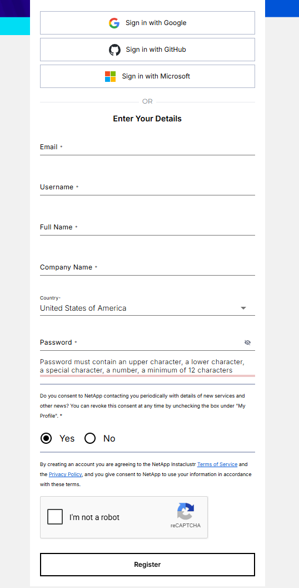
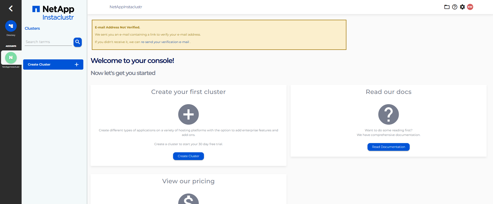
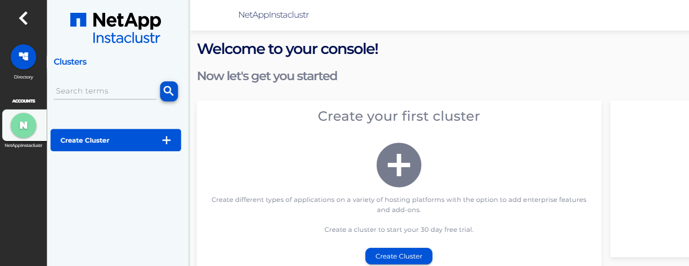
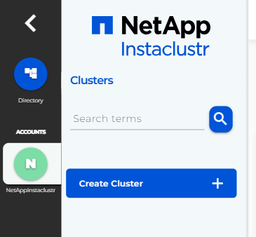
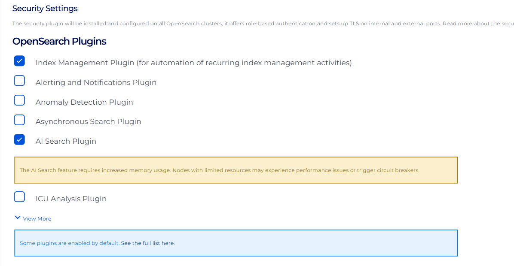
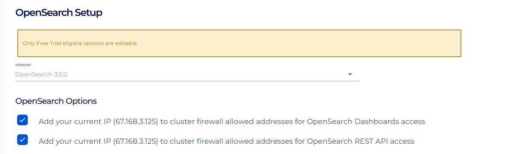

← **Previous:** [Course index](README.md) · **Next:** [How to run the labs](HANDS-ON-GUIDE.md) →

# Set up your OpenSearch cluster

Everything in this course runs against a live OpenSearch cluster. You'll create a free NetApp Instaclustr trial account, launch a cluster with the plugins the course needs, open the firewall to your own machine, and collect the connection details. 

This will take roughly **10 minutes** to provision.

**What you'll do:**

- [Set up your OpenSearch cluster](#set-up-your-opensearch-cluster)
  - [1. Sign up and verify your email](#1-sign-up-and-verify-your-email)
  - [2. Create the OpenSearch cluster](#2-create-the-opensearch-cluster)
  - [3. Add your IP to the firewall](#3-add-your-ip-to-the-firewall)
  - [4. Collect your connection details](#4-collect-your-connection-details)
  - [5. Set up generation](#5-set-up-generation)
  - [6. Confirm it works](#6-confirm-it-works)
    - [Two quick checks, and then you're done here.](#two-quick-checks-and-then-youre-done-here)
  - [Next, read how to run the labs, and then you are ready for Chapter 1.](#next-read-how-to-run-the-labs-and-then-you-are-ready-for-chapter-1)


---

## 1. Sign up and verify your email

>Start at the [NetApp Instaclustr free trial](https://console2.instaclustr.com/signup?source=InstAcademy_OpenSearch_Advanced_RAG) and fill out the sign-up form.



>You'll land on the console dashboard, which asks you to verify your email address before you can create anything.



>Click the link in the verification email. When you come back, the yellow banner is gone and the console is ready.



## 2. Create the OpenSearch cluster

>On the dashboard, click the blue **Create Cluster** button in the left sidebar.



>Give the cluster a name: **IA-{your_initials}-OpenSearch**, choose **OpenSearch** from the list of technologies. Make sure you have **AWS** selected, and click **Next**.


>On the plugins list, select the **AI Search Plugin**. This is the one choice you cannot skip: it installs ML Commons and the k-NN plugin, which is what lets the cluster host an embedding model and run vector search. **Without it, this course will not work!**



>Click **Next**, then scroll to **Data Node Selection** and click **Change Node Size**.


>Choose the **t4g.medium** node size at the bottom of the list. Smaller nodes cannot hold the embedding model this course deploys. (Remember, this will run for free in your account)


## 3. Add your IP to the firewall

>Instaclustr clusters are closed to the internet by default, so your machine has to be allowed in explicitly. On the network screen, check the two boxes to **add your current IP address** to the firewall rules.



> **If your IP changes, you'll lose access until you update it in the firewall rules after deployment.** Home internet connections and VPNs hand out new addresses regularly, and a connection that worked yesterday can hang or time out today for this reason alone. If requests suddenly stop responding, come back to **Firewall Rules** in the console and add your current IP again.

>Click **Next**, review everything on the final screen, accept the ToS, then click **Create Cluster**.


>Provisioning takes about ten minutes. The console shows the cluster as **Provisioning** and then **Running**.

## 4. Collect your connection details

>Once the cluster is running, select the **Connection Info** tab. You'll need three things from this page for the rest of the course:

| What you need | Where it comes from | Used by |
|---|---|---|
| **Cluster URL** (`https://…:9200`) | Connection Info, the public API endpoint | every terminal step: the loader and scorer scripts, and the local runner |
| **Username and password** | Connection Info, the default user is `icopensearch`, copy the password as well | both OpenSearch Dashboards login and the local runner |
| **OpenSearch Dashboards URL** (`…:5601`) | Connection Info, listed separately | Dev Tools, which is where you'll run most of the course |

>Keep that tab open, or paste the three values somewhere handy. You'll need them in the next step and again when you set up the runner.

## 5. Set up generation

The retrieval portion of this course runs on your cluster. The generation portion, where a language model reads the retrieved evidence and writes an answer, runs either on Groq's free tier or locally using ollama and a small model if your computer has the resources. 

>Sign in at [console.groq.com/keys](https://console.groq.com/keys) with an email, Google, or GitHub account and create an API key. It starts with `gsk_`. There is no payment step and no credit card field. Set it in the terminal you will run the chapters from — macOS/Linux:

```
export GROQ_API_KEY=gsk_your_key_here
```

>Windows (PowerShell):

```powershell
$env:GROQ_API_KEY = "gsk_your_key_here"
```

>The free tier allows around a thousand requests a day. One full pass through this course is about twenty, so you have room to experiment and to make mistakes.

## 6. Confirm it works

### Two quick checks, and then you're done here.

>**Dev Tools (the main path).** Open your Dashboards URL in a browser. It uses port **5601**, not 9200, and looks like this:

```
https://opensearch-dashboards.<your-cluster-id>.cnodes.io:5601
```

>Log in with your cluster username and password, then open the menu at the top left, scroll to **Management**, and choose **Dev Tools**. You can also go straight to the console:

```
https://opensearch-dashboards.<your-cluster-id>.cnodes.io:5601/app/dev_tools#/console
```

>If you can log in you are good to go!

>**Generation (the other half).** Confirm the model answers before Chapter 2 needs it — macOS/Linux:

```
curl -s https://api.groq.com/openai/v1/chat/completions \
  -H "Authorization: Bearer $GROQ_API_KEY" \
  -H "Content-Type: application/json" \
  -d '{"model":"openai/gpt-oss-120b","messages":[{"role":"user","content":"say hello"}]}'
```

>Windows (PowerShell):

```powershell
(Invoke-RestMethod https://api.groq.com/openai/v1/chat/completions -Method Post -ContentType "application/json" -Headers @{ Authorization = "Bearer $env:GROQ_API_KEY" } -Body '{"model":"openai/gpt-oss-120b","messages":[{"role":"user","content":"say hello"}]}').choices[0].message.content
```

>If a reply comes back, generation is ready.


---

## Next, read [how to run the labs](HANDS-ON-GUIDE.md), and then you are ready for [Chapter 1](chapters/01-simple-rag-and-hybrid-search/README.md).

---

← **Previous:** [Course index](README.md) · **Next:** [How to run the labs](HANDS-ON-GUIDE.md) →
