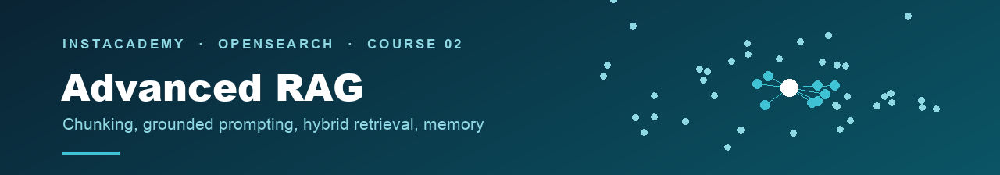

← [InstAcademy](../../README.md) · [OpenSearch track](../README.md)

# Advanced RAG with OpenSearch

🎯 Intermediate to Advanced · 🧪 **41 steps across 4 chapters** · 🔧 Dev Tools console, plus your terminal for loading, scoring, and generation · 💰 Free 30-day trial cluster plus a free Groq API key

**Course version 1.1** · validated end to end on **OpenSearch 3.5.0** · [changelog](CHANGELOG.md)

Welcome to this advanced RAG Hands-on lab. Together we will build a retrieval-augmented generation (RAG) system from scratch, taking it from a simple deployment to a robust system, one capability layer at a time.

You will build one system across the whole course. It is Example Corp's internal AI support tool, an assistant that answers user's questions from the company's own documentation instead of guessing from web results. 

* **Chapter 1** will build out retrieval. 
* **Chapter 2** wraps that retrieval in a disciplined prompt, so the language model answers from the evidence and shows you where each claim comes from. 
* **Chapter 3** proves the retrieval choice with hybrid search and a score. 
* **Chapter 4** teaches the tool how to hold context and memory throughout a conversation and implement 'Generation'.

### 🎯 What you will learn

- How to deploy an embedding model inside OpenSearch and embed documents automatically as they land.
- How to design a k-NN index that stores the vector, the filtering metadata, and the fields your retrieval depends on later.
- How your chunking strategy decides what you can retrieve, and why this system searches a small child chunk for precision and then hands the model the whole parent section for context.
- How to measure retrieval instead of trusting it, using hit rate, precision, and MRR on a golden set.
- How to write a prompt that grounds an answer in evidence, cites its sources, and declines when the evidence does not cover the question.
- How to run keyword, vector, and hybrid search side by side and pick a retriever based on the results.
- How to implement memory, so a follow-up question that only makes sense with context still retrieves the right thing.

---

## 🏢 The company you are building for

Example Corp builds a business-intelligence platform used by more than two thousand enterprise clients. Its fifteen-person support team handles five hundred tickets a day with a four-hour Service Level Agreement (SLA). Around sixty percent of those tickets ask something already answered in the documentation. The internal AI support tool exists to surface those answers automatically. Five data assets types feed it: product documentation, integration guides, support tickets, a known-issues database, and the API reference. The knowledge base you build holds 1,079 of these documents as 5,139 searchable chunks, and a 300-query golden set lets you measure retrieval quality with hit rate, precision, and MRR. All of this data is fictitious and was created for this lab; see [a note on the data](#a-note-on-the-data) below.

## 📚 The four chapters

| # | Chapter | What you build | Steps |
|---|---|---|---|
| **1** | [Simple RAG and hybrid search](chapters/01-simple-rag-and-hybrid-search/README.md) | An embedding model deployed in-cluster, an ingest pipeline, a k-NN knowledge base, and a first retrieval scored against a golden set | 11 |
| **2** | [Context prompting for RAG](chapters/02-context-prompting-for-rag/README.md) | The five-block prompt that grounds every answer in retrieved evidence, cites its sources, and declines when the evidence doesn't cover the question | 9 |
| **3** | [Hybrid RAG](chapters/03-hybrid-rag/README.md) | Keyword, vector, and hybrid retrieval run side by side and picked on measured numbers rather than instinct | 9 |
| **4** | [RAG with memory](chapters/04-rag-with-memory/README.md) | Conversation memory via the OpenSearch Memory API, so a follow-up that only makes sense in context still retrieves the right thing | 12 |

Work the chapters in order. Each one builds on the system the last one left running.

## 💰 What this costs

> [!NOTE]
> **Nothing.** The course is free, and the NetApp Instaclustr platform it runs on is provided as a free 30-day trial. Generation runs using a **free Groq API key**, or locally through Ollama if you'd rather not use a hosted model. Anything still running when the trial ends is removed automatically.
>

## Start here

| | |
|---|---|
| **1. [Set up your cluster](CLUSTER-SETUP.md)** | Sign up for a free trial, deploy an OpenSearch cluster with the AI Search Plugin, open the firewall, collect your connection details, and get a free Groq API key. About 15 minutes |
| **2. [Learn how to run the labs](HANDS-ON-GUIDE.md)** | How a chapter is laid out, how to reach Dev Tools, and the Windows notes. Read this once |
| **3. [Start Chapter 1](chapters/01-simple-rag-and-hybrid-search/README.md)** | Deploy the embedding model and build the knowledge base the whole course queries |

## 📚 What's in this course

| Path | What it is |
|---|---|
| [`chapters/Chapter _/`](chapters/01-simple-rag-and-hybrid-search/) | The four chapter workshops. This is the course |
| [`chapters/05-course-cleanup/`](chapters/05-course-cleanup/README.md) | Optional teardown to remove everything the labs created when you're done |
| [`../example-corp-kit/`](example-corp-kit/) | The example data, the golden set, the loader and scorer scripts, and the runner the labs use |
| [`assets/`](assets/) | Directory for screenshots to stay organized |
| [`CLUSTER-SETUP.md`](CLUSTER-SETUP.md) | The steps you need to sign-up, cluster creation, firewall, connection details, LLM generation key |
| [`HANDS-ON-GUIDE.md`](HANDS-ON-GUIDE.md) | How to run the labs |
| [`CHANGELOG.md`](CHANGELOG.md) | Course versions and which OpenSearch version each was validated on |

The labs go hand-in-hand with the Advanced RAG video course. These labs can be done simultaneously with each chapter of the video course, or after you've gone through the videos.

## 📋 What you need

- An OpenSearch cluster with the **AI Search Plugin**, which bundles k-NN and ML Commons. [Cluster setup](CLUSTER-SETUP.md) walks you through deployment.
- **OpenSearch 3.5 or later**, provided by the Instaclustr free trial or by your own cluster (the note at the bottom of this page covers the own-cluster path). The course was validated on 3.5.0.
- A **model to write the answers**. This course uses [Groq](https://console.groq.com/keys); the free tier allows around a thousand requests a day and a full pass through the course is about twenty, so there is room to experiment. If you'd rather not use a hosted model, the runner also supports [Ollama](https://ollama.com) with a small self-hosted model (`llama3.2:3b`, about 2 GB) — no key and no signup, at the cost of looser wording, as Chapter 2's optional step shows.
- **Python 3** on your own machine. The command is `python3` on macOS and Linux, `python` on Windows.
- A browser. Everything else is optional.

## A note on the data

Everything you load and query in this course is fictitious, and it exists only for this lab. Example Corp is not a real company. Its product, the documentation, the integration guides, the known issues, the support tickets, the error codes, and the version numbers were all generated for the course. Where a real product name appears in the corpus, for example Stripe, Slack, or PostgreSQL in the integration guides, it is only there to make the fictional documentation read like the real thing. None of that content comes from those companies, describes their actual products, or is affiliated with or endorsed by them.

The assistant in this course is referred to as "the internal AI support tool" or "the support tool." It is not a branded product.

## 🏅 Finished the course?

Badges are issued from the **InstAcademy library**, and completion has two halves: the video series and these hands-on labs.

When you've done both: [request your badge](https://github.com/instaclustr/instacademy/issues/new?template=course-completion.yml) with your name and a tick against each half, then fill in the badge form it links to.

## 🛟 Support

Issues can be submitted to the GitHub repository [HERE](https://github.com/instaclustr/InstAcademy/issues).

---

## Let's Get Started

**[Set up your OpenSearch cluster](CLUSTER-SETUP.md)** 

---

🚀 **Next:** [Set up your cluster](CLUSTER-SETUP.md)
← [OpenSearch track](../README.md) · [InstAcademy](../../README.md)

