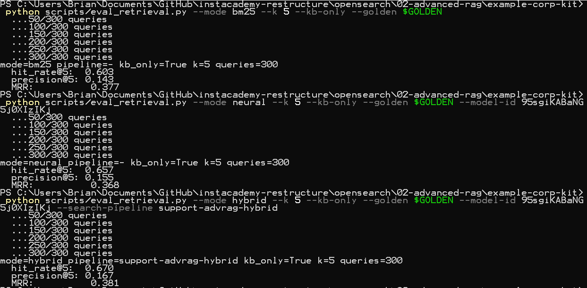
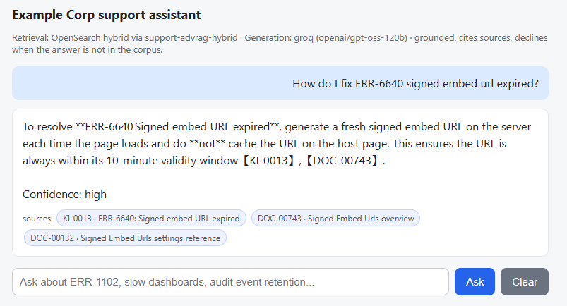
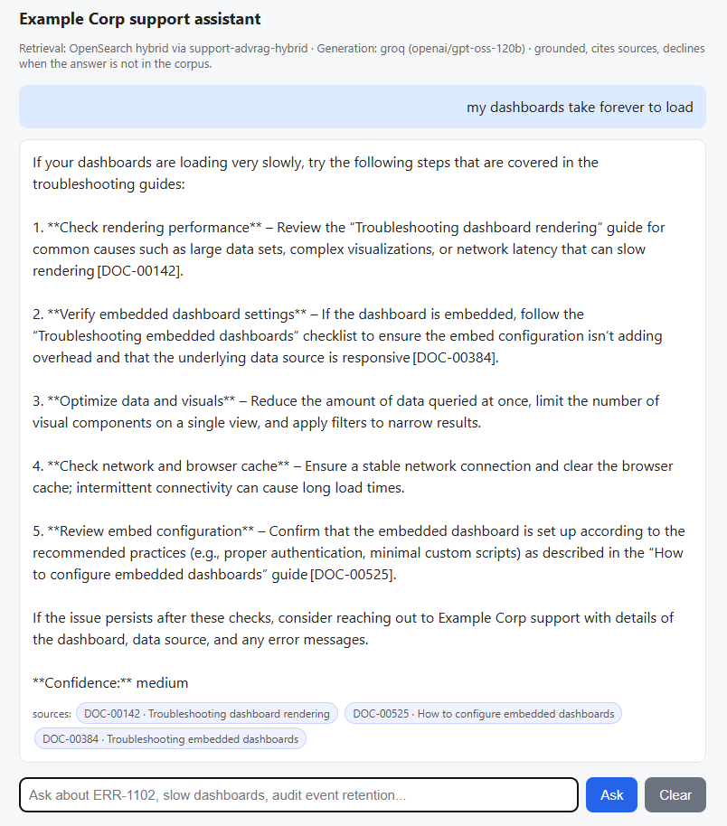
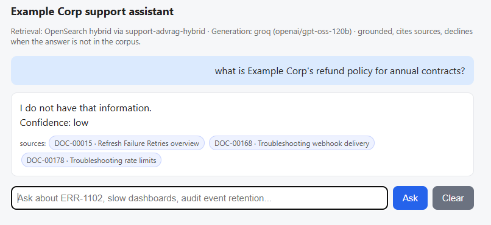
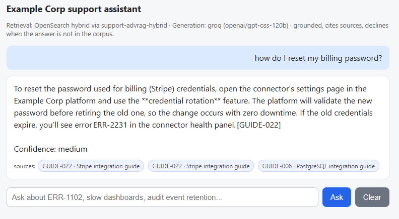

← **Previous:** [Chapter 2](../02-context-prompting-for-rag/README.md) · [Course index](../../README.md) · [How to run labs](../../HANDS-ON-GUIDE.md) · **Next:** [Chapter 4](../04-rag-with-memory/README.md) →

# Chapter 3 — Hybrid RAG

🎯 Chapter 3 of 4 · 🧪 **9 steps** · 🔧 Dev Tools console, plus your terminal for Step 8 and the [chat form](../../example-corp-kit/rag-runner/) in Step 9

In Chapter 2 you wrapped the knowledge base in a structured prompt and watched the support tool answer from evidence and cite it. Every one of those answers relied on vector search: retrieval by meaning. This chapter adds the other half.

You are going to run the same question three ways against the knowledge base you built in Chapter 1: keyword search, vector search, and the two of them fused. 

You will watch keyword search nail an error code that vector search only ties, then watch keyword search completely miss a plain-language symptom that vector search finds instantly. Then you'll fuse both legs with a search pipeline and, most important, score all three methods against the golden set so the choice is based on a number and not an opinion. By the end you'll interact with the whole thing in a browser.

| Section | Lesson | What you build |
|---------|--------|----------------|
| [3-1](#lesson-3-1--keyword-search-and-its-blind-spot) | Keyword search and its blind spot | Two BM25 queries: one that nails an error code, one that misses a plain-language symptom entirely |
| [3-2](#lesson-3-2--vector-search-fills-the-gap) | Vector search fills the gap | The same two queries by meaning, on a completely different score scale |
| [3-3](#lesson-3-3--fuse-the-two-legs-with-a-hybrid-pipeline) | Fuse the two legs | An RRF search pipeline, and both anchor queries running through it in a single call |
| [3-4](#lesson-3-4--measure-it-which-retriever-actually-wins) | Measure it | All three retrievers scored on the 300-query golden set |
| [3-5](#lesson-3-5--put-it-to-work) | Put it to work | The packing rule for a fused list, and the full hybrid system in a browser |


## Lesson 3-1 — Keyword search and its blind spot

Keyword search, also called full text search, scores documents with an algorithm called BM25. It works off an inverted index, a lookup from each word to the documents that contain it. It rewards a document for containing the rare words from your query, discounts the common ones, and ignores meaning entirely. That makes it perfect for error codes and exact terms, and useless when the customer never types the exact term. You will see both sides of it here.

### Step 1: Keyword search finds an exact error code

A customer pastes `ERR-6640`. This is the easy case for BM25: the code is a rare string, so the one document that contains it shoots to the top. There is exactly one right answer here, and keyword search lands on it every time, nothing probabilistic about it.

**Request** - run a keyword query for the error code:

```http
POST support-advrag-kb/_search
{
  "size": 3,
  "_source": ["source_id", "doc_type", "title", "product_version"],
  "query": {
    "multi_match": {
      "query": "ERR-6640 signed embed url expired",
      "fields": ["text", "title", "section_path"]
    }
  }
}
```

**Expected** - the known issue for `ERR-6640` is first at 14.264, with a wide gap to second place. That gap is BM25 rewarding the exact rare token. Note the raw score, because it behaves nothing like the vector scores you have been reading: 14.264 is not out of anything (BM25 has no maximum) and the number is computed from word statistics across your whole corpus, so the same document can score differently after documents are added or removed. A BM25 score only means something next to the other scores in the same result list.

```json
{
"hits": {
    "total": {
      "value": 1277,
      "relation": "eq"
    },
    "max_score": 14.264366,
    "hits": [
      {
        "_index": "support-advrag-kb",
        "_id": "KI-0013#0.0",
        "_score": 14.264366,
        "_source": {
          "product_version": null,
          "doc_type": "known-issue",
          "source_id": "KI-0013",
          "title": "ERR-6640: Signed embed URL expired"
        }
      },
      {
        "_index": "support-advrag-kb",
        "_id": "DOC-00743#2.0",
        "_score": 10.832745,
        "_source": {
          "product_version": "5.1",
          "doc_type": "product-docs",
          "source_id": "DOC-00743",
          "title": "Signed Embed Urls overview"
        }
      },
      {
        "_index": "support-advrag-kb",
        "_id": "DOC-00132#3.0",
        "_score": 10.751019,
        "_source": {
          "product_version": "4.9",
          "doc_type": "product-docs",
          "source_id": "DOC-00132",
          "title": "Signed Embed Urls settings reference"
        }
      }
    ]
  }
}
```

The known issue wins because `ERR-6640` is a rare token that appears in almost no documents. When it shows up, BM25 treats it as a very strong signal.

### Step 2: Keyword search misses a plain-language symptom

Now the hard case. A customer describes the same underlying problem in their own words and never types an error code: *"why do my dashboards take forever to load."*

**Request** - run the same query shape on plain language:

```http
POST support-advrag-kb/_search
{
  "size": 3,
  "_source": ["source_id", "doc_type", "title", "product_version"],
  "query": {
    "multi_match": {
      "query": "why do my dashboards take forever to load",
      "fields": ["text", "title", "section_path"]
    }
  }
}
```

**Expected** - settings and configuration pages that happen to share the common words "dashboards" and "load," and **not** the troubleshooting document that actually explains slow rendering. Note the top score, 3.18, against 14.26 in Step 1. That's a big difference in scoring! The system is telling us it did not find a strong match.
```json
{
  "hits": {
    "total": {
      "value": 4130,
      "relation": "eq"
    },
    "max_score": 3.1756785,
    "hits": [
      {
        "_index": "support-advrag-kb",
        "_id": "DOC-00337#1.2",
        "_score": 3.1756785,
        "_source": {
          "product_version": "5.0",
          "doc_type": "product-docs",
          "source_id": "DOC-00337",
          "title": "Embedded Dashboards settings reference"
        }
      },
      {
        "_index": "support-advrag-kb",
        "_id": "DOC-00807#1.2",
        "_score": 3.1756785,
        "_source": {
          "product_version": "4.8",
          "doc_type": "product-docs",
          "source_id": "DOC-00807",
          "title": "Embedded Dashboards settings reference"
        }
      },
      {
        "_index": "support-advrag-kb",
        "_id": "DOC-00995#1.1",
        "_score": 3.051722,
        "_source": {
          "product_version": "5.1",
          "doc_type": "product-docs",
          "source_id": "DOC-00995",
          "title": "How to configure embedded dashboards"
        }
      }
    ]
  }
}
```

The customer said "take forever to load." The document that answers them is titled "Troubleshooting dashboard rendering," and it talks about render timeouts. To a person those mean the same thing. To BM25 they are unrelated strings, so the right document never surfaces. Remember this result. Vector search fixes it in the next step.

---

## Lesson 3-2 — Vector search fills the gap

A neural query embeds your text with the same model that embedded the documents, then matches by vector distance. It scores by meaning, not by shared words. 

> [!NOTE]
> Replace `YOUR_MODEL_ID` with your `ML_MODEL_ID` in both steps.

### Step 3: Vector search also finds the correct error code

Run the Step 1 query again, this time by meaning, to see whether vectors give anything up on the easy case.

**Request** - run the Step 1 query by meaning instead. Replace `YOUR_MODEL_ID`:

```http
POST support-advrag-kb/_search
{
  "size": 3,
  "_source": ["source_id", "doc_type", "title", "product_version"],
  "query": {
    "neural": {
      "text_embedding": {
        "query_text": "ERR-6640 signed embed url expired",
        "model_id": "YOUR_MODEL_ID",
        "k": 3
      }
    }
  }
}
```

**Expected** - the same known issue first, this time at 0.9372. The scores sit near 1, on a completely different scale from the BM25 scores in Step 1. That scale difference is the problem fusion has to solve in Lesson 3-3 when trying to combine scores.

```json
{
"hits": {
    "total": {
      "value": 3,
      "relation": "eq"
    },
    "max_score": 0.93719304,
    "hits": [
      {
        "_index": "support-advrag-kb",
        "_id": "KI-0013#0.0",
        "_score": 0.93719304,
        "_source": {
          "product_version": null,
          "doc_type": "known-issue",
          "source_id": "KI-0013",
          "title": "ERR-6640: Signed embed URL expired"
        }
      },
      {
        "_index": "support-advrag-kb",
        "_id": "DOC-00743#2.0",
        "_score": 0.9224682,
        "_source": {
          "product_version": "5.1",
          "doc_type": "product-docs",
          "source_id": "DOC-00743",
          "title": "Signed Embed Urls overview"
        }
      },
      {
        "_index": "support-advrag-kb",
        "_id": "DOC-00417#2.0",
        "_score": 0.91592073,
        "_source": {
          "product_version": "4.8",
          "doc_type": "product-docs",
          "source_id": "DOC-00417",
          "title": "Troubleshooting service accounts"
        }
      }
    ]
  }
}
```

Vector search finds the error code too, so with the easy question both methods agree. The difference shows up in the next query.

### Step 4: Vector search catches the symptom BM25 missed

Run the exact plain-language query from Step 2, unchanged, as a neural query.

**Request** - run the Step 2 query by meaning. Replace `YOUR_MODEL_ID`:

```http
POST support-advrag-kb/_search
{
  "size": 3,
  "_source": ["source_id", "doc_type", "title", "product_version"],
  "query": {
    "neural": {
      "text_embedding": {
        "query_text": "why do my dashboards take forever to load",
        "model_id": "YOUR_MODEL_ID",
        "k": 3
      }
    }
  }
}
```

**Expected** - "Troubleshooting dashboard rendering" is now first, the kind of document that BM25 buried in Step 2. Vector search matched "take forever to load" to "render" because it understands meaning, with no shared vocabulary at all.

```json
{
  "hits": {
    "total": {
      "value": 3,
      "relation": "eq"
    },
    "max_score": 0.7875165,
    "hits": [
      {
        "_index": "support-advrag-kb",
        "_id": "DOC-00142#0.0",
        "_score": 0.7875165,
        "_source": {
          "product_version": "5.0",
          "doc_type": "product-docs",
          "source_id": "DOC-00142",
          "title": "Troubleshooting dashboard rendering"
        }
      },
      {
        "_index": "support-advrag-kb",
        "_id": "DOC-00377#1.0",
        "_score": 0.7810552,
        "_source": {
          "product_version": "4.8",
          "doc_type": "product-docs",
          "source_id": "DOC-00377",
          "title": "Troubleshooting dashboard rendering"
        }
      },
      {
        "_index": "support-advrag-kb",
        "_id": "DOC-00666#2.0",
        "_score": 0.7806605,
        "_source": {
          "product_version": "5.0",
          "doc_type": "product-docs",
          "source_id": "DOC-00666",
          "title": "How embedded dashboards works"
        }
      }
    ]
  }
}
```

You have now seen the trade directly. BM25 owns exact tokens like `ERR-6640`. Vectors own meaning like "take forever to load." A support tool needs both, because customers send both. So let's combine them for an even better tool!

---

## Lesson 3-3 — Fuse the two legs with a hybrid pipeline

Hybrid search runs both legs and merges their ranked lists. The merge method here is called Reciprocal Rank Fusion (RRF), which combines by **rank position**, not by raw score. That helps to sidestep the scale problem you just saw: a BM25 score of 14.35 and a vector score of 0.94 never have to be compared to each other. A hybrid query is a normal search carrying a `hybrid` block with one sub-query per leg, run through a search pipeline that does the fusion.

### Step 5: Create the hybrid search pipeline

The pipeline is where the fusion strategy lives, which means you can change how results are merged without touching a single query.

**Request** - create the RRF search pipeline:

```http
PUT _search/pipeline/support-advrag-hybrid
{
  "description": "Fuse BM25 and vector legs with reciprocal rank fusion",
  "phase_results_processors": [
    { "score-ranker-processor": { "combination": { "technique": "rrf" } } }
  ]
}
```

**Expected** - the pipeline is registered and ready to attach to a search.

```json
{
  "acknowledged": true
}
```

> [!IMPORTANT]
> **Save** the pipeline name `support-advrag-hybrid`. You'll attach it to searches for the rest of this chapter and again in Chapter 4.

RRF has one knob, the **rank constant**, which controls how fast a document's credit falls off as it sinks down a list. A small constant makes the top few positions count for almost everything; a large one flattens the curve so deeper hits still contribute. The request above does not set it, so you get the default, which is a safe place to start and the right choice until a golden-set score tells you otherwise. Tune it the way you tune anything else in this course: change it, re-run the golden-set scoring in [Step 8](#step-8-score-bm25-vector-and-hybrid-on-the-golden-set) of this chapter, and keep the change only if a number moved.

### Step 6: One hybrid query, both legs at once

Attach the pipeline with `?search_pipeline=` and put both legs inside the `hybrid` block. The vector leg asks for `k: 10` while `size` is 3: each leg retrieves wide so the fusion has something to work with, and then you narrow the results.

**Request** - run both legs through the pipeline. Replace `YOUR_MODEL_ID`:

```http
POST support-advrag-kb/_search?search_pipeline=support-advrag-hybrid
{
  "size": 3,
  "_source": ["source_id", "doc_type", "title", "product_version"],
  "query": {
    "hybrid": {
      "queries": [
        { "multi_match": { "query": "ERR-6640 signed embed url expired", "fields": ["text", "title"] } },
        { "neural": { "text_embedding": { "query_text": "ERR-6640 signed embed url expired", "model_id": "YOUR_MODEL_ID", "k": 10 } } }
      ]
    }
  }
}
```

**Expected** - three hits, with the known issue first, carried by both legs. Do not be thrown by the much larger `total` above them: that counts every document either leg matched at all, the vector leg retrieved its `k: 10` candidates into the fusion, and `size: 3` is what trims the final fused list to the three you see. The scores are small RRF rank scores, which is normal and expected: RRF ranks by position, so the absolute number is not meaningful and only the order is.

```json
{
"hits": {
    "total": {
      "value": 922,
      "relation": "eq"
    },
    "max_score": 0.032786883,
    "hits": [
      {
        "_index": "support-advrag-kb",
        "_id": "KI-0013#0.0",
        "_score": 0.032786883,
        "_source": {
          "product_version": null,
          "doc_type": "known-issue",
          "source_id": "KI-0013",
          "title": "ERR-6640: Signed embed URL expired"
        }
      },
      {
        "_index": "support-advrag-kb",
        "_id": "DOC-00743#2.0",
        "_score": 0.032258064,
        "_source": {
          "product_version": "5.1",
          "doc_type": "product-docs",
          "source_id": "DOC-00743",
          "title": "Signed Embed Urls overview"
        }
      },
      {
        "_index": "support-advrag-kb",
        "_id": "DOC-00132#3.0",
        "_score": 0.015873017,
        "_source": {
          "product_version": "4.9",
          "doc_type": "product-docs",
          "source_id": "DOC-00132",
          "title": "Signed Embed Urls settings reference"
        }
      }
    ]
  }
}
```

### Step 7: The hybrid query rescues the symptom case too

Run the plain-language query through the same pipeline. The troubleshooting document BM25 could not surface in Step 2 should ride the vector leg back into the fused list.

**Request** - run the plain-language query through the same pipeline:

```http
POST support-advrag-kb/_search?search_pipeline=support-advrag-hybrid
{
  "size": 3,
  "_source": ["source_id", "doc_type", "title", "product_version"],
  "query": {
    "hybrid": {
      "queries": [
        { "multi_match": { "query": "why do my dashboards take forever to load", "fields": ["text", "title"] } },
        { "neural": { "text_embedding": { "query_text": "why do my dashboards take forever to load", "model_id": "YOUR_MODEL_ID", "k": 10 } } }
      ]
    }
  }
}
```

**Expected** - `DOC-00142`, "Troubleshooting dashboard rendering," is back, tied for the **top score** in the fused ranking. This is the document BM25 could not surface at any position in Step 2. Neither method alone produced this list.

```json
{
  "hits": {
    "total": {
      "value": 3902,
      "relation": "eq"
    },
    "max_score": 0.016393442,
    "hits": [
      {
        "_index": "support-advrag-kb",
        "_id": "DOC-00337#1.2",
        "_score": 0.016393442,
        "_source": {
          "product_version": "5.0",
          "doc_type": "product-docs",
          "source_id": "DOC-00337",
          "title": "Embedded Dashboards settings reference"
        }
      },
      {
        "_index": "support-advrag-kb",
        "_id": "DOC-00142#0.0",
        "_score": 0.016393442,
        "_source": {
          "product_version": "5.0",
          "doc_type": "product-docs",
          "source_id": "DOC-00142",
          "title": "Troubleshooting dashboard rendering"
        }
      },
      {
        "_index": "support-advrag-kb",
        "_id": "DOC-00807#1.2",
        "_score": 0.016129032,
        "_source": {
          "product_version": "4.8",
          "doc_type": "product-docs",
          "source_id": "DOC-00807",
          "title": "Embedded Dashboards settings reference"
        }
      }
    ]
  }
}
```

What matters in that list is `DOC-00142`: the document keyword search buried completely in Step 2 now sits at the top score of the fused list, because the vector leg carried it there. It shares that score with `DOC-00337`, and the note below explains why RRF produces exact ties like that one and why the pair can print in either order.

Both anchor queries now work through one pipeline: exact-token precision on the error code and matching by meaning on the symptom, in a single call.

> **Documents tied at the same RRF score can swap places.** That is not a rounding artifact, it is how RRF works: the score is built from rank positions, so two documents sitting at the same position across the legs get arithmetically identical scores, and which one prints first is decided by internal index order rather than by relevance. Read a tie as "these two ranked equally," not as "this one beat that one," and if your application needs a stable order inside a tie, break it yourself on a field you control such as `updated_at` or `product_version`.

---

## Lesson 3-4 — Measure it: which retriever actually wins

You have now seen two hand-picked queries. That's not really full evidence. Chapter 1 introduced the three retrieval metrics and you scored the vector baseline with them. Now you'll score all three methods and let the numbers decide.

### Step 8: Score BM25, vector, and hybrid on the golden set

You'll run the same 300-query golden set against each search method. Only the `--mode` changes. Hybrid additionally needs the search pipeline you built in Step 5. Each sweep will take
 a few minutes.

**Request** - score all three retrievers in your terminal:

```bash
# from the repo folder — if your terminal is still in rag-runner
# from Chapter 2, use `cd ..` instead
cd example-corp-kit
export OS_URL=https://<user>:<password>@<your-host>:9200
export OS_INDEX=support-advrag-kb
GOLDEN=corpus/example-corp-corpus-v2.1.0/golden_set.jsonl

python3 scripts/eval_retrieval.py --mode bm25   --k 5 --kb-only --golden $GOLDEN

python3 scripts/eval_retrieval.py --mode neural --k 5 --kb-only --golden $GOLDEN \
  --model-id YOUR_MODEL_ID

python3 scripts/eval_retrieval.py --mode hybrid --k 5 --kb-only --golden $GOLDEN \
  --model-id YOUR_MODEL_ID --search-pipeline support-advrag-hybrid
```

> **Windows (PowerShell)** — the same three sweeps, each `python` command on one line:
>
> ```powershell
> # from the repo folder — if your terminal is still in rag-runner
> # from Chapter 2, use `cd ..` instead
> cd example-corp-kit
> $env:OS_URL = "https://<user>:<password>@<your-host>:9200"
> $env:OS_INDEX = "support-advrag-kb"
> $GOLDEN = "corpus/example-corp-corpus-v2.1.0/golden_set.jsonl"
> python scripts/eval_retrieval.py --mode bm25 --k 5 --kb-only --golden $GOLDEN
> python scripts/eval_retrieval.py --mode neural --k 5 --kb-only --golden $GOLDEN --model-id YOUR_MODEL_ID
> python scripts/eval_retrieval.py --mode hybrid --k 5 --kb-only --golden $GOLDEN --model-id YOUR_MODEL_ID --search-pipeline support-advrag-hybrid
> ```

**Expected** - three reports. The neural row is Chapter 1 Step 11's baseline, give or take the few thousandths that approximate search moves between runs.

Windows Example:


```text
mode=bm25 pipeline=- kb_only=True k=5 queries=300
  hit_rate@5:  0.603
  precision@5: 0.143
  MRR:          0.377

mode=neural pipeline=- kb_only=True k=5 queries=300
  hit_rate@5:  0.657
  precision@5: 0.155
  MRR:          0.368

mode=hybrid pipeline=support-advrag-hybrid kb_only=True k=5 queries=300
  hit_rate@5:  0.670
  precision@5: 0.167
  MRR:          0.381
```


Side by side, that is the whole argument for hybrid:

```text
method   hit@5   precision@5   MRR
bm25     0.603   0.143         0.377
neural   0.657   0.155         0.368
hybrid   0.670   0.167         0.381
```

- **Hybrid has the best hit rate (0.670)**: it finds a correct document in the top 5 more often than either method alone.
- **Hybrid also has the best precision (0.167)**: its top 5 is the cleanest of the three, so you pack the model with the least off-topic noise.
- **BM25 has the lowest precision (0.143)**: across a golden set that is mostly plain-language questions, keyword search fills its top 5 with common-word matches and misses, exactly the vocabulary gap from Lesson 3-1. Its precision only shows on exact tokens like `ERR-6640`, and those are the minority here.
- **MRR is a near-tie (0.368 to 0.381)**: the spread is small and the leader flips between runs — hybrid edged it on this run, BM25 has on others — so how high the first correct document ranks is not what separates these methods on this corpus.

This is why you use hybrid. Not because it sounds thorough, but because on your own golden set it wins the metrics you can act on: hit rate and precision on every validated run, and on this one, MRR as well.

**Expect your numbers to differ slightly** Vector search is approximate by design, so scoring the same 300 queries twice against the same index does not return identical figures. What reproduces is the ordering: hybrid wins hit rate and precision, and MRR stays a three-way near-tie. That ordering is the finding.

---

## Lesson 3-5 — Put it to work

The fused list is just better evidence for the Chapter 2 prompt. Nothing about generation changes: better retrieval improves the answer without touching a single prompt block.

The fused list is a list of *children*, and Chapter 2 Step 1 established what to do about that. The one thing that changes here is how you dedupe your results. In Chapter 2 you used `collapse` on `parent_id`, which works on a single-leg query. **It does not work on a hybrid query.** If you add `collapse` to the Step 6 request the fused ranking falls apart: `KI-0013`, the known issue that is the entire point of the query, drops out of the results, and what comes back is not stable between runs. Collapse runs against the fused result rather than composing with the fusion, in the same way that reranking before fusion silently drops a leg.

So on a hybrid query you let the fusion finish and dedupe afterwards, in your own code. Retrieve wider than you need, walk the fused list in order, keep the first child of each `parent_id`, and pack the parent.

The function below is that rule written out. **There is nothing to run here** — this is the packing code that already lives inside the chat server, and it will execute on every question you ask in Step 9. Read it before you launch, so the `packed 3 parent sections` lines the server prints are something you understand:

```python
def pack(hits, keep=3, budget_words=1500):
    seen, blocks, words = set(), [], 0
    for h in hits:                              # already fused, already in rank order
        if len(blocks) >= keep:
            break
        s = h["_source"]
        pid = s.get("parent_id") or s["source_id"]
        if pid in seen:                         # a sibling of a section we already packed
            continue
        text = s.get("parent_text") or s["text"]   # known issues have no parent
        n = len(text.split())
        if blocks and words + n > budget_words:
            break
        seen.add(pid); words += n
        blocks.append(f"[{s['source_id']}] ({s['doc_type']}, "
                      f"v{s.get('product_version') or 'n/a'}) {s['title']}: {text}")
    return "\n\n".join(blocks)
```

That is the parent-child payoff in one function. Retrieval is precise because it matched 50-word children. The prompt is rich because it carries the full parent sections.

### Step 9: Talk to your hybrid RAG system in the browser

Now interact with the full loop. The runner's web form does what you have been doing by hand: embed the question, run hybrid search against your index, pack the parents, and generate a grounded answer.

This is the same server you launched in Chapter 2, where it retrieved with a single vector leg because `RAG_PIPE` was not set. One line in `.env` changes that: set `RAG_PIPE` to the pipeline you built in Step 5, and every question now runs through both legs and the fusion. Nothing else changes — same file, same code.

If you skipped Chapter 2 Step 9, set up `.env` and `model_id.txt` first.

**Request** - add the pipeline line to `.env`, then start the chat form:

```bash
# from the repo folder — if you just ran Step 8 you are in
# example-corp-kit, so use `cd rag-runner` instead
cd example-corp-kit/rag-runner

# .env already has OS_URL, OS_USER, OS_PW, and RAG_INDEX=support-advrag-kb
# from Chapter 2. Add one line to it now:
echo "RAG_PIPE=support-advrag-hybrid" >> .env

# and model_id.txt needs your ML_MODEL_ID:
echo "YOUR_MODEL_ID" > model_id.txt

python3 05_rag_chat_server.py
```

> **Windows (PowerShell)** — use `Add-Content` and `Set-Content`, **not** `echo` with `>>` or `>` (Windows PowerShell writes UTF-16 there, which breaks `.env` at startup and turns the model id to garbage):
>
> ```powershell
> # from the repo folder — if you just ran Step 8 you are in
> # example-corp-kit, so use `cd rag-runner` instead
> cd example-corp-kit/rag-runner
> Add-Content .env "RAG_PIPE=support-advrag-hybrid" -Encoding Ascii
> Set-Content model_id.txt "YOUR_MODEL_ID" -Encoding Ascii
> python 05_rag_chat_server.py
> ```

**Expected** - the server starts, and the startup line now reports hybrid retrieval where Chapter 2 reported vector only. Open **http://localhost:8787**, which is bound to your machine only.

```text
RAG chat UI on http://localhost:8787  (model openai/gpt-oss-120b, retrieval hybrid via support-advrag-hybrid)
```

The page header reports the same thing, so you can always tell which retriever answered a question by looking at it rather than by remembering what is in `.env`.

Now, ask the tool the two anchor queries from this chapter, then one that is not in the corpus. 

**Request** - ask the error-code question:

```text
How do I fix ERR-6640 signed embed url expired?
```

**Expected** - `KI-0013` leads the sources:

```text
To resolve ERR‑6640 Signed embed URL expired, generate a fresh signed embed URL on the
server each time the page loads and do not cache the URL on the host page. This ensures the
URL is always within its 10‑minute validity window 【KI-0013】,【DOC-00743】.
Confidence: high
```



> [!IMPORTANT]
> The important thing is what this answer does **not** say. `KI-0013` is still an open issue with no 'fixed' version, and the model does not invent one either. Compare that with the `ERR-1102` answer, which correctly named version 5.0 because the evidence contained a fixed version. Same prompt, same model, opposite behaviour, driven entirely by what the evidence supports.

The sources under the answer show the same duplication Chapter 2 Step 9 walked through. `KI-0013` is the known issue, but `DOC-00743` and `DOC-00132` also carry the identical resolution sentence, every cited page does support the answer. The `ERR-6640` entry is repeated across a lot of this corpus, which is why the answer is right no matter which of those pages it credits.

**Request** - Next, ask the plain-language question, the one BM25 could not answer in Step 2:

```text
my dashboards take forever to load
```

**Expected** - hybrid pulls `DOC-00142` into the sources at 0.0164, and the answer points at it:

```text
If your dashboards are loading very slowly, try the following steps that are covered in the
troubleshooting guides:

1. Check rendering performance – Review the "Troubleshooting dashboard rendering" guide for
   common causes such as large data sets, complex visualizations, or network latency [DOC-00142].
2. Verify embedded dashboard settings – Follow the "Troubleshooting embedded dashboards"
   checklist to ensure the embed configuration isn't adding overhead [DOC-00384].
3. Optimize data and visuals – Reduce the data queried at once, limit visual components, and
   apply filters to narrow results.
4. Check network and browser cache – Ensure a stable connection and clear the browser cache.
5. Review embed configuration – Confirm the embedded dashboard follows recommended practices,
   as described in the "How to configure embedded dashboards" guide [DOC-00525].

Confidence: medium
```



Retrieval did its job here and generation only half did. The right document, `DOC-00142`, is found, cited, and handed over — but look at what the model built on top of it. Steps 1, 2, and 5 point at real troubleshooting guides; steps 3 and 4 (optimize the data, clear the browser cache) carry no citation at all, because they are generic advice the model supplied rather than anything the evidence contained. The corpus sections describe the area without prescribing one crisp fix, so the model padded around them and rated itself `medium`. **This is the difference between a retrieval win and an answer win. It's also why you scored retrieval by itself in Lesson 3-4.** Hybrid search earned its place by the numbers. Turning good evidence into a good answer every time is a generation problem.

**Request** - ask a question the corpus does not cover:

```text
what is Example Corp's refund policy for annual contracts?
```

**Expected** - a decline. This knowledge base is technical documentation, and nothing in it covers commercial terms, so the tool refuses rather than assembling something from whatever came back nearest:

```text
I do not have that information.
Confidence: low
```



### One more question, where hybrid can make things worse

**Request** - ask the question that declined cleanly in Chapter 2 Step 9:

```text
how do I reset my billing password?
```

**Expected** - with the keyword leg in play, it does not decline any more:

```text
To reset the password used for billing (Stripe) credentials, open the connector's settings
page in the Example Corp platform and use the credential rotation feature. The platform will
validate the new password before retiring the old one, so the change occurs with zero
downtime. If the old credentials expire, you'll see error ERR‑2231 in the connector health
panel. [GUIDE-022]
Confidence: medium
```



Nothing there is invented; `GUIDE-022` really does describe rotating Stripe credentials. But the customer asked about a **billing password**, and credential rotation for a payment connector is a different thing. The answer is grounded but wrong.

**The keyword leg is what broke it.** Vector search read "reset my billing password" as an account-management question, found nothing close in a corpus that has no such page, and returned distant neighbours the model recognized as irrelevant, which is why the same question declined cleanly in Chapter 2. BM25 behaved differently: it saw the less-common token `password`, matched it against the one guide in the corpus that happens to use the word, and then fusion carried that hit to the top. In this one case, adding a second retriever made the answer *worse*, because it handed the model a document that looked on-topic without being on-topic.

That is the counter to Lesson 3-4. Hybrid still won the golden set on the metrics you can act on, and it is still the right default, but a keyword leg will sometimes promote a lexical coincidence, a document that shares a word with the question without answering it. A grounded prompt cannot save you here, because the model has no way to tell "contains the word `password`" from "answers a question about passwords"; both look like relevant evidence from the inside. The golden set proves hybrid wins on average, across all 300 queries. It does not promise hybrid wins on every single question. This question is a case where it lost.

You have now run the full hybrid system end to end. But notice what every answer in this chapter had in common: each question stood completely alone, with no memory of the one before it. A real support conversation is not like that, and Chapter 4 is where you will give the support tool that memory.

> **Results vary in wording, not in behavior.** Retrieval order is deterministic on the same corpus and model, so the rankings and sources reproduce. The model's exact sentences will not. What stays constant is that the answer is grounded in the fused evidence, cited, and clear that the issue is still open. The confidence level is the model's own rating and can come back low, medium, or high on the same question.

---

## 🏁 Chapter 3 wrap-up

### Congratulations! You picked your retriever with a number, not a hunch!

You ran one question three ways, watched each retriever win and lose, and let the golden set settle the argument. Here's what you learned along the way:

- **Keyword search (BM25)** scores by rare shared words. It is exact and deterministic, ideal for error codes and product terms, and blind to meaning.
- **Vector search** scores by meaning, so it finds the right document even when the customer's words never appear in it.
- **Hybrid search** runs both legs and fuses them. **Reciprocal rank fusion** merges by rank position, which avoids comparing scores that live on different scales.
- **Measured on the golden set**, hybrid wins hit rate (0.670) and precision (0.167); ranking is a near-tie. The eval, not intuition, is what justifies the choice.
- **`collapse` does not compose with hybrid fusion.** Parent dedupe moves out of the query and into the packing code once you fuse two legs, the same discipline as never reranking before fusion.
- **Retrieval feeds generation; it does not fix it.** The prompt blocks from Chapter 2 never changed — better evidence usually makes their answer stronger, but a keyword-coincidence hit like the billing-password case shows fused evidence can also make a grounded answer confidently wrong. Retrieval quality and answer quality are measured separately for exactly this reason.

## 🚀 Next chapter

[Chapter 4 — RAG with memory](../04-rag-with-memory/README.md). The system answers one well formed question beautifully and has no idea what you asked a moment ago. Next you'll give it a memory, watch a follow up that failed start working, and hold multi-turn conversations with everything you have built.

**Let's get started!**

---

← [Chapter 2](../02-context-prompting-for-rag/README.md) · [Course index](../../README.md) · [Report a problem with this chapter](https://github.com/instaclustr/instacademy/issues/new/choose) · [Chapter 4](../04-rag-with-memory/README.md) →
