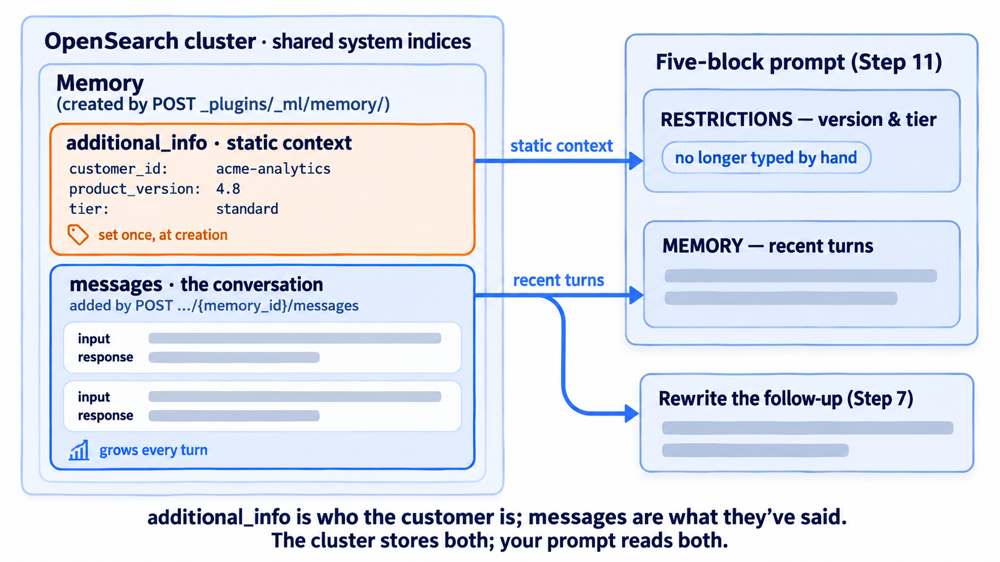
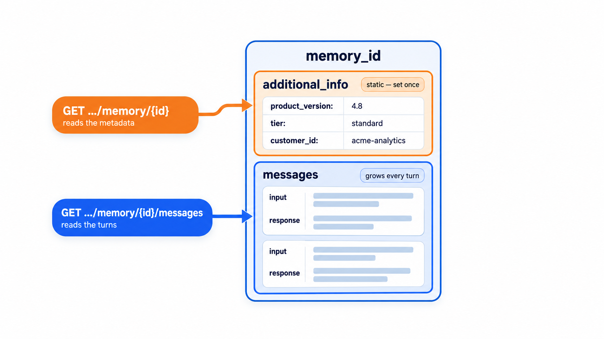
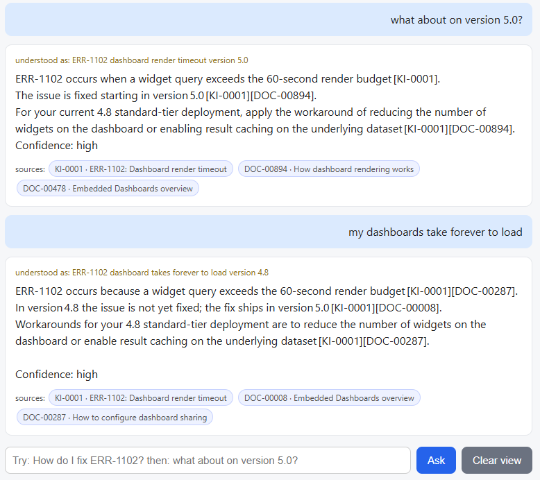

← **Previous:** [Chapter 3](../03-hybrid-rag/README.md) · [How to run labs](../../HANDS-ON-GUIDE.md) · **Next:** [Back to the course index](../../README.md) →

# Chapter 4 — RAG with memory

🎯 Chapter 4 of 4 · 🧪 **12 steps** · 🔧 Dev Tools console, plus your terminal for Steps 7, 11, and the [chat form](../../example-corp-kit/rag-runner/) in Step 12

This is the last chapter of the course. Chapters 1 through 3 gave the support tool everything it needs to answer one well formed question. It retrieves the right evidence with hybrid search, it wraps that evidence in a structured prompt, and it proves the retrieval choice with numbers. But a support conversation does not arrive one question at a time. A customer may start with an error code, come back a few messages later, and ask a follow up that only makes sense in light of everything said before. Retrieval on its own has no memory of any of that. Every question is treated as the first one the system has ever seen.

In this chapter you fix that. First you'll watch a stateless follow up retrieve the wrong thing and see why. Then you'll give the support tool a memory with the OpenSearch ML Commons Memory API, use that memory to rewrite a context-dependent follow up into a question, and attach each customer's own context to the shared knowledge base. You'll finish by having a multi-turn conversation with the whole system in a browser.

| Section | Lesson | What you build |
|---------|--------|----------------|
| [4-1](#lesson-4-1--the-conversation-problem) | The conversation problem | A stateless follow up that retrieves the wrong thing, a memory that stores the turns, and a rewrite that makes retrieval work again |
| [4-2](#lesson-4-2--isolation-what-to-carry-forward-and-the-combined-prompt) | Isolation, history, and the combined prompt | A second customer's memory proving the boundary holds, and a prompt carrying evidence and memory together |
| [4-3](#lesson-4-3--the-capstone-talk-to-your-rag-system) | The capstone | A multi-turn conversation with everything you built across four chapters |

## Let's get started.

Dev Tools handles the Memory API and search calls in Steps 1 through 6 and 8 through 10; Steps 7, 11, and 12 run on your machine.

---

## Lesson 4-1 — The conversation problem

> [!NOTE]
> **What a "turn" means.** A *turn* is one exchange in a conversation: the user's message plus the assistant's reply to it. Ask a question, get an answer — that is one turn. The Memory API stores each turn as a single record with two fields, an `input` (what the user said) and a `response` (what the assistant answered), and a multi-turn conversation is nothing more than those records kept in order. The word shows up all through this chapter, and the `Turns stored` counter in the Step 12 chat form is literally counting them.

### Step 1: Watch a stateless follow up fail

A customer on version 4.8 asks about the ERR-1102 dashboard render timeout, gets a good answer, and then types a short follow up: "what about on version 5.0?" A stateless pipeline sends those exact words to retrieval with no idea that the question is still about ERR-1102. Run the follow up on its own and watch retrieval miss.

**Request** - send the raw follow up straight to retrieval. Replace `YOUR_MODEL_ID`:

```http
POST support-advrag-kb/_search
{
  "size": 3,
  "_source": ["source_id", "title", "product_version"],
  "query": {
    "neural": {
      "text_embedding": {
        "query_text": "what about on version 5.0?",
        "model_id": "YOUR_MODEL_ID",
        "k": 3
      }
    }
  }
}
```

**Expected** - pages about incremental refresh and mobile layouts. Nothing about ERR-1102, and nothing wrong with the search itself.

```json
{
  "hits": {
    "max_score": 0.74537617,
    "hits": [
      { "_score": 0.7454, "_source": { "source_id": "DOC-00715", "title": "Incremental Refresh overview", "product_version": "5.1" } },
      { "_score": 0.7446, "_source": { "source_id": "DOC-00665", "title": "How mobile layouts works", "product_version": "5.0" } },
      { "_score": 0.7405, "_source": { "source_id": "DOC-00245", "title": "Incremental Refresh overview", "product_version": "5.0" } }
    ]
  }
}
```

This is the whole problem we currently face. Those three documents are the closest matches in meaning to the phrase "version 5.0," which is a correct answer to the question retrieval was handed. The question it was handed was the wrong question, because half of it was in the previous turn.

Notice what does not happen: no error, no empty result, nothing to alert on. The pipeline returns a confident, well-cited answer about incremental refresh, but a support engineer who reads it can't pass it on.

### Step 2: Create a memory for the conversation

The Memory API stores a conversation inside the cluster. Create one and attach the customer's static context, their version and tier, in `additional_info`. That context is the user-specific data that does not belong in the general knowledge base, because the knowledge base is shared by every customer.




**Request** - create the memory with the customer's context attached:

```http
POST _plugins/_ml/memory/
{
  "name": "acme-analytics dashboard issue",
  "additional_info": {
    "customer_id": "acme-analytics",
    "product_version": "4.8",
    "tier": "standard"
  }
}
```

**Expected** - a `memory_id`. Yours will differ.

```json
{ "memory_id": "EJvN2J8BEWv-bbzhjph8" }
```

**Save** the `memory_id`. Every step below that says `YOUR_MEMORY_ID` means this value.

### Step 3: Store the first turn

The memory you just created is empty. It has the customer's context but no conversation yet. Here you'll record the first turn: the customer's ERR-1102 question and the answer the tool gave. Each turn is one `POST` to the memory's `/messages` endpoint, carrying the user's `input` and the assistant's `response`. This is the write your pipeline would make after every reply, so the cluster's copy of the conversation always matches what the customer actually saw.

**Request** - store turn one. Replace `YOUR_MEMORY_ID`:

```http
POST _plugins/_ml/memory/YOUR_MEMORY_ID/messages
{
  "input": "How do I fix the ERR-1102 dashboard render timeout?",
  "response": "Reduce widget count or enable result caching on the underlying dataset. A permanent fix ships in version 5.0. [KI-0001]"
}
```

**Expected** - a `message_id`.

```json
{ 
  "message_id": "8CHN2J8B8F-e4abekBiz" 
}
```

### Step 4: Store the follow up turn

Now the second turn: the customer's "what about on version 5.0?" and the answer they got. It is the same `POST` as Step 3, and that's the point: every turn, no matter how long the conversation runs, is one more record appended to the memory in the order it happened. Store this one and the memory now holds the full exchange from Step 1.

**Request** - store turn two:

```http
POST _plugins/_ml/memory/YOUR_MEMORY_ID/messages
{
  "input": "what about on version 5.0?",
  "response": "On version 5.0 the render timeout fix is already included, so no workaround is needed. [KI-0001]"
}
```

**Expected** - another `message_id`.

```json
{ 
  "message_id": "_wXN2J8Bb0H5wu58kqv_" 
}
```

### Step 5: Read the conversation history

Steps 3 and 4 wrote turns into the memory; this step reads them back out. That read is the move that makes memory useful: your pipeline runs this `GET` at the start of every new turn, before it retrieves or generates anything, to load the recent history. It returns every message in the memory, oldest first. That history is what lets the model resolve a follow up like "what about on version 5.0?"

**Request** - read the history back:

```http
GET _plugins/_ml/memory/YOUR_MEMORY_ID/messages
```

**Expected** - the messages in order, each with its `input`, its `response`, and timestamps.

```json
{
  "messages": [
    {
      "memory_id": "EJvN2J8BEWv-bbzhjph8",
      "message_id": "8CHN2J8B8F-e4abekBiz",
      "create_time": "2026-08-06T20:39:38.299594226Z",
      "updated_time": "2026-08-06T20:39:38.299594226Z",
      "input": "How do I fix the ERR-1102 dashboard render timeout?",
      "response": "Reduce widget count or enable result caching on the underlying dataset. A permanent fix ships in version 5.0. [KI-0001]"
    },
    {
      "memory_id": "EJvN2J8BEWv-bbzhjph8",
      "message_id": "_wXN2J8Bb0H5wu58kqv_",
      "create_time": "2026-08-06T20:39:38.917302917Z",
      "updated_time": "2026-08-06T20:39:38.917302917Z",
      "input": "what about on version 5.0?",
      "response": "On version 5.0 the render timeout fix is already included, so no workaround is needed. [KI-0001]"
    }
  ]
}
```

That is the whole API surface for conversation state: create a memory, add turns, read them back in order. Three calls, and the conversation now lives in the cluster.

### Step 6: Read the customer's static context

Step 5 read the *conversation*, the turns that change with every message. This step reads the other half of the memory: the `additional_info` you attached back in Step 2, the facts about the customer that do *not* change turn to turn. Notice the endpoint is different. Step 5 hit `/messages` for the turns; this one hits the memory object itself for its metadata. That split is the whole design: a memory is one customer's durable context wrapped around their running conversation, and you read each part when you need it. In Step 11 you'll pull both together into a single prompt — the `additional_info` becomes the version-and-tier restriction, the messages become the recent history.



**Request** - read the memory's own metadata:

```http
GET _plugins/_ml/memory/YOUR_MEMORY_ID
```

**Expected** - the memory metadata, including `additional_info`. Look at two fields side by side. The `user` field reads `icopensearch` (the OpenSearch login that made the API call) which the cluster fills in on its own. The customer is `customer_id: acme-analytics`, inside the `additional_info` section. The cluster has no built-in notion of a "customer": the `user` who calls the API and the customer a memory is *about* are two different things. Keeping them matched up is your application's job, not the cluster's. Step 10 comes back to why that matters.

```json
{
  "memory_id": "EJvN2J8BEWv-bbzhjph8",
  "create_time": "2026-08-06T20:39:37.840300158Z",
  "updated_time": "2026-08-06T20:39:39.019261233Z",
  "name": "acme-analytics dashboard issue",
  "user": "icopensearch",
  "additional_info": {
    "product_version": "4.8",
    "tier": "standard",
    "customer_id": "acme-analytics"
  }
}
```

### Step 7: Rewrite the follow up using the history

Now you'll use the model to turn the context-dependent follow up into a complete, standalone question that includes the error code and version the customer left out, so retrieval has something to match. Hand it the recent turns and ask for one rewritten query. This is the same prompt the memory-aware runner uses in Step 12.

> [!NOTE] 
> This step and Step 11 call Groq, so set your key in the terminal first if this is a fresh session: `export GROQ_API_KEY=gsk_your_key_here` on macOS/Linux, or `$env:GROQ_API_KEY = "gsk_your_key_here"` in PowerShell (where you also paste the `Ask-Groq` helper once, from the [lab guide](../../HANDS-ON-GUIDE.md#windows-users)).

**Request** - ask the model for one standalone query:

```bash
curl -s https://api.groq.com/openai/v1/chat/completions \
  -H "Authorization: Bearer $GROQ_API_KEY" \
  -H "Content-Type: application/json" -d '{
  "model": "openai/gpt-oss-120b",
  "temperature": 0,
  "messages": [
    {
      "role": "user",
      "content": "Conversation so far:\nUser: How do I fix the ERR-1102 dashboard render timeout?\nAssistant: Reduce widget count or enable result caching on the underlying dataset. A permanent fix ships in version 5.0. [KI-0001]\n\nUser: what about on version 5.0?\n\nRewrite the user'"'"'s last message as a standalone search query that includes any error code or version it depends on. Output only the query, nothing else."
    }
  ]
}' \
  | python3 -c "import sys,json;print(json.load(sys.stdin)['choices'][0]['message']['content'].strip())"
```
> **Windows (PowerShell)** — the same request through the [`Ask-Groq` helper](../../HANDS-ON-GUIDE.md#windows-users):
>
> ```powershell
> Ask-Groq @'
> {
>   "model": "openai/gpt-oss-120b",
>   "temperature": 0,
>   "messages": [
>     {
>       "role": "user",
>       "content": "Conversation so far:\nUser: How do I fix the ERR-1102 dashboard render timeout?\nAssistant: Reduce widget count or enable result caching on the underlying dataset. A permanent fix ships in version 5.0. [KI-0001]\n\nUser: what about on version 5.0?\n\nRewrite the user's last message as a standalone search query that includes any error code or version it depends on. Output only the query, nothing else."
>     }
>   ]
> }
> '@
> ```

**Expected** - a query that includes both the error code and the version, neither of which was in the message the customer typed.

```text
ERR-1102 dashboard render timeout version 5.0
```

The rewrite could just as well be a full sentence: "Is the ERR-1102 dashboard render timeout fixed in version 5.0?" Either form works, and Step 8 proves it by retrieving on this rewritten query. What matters is not the grammar but the tokens: `ERR-1102` and `5.0` are now in the query text. That is all retrieval needs to find the right document. Notice what memory did and did not do here. It did not answer the question, it just handed back the pieces of the question the customer had left implicit, so retrieval could do its job.

### Step 8: Retrieve the rewritten question with hybrid search

Send the rewritten question from Step 7 through the `support-advrag-hybrid` pipeline you built in Chapter 3, and compare what comes back to the raw follow-up in Step 1.

**Request** - retrieve the rewritten question. Replace `YOUR_MODEL_ID`:

```http
POST support-advrag-kb/_search?search_pipeline=support-advrag-hybrid
{
  "size": 3,
  "_source": ["source_id", "title", "product_version"],
  "query": {
    "hybrid": {
      "queries": [
        { "multi_match": { "query": "Is the ERR-1102 dashboard render timeout fixed in version 5.0?", "fields": ["text", "title", "section_path"] } },
        { "neural": { "text_embedding": { "query_text": "Is the ERR-1102 dashboard render timeout fixed in version 5.0?", "model_id": "YOUR_MODEL_ID", "k": 10 } } }
      ]
    }
  }
}
```

**Expected** - `KI-0001` is now the top hit at 0.0328, the known issue the raw follow up missed entirely in Step 1.

```json
{
  "hits": {
    "max_score": 0.032786883,
    "hits": [
      { "_score": 0.0328, "_source": { "source_id": "KI-0001", "title": "ERR-1102: Dashboard render timeout", "product_version": null } },
      { "_score": 0.0161, "_source": { "source_id": "DOC-00666", "title": "How embedded dashboards works", "product_version": "5.0" } },
      { "_score": 0.0161, "_source": { "source_id": "DOC-00236", "title": "Dashboard Rendering overview", "product_version": "5.0" } }
    ]
  }
}
```

That win belongs to both the memory and the keyword leg. The rewrite put the exact token `ERR-1102` into the query, and BM25 matched it hard against the known issue, the same code plain vector search could not surface in Step 1, where the query was only the five words "what about on version 5.0?". Hybrid plus the rewrite is what recovers it.

The two documents behind it are tied at 0.0161 and may print in either order on your cluster, which is the RRF tie behaviour Chapter 3 Step 7 covered. The first results is the one that matters (`KI-0001`) and is not tied with any other document: it leads by a factor of two.

`KI-0001` says the timeout is fixed in version 5.0, so the grounded answer for a customer already on 5.0 is that no workaround is needed. The shorter rewrite from Step 7 returns the same top hit at the same score, which is the point: retrieval needed the information from the `additional-information` memory, not the grammar.

The three hits above are child chunks, the same as every hybrid result in Chapter 3, so the same packing rule applies before any of them reaches the prompt: add `parent_text` to `_source`, keep one hit per `parent_id`, and pack the parent, or the child for `KI-0001`, which is a known issue with no parent section. Do not add `collapse` to this request; it is a hybrid query, and Chapter 3 showed what that does to a fused ranking.

---

## Lesson 4-2 — Isolation, what to carry forward, and the combined prompt

### Step 9: Create a second customer's memory

One customer's conversation must never surface in another customer's session. Each conversation is its own memory with its own id, so isolation is structural rather than something you enforce with a filter.

**Request** - create a second, unrelated memory:

```http
POST _plugins/_ml/memory/
{
  "name": "northwind logistics",
  "additional_info": {
    "customer_id": "northwind-logistics",
    "product_version": "5.1",
    "tier": "enterprise"
  }
}
```

**Expected** - a second, different `memory_id`.

```json
{ "memory_id": "EZvN2J8BEWv-bbzhuphG" }
```

**Save** this one too, as `SECOND_MEMORY_ID`.

### Step 10: Prove the second memory cannot see the first

Two customers now have memories on the same cluster: acme-analytics, with the two-turn ERR-1102 conversation from Steps 3 and 4, and northwind-logistics, created empty a moment ago. In a support tool northwind must never see a word of acme's conversation and vice versa. You'll test this directly. Read the *second* memory's history and confirm nothing from the first leaks in.

You do not query "all memories" and filter down to one customer; you address a single `memory_id`, and that id only returns its own messages. Below is scoped to `SECOND_MEMORY_ID`, so acme's conversation is not merely hidden from it, it cannot reach it.

**Request** - read the second memory's history. Replace `SECOND_MEMORY_ID`:

```http
GET _plugins/_ml/memory/SECOND_MEMORY_ID/messages
```

**Expected** - zero messages. A new memory starts empty, with no route to anyone else's history.

```json
{ "messages": [] }
```

> [!NOTE] 
> **This is a security boundary.** A customer's conversation history is as sensitive as their documents. Nothing in the cluster knows which memory belongs to which person: that mapping lives in your applications, which decides which `memory_id` belongs to which customer. Treat a `memory_id` the way you treat a session token, because whoever holds it can read the conversations.

### Choosing what history to carry forward

You cannot put an entire conversation into every prompt. A long chat blows past the token budget, and even when it fits, stuffing dozens of old messages in makes the answer worse, not better, because the model has to read through everything that is no longer relevant to find the little that is. Three strategies decide what to carry:

- **Sliding window.** Keeps the last few turns word for word and drops the rest. It's simple, cheap, and it preserves the exact recent wording a follow up usually depends on. Anything past the edge of the window is gone. Good when conversations are short and what matters is almost always the last thing said.
  
- **Summary.** Keeps a running summary of the whole conversation instead of the raw turns, updating it as you go. It holds the arc of a long troubleshooting session, but a summary always leaves something out, and whatever is left out, the model can no longer reach. Good when the overall picture matters more than the exact words.
  
- **Hybrid.** Keeps a summary of the older part plus the last few turns word for word. Long-term gist and short-term precision together, for a predictable number of tokens. This is usually the right answer.

Whatever you choose, spend the token budget intentionally. Decide how much room goes to the retrieved evidence, how much to the memory, and how much you leave for the answer itself.

### Expiring old sessions

A conversation from six months ago should not sit in your cluster forever. The Memory API has **no built in TTL**: nothing in OpenSearch decides how long a conversation lives, and a memory stays until something deletes it.

So retention is your application's job, and there are three parts to it:

1. **Picking the window...** This is completely up to your business requirements. It could be thirty days, ninety days, or whatever number makes sense to you.
2. **Recording when each memory was created.** Your application already has to track which `memory_id` belongs to which customer, so store the creation time next to it.
3. **Running a scheduled job that deletes by id.** It finds every memory older than the window and calls `DELETE _plugins/_ml/memory/{memory_id}` on each one.

### Step 11: Assemble the combined prompt

Here is where the whole course comes together. Chapter 2 built a five-block prompt and left the tooling block empty on purpose. This chapter fills it, with memory. At answer time you now pull two things side-by-side: the long-term evidence from the knowledge base, and the customer's stored context and recent turns from the memory. Each block is labeled for what it is, so the model is never confused about which part is durable product truth and which part belongs to this conversation.

**Request** - send remembered context and retrieved evidence in one prompt:

```bash
curl -s https://api.groq.com/openai/v1/chat/completions \
  -H "Authorization: Bearer $GROQ_API_KEY" \
  -H "Content-Type: application/json" -d '{
  "model": "openai/gpt-oss-120b",
  "temperature": 0,
  "messages": [
    {
      "role": "system",
      "content": "You are Example Corp'"'"'s internal support assistant. Answer ONLY using the evidence provided below. If the evidence does not contain the answer, say you do not have that information. After each claim, cite the source in square brackets using its source_id. Be concise, then end with a final line that reads Confidence: low, medium, or high."
    },
    {
      "role": "user",
      "content": "## MEMORY\nCustomer acme-analytics, product version 4.8, standard tier.\nRecent turns:\nUser: How do I fix the ERR-1102 dashboard render timeout?\nAssistant: Reduce widget count or enable result caching on the underlying dataset. A permanent fix ships in version 5.0. [KI-0001]\nUser: what about on version 5.0?\n\n## GOAL\nIs the ERR-1102 dashboard render timeout fixed in version 5.0?\n\n## RESTRICTIONS\nThe customer is on product version 4.8, standard tier. Version matching is a preference for choosing between sources, NOT a requirement for using them. Never refuse to answer because the evidence is written for a different version. If a fix only exists in a later version, give the workaround for their version and name the version the fix ships in.\n\n## EVIDENCE\n[KI-0001] (known-issue) ERR-1102: Dashboard render timeout\nSymptom: Users encounter ERR-1102 (dashboard render timeout).\nRoot cause: Widget query exceeded the 60 second render budget\nWorkaround: Reduce widget count or enable result caching on the underlying dataset\nAffected versions: 4.8, 4.9\nFixed in: 5.0\n\n## ANSWER SCHEMA\nThe answer, a [source_id] citation on every claim, then a final line reading Confidence: low, medium, or high."
    }
  ]
}' \
  | python3 -c "import sys,json;print(json.load(sys.stdin)['choices'][0]['message']['content'].strip())"
```
> **Windows (PowerShell)** — the same request through the [`Ask-Groq` helper](../../HANDS-ON-GUIDE.md#windows-users):
>
> ```powershell
> Ask-Groq @'
> {
>   "model": "openai/gpt-oss-120b",
>   "temperature": 0,
>   "messages": [
>     {
>       "role": "system",
>       "content": "You are Example Corp's internal support assistant. Answer ONLY using the evidence provided below. If the evidence does not contain the answer, say you do not have that information. After each claim, cite the source in square brackets using its source_id. Be concise, then end with a final line that reads Confidence: low, medium, or high."
>     },
>     {
>       "role": "user",
>       "content": "## MEMORY\nCustomer acme-analytics, product version 4.8, standard tier.\nRecent turns:\nUser: How do I fix the ERR-1102 dashboard render timeout?\nAssistant: Reduce widget count or enable result caching on the underlying dataset. A permanent fix ships in version 5.0. [KI-0001]\nUser: what about on version 5.0?\n\n## GOAL\nIs the ERR-1102 dashboard render timeout fixed in version 5.0?\n\n## RESTRICTIONS\nThe customer is on product version 4.8, standard tier. Version matching is a preference for choosing between sources, NOT a requirement for using them. Never refuse to answer because the evidence is written for a different version. If a fix only exists in a later version, give the workaround for their version and name the version the fix ships in.\n\n## EVIDENCE\n[KI-0001] (known-issue) ERR-1102: Dashboard render timeout\nSymptom: Users encounter ERR-1102 (dashboard render timeout).\nRoot cause: Widget query exceeded the 60 second render budget\nWorkaround: Reduce widget count or enable result caching on the underlying dataset\nAffected versions: 4.8, 4.9\nFixed in: 5.0\n\n## ANSWER SCHEMA\nThe answer, a [source_id] citation on every claim, then a final line reading Confidence: low, medium, or high."
>     }
>   ]
> }
> '@
> ```

**Expected** - a grounded, cited answer that resolves the follow up in the thread of the conversation.

```text
Yes, the ERR-1102 dashboard render timeout is fixed in version 5.0 [KI-0001].
Confidence: high
```

Line this prompt up against the one you built in Chapter 2, block by block. Only one is genuinely new — the rest are the Chapter 2 blocks, doing the same jobs:

| Block | What it holds now | Compared with Chapter 2 |
|---|---|---|
| System instructions | The grounding, citation, and confidence rules | Identical string, character for character |
| `## MEMORY` | The customer record from `additional_info`, plus the recent turns | **New** — this is the `## TOOLING` slot Chapter 2 left holding the placeholder `(none yet, Chapter 4 fills this with memory)` |
| `## GOAL` | The question to answer | Same block; the question is now Step 7's rewrite, not the raw follow up |
| `## RESTRICTIONS` | The customer's version and tier | Same rule, word for word |
| `## EVIDENCE` | Step 8's fused hits, packed as parent sections | Same block |
| `## ANSWER SCHEMA` | The answer, citations, and confidence shape | Unchanged |

**The change that matters is not just the new block, it is where an old one gets its facts.** In Chapter 2 you typed "product version 4.8, standard tier" into the restrictions block by hand, because there was nowhere else for it to come from. Here, those same two values arrive from the memory you created in Step 2 and read back in Step 6. **The restrictions block did not change shape; it stopped being hard-coded**.

> [!Important]
>  **Beyond the conversational Memory API.** OpenSearch also has an agentic memory container (`POST /_plugins/_ml/memory_containers/_create`), which responds on this 3.5 cluster too. It manages longer-lived agent memory with less wiring and is the natural next step for multi-agent systems. This lab stays on the conversational Memory API because it maps cleanly to a support conversation.

---

## Lesson 4-3 — The capstone: talk to your RAG system

### Step 12: Have a multi-turn conversation with the whole system

Everything you built now runs behind one page: you type a question, OpenSearch does hybrid retrieval over all 5,139 chunks, the model answers from what came back, grounded and cited, and the Memory API carries the conversation from one turn to the next. No credit card, no billing information, and every piece of it inspectable.

There are two forms in the runner folder. `05_rag_chat_server.py` is the single-turn version from Chapters 2 and 3: it retrieves and answers, but each question stands alone. `06_rag_chat_memory.py` is this chapter's version: on startup it creates a memory, stores every turn, reads the history back to resolve follow ups, and feeds recent turns into the prompt.

It reads the same `.env` and `model_id.txt` you set up in Chapter 2 Step 9, and it needs `RAG_PIPE=support-advrag-hybrid` in that `.env` (you added it in Chapter 3 Step 9) so the memory form retrieves with the hybrid pipeline. Nothing new to configure; if you are on a fresh machine, set the runner folder up as Chapter 2 Step 9 describes.

**Request** - start the memory-aware chat form. In Git Bash use `python`, and if your terminal is still in `rag-runner` from Chapter 3, skip the `cd`:

```bash
cd example-corp-kit/rag-runner
python3 06_rag_chat_memory.py
```

> **Windows (PowerShell)** — the same, with `python`:
>
> ```powershell
> cd example-corp-kit/rag-runner
> python 06_rag_chat_memory.py
> ```
>
> Seeing `error` on every question after it starts? The server reads `model_id.txt` and `.env` once, at startup — if you changed either, fully stop it (Ctrl+C, confirm the prompt returns) and relaunch, and if the relaunch reports the port is in use, an old server is still running.

**Expected** - the server starts on port 8788 and prints the `memory_id` it just created for this session.

```text
RAG+memory chat on http://localhost:8788  (model openai/gpt-oss-120b, memory EJvN2J8BEWv-bbzhjph8)
```

Open **http://localhost:8788**, which is bound to your machine only. This time, instead of asking single questions, hold a **conversation** — the turns build on each other. Ask these four in order, and watch three places as you go:

- **The end of the small line under the title** reads `Turns stored: N`. It ticks up by one after every exchange. That is the memory growing, one record per turn.
- **Under an answer**, an `understood as:` line appears whenever the tool rewrote your question before retrieving. A complete question shows none; a context-dependent follow up shows the rewrite.
- **The terminal running the server** prints a `packed N parent sections` line for every question, the same parent-packing you watched in Chapters 2 and 3, still running underneath.

**Request** - Turn 1, a complete question that doesn't need context:

```text
How do I fix ERR-1102 dashboard render timeout?
```

**Expected** - the tool retrieves `KI-0001` and answers with the workaround. `Turns stored` reads 1, and no `understood as:` line appears under the answer, because a complete question needs no rewrite. This turn is also what fills the memory that the next turn depends on.

**Request** - Turn 2, a follow up that only makes sense in light of Turn 1 — the exact question that failed back in Step 1:

```text
what about on version 5.0?
```

**Expected** - the form reads the stored history, rewrites those five words into a standalone query, shows you that rewrite under the reply, retrieves on it, and answers. `Turns stored` climbs to 2. On the validated run the rewrite line read:

```text
understood as: ERR-1102 dashboard render timeout version 5.0
```

The mechanism worked. The five words the customer typed became a query carrying the error code, the descriptive words, and the version. Memory supplied the half of the question that was never in the message, and the answer came back saying the simple true thing:

```text
ERR-1102 occurs when a widget's query exceeds the 60-second render budget [KI-0001].
The issue is fixed starting in version 5.0 [DOC-00894][DOC-00478]. For customers on
earlier versions (e.g., 4.8), the recommended work-arounds are to reduce the number of
widgets on the dashboard or enable result caching on the underlying dataset [KI-0001].
Confidence: high
```

Notice that it answered the version-5.0 question **and** kept the 4.8 workaround in view, because the restrictions block carries this customer's version out of the memory's `additional_info`. Compare it with Step 1, where these same five words retrieved incremental-refresh and mobile-layout docs. The knowledge base did not change between the two runs; memory did. It rewrote the bare follow up into a question that names `ERR-1102`, and retrieval can only find what the query names.

**Look at what the rewrite kept, because that is why it worked.** It did not shrink the question down to `ERR-1102 on version 5.0`. It carried `dashboard render timeout` along too — the descriptive words give the keyword leg rare tokens to grip and the vector leg meaning to match, so both halves of hybrid search have something to work with. Drop those words and retrieval gets worse, quietly: the query still runs, nothing errors, the results are just weaker, and nothing in the logs tells you.


**Request** - Turn 3, a fresh symptom on a completely different topic. Turns 1 and 2 were both about the `ERR-1102` render timeout; this question is about slow load times and has nothing to do with that error. Ask it and watch what memory does with a subject change:

```text
my dashboards take forever to load
```

**Expected** - this is the other edge of the same knife, so watch the rewrite line closely. The customer has moved on to a new, unrelated symptom, but the model doing the rewrite has only the ERR-1102 conversation to work from. On the validated run it read:

```text
understood as: ERR-1102 dashboard load time version 5.0
```



The customer changed the subject, and the rewrite dragged the whole previous topic along with it. The answer that follows opens by framing slow dashboards as an `ERR-1102` problem, which may well be right, but is not something the customer said. 

Memory is not free: a system that remembers everything will apply what it remembers to questions that were not about it. In production this is where you add the cheap check from the note under Step 7 and skip the rewrite when a question is already complete on its own.

**Request** - Turn 4, a question the corpus does not cover:

```text
what is Example Corp's refund policy for annual contracts?
```

**Expected** - a decline, exactly as in every chapter. A conversation, a memory, and a hybrid retriever are all stacked on top of the model now, and none of them talk it into an answer. It is worth being precise about what that proves: not that the grounding rule is the only thing holding the line here. Four chapters of stacking have not eroded the call. Memory did not talk the model into treating an old turn as evidence, and the rewrite did not drag the conversation somewhere the evidence could not follow.

> [!NOTE]
> **Results vary in wording, not in behavior.** Retrieval is deterministic on the same corpus and model, so the sources reproduce. The rewrite, the answer's exact sentences, and its self-reported confidence all come from the language model and will vary run to run, including how good the rewrite is. What stays constant is that Turn 2 retrieves on a question containing `ERR-1102` rather than on the five words the customer typed, and that Turn 4 declines.

---

## 🏁 Chapter 4 conclusion

### Nicely done — your support tool now holds a conversation!

You gave the support tool a memory! Retrieval stayed the same, the prompt structure stayed the same, and Chapter 2's deliberately empty block finally got filled. Here's what you learned:

- **Stateless RAG treats every question as the first one.** A follow up that depends on an earlier turn retrieves the wrong thing, a confident answer to the wrong question.
- **The ML Commons Memory API stores conversations inside the cluster.** Create a memory, add turns as `input` and `response`, read the history back, and attach static user context in `additional_info`. Conversation state lives in the data layer, not your application's process memory.
- **A follow up has to be rewritten into a standalone question.** What makes retrieval work again is the tokens the rewrite restores, not its grammar.
- **Memory is a security boundary your application owns.** It carries user-specific data that does not belong in the shared knowledge base, and nothing in the cluster stops one customer's `memory_id` from reading another's. Your application needs to keep that mapping.
- **Sliding window, summary, and hybrid**  each trade recency against completeness inside a fixed token budget the memory block shares with the packed evidence.
- **The Memory API has no built-in TTL.** Retention is a scheduled job in your application that deletes by `memory_id`, not an ISM policy.

---

## 🏁 Course wrap-up

### Congratulations! You've made it to the end of this course!

We hope you have enjoyed doing this hands-on workshop! You built one fully-working RAG system, layer by layer, and measured every step. Looking back across the four chapters:

- **Chapter 1** - the retrieval layer: an embedding model deployed inside your own cluster, an ingest pipeline that vectorizes on arrival, a k-NN index carrying the parent-child and filtering fields, 5,139 chunks loaded idempotently, and a scored baseline of hit rate 0.653.
- **Chapter 2** - the prompt: parent sections packed as evidence, a lazy prompt caught inventing detail, and the five-block structure that grounds every claim, cites its source, respects the customer's version, and declines when the evidence does not cover the question.
- **Chapter 3** - the retriever, proven: BM25 for exact tokens, vectors for meaning, reciprocal rank fusion for both, and a golden-set score that made the choice a number (hybrid at 0.670 hit rate and 0.167 precision) instead of an opinion.
- **Chapter 4** - the conversation: turns stored in the OpenSearch Memory API with the customer's context attached, a follow up rewritten so retrieval works again, isolation proven between two customers, and evidence and memory carried side by side in one prompt.

**Where to go from here**

- **Explore the rest of the platform.** Your 30-day trial is still running. Open the [Instaclustr Management Console](https://console2.instaclustr.com/?source=InstAcademy_OpenSearch_Advanced_RAG), look around, and see what else you can build before it expires.
- **Claim your badge.** If you finished both the video series and these labs, [request your Credly badge](https://github.com/instaclustr/instacademy/issues/new?template=course-completion.yml). Mark the course complete in the InstAcademy library first.
- **Tell people how it went.** [Rate the course](https://github.com/instaclustr/instacademy/issues/new/choose) so we can make it better, and share what you built on LinkedIn.

**Clean up when you're ready.** If you want a tidy cluster to keep experimenting on for the rest of your free trial, [clean up your lab here](../05-course-cleanup/README.md) — it removes the memories, index, pipelines, and model the course created. You can also delete the cluster entirely and try another Instaclustr managed technology for the remainder of the trial. Either way, at the end of the free trial every running resource is removed from your account automatically. Thanks for building this with us.

We hope to see you again soon!
---

← [Chapter 3](../03-hybrid-rag/README.md) · [OpenSearch track](../../../README.md) · [Report a problem with this chapter](https://github.com/instaclustr/instacademy/issues/new/choose) · 🏁 [Back to the course index](../../README.md) →
