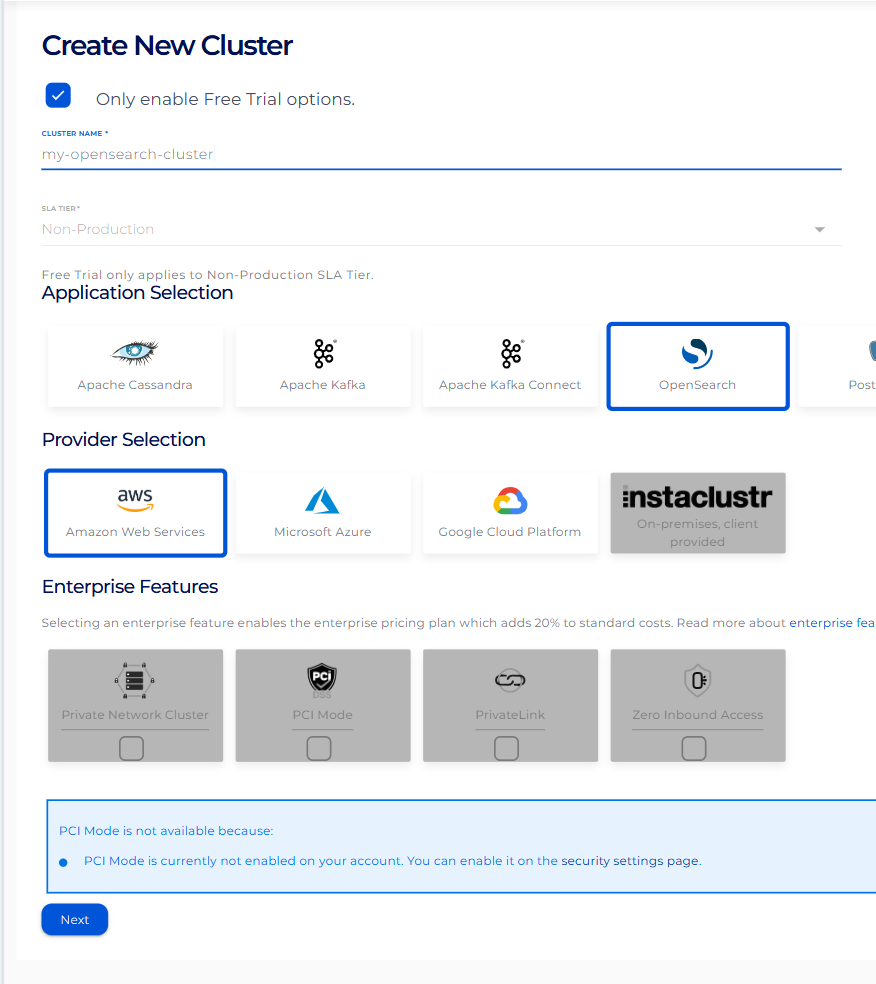
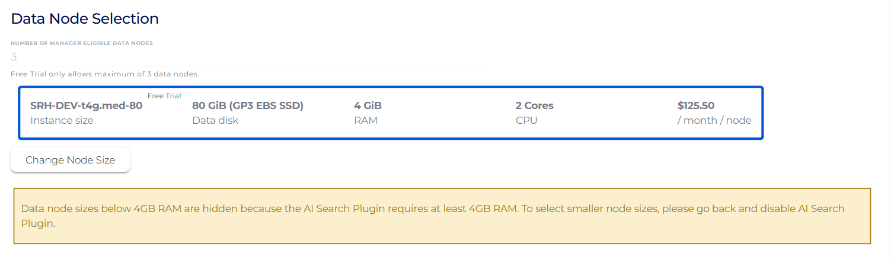
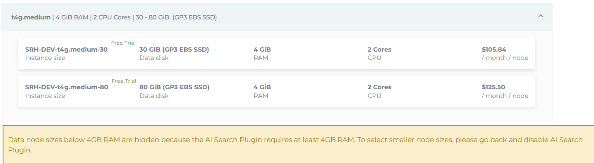
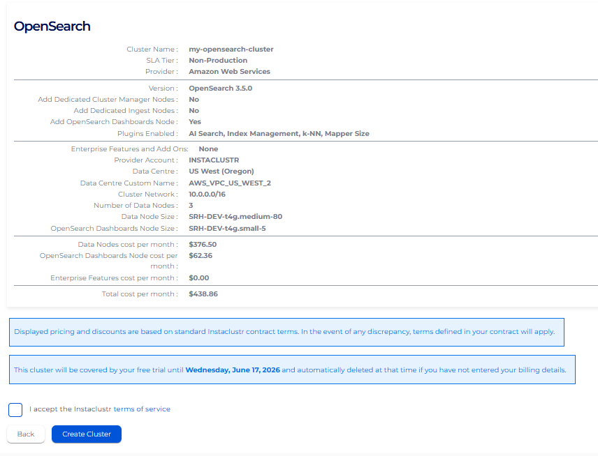

← [Course index](README.md) · [How to run labs](HANDS-ON-GUIDE.md) · **Next:** [Chapter 1](src/Chapter%201/README.md)

# Set up your OpenSearch cluster

Everything in this course runs against a real OpenSearch cluster, so this page gets you one. You'll create a free NetApp Instaclustr trial account, launch a cluster with the plugins the course needs, open the firewall to your own machine, and collect the connection details every chapter asks for. No credit card, and the trial runs for 30 days.

Budget about **15 minutes**, most of which is the cluster provisioning itself while you go get coffee.

**What you'll do**

1. [Sign up and verify your email](#1-sign-up-and-verify-your-email)
2. [Create the cluster](#2-create-the-cluster) — name it, pick OpenSearch, add the **AI Search Plugin**, size the nodes
3. [Add your IP to the firewall](#3-add-your-ip-to-the-firewall)
4. [Collect your connection details](#4-collect-your-connection-details)
5. [Confirm it works](#5-confirm-it-works)

> **Choices that matter.** Two settings on the create screens are not optional for this course: the **AI Search Plugin** (it ships ML Commons and k-NN, which Chapters 2 through 5 depend on) and a **data node size with enough memory to hold an embedding model** (the m.80 tier below). Everything else can be left at its default.

---

## 1. Sign up and verify your email

Start at the [NetApp Instaclustr free trial](https://console2.instaclustr.com/signup?source=InstAcademy_OpenSearch_AISearch) and fill out the sign-up form.


You'll land on the console dashboard, which asks you to verify your email address before you can create anything.


Click the link in the verification email. When you come back, the yellow banner is gone and the console is ready.


## 2. Create the cluster

On the dashboard, click the blue **Create Cluster** button in the left sidebar.


Give the cluster a name you'll recognize, choose **OpenSearch** from the list of technologies, and click **Next**.



On the plugins list, select the **AI Search Plugin**. This is the one choice you cannot skip: it installs ML Commons and the k-NN plugin, which is what lets the cluster host embedding models and run vector search. Without it, Chapter 2 onward will not work.


Click **Next**, then scroll to **Data Node Selection** and click **Change Node Size**.



Choose the **m.80** node size at the bottom of the list. Smaller nodes cannot hold the embedding models this course deploys, and you'll hit memory circuit breakers partway through Chapter 2.



## 3. Add your IP to the firewall

Instaclustr clusters are closed to the internet by default, so your machine has to be allowed in explicitly. On the network screen, check the two boxes to **add your current IP address** to the firewall rules.


> **If your IP changes, you lose access.** Home internet connections and VPNs hand out new addresses regularly, and a connection that worked yesterday can hang or time out today for this reason alone. If requests suddenly stop responding, come back to **Firewall Rules** in the console and add your current IP again.

Click **Next**, review everything on the final screen, then click **Create Cluster**.



Provisioning takes about ten minutes. The console shows the cluster as **Provisioning** and then **Running**.

## 4. Collect your connection details

Once the cluster is running, open it in the console and go to the **Connection Info** tab. Three things there matter for the rest of the course:

| What you need | Where it comes from | Used by |
|---|---|---|
| **Cluster URL** (`https://…:9200`) | Connection Info, the public endpoint | Bruno's `baseUrl`, and every `curl` command |
| **Username and password** | Connection Info, the default user is `icopensearch` | Both Dev Tools login and Bruno auth |
| **OpenSearch Dashboards URL** (`…:5601`) | Connection Info, listed separately | Dev Tools, which is where you'll run most of the course |

Keep that tab open, or paste the three values somewhere handy. You'll need them in the next step and again when you set up Bruno.

## 5. Confirm it works

Two quick checks, and then you're done here.

**Dev Tools (the main path).** Open your Dashboards URL in a browser. It uses port **5601**, not 9200, and looks like this:

```
https://opensearch-dashboards.<your-cluster-id>.cnodes.io:5601
```

Log in with your cluster username and password, then open the menu at the top left, scroll to **Management**, and choose **Dev Tools**. You can also go straight to the console:

```
https://opensearch-dashboards.<your-cluster-id>.cnodes.io:5601/app/dev_tools#/console
```

Type this into the left pane and press **Ctrl+Enter** to run it:

```http
GET _cluster/health
```

A healthy new cluster answers with `"status": "green"` and `"number_of_data_nodes": 3`. That's your cluster talking back, and you're ready for Chapter 1.

**Bruno (fast mode, optional).** If you plan to use the Bruno collection, set `baseUrl`, `username`, and `password` in its **Local** environment now. The [Bruno guide](bruno/README.md) covers the rest.

> **Trial housekeeping.** The trial lasts 30 days and needs no credit card. You can delete the cluster from the console at any time, and the last chapter's wrap-up points you back here when you're finished with the course.

---

**Cluster running? Connection details saved?** Then head to [Chapter 1](src/Chapter%201/README.md), or read [how to run the labs](HANDS-ON-GUIDE.md) first if you haven't yet.
