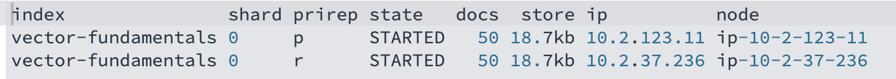
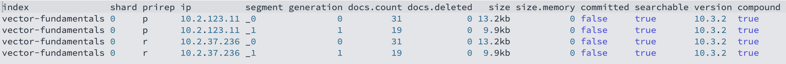
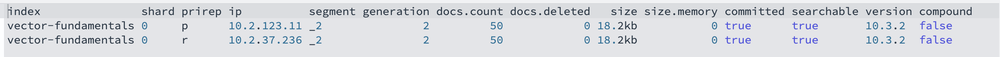
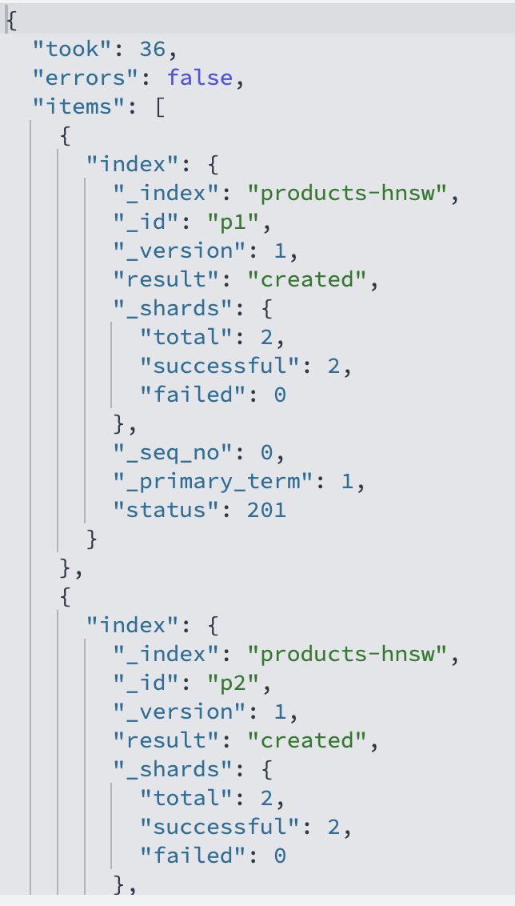
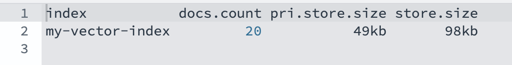
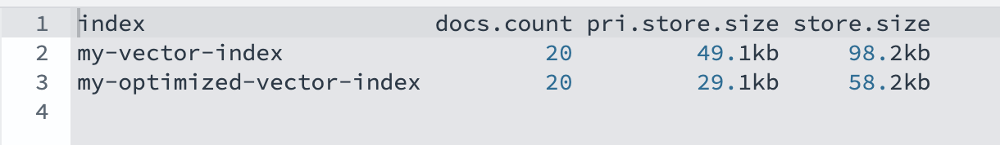

# Chapter 1 — Configuring and optimizing vector search

**Chapter 1 workshop** · [Vector Storage & Search for AI](../../README.md)

← [Course index](../../README.md) · [How to run labs](../../HANDS-ON-GUIDE.md) · **Next:** [Chapter 2](../Chapter%202/README.md)

This is the hands-on companion to Chapter 1 of the video course. Everything the
videos demonstrate — index settings, HNSW/IVF method parameters, exact k-NN,
disk-based and memory-optimized storage, chunking, shard sizing, and dimension
reduction — is turned into a request you can run yourself in **Dev Tools** (or
[Bruno fast mode](../../bruno/Chapter%201/)).

The chapter is one continuous workshop, organized into four sections that match
the lessons:

| Section | Lesson | What you build |
|---------|--------|----------------|
| [1-1](#lesson-1-1--vector-search-fundamentals-and-configuration) | Vector search fundamentals and configuration | A `knn_vector` index; inspect settings, shards, segments; disk-based + memory-optimized variants |
| [1-2](#lesson-1-2--choosing-the-right-type-of-vector-search) | Exact k-NN, HNSW, IVF | Run all three search methods on the same data and compare |
| [1-3](#lesson-1-3--vector-storage-and-search-optimizations) | Storage & search optimizations | Chunking, shard/ISM management, dimension reduction |

Work through the sections in order — later steps reuse earlier indexes. A
[cleanup section](#cleanup) at the end removes everything you created.

## How to read a step

Every step uses the same layout (see the [lab guide](../../HANDS-ON-GUIDE.md)):

- A concept from the video is described.
- **Request** — code you'll paste into **Dev Tools** (Dashboards → Dev Tools).
- **Expected** — what the output should look like.
- **Save** — values you'll reuse later.
- **Fast mode** — ability to run it as a full script with bruno instead of doing it manually.

## Prerequisites

- A running **Instaclustr OpenSearch cluster** (3-node trial, **AI Search
  Plugin** enabled) reachable from your browser — see [cluster setup](../../CREATE_CLUSTER.md).
  Your IP must be on the firewall allow-list.
- **OpenSearch 3.5+.**
- **Dev Tools** to run the commands or [Bruno](../../bruno/README.md) configured with
  `baseUrl`, `username`, `password` of the OpenSearch cluster.
- Sample floating-point vectors used in these labs are tiny (8-dimensional) and
  ship as bulk files under [`rest/bulk/`](../../rest/bulk/). Real embeddings used in Chapter 2.

---

## Lesson 1-1 — Vector search fundamentals and configuration

**Concept — vectors and embeddings.** A *vector* is a list of numbers describing
a point in multi-dimensional space by its direction and magnitude. It lets you
reason about non-numeric data (text, images, audio) numerically. A *vector
embedding* is one piece of real data after a machine-learning model has
translated it into that space — for example, one book's description turned into
768 floats. Each dimension captures a facet of the data (a naive color embedding
might use 3 dimensions for red/green/blue); higher dimensionality captures more
nuance at the cost of more storage and compute. OpenSearch stores embeddings in a
`knn_vector` field and searches them by distance.

**Concept — the cost/performance balance.** Tuning a vector index is always a
trade between **search performance** and **operational cost**, where cost breaks
down into three resources: **CPU, RAM, and storage**. Two structural knobs
dominate:

- **Shards** — more shards means smaller shards and more parallelism, but each
  shard adds coordination overhead. You'll size these in [Lesson 1-3](#lesson-1-3--vector-storage-and-search-optimizations).
- **Segments** — Lucene stores each shard as a set of immutable segments. More
  segments means higher search latency, so merging segments is a core tuning
  lever (Step 5 below).

### Step 1: Verify cluster connectivity (only if using Fast-mode/Bruno)

Every later step assumes basic auth and TLS work. `GET /` returns the cluster
name and version — a five-second smoke test that saves hours of debugging bulk
or model errors later. It also confirms your engine version so you know which
features (like `on_disk` mode) are available.

**Request**

```http
GET /
```

**Expected**

```json
{
  "name": "...",
  "cluster_name": "...",
  "version": { "number": "3.x.x", "...": "..." },
  "tagline": "The OpenSearch Project: https://opensearch.org/"
}
```

If you get `401 Unauthorized` check the username/password. If it timesout, check that your IP is
on the Instaclustr firewall list.

**Fast mode** — `01-cluster-info.bru`

### Step 2: Create a vector index
  
`knn_vector` is the field type that stores embeddings. Three settings do the
heavy lifting:

- **`index.knn: true`** — turns on the k-NN data structures for the index. Without
  it you cannot run approximate `knn` queries.
- **`dimension`** — the exact length of every vector. It must match your
  embedding model; a mismatch fails at index time.
- **`method`** — the ANN algorithm and engine. Here `hnsw` on `faiss` (the
  default engine). `space_type` is the distance function (`l2` = Euclidean); it
  can sit at the top level of the field or inside `method`. The HNSW parameters
  **`m`** (links per node, default 16) and **`ef_construction`** (build-time
  candidate list, default 100) trade graph quality against the build cost and memory.

This is a k-NN-enabled index with a title and vector field **(my_vector)** that builds a proper HNSW graph, 
with a standard approximate-nearest-neighbor index structure.

**m: 16** means each node in the graph connects to **up to 16 neighbors**. This controls density/accuracy vs memory usage.
**ef_construction: 100** is how thoroughly the graph is built at index time (higher is a better quality graph but slower to build).

**Request**

```http
PUT vector-fundamentals
{
  "settings": {
    "index": {
      "knn": true,
      "knn.algo_param.ef_search": 100
    }
  },
  "mappings": {
    "properties": {
      "title": { "type": "text" },
      "my_vector": {
        "type": "knn_vector",
        "dimension": 8,
        "space_type": "l2",
        "method": {
          "name": "hnsw",
          "engine": "faiss",
          "parameters": {
            "m": 16,
            "ef_construction": 100
          }
        }
      }
    }
  }
}
```

**Expected**

```json
{
  "acknowledged": true,
  "shards_acknowledged": true,
  "index": "vector-fundamentals"
}
```
This means it saved your new index correctly.

If it already exists from a previous run, `DELETE vector-fundamentals` first.

**Fast mode** — `02-create-vector-index.bru`

### Step 3: Inspect the mapping and settings

Reading back the mapping confirms OpenSearch accepted your `knn_vector`
configuration and shows the effective defaults it filled in. This is useful when you
want to know exactly what `m`, `ef_construction`, and `space_type` your index is
actually using.

**Request**

```http
GET vector-fundamentals/_mapping
```

**Expected** — the `my_vector` field echoed back with `type: knn_vector`,
`dimension: 8`, and your `method` block.

```
{
  "vector-fundamentals": {
    "mappings": {
      "properties": {
        "my_vector": {
          "type": "knn_vector",
          "dimension": 8,
          "method": {
            "engine": "faiss",
            "space_type": "l2",
            "name": "hnsw",
            "parameters": {
              "ef_construction": 100,
              "m": 16
            }
          },
          "space_type": "l2"
        },
        "title": {
          "type": "text"
        }
      }
    }
  }
}
```

**Fast mode** — `03-get-mapping.bru`

### Step 4: Index a few vectors

You need documents in the index before shards, segments, and search become
meaningful. The bulk API indexes many documents in one request as alternating
action/source lines (NDJSON). These three vectors are 8-dimensional to be more
readable by eye. We'll index these 50 vectors across two _bulk commands and show what that looks

**Request** — run the `POST` command to index the 50 vectors

```http
POST _bulk
{"index": {"_index": "vector-fundamentals", "_id": "1"}}
{"title": "Intro to Vector Search", "my_vector": [0.1, 0.2, 0.3, 0.4, 0.5, 0.6, 0.7, 0.8]}
{"index": {"_index": "vector-fundamentals", "_id": "2"}}
{"title": "Scaling Retrieval", "my_vector": [0.15, 0.25, 0.35, 0.45, 0.55, 0.65, 0.75, 0.85]}
{"index": {"_index": "vector-fundamentals", "_id": "3"}}
{"title": "Tuning HNSW Graphs", "my_vector": [0.8, 0.7, 0.6, 0.5, 0.4, 0.3, 0.2, 0.1]}
{"index": {"_index": "vector-fundamentals", "_id": "4"}}
{"title": "Approximate Nearest Neighbors 101", "my_vector": [0.12, 0.22, 0.32, 0.42, 0.52, 0.62, 0.72, 0.82]}
{"index": {"_index": "vector-fundamentals", "_id": "5"}}
{"title": "Embedding Models Compared", "my_vector": [0.9, 0.8, 0.7, 0.6, 0.5, 0.4, 0.3, 0.2]}
{"index": {"_index": "vector-fundamentals", "_id": "6"}}
{"title": "Recall vs Latency Tradeoffs", "my_vector": [0.18, 0.28, 0.38, 0.48, 0.58, 0.68, 0.78, 0.88]}
{"index": {"_index": "vector-fundamentals", "_id": "7"}}
{"title": "FAISS Under the Hood", "my_vector": [0.85, 0.75, 0.65, 0.55, 0.45, 0.35, 0.25, 0.15]}
{"index": {"_index": "vector-fundamentals", "_id": "8"}}
{"title": "Scalar Quantization Explained", "my_vector": [0.05, 0.15, 0.25, 0.35, 0.45, 0.55, 0.65, 0.75]}
{"index": {"_index": "vector-fundamentals", "_id": "9"}}
{"title": "HNSW Graph Construction", "my_vector": [0.95, 0.85, 0.75, 0.65, 0.55, 0.45, 0.35, 0.25]}
{"index": {"_index": "vector-fundamentals", "_id": "10"}}
{"title": "Cosine vs L2 Distance", "my_vector": [0.22, 0.32, 0.42, 0.52, 0.62, 0.72, 0.82, 0.92]}
{"index": {"_index": "vector-fundamentals", "_id": "11"}}
{"title": "Building a RAG Pipeline", "my_vector": [0.7, 0.6, 0.5, 0.4, 0.3, 0.2, 0.1, 0.05]}
{"index": {"_index": "vector-fundamentals", "_id": "12"}}
{"title": "Chunking Strategies for Docs", "my_vector": [0.14, 0.24, 0.34, 0.44, 0.54, 0.64, 0.74, 0.84]}
{"index": {"_index": "vector-fundamentals", "_id": "13"}}
{"title": "Hybrid Search Deep Dive", "my_vector": [0.78, 0.68, 0.58, 0.48, 0.38, 0.28, 0.18, 0.08]}
{"index": {"_index": "vector-fundamentals", "_id": "14"}}
{"title": "Reciprocal Rank Fusion", "my_vector": [0.3, 0.4, 0.5, 0.6, 0.7, 0.8, 0.9, 0.95]}
{"index": {"_index": "vector-fundamentals", "_id": "15"}}
{"title": "Sparse Neural Search", "my_vector": [0.6, 0.5, 0.4, 0.3, 0.2, 0.1, 0.05, 0.15]}
{"index": {"_index": "vector-fundamentals", "_id": "16"}}
{"title": "Segment Merging Basics", "my_vector": [0.26, 0.36, 0.46, 0.56, 0.66, 0.76, 0.86, 0.96]}
{"index": {"_index": "vector-fundamentals", "_id": "17"}}
{"title": "Force Merge in Practice", "my_vector": [0.65, 0.55, 0.45, 0.35, 0.25, 0.15, 0.05, 0.1]}
{"index": {"_index": "vector-fundamentals", "_id": "18"}}
{"title": "On-Disk Vector Storage", "my_vector": [0.19, 0.29, 0.39, 0.49, 0.59, 0.69, 0.79, 0.89]}
{"index": {"_index": "vector-fundamentals", "_id": "19"}}
{"title": "Memory-Optimized Indexing", "my_vector": [0.82, 0.72, 0.62, 0.52, 0.42, 0.32, 0.22, 0.12]}
{"index": {"_index": "vector-fundamentals", "_id": "20"}}
{"title": "Compression Levels Tuning", "my_vector": [0.08, 0.18, 0.28, 0.38, 0.48, 0.58, 0.68, 0.78]}
{"index": {"_index": "vector-fundamentals", "_id": "21"}}
{"title": "IVF Index Structure", "my_vector": [0.91, 0.81, 0.71, 0.61, 0.51, 0.41, 0.31, 0.21]}
{"index": {"_index": "vector-fundamentals", "_id": "22"}}
{"title": "Product Quantization", "my_vector": [0.33, 0.43, 0.53, 0.63, 0.73, 0.83, 0.93, 0.13]}
{"index": {"_index": "vector-fundamentals", "_id": "23"}}
{"title": "Reindexing with Painless", "my_vector": [0.55, 0.45, 0.35, 0.25, 0.15, 0.05, 0.1, 0.2]}
{"index": {"_index": "vector-fundamentals", "_id": "24"}}
{"title": "Truncating Embeddings", "my_vector": [0.16, 0.26, 0.36, 0.46, 0.56, 0.66, 0.76, 0.86]}
{"index": {"_index": "vector-fundamentals", "_id": "25"}}
{"title": "PCA for Dimensionality Reduction", "my_vector": [0.88, 0.78, 0.68, 0.58, 0.48, 0.38, 0.28, 0.18]}
{"index": {"_index": "vector-fundamentals", "_id": "26"}}
{"title": "Binary Vector Encoding", "my_vector": [0.07, 0.17, 0.27, 0.37, 0.47, 0.57, 0.67, 0.77]}
{"index": {"_index": "vector-fundamentals", "_id": "27"}}
{"title": "FP16 Precision Storage", "my_vector": [0.93, 0.83, 0.73, 0.63, 0.53, 0.43, 0.33, 0.23]}
{"index": {"_index": "vector-fundamentals", "_id": "28"}}
{"title": "ef_search Tuning Guide", "my_vector": [0.24, 0.34, 0.44, 0.54, 0.64, 0.74, 0.84, 0.94]}
{"index": {"_index": "vector-fundamentals", "_id": "29"}}
{"title": "ef_construction Explained", "my_vector": [0.72, 0.62, 0.52, 0.42, 0.32, 0.22, 0.12, 0.02]}
{"index": {"_index": "vector-fundamentals", "_id": "30"}}
{"title": "m Parameter in HNSW", "my_vector": [0.11, 0.21, 0.31, 0.41, 0.51, 0.61, 0.71, 0.81]}
{"index": {"_index": "vector-fundamentals", "_id": "31"}}
{"title": "Shard Allocation Strategy", "my_vector": [0.87, 0.77, 0.67, 0.57, 0.47, 0.37, 0.27, 0.17]}
```
Since we just added these vectors in memory we will refresh the index to force the
bulk-indexed documents to become visible/searchable immediately. Since this is a
brand new index we want to guarantee they are visible before we look at the shards
and segments. 

```
POST vector-fundamentals/_refresh
```

and...
```
POST _bulk
{"index": {"_index": "vector-fundamentals", "_id": "32"}}
{"title": "Replica Placement Rules", "my_vector": [0.31, 0.41, 0.51, 0.61, 0.71, 0.81, 0.91, 0.06]}
{"index": {"_index": "vector-fundamentals", "_id": "33"}}
{"title": "Cluster Health Basics", "my_vector": [0.59, 0.49, 0.39, 0.29, 0.19, 0.09, 0.14, 0.24]}
{"index": {"_index": "vector-fundamentals", "_id": "34"}}
{"title": "Bulk API Performance", "my_vector": [0.13, 0.23, 0.33, 0.43, 0.53, 0.63, 0.73, 0.83]}
{"index": {"_index": "vector-fundamentals", "_id": "35"}}
{"title": "Refresh Interval Tradeoffs", "my_vector": [0.79, 0.69, 0.59, 0.49, 0.39, 0.29, 0.19, 0.09]}
{"index": {"_index": "vector-fundamentals", "_id": "36"}}
{"title": "Near Real-Time Search", "my_vector": [0.2, 0.3, 0.4, 0.5, 0.6, 0.7, 0.8, 0.9]}
{"index": {"_index": "vector-fundamentals", "_id": "37"}}
{"title": "Lucene Segment Internals", "my_vector": [0.62, 0.52, 0.42, 0.32, 0.22, 0.12, 0.02, 0.11]}
{"index": {"_index": "vector-fundamentals", "_id": "38"}}
{"title": "Compound File Format", "my_vector": [0.36, 0.46, 0.56, 0.66, 0.76, 0.86, 0.96, 0.06]}
{"index": {"_index": "vector-fundamentals", "_id": "39"}}
{"title": "Doc Values vs Postings", "my_vector": [0.74, 0.64, 0.54, 0.44, 0.34, 0.24, 0.14, 0.04]}
{"index": {"_index": "vector-fundamentals", "_id": "40"}}
{"title": "k-NN Plugin Architecture", "my_vector": [0.09, 0.19, 0.29, 0.39, 0.49, 0.59, 0.69, 0.79]}
{"index": {"_index": "vector-fundamentals", "_id": "41"}}
{"title": "Filtering with k-NN Queries", "my_vector": [0.96, 0.86, 0.76, 0.66, 0.56, 0.46, 0.36, 0.26]}
{"index": {"_index": "vector-fundamentals", "_id": "42"}}
{"title": "Pre-filter vs Post-filter", "my_vector": [0.25, 0.35, 0.45, 0.55, 0.65, 0.75, 0.85, 0.95]}
{"index": {"_index": "vector-fundamentals", "_id": "43"}}
{"title": "Painless Scripting Tips", "my_vector": [0.66, 0.56, 0.46, 0.36, 0.26, 0.16, 0.06, 0.16]}
{"index": {"_index": "vector-fundamentals", "_id": "44"}}
{"title": "ISM Policies for Retention", "my_vector": [0.17, 0.27, 0.37, 0.47, 0.57, 0.67, 0.77, 0.87]}
{"index": {"_index": "vector-fundamentals", "_id": "45"}}
{"title": "Rollover Index Patterns", "my_vector": [0.84, 0.74, 0.64, 0.54, 0.44, 0.34, 0.24, 0.14]}
{"index": {"_index": "vector-fundamentals", "_id": "46"}}
{"title": "Security Roles and Users", "my_vector": [0.06, 0.16, 0.26, 0.36, 0.46, 0.56, 0.66, 0.76]}
{"index": {"_index": "vector-fundamentals", "_id": "47"}}
{"title": "Hybrid Weighted Scoring", "my_vector": [0.92, 0.82, 0.72, 0.62, 0.52, 0.42, 0.32, 0.22]}
{"index": {"_index": "vector-fundamentals", "_id": "48"}}
{"title": "Min-Max Normalization", "my_vector": [0.29, 0.39, 0.49, 0.59, 0.69, 0.79, 0.89, 0.99]}
{"index": {"_index": "vector-fundamentals", "_id": "49"}}
{"title": "Arithmetic Mean Combination", "my_vector": [0.53, 0.43, 0.33, 0.23, 0.13, 0.03, 0.15, 0.25]}
{"index": {"_index": "vector-fundamentals", "_id": "50"}}
{"title": "Cluster Settings Deep Dive", "my_vector": [0.4, 0.5, 0.6, 0.7, 0.8, 0.9, 0.95, 0.05]}
```
We'll invoke another refresh since we added more vectors.

```
POST vector-fundamentals/_refresh
```

**Expected** — The command should return a similar output to the following:
```
{
  "took": 25,
  "errors": false,
  "items": [
    {
      "index": {
        "_index": "vector-fundamentals",
        "_id": "1",
        "_version": 1,
        "result": "created",
        "_shards": {
          "total": 2,
          "successful": 2,
          "failed": 0
        },
        "_seq_no": 0,
        "_primary_term": 1,
        "status": 201
      }
    },
    {
      "index": {
        "_index": "vector-fundamentals",
        "_id": "2",
        "_version": 1,
        "result": "created",
        "_shards": {
          "total": 2,
          "successful": 2,
          "failed": 0
        },
        "_seq_no": 1,
        "_primary_term": 1,
        "status": 201
      }
    },...
}
```
**NOTE:** numbers start at '0' and not '1'. "_seq_no" for the first vector will appear as '0', which is normal.

**Fast mode** — `04-bulk-fundamentals-1.bru` → `05-refresh-fundamentals.bru` → `06-bulk-fundamentals-2.bru` → `07-refresh-fundamentals-2.bru`

### Step 5: Inspect shards and segments, then force-merge

This is the "segment management" the video calls out. `_cat/shards` shows how the
index is distributed; `_cat/segments` shows the immutable Lucene segments inside
each shard. Because more segments means higher query latency, `_forcemerge`
collapses them — here down to one segment — which is a common optimization for
read-heavy indexes that are no longer being written. (Only force-merge indexes
that are done ingesting; it is expensive.)

You'll see we have 2 total shards and both were successful.

**Request** — This command will show us where the shards are in our cluster
```http
GET _cat/shards/vector-fundamentals?v
```
Notice in the image below that **shard 0** has a **Primary (p)** and 
**Replica (r)** on two separate nodes.



Now we'll take a look at any segments inside of the shard:

**Request**:

```http
GET _cat/segments/vector-fundamentals?v
```
Let's break down what we are looking at:
**shard = 0** is the first shard created on these nodes.
**segment = _0** means this is the very first segment created for this shard.
**docs.count`/`docs.deleted** shows the 3 docs you indexed in Step 4. No documents have been deleted 
**size = 5.2kb** the size of the segments on disk,  
**size.memory = 0** means we are using approximately zero JVM heap
**committed = true** shows the segment has been fsynced to disk (it's durable)
**searchable = true** means the segment is visible to queries. A segment can exist
but not be searchable if it was written and a refresh hadn't happened yet.
**version = 10.3.2** is the Lucene version that wrote the segment
**compound = true** means all segment's files (postings, doc values, vectors, etc)
are packed into a single compound file (.cfs) to conserve file handles. Not the focus
of this workshop, but good to know.




**Request** — merge to a single segment:

```http
POST vector-fundamentals/_forcemerge?max_num_segments=1
```

**Expected** — Successful command
```
{
  "_shards": {
    "total": 2,
    "successful": 2,
    "failed": 0
  }
}
```

**Request** - Because our index is not under much load, we will refresh it to ensure we see the results:
```
POST vector-fundamentals/_refresh
```

Now if we run our segment query again, we will see a single segment:
**Request**
```
GET _cat/segments/vector-fundamentals?v
```
Notice how we now see a single segment: **'_2'** with the 50 documents combined!


**Fast mode** — `08-cat-shards.bru` → `09-cat-segments.bru` → `10-forcemerge.bru` → `11-refresh-after-merge.bru` → re-run `09-cat-segments.bru`

### Step 6: Disk-based (on_disk) storage

Disk-based vector search stores full-fidelity vectors on disk and keeps only a
compressed form in memory, cutting RAM cost while preserving strong recall
through a two-phase quantize-then-rescore search. You enable it with
**`mode: on_disk`** and tune the memory/recall trade with **`compression_level`**
(valid values `1x`, `2x`, `4x`, `8x`, `16x`, `32x`; `on_disk` defaults to `32x`).
We will use 16x in our call, which means OpenSearch is quantizing (shrinking) the 
stored representation to about 1/16th the size of the full float32 precision.

**Request**

```http
PUT vector-disk-demo
{
  "settings": { "index": { "knn": true } },
  "mappings": {
    "properties": {
      "my_vector": {
        "type": "knn_vector",
        "dimension": 8,
        "space_type": "l2",
        "mode": "on_disk",
        "compression_level": "16x"
      }
    }
  }
}
```

**Expected** — Note we set only `mode` and `compression_level`; OpenSearch chooses
 the `faiss` engine and a quantizing encoder for you.
```
{
  "acknowledged": true,
  "shards_acknowledged": true,
  "index": "vector-disk-demo"
}
```

**Fast mode** — `12-create-disk-index.bru`

---

## Lesson 1-2 — Choosing the right type of vector search

**Concept — kNN vs aNN.** 

- **Exact k-nearest-neighbor (kNN)** compares the query against *every* indexed
  vector. It has perfect recall but its cost grows linearly with the dataset, so
  it doesn't scale.
- **Approximate nearest neighbor (aNN)** still uses distance math, but a
  specialized data structure narrows the search to a small set of candidate
  vectors first — letting it search billions of vectors in milliseconds. The two
  aNN methods here are **HNSW** and **IVF**.
  - **HNSW (Hierarchical Navigable Small World)** builds a layered graph. Search
    starts at a sparse top layer, hops to the closest node, then descends into
    denser layers — like finding a book by narrowing from *Art* → *Modern art* →
    the exact title. Very fast and scales well, at a high memory cost.
  - **IVF (Inverted File Index)** uses k-means to cluster vectors around
    **centroids**. Each centroid owns a bucket (the "inverted file") of its
    vectors. A query only scans the buckets of the nearest centroids, so most
    vectors are skipped — fast even on huge datasets, with lower memory than
    HNSW, but it requires a **training** step first. IVF is `faiss`-only.

You'll run all three against the same 10 product vectors and compare.

### Step 7: Create the products index (HNSW)

This `faiss`/`hnsw` index is both the HNSW demo and the source of training data
for IVF later. The `category` keyword field lets us demonstrate filtered exact
search. We set `m` and `ef_construction` explicitly so you can see the knobs from
Lesson 1-1 in a realistic index. Noticed the method name here and the engine being used...

**Request**:

```http
PUT products-hnsw
{
  "settings": { "index": { "knn": true } },
  "mappings": {
    "properties": {
      "title": { "type": "text" },
      "category": { "type": "keyword" },
      "product_vector": {
        "type": "knn_vector",
        "dimension": 8,
        "space_type": "l2",
        "method": {
          "name": "hnsw",
          "engine": "faiss",
          "parameters": { "m": 16, "ef_construction": 128 }
        }
      }
    }
  }
}
```

**Expected**: 
```
{
  "acknowledged": true,
  "shards_acknowledged": true,
  "index": "products-hnsw"
}
```

**Fast mode** — `13-create-products-hnsw.bru`

### Step 8: Bulk-index the product vectors

Ten small products (three rough clusters: electronics, books, outdoor) give the
search methods something to distinguish.

**Request** — run the following command to index 10 products

```http
POST _bulk
{"index": {"_index": "products-hnsw", "_id": "p1"}}
{"title": "Wireless Headphones", "category": "electronics", "product_vector": [0.92, 0.88, 0.1, 0.12, 0.05, 0.08, 0.11, 0.09]}
{"index": {"_index": "products-hnsw", "_id": "p2"}}
{"title": "Bluetooth Speaker", "category": "electronics", "product_vector": [0.88, 0.91, 0.14, 0.09, 0.07, 0.1, 0.08, 0.12]}
{"index": {"_index": "products-hnsw", "_id": "p3"}}
{"title": "Smart Watch", "category": "electronics", "product_vector": [0.85, 0.83, 0.2, 0.15, 0.1, 0.12, 0.14, 0.1]}
{"index": {"_index": "products-hnsw", "_id": "p4"}}
{"title": "Hardcover Novel", "category": "books", "product_vector": [0.1, 0.12, 0.9, 0.88, 0.11, 0.09, 0.13, 0.08]}
{"index": {"_index": "products-hnsw", "_id": "p5"}}
{"title": "Cookbook Deluxe", "category": "books", "product_vector": [0.14, 0.09, 0.86, 0.91, 0.08, 0.12, 0.1, 0.11]}
{"index": {"_index": "products-hnsw", "_id": "p6"}}
{"title": "Poetry Collection", "category": "books", "product_vector": [0.09, 0.15, 0.83, 0.85, 0.13, 0.1, 0.09, 0.14]}
{"index": {"_index": "products-hnsw", "_id": "p7"}}
{"title": "Camping Tent", "category": "outdoor", "product_vector": [0.12, 0.1, 0.11, 0.09, 0.9, 0.88, 0.13, 0.1]}
{"index": {"_index": "products-hnsw", "_id": "p8"}}
{"title": "Hiking Backpack", "category": "outdoor", "product_vector": [0.1, 0.13, 0.09, 0.12, 0.87, 0.9, 0.11, 0.09]}
{"index": {"_index": "products-hnsw", "_id": "p9"}}
{"title": "Trekking Poles", "category": "outdoor", "product_vector": [0.13, 0.09, 0.14, 0.1, 0.84, 0.86, 0.15, 0.12]}
{"index": {"_index": "products-hnsw", "_id": "p10"}}
{"title": "Portable Charger", "category": "electronics", "product_vector": [0.8, 0.86, 0.18, 0.14, 0.2, 0.16, 0.1, 0.11]}

```

**Expected**: ten items created and "errors: false"
```
{
  "took": 36,
  "errors": false,
  "items": [...
```
 Your response should look similar to the image below.


**Request**

```http
POST products-hnsw/_refresh
```

**Expected**: 2 successful shards refresh

```
{
  "_shards": {
    "total": 2,
    "successful": 2,
    "failed": 0
  }
}
```

**Fast mode** — `14-bulk-products.bru` → `15-refresh-products-hnsw.bru`

### Step 9: Exact k-NN with a scoring script

Exact kNN is done with a **scoring script**, not the `knn` query. The special
`knn_score` script (note `"lang": "knn"`) computes the true distance from the
query vector to every matched document — It's essentially a brute-force scan 
with perfect recall. Use it for small datasets where accuracy is non-negotiable. 
`space_type` is chosen at query time here, and `query_value` must match the 
field's `dimension`.

In this example, we are giving you a pre-computed query_value, but in chapter 2
your environment will be configured to compute it's own. Here we'll assume our 
query_value comes from '**portable wireless gadgets**'.
**Request**

```http
GET products-hnsw/_search
{
  "size": 3,
  "query": {
    "script_score": {
      "query": { "match_all": {} },
      "script": {
        "source": "knn_score",
        "lang": "knn",
        "params": {
          "field": "product_vector",
          "query_value": [0.90, 0.90, 0.10, 0.10, 0.05, 0.05, 0.10, 0.10],
          "space_type": "l2"
        }
      }
    }
  }
}
```

**Expected**: based on the input query_value the three electronics products 
(`Wireless Headphones`, `Bluetooth Speaker`, and `Smart Watch`) rank highest, 
because the query vector sits in the electronics cluster.

**Fast mode** — `16-exact-knn-score-script.bru`

### Step 10: Exact k-NN with a pre-filter

The scoring-script approach shines when you need **heavy pre-filtering**: you
restrict the candidate set *first* with a normal query, then compute exact
distances only over what survives. Here we score exact distance only across the
`books` category. (Approximate `knn` queries filter differently and can return
fewer than `k` results after filtering; the scoring script avoids that.)

**Request**

```http
GET products-hnsw/_search
{
  "size": 3,
  "query": {
    "script_score": {
      "query": {
        "bool": { "filter": { "term": { "category": "books" } } }
      },
      "script": {
        "source": "knn_score",
        "lang": "knn",
        "params": {
          "field": "product_vector",
          "query_value": [0.10, 0.10, 0.90, 0.90, 0.10, 0.10, 0.10, 0.10],
          "space_type": "l2"
        }
      }
    }
  }
}
```

**Expected** — 3 books returned. (Hardcover Novel, Cookbook Deluxe, 
Poetry Collection), and no electronics or outdoor items leaked through.

**Fast mode** — `17-exact-knn-prefilter.bru`

### Step 11: Approximate search with HNSW

The `knn` query runs the approximate HNSW search you configured on the index. It
walks the graph instead of scanning every vector. `k` is how many neighbors to
return; `method_parameters.ef_search` widens the search list at query time
(higher = more accurate, slower). On this tiny dataset the results match exact
search, but on millions of vectors this is orders of magnitude faster.

**Request**

```http
GET products-hnsw/_search
{
  "size": 3,
  "query": {
    "knn": {
      "product_vector": {
        "vector": [0.90, 0.90, 0.10, 0.10, 0.05, 0.05, 0.10, 0.10],
        "k": 3,
        "method_parameters": { "ef_search": 100 }
      }
    }
  }
}
```

**Expected** — the 3 nearest neighbors to the query vector are returned, 
all from the electronics category (Wireless Headphones, Bluetooth Speaker, 
Smart Watch), ranked by similarity score. Since the query vector 
[0.90, 0.90, 0.10, 0.10, 0.05, 0.05, 0.10, 0.10] closely matches 
the electronics product vectors, HNSW correctly surfaces them as nearest 
neighbors — no books or outdoor items should appear, and on this small 
dataset the approximate result matches what exact search would return.

**Fast mode** — `18-hnsw-knn-query.bru`

### Step 12: Train an IVF model and poll until ready

IVF must learn its centroids before it can index anything, so you **train a
model** with the Train API. It reads vectors from an existing `knn_vector` field
(`products-hnsw`), clusters them into `nlist` buckets, and stores a reusable
model. `nprobes` (how many buckets to scan at query time) can be set now or per
query. Training needs at least `nlist` vectors; we use `nlist: 4` against 10
vectors. Training is asynchronous — the call returns immediately with a
`model_id`.

**Request**

```http
POST _plugins/_knn/models/_train
{
  "training_index": "products-hnsw",
  "training_field": "product_vector",
  "dimension": 8,
  "description": "IVF model for Chapter 1 products",
  "space_type": "l2",
  "method": {
    "name": "ivf",
    "engine": "faiss",
    "parameters": { "nlist": 4, "nprobes": 2 }
  }
}
```

**Expected**

```json
{
  "model_id": "0rTfYsM7SH-3v7PFlca7QA"
}
```

**IMPORTANT!!** Save the returned `model_id`; the next two steps use it. In the 
requests below, replace **`YOUR_MODEL_ID`** with this value. 
If using Bruno, set **`ivfModelId`** in the **Local** environment instead.

Training runs in the background. Poll the model until its `state` is `created`
(from `training`); only then can an index use it.

**Request**

```http
GET _plugins/_knn/models/YOUR_MODEL_ID?filter_path=state,error
```

**Expected**

```json
{
  "state": "created",
  "error": ""
}
```

If `state` is `failed`, the `error` field explains why (most often too few
training vectors for `nlist`). Make sure your Model_ID does not include 
quotation marks in the REST call or it will give you an error.

**Fast mode** — `19-train-ivf-model.bru` → `20-poll-ivf-model.bru`

### Step 13: Create the IVF index and copy the data into it

In Step 12 you trained a model, but a model by itself can't be searched, 
it's just the learned "map" of your data: the four centroid points that 
k-means found, plus the dimension, engine, and distance function it was 
trained with. This step turns that map into a usable index in two parts.

First, the index. Notice the mapping below references the model with 
model_id instead of the method block you wrote by hand in Step 2. 
That's the key difference between HNSW and IVF index creation: with HNSW 
you declare the algorithm parameters directly in the mapping, but an IVF 
field inherits everything: dimension, engine, space_type, and the trained 
centroids from the model. That's also why there's no dimension in this 
mapping: the model already knows it's 8, and specifying a conflicting value 
would be an error waiting to happen.

Second, the data. The new index starts empty, and this is where IVF differs 
from HNSW at write time too. As _reindex copies each product over from 
**products-hnsw**, OpenSearch measures the distance from that product's vector 
to each of the 4 trained centroids and files the document into the bucket of 
the nearest centroid, building the "inverted file" that gives IVF its name. 
At search time (next step), a query only scans the buckets of its closest 
centroids instead of every vector, which is where the speed comes from.

One thing worth internalizing: the centroids are frozen at training time. 
Documents indexed later still get assigned to the nearest existing centroid, 
nothing re-clusters. If your data's shape drifts substantially from what the 
model was trained on, bucket assignments get lopsided and recall degrades; 
the fix is retraining a new model and reindexing, which is IVF's ongoing 
operational cost compared to HNSW.

**Request**

```http
PUT products-ivf
{
  "settings": { "index": { "knn": true } },
  "mappings": {
    "properties": {
      "title": { "type": "text" },
      "category": { "type": "keyword" },
      "product_vector": {
        "type": "knn_vector",
        "model_id": "YOUR_MODEL_ID"
      }
    }
  }
}
```

**Expected** - Index created successfully.
```
{
  "acknowledged": true,
  "shards_acknowledged": true,
  "index": "products-ivf"
}
```

`_reindex` then copies every document from `products-hnsw` into `products-ivf`
server-side; as each vector lands it is assigned to its nearest IVF centroid.

**Request** - copy all documents into products-ivf

```http
POST _reindex?wait_for_completion=true
{
  "source": { "index": "products-hnsw" },
  "dest": { "index": "products-ivf" }
}
```

**Expected** — 10 items total, timed_out: false

```http
{
  "took": 1061,
  "timed_out": false,
  "total": 10,
  "updated": 0,
  "created": 10,
  "deleted": 0,
  "batches": 1,
  "version_conflicts": 0,
  "noops": 0,
  "retries": {
    "bulk": 0,
    "search": 0
  },
  "throttled_millis": 0,
  "requests_per_second": -1,
  "throttled_until_millis": 0,
  "failures": []
}
```

**Fast mode** — `21-create-products-ivf.bru` → `22-reindex-to-ivf.bru` → `23-refresh-products-ivf.bru`

### Step 14: Search the IVF index

The same `knn` query now runs against IVF. `method_parameters.nprobes` controls
how many centroid buckets are scanned (raise it for better recall, lower it for
speed). Because most buckets are skipped, IVF stays fast on very large datasets
while using less memory than HNSW.

**Request**

```http
GET products-ivf/_search
{
  "size": 3,
  "query": {
    "knn": {
      "product_vector": {
        "vector": [0.90, 0.90, 0.10, 0.10, 0.05, 0.05, 0.10, 0.10],
        "k": 3,
        "method_parameters": { "nprobes": 4 }
      }
    }
  }
}
```

**Expected** — The same top 3 electronics products (Wireless Headphones, 
Bluetooth Speaker, Smart Watch) rank highest, retrieved through IVF's 
centroid-bucket search rather than HNSW's graph walk. With nprobes: 4, 
4 of the index's centroid buckets get scanned. The query vector lands 
near the electronics cluster, so those buckets are among the ones 
probed and the correct neighbors surface. Scores and ranking match the 
HNSW example exactly (0.9977 → 0.9941 → 0.9719), which is expected on 
this small dataset; the real difference between the two methods shows 
up in took time and memory footprint at scale, not in result quality here. 

When creating this walkthrough, this result ```took: 64ms``` vs 
```took: 1282ms``` on the earlier HNSW query. That's a fairly dramatic gap 
for identical results on a tiny dataset.

**Fast mode** — `24-ivf-knn-query.bru`


---

## Lesson 1-3 — Vector storage and search optimizations

Three techniques that keep large vector deployments fast and affordable:
**chunking**, **shard management (ISM)**, and **dimension reduction**.

### Chunking

**Concept.** Embedding models have strict token limits (many popular models
handle ~512 tokens, roughly 1,000–1,200 characters). Feed them a document that's
too long and they silently **truncate** it, losing context and producing a poor
embedding. **Chunking** splits a long document into smaller pieces, embeds each
piece separately, and stores each chunk as its own document linked back to the
parent. 

**Benefits:** every chunk fits the model (better embeddings) and smaller
chunks give sharper semantic matches. 

**Costs:** more chunks means more embeddings, more storage, and you often 
reassemble the parent context at retrieval time.


### Shard sizing and ISM rollover

**Concept.** Shard sizing is a balance: **smaller shards** parallelize better but
add coordination overhead when there are too many; **larger shards** reduce
overhead but raise per-query latency because each search scans more data. For
data that grows continuously (logs, events), **Index State Management (ISM)**
policies automate rollover, starting a fresh index once the current one hits a
size or age threshold, so shards never grow unbounded. Chapter 5 (Lesson 5-2)
builds a rollover alias and an ISM policy hands-on.

### Dimension reduction

**Concept.** Vector dimensionality drives both storage and search cost —
lower-dimension vectors are cheaper to store and faster to search, at some
accuracy cost. There are two ways to reduce dimensions:

- **In-place reduction** — reindex within the same index. Fast, but risky because
  you're mutating the index your application reads from.
- **Rebuild in a new index** — create a new, smaller-dimension index and remap the
  data into it. Safer, easy to roll back, which is exactly what the next steps do 
  (256 → 128 dimensions) **(Recommended Approach)**.

### Step 15: Create and load the 256-dim source index

So far this chapter has used tiny 8-dimensional vectors you can read by eye. Real
embedding models output much longer vectors — 256, 768, or 1,536 numbers per
document, and every one of those numbers costs storage and memory. To make this
dimension-reduction exercise realistic, we start with a 256-dimensional index:
big enough that cutting it in half produces a saving worth measuring, small
enough to load in seconds. Treat `my-vector-index` as if it were your production
index whose memory bill you want to shrink.

**Request**

```http
PUT my-vector-index
{
  "settings": { "index": { "knn": true } },
  "mappings": {
    "properties": {
      "title": { "type": "text" },
      "my_vector": {
        "type": "knn_vector",
        "dimension": 256,
        "space_type": "l2",
        "method": { "name": "hnsw", "engine": "faiss" }
      }
    }
  }
}
```

**Expected**:
```
{
  "acknowledged": true,
  "shards_acknowledged": true,
  "index": "my-vector-index"
}
```

Vectors are large, so load it with the pre-generated bulk file rather than
typing 256 floats per document.

**Request** — Run the bulk import of 20 256-float documents below, then \
make sure you run the refresh command (found below this command).

```http
POST _bulk
{"index": {"_index": "my-vector-index", "_id": "1"}}
{"title": "Intro to search", "my_vector": [0.1, 0.117, 0.134, 0.15100000000000002, 0.168, 0.185, 0.202, 0.21900000000000003, 0.23600000000000002, 0.253, 0.27, 0.28700000000000003, 0.30400000000000005, 0.32100000000000006, 0.338, 0.355, 0.372, 0.389, 0.406, 0.42300000000000004, 0.44000000000000006, 0.4570000000000001, 0.474, 0.491, 0.508, 0.525, 0.542, 0.559, 0.5760000000000001, 0.5930000000000001, 0.61, 0.627, 0.644, 0.661, 0.678, 0.6950000000000001, 0.7120000000000001, 0.729, 0.746, 0.763, 0.78, 0.797, 0.8140000000000001, 0.8310000000000001, 0.848, 0.865, 0.882, 0.899, 0.916, 0.933, 0.9500000000000001, 0.9670000000000001, 0.9840000000000001, 0.001000000000000112, 0.018000000000000016, 0.03500000000000014, 0.052000000000000046, 0.06900000000000017, 0.08600000000000008, 0.1030000000000002, 0.1200000000000001, 0.13700000000000023, 0.15400000000000014, 0.17100000000000026, 0.18800000000000017, 0.20500000000000007, 0.2220000000000002, 0.2390000000000001, 0.2560000000000002, 0.27300000000000013, 0.29000000000000026, 0.30700000000000016, 0.3240000000000003, 0.3410000000000002, 0.3580000000000001, 0.3750000000000002, 0.3920000000000001, 0.40900000000000025, 0.42600000000000016, 0.4430000000000003, 0.4600000000000002, 0.4770000000000001, 0.4940000000000002, 0.5110000000000001, 0.5280000000000002, 0.5450000000000002, 0.5620000000000003, 0.5790000000000002, 0.5960000000000001, 0.6130000000000002, 0.6300000000000001, 0.6470000000000002, 0.6640000000000001, 0.6810000000000003, 0.6980000000000002, 0.7150000000000003, 0.7320000000000002, 0.7490000000000001, 0.7660000000000002, 0.7830000000000001, 0.8000000000000003, 0.8170000000000002, 0.8340000000000003, 0.8510000000000002, 0.8680000000000003, 0.8850000000000002, 0.9020000000000001, 0.9190000000000003, 0.9360000000000002, 0.9530000000000003, 0.9700000000000002, 0.9870000000000003, 0.0040000000000000036, 0.020999999999999908, 0.038000000000000256, 0.05500000000000016, 0.07200000000000006, 0.08899999999999997, 0.10600000000000032, 0.12300000000000022, 0.14000000000000012, 0.15700000000000003, 0.17400000000000038, 0.19100000000000028, 0.20800000000000018, 0.2250000000000001, 0.24200000000000044, 0.25900000000000034, 0.27600000000000025, 0.29300000000000015, 0.31000000000000005, 0.3270000000000004, 0.3440000000000003, 0.3610000000000002, 0.3780000000000001, 0.39500000000000046, 0.41200000000000037, 0.42900000000000027, 0.4460000000000002, 0.4630000000000001, 0.4800000000000004, 0.49700000000000033, 0.5140000000000002, 0.5310000000000001, 0.5480000000000005, 0.5650000000000004, 0.5820000000000003, 0.5990000000000002, 0.6160000000000001, 0.6330000000000005, 0.6500000000000004, 0.6670000000000003, 0.6840000000000002, 0.7010000000000001, 0.7180000000000004, 0.7350000000000003, 0.7520000000000002, 0.7690000000000001, 0.7860000000000005, 0.8030000000000004, 0.8200000000000003, 0.8370000000000002, 0.8540000000000001, 0.8710000000000004, 0.8880000000000003, 0.9050000000000002, 0.9220000000000002, 0.9390000000000005, 0.9560000000000004, 0.9730000000000003, 0.9900000000000002, 0.007000000000000117, 0.024000000000000465, 0.04100000000000037, 0.058000000000000274, 0.07500000000000018, 0.09200000000000008, 0.10900000000000043, 0.12600000000000033, 0.14300000000000024, 0.16000000000000014, 0.1770000000000005, 0.1940000000000004, 0.2110000000000003, 0.2280000000000002, 0.2450000000000001, 0.26200000000000045, 0.27900000000000036, 0.29600000000000026, 0.31300000000000017, 0.3300000000000005, 0.3470000000000004, 0.3640000000000003, 0.3810000000000002, 0.39800000000000013, 0.4150000000000005, 0.4320000000000004, 0.4490000000000003, 0.4660000000000002, 0.48300000000000054, 0.5000000000000004, 0.5170000000000003, 0.5340000000000003, 0.5510000000000002, 0.5680000000000005, 0.5850000000000004, 0.6020000000000003, 0.6190000000000002, 0.6360000000000006, 0.6530000000000005, 0.6700000000000004, 0.6870000000000003, 0.7040000000000002, 0.7210000000000005, 0.7380000000000004, 0.7550000000000003, 0.7720000000000002, 0.7890000000000001, 0.8060000000000005, 0.8230000000000004, 0.8400000000000003, 0.8570000000000002, 0.8740000000000006, 0.8910000000000005, 0.9080000000000004, 0.9250000000000003, 0.9420000000000002, 0.9590000000000005, 0.9760000000000004, 0.9930000000000003, 0.009999999999999787, 0.027000000000000135, 0.04400000000000048, 0.06099999999999994, 0.07800000000000029, 0.09499999999999975, 0.1120000000000001, 0.12899999999999956, 0.1459999999999999, 0.16300000000000026, 0.17999999999999972, 0.19700000000000006, 0.21399999999999952, 0.23099999999999987, 0.24800000000000022, 0.2649999999999997, 0.28200000000000003, 0.2990000000000004, 0.31599999999999984, 0.3330000000000002, 0.34999999999999964, 0.367, 0.38400000000000034, 0.4009999999999998, 0.41800000000000015, 0.4349999999999996]}
{"index": {"_index": "my-vector-index", "_id": "2"}}
{"title": "Vectors in practice", "my_vector": [0.3, 0.317, 0.33399999999999996, 0.351, 0.368, 0.385, 0.402, 0.419, 0.436, 0.453, 0.47, 0.487, 0.504, 0.521, 0.538, 0.5549999999999999, 0.5720000000000001, 0.589, 0.6060000000000001, 0.623, 0.64, 0.657, 0.6739999999999999, 0.6910000000000001, 0.708, 0.7250000000000001, 0.742, 0.759, 0.776, 0.793, 0.81, 0.827, 0.8440000000000001, 0.861, 0.8780000000000001, 0.895, 0.9120000000000001, 0.929, 0.946, 0.9630000000000001, 0.98, 0.9970000000000001, 0.014000000000000012, 0.03100000000000014, 0.04800000000000004, 0.06499999999999995, 0.08200000000000007, 0.09899999999999998, 0.1160000000000001, 0.133, 0.15000000000000013, 0.16700000000000004, 0.18400000000000016, 0.20100000000000007, 0.21799999999999997, 0.2350000000000001, 0.252, 0.26900000000000013, 0.28600000000000003, 0.30300000000000016, 0.32000000000000006, 0.3370000000000002, 0.3540000000000001, 0.3710000000000002, 0.3880000000000001, 0.405, 0.42200000000000015, 0.43900000000000006, 0.4560000000000002, 0.4730000000000001, 0.4900000000000002, 0.5070000000000001, 0.5240000000000002, 0.5410000000000001, 0.558, 0.5750000000000002, 0.5920000000000001, 0.6090000000000002, 0.6260000000000001, 0.6430000000000002, 0.6600000000000001, 0.677, 0.6940000000000002, 0.7110000000000001, 0.7280000000000002, 0.7450000000000001, 0.7620000000000002, 0.7790000000000001, 0.796, 0.8130000000000002, 0.8300000000000001, 0.8470000000000002, 0.8640000000000001, 0.8810000000000002, 0.8980000000000001, 0.9150000000000003, 0.9320000000000002, 0.9490000000000001, 0.9660000000000002, 0.9830000000000001, 0.0, 0.016999999999999904, 0.03400000000000025, 0.051000000000000156, 0.06800000000000006, 0.08499999999999996, 0.10199999999999987, 0.11900000000000022, 0.13600000000000012, 0.15300000000000002, 0.16999999999999993, 0.18700000000000028, 0.20400000000000018, 0.22100000000000009, 0.238, 0.2549999999999999, 0.27200000000000024, 0.28900000000000015, 0.30600000000000005, 0.32299999999999995, 0.33999999999999986, 0.35699999999999976, 0.3740000000000001, 0.391, 0.4079999999999999, 0.4249999999999998, 0.44200000000000017, 0.4590000000000001, 0.476, 0.4929999999999999, 0.5099999999999998, 0.5270000000000001, 0.544, 0.5609999999999999, 0.5779999999999998, 0.5950000000000002, 0.6120000000000001, 0.629, 0.6459999999999999, 0.6629999999999998, 0.6800000000000002, 0.6970000000000001, 0.714, 0.7309999999999999, 0.7480000000000002, 0.7650000000000001, 0.782, 0.7989999999999999, 0.8159999999999998, 0.8330000000000002, 0.8500000000000001, 0.867, 0.8839999999999999, 0.9009999999999998, 0.9180000000000001, 0.935, 0.952, 0.9689999999999999, 0.9860000000000002, 0.0030000000000001137, 0.020000000000000018, 0.03699999999999992, 0.053999999999999826, 0.07100000000000017, 0.08800000000000008, 0.10499999999999998, 0.12199999999999989, 0.13900000000000023, 0.15600000000000014, 0.17300000000000004, 0.18999999999999995, 0.20699999999999985, 0.2240000000000002, 0.2410000000000001, 0.258, 0.2749999999999999, 0.2919999999999998, 0.30900000000000016, 0.32600000000000007, 0.34299999999999997, 0.3599999999999999, 0.3770000000000002, 0.39400000000000013, 0.41100000000000003, 0.42799999999999994, 0.44499999999999984, 0.4620000000000002, 0.4790000000000001, 0.496, 0.5129999999999999, 0.5300000000000002, 0.5470000000000002, 0.5640000000000001, 0.581, 0.5979999999999999, 0.6150000000000002, 0.6320000000000001, 0.649, 0.6659999999999999, 0.6830000000000003, 0.7000000000000002, 0.7170000000000001, 0.734, 0.7509999999999999, 0.7680000000000002, 0.7850000000000001, 0.802, 0.819, 0.8360000000000003, 0.8530000000000002, 0.8700000000000001, 0.887, 0.9039999999999999, 0.9210000000000003, 0.9380000000000002, 0.9550000000000001, 0.972, 0.9889999999999999, 0.006000000000000227, 0.023000000000000576, 0.040000000000000036, 0.057000000000000384, 0.07400000000000073, 0.09100000000000019, 0.10800000000000054, 0.125, 0.14200000000000035, 0.1590000000000007, 0.17600000000000016, 0.1930000000000005, 0.20999999999999996, 0.2270000000000003, 0.24400000000000066, 0.2610000000000001, 0.27800000000000047, 0.29499999999999993, 0.3120000000000003, 0.32899999999999974, 0.3460000000000001, 0.36300000000000043, 0.3799999999999999, 0.39700000000000024, 0.4139999999999997, 0.43100000000000005, 0.4480000000000004, 0.46499999999999986, 0.4820000000000002, 0.49900000000000055, 0.516, 0.5330000000000004, 0.5499999999999998, 0.5670000000000002, 0.5840000000000005, 0.601, 0.6180000000000003, 0.6349999999999998]}
{"index": {"_index": "my-vector-index", "_id": "3"}}
{"title": "Scaling retrieval", "my_vector": [0.55, 0.5670000000000001, 0.5840000000000001, 0.6010000000000001, 0.6180000000000001, 0.635, 0.652, 0.669, 0.686, 0.7030000000000001, 0.7200000000000001, 0.7370000000000001, 0.754, 0.7710000000000001, 0.788, 0.805, 0.8220000000000001, 0.8390000000000001, 0.8560000000000001, 0.873, 0.8900000000000001, 0.907, 0.924, 0.9410000000000001, 0.9580000000000001, 0.9750000000000001, 0.9920000000000001, 0.009000000000000119, 0.026000000000000023, 0.04300000000000015, 0.06000000000000005, 0.07699999999999996, 0.09400000000000008, 0.11100000000000021, 0.1280000000000001, 0.14500000000000002, 0.16200000000000014, 0.17900000000000005, 0.19600000000000017, 0.21300000000000008, 0.22999999999999998, 0.2470000000000001, 0.26400000000000023, 0.28100000000000014, 0.29800000000000004, 0.31499999999999995, 0.3320000000000001, 0.3490000000000002, 0.3660000000000001, 0.383, 0.40000000000000013, 0.41700000000000026, 0.43400000000000016, 0.45100000000000007, 0.46799999999999997, 0.4850000000000001, 0.5020000000000002, 0.5190000000000001, 0.536, 0.5530000000000002, 0.5700000000000001, 0.5870000000000002, 0.6040000000000001, 0.6210000000000002, 0.6380000000000001, 0.655, 0.6720000000000002, 0.6890000000000001, 0.7060000000000002, 0.7230000000000001, 0.7400000000000002, 0.7570000000000001, 0.7740000000000002, 0.7910000000000001, 0.808, 0.8250000000000002, 0.8420000000000001, 0.8590000000000002, 0.8760000000000001, 0.8930000000000002, 0.9100000000000001, 0.927, 0.9440000000000002, 0.9610000000000001, 0.9780000000000002, 0.9950000000000001, 0.012000000000000455, 0.028999999999999915, 0.04600000000000026, 0.06300000000000017, 0.08000000000000007, 0.09700000000000042, 0.11399999999999988, 0.13100000000000023, 0.14800000000000013, 0.16500000000000004, 0.18200000000000038, 0.19899999999999984, 0.2160000000000002, 0.2330000000000001, 0.25, 0.26700000000000035, 0.28400000000000025, 0.30100000000000016, 0.3180000000000005, 0.33499999999999996, 0.3520000000000003, 0.3690000000000002, 0.3860000000000001, 0.40300000000000047, 0.41999999999999993, 0.4370000000000003, 0.4540000000000002, 0.4710000000000001, 0.48800000000000043, 0.5049999999999999, 0.5220000000000002, 0.5390000000000001, 0.556, 0.5730000000000004, 0.5899999999999999, 0.6070000000000002, 0.6240000000000006, 0.641, 0.6580000000000004, 0.6749999999999998, 0.6920000000000002, 0.7090000000000005, 0.726, 0.7430000000000003, 0.7599999999999998, 0.7770000000000001, 0.7940000000000005, 0.8109999999999999, 0.8280000000000003, 0.8450000000000006, 0.8620000000000001, 0.8790000000000004, 0.8959999999999999, 0.9130000000000003, 0.9300000000000006, 0.9470000000000001, 0.9640000000000004, 0.9809999999999999, 0.9980000000000002, 0.015000000000000568, 0.03200000000000003, 0.04900000000000038, 0.06599999999999984, 0.08300000000000018, 0.10000000000000053, 0.11699999999999999, 0.13400000000000034, 0.1509999999999998, 0.16800000000000015, 0.1850000000000005, 0.20199999999999996, 0.2190000000000003, 0.23600000000000065, 0.2530000000000001, 0.27000000000000046, 0.2869999999999999, 0.30400000000000027, 0.3210000000000006, 0.3380000000000001, 0.3550000000000004, 0.3719999999999999, 0.38900000000000023, 0.4060000000000006, 0.42300000000000004, 0.4400000000000004, 0.45699999999999985, 0.4740000000000002, 0.49100000000000055, 0.508, 0.5250000000000004, 0.5419999999999998, 0.5590000000000002, 0.5760000000000005, 0.593, 0.6100000000000003, 0.6270000000000007, 0.6440000000000001, 0.6610000000000005, 0.6779999999999999, 0.6950000000000003, 0.7120000000000006, 0.7290000000000001, 0.7460000000000004, 0.7629999999999999, 0.7800000000000002, 0.7970000000000006, 0.8140000000000001, 0.8310000000000004, 0.8479999999999999, 0.8650000000000002, 0.8820000000000006, 0.899, 0.9160000000000004, 0.9330000000000007, 0.9500000000000002, 0.9670000000000005, 0.984, 0.001000000000000334, 0.018000000000000682, 0.03500000000000014, 0.05200000000000049, 0.06899999999999995, 0.0860000000000003, 0.10300000000000065, 0.1200000000000001, 0.13700000000000045, 0.15399999999999991, 0.17100000000000026, 0.1880000000000006, 0.20500000000000007, 0.22200000000000042, 0.23899999999999988, 0.2560000000000002, 0.2730000000000006, 0.29000000000000004, 0.3070000000000004, 0.32400000000000073, 0.3410000000000002, 0.35800000000000054, 0.375, 0.39200000000000035, 0.4090000000000007, 0.42600000000000016, 0.4430000000000005, 0.45999999999999996, 0.4770000000000003, 0.49400000000000066, 0.5110000000000001, 0.5280000000000005, 0.5449999999999999, 0.5620000000000003, 0.5789999999999997, 0.5960000000000001, 0.6130000000000004, 0.6299999999999999, 0.6470000000000002, 0.6639999999999997, 0.681, 0.6980000000000004, 0.7149999999999999, 0.7320000000000002, 0.7490000000000006, 0.766, 0.7830000000000004, 0.7999999999999998, 0.8170000000000002, 0.8340000000000005, 0.851, 0.8680000000000003, 0.8849999999999998]}
{"index": {"_index": "my-vector-index", "_id": "4"}}
{"title": "Tuning HNSW graphs", "my_vector": [0.05, 0.062, 0.074, 0.086, 0.098, 0.11, 0.122, 0.134, 0.146, 0.158, 0.17, 0.182, 0.194, 0.206, 0.218, 0.23, 0.242, 0.254, 0.266, 0.278, 0.29, 0.302, 0.314, 0.326, 0.338, 0.35, 0.362, 0.374, 0.386, 0.398, 0.41, 0.422, 0.434, 0.446, 0.458, 0.47, 0.482, 0.494, 0.506, 0.518, 0.53, 0.542, 0.554, 0.566, 0.578, 0.59, 0.602, 0.614, 0.626, 0.638, 0.65, 0.662, 0.674, 0.686, 0.698, 0.71, 0.722, 0.734, 0.746, 0.758, 0.77, 0.782, 0.794, 0.806, 0.818, 0.83, 0.842, 0.854, 0.866, 0.878, 0.89, 0.902, 0.914, 0.926, 0.938, 0.95, 0.962, 0.974, 0.986, 0.998, 1.01, 1.022, 1.034, 1.046, 1.058, 1.07, 1.082, 1.094, 1.106, 1.118, 1.13, 1.142, 1.154, 1.166, 1.178, 1.19, 1.202, 1.214, 1.226, 1.238, 1.25, 1.262, 1.274, 1.286, 1.298, 1.31, 1.322, 1.334, 1.346, 1.358, 1.37, 1.382, 1.394, 1.406, 1.418, 1.43, 1.442, 1.454, 1.466, 1.478, 1.49, 1.502, 1.514, 1.526, 1.538, 1.55, 1.562, 1.574, 1.586, 1.598, 1.61, 1.622, 1.634, 1.646, 1.658, 1.67, 1.682, 1.694, 1.706, 1.718, 1.73, 1.742, 1.754, 1.766, 1.778, 1.79, 1.802, 1.814, 1.826, 1.838, 1.85, 1.862, 1.874, 1.886, 1.898, 1.91, 1.922, 1.934, 1.946, 1.958, 1.97, 1.982, 1.994, 2.006, 2.018, 2.03, 2.042, 2.054, 2.066, 2.078, 2.09, 2.102, 2.114, 2.126, 2.138, 2.15, 2.162, 2.174, 2.186, 2.198, 2.21, 2.222, 2.234, 2.246, 2.258, 2.27, 2.282, 2.294, 2.306, 2.318, 2.33, 2.342, 2.354, 2.366, 2.378, 2.39, 2.402, 2.414, 2.426, 2.438, 2.45, 2.462, 2.474, 2.486, 2.498, 2.51, 2.522, 2.534, 2.546, 2.558, 2.57, 2.582, 2.594, 2.606, 2.618, 2.63, 2.642, 2.654, 2.666, 2.678, 2.69, 2.702, 2.714, 2.726, 2.738, 2.75, 2.762, 2.774, 2.786, 2.798, 2.81, 2.822, 2.834, 2.846, 2.858, 2.87, 2.882, 2.894, 2.906, 2.918, 2.93, 2.942, 2.954, 2.966, 2.978, 2.99, 3.002, 3.014, 3.026, 3.038, 3.05, 3.062, 3.074, 3.086, 3.098, 3.11]}
{"index": {"_index": "my-vector-index", "_id": "5"}}
{"title": "Approximate nearest neighbors", "my_vector": [0.72, 0.729, 0.738, 0.747, 0.756, 0.765, 0.774, 0.783, 0.792, 0.801, 0.81, 0.819, 0.828, 0.837, 0.846, 0.855, 0.864, 0.873, 0.882, 0.891, 0.9, 0.909, 0.918, 0.927, 0.936, 0.945, 0.954, 0.963, 0.972, 0.981, 0.99, 0.999, 1.008, 1.017, 1.026, 1.035, 1.044, 1.053, 1.062, 1.071, 1.08, 1.089, 1.098, 1.107, 1.116, 1.125, 1.134, 1.143, 1.152, 1.161, 1.17, 1.179, 1.188, 1.197, 1.206, 1.215, 1.224, 1.233, 1.242, 1.251, 1.26, 1.269, 1.278, 1.287, 1.296, 1.305, 1.314, 1.323, 1.332, 1.341, 1.35, 1.359, 1.368, 1.377, 1.386, 1.395, 1.404, 1.413, 1.422, 1.431, 1.44, 1.449, 1.458, 1.467, 1.476, 1.485, 1.494, 1.503, 1.512, 1.521, 1.53, 1.539, 1.548, 1.557, 1.566, 1.575, 1.584, 1.593, 1.602, 1.611, 1.62, 1.629, 1.638, 1.647, 1.656, 1.665, 1.674, 1.683, 1.692, 1.701, 1.71, 1.719, 1.728, 1.737, 1.746, 1.755, 1.764, 1.773, 1.782, 1.791, 1.8, 1.809, 1.818, 1.827, 1.836, 1.845, 1.854, 1.863, 1.872, 1.881, 1.89, 1.899, 1.908, 1.917, 1.926, 1.935, 1.944, 1.953, 1.962, 1.971, 1.98, 1.989, 1.998, 2.007, 2.016, 2.025, 2.034, 2.043, 2.052, 2.061, 2.07, 2.079, 2.088, 2.097, 2.106, 2.115, 2.124, 2.133, 2.142, 2.151, 2.16, 2.169, 2.178, 2.187, 2.196, 2.205, 2.214, 2.223, 2.232, 2.241, 2.25, 2.259, 2.268, 2.277, 2.286, 2.295, 2.304, 2.313, 2.322, 2.331, 2.34, 2.349, 2.358, 2.367, 2.376, 2.385, 2.394, 2.403, 2.412, 2.421, 2.43, 2.439, 2.448, 2.457, 2.466, 2.475, 2.484, 2.493, 2.502, 2.511, 2.52, 2.529, 2.538, 2.547, 2.556, 2.565, 2.574, 2.583, 2.592, 2.601, 2.61, 2.619, 2.628, 2.637, 2.646, 2.655, 2.664, 2.673, 2.682, 2.691, 2.7, 2.709, 2.718, 2.727, 2.736, 2.745, 2.754, 2.763, 2.772, 2.781, 2.79, 2.799, 2.808, 2.817, 2.826, 2.835, 2.844, 2.853, 2.862, 2.871, 2.88, 2.889, 2.898, 2.907, 2.916, 2.925, 2.934, 2.943, 2.952, 2.961, 2.97, 2.979, 2.988, 2.997, 3.006, 3.015]}
{"index": {"_index": "my-vector-index", "_id": "6"}}
{"title": "Embedding models compared", "my_vector": [0.2, 0.215, 0.23, 0.245, 0.26, 0.275, 0.29, 0.305, 0.32, 0.335, 0.35, 0.365, 0.38, 0.395, 0.41, 0.425, 0.44, 0.455, 0.47, 0.485, 0.5, 0.515, 0.53, 0.545, 0.56, 0.575, 0.59, 0.605, 0.62, 0.635, 0.65, 0.665, 0.68, 0.695, 0.71, 0.725, 0.74, 0.755, 0.77, 0.785, 0.8, 0.815, 0.83, 0.845, 0.86, 0.875, 0.89, 0.905, 0.92, 0.935, 0.95, 0.965, 0.98, 0.995, 1.01, 1.025, 1.04, 1.055, 1.07, 1.085, 1.1, 1.115, 1.13, 1.145, 1.16, 1.175, 1.19, 1.205, 1.22, 1.235, 1.25, 1.265, 1.28, 1.295, 1.31, 1.325, 1.34, 1.355, 1.37, 1.385, 1.4, 1.415, 1.43, 1.445, 1.46, 1.475, 1.49, 1.505, 1.52, 1.535, 1.55, 1.565, 1.58, 1.595, 1.61, 1.625, 1.64, 1.655, 1.67, 1.685, 1.7, 1.715, 1.73, 1.745, 1.76, 1.775, 1.79, 1.805, 1.82, 1.835, 1.85, 1.865, 1.88, 1.895, 1.91, 1.925, 1.94, 1.955, 1.97, 1.985, 2.0, 2.015, 2.03, 2.045, 2.06, 2.075, 2.09, 2.105, 2.12, 2.135, 2.15, 2.165, 2.18, 2.195, 2.21, 2.225, 2.24, 2.255, 2.27, 2.285, 2.3, 2.315, 2.33, 2.345, 2.36, 2.375, 2.39, 2.405, 2.42, 2.435, 2.45, 2.465, 2.48, 2.495, 2.51, 2.525, 2.54, 2.555, 2.57, 2.585, 2.6, 2.615, 2.63, 2.645, 2.66, 2.675, 2.69, 2.705, 2.72, 2.735, 2.75, 2.765, 2.78, 2.795, 2.81, 2.825, 2.84, 2.855, 2.87, 2.885, 2.9, 2.915, 2.93, 2.945, 2.96, 2.975, 2.99, 3.005, 3.02, 3.035, 3.05, 3.065, 3.08, 3.095, 3.11, 3.125, 3.14, 3.155, 3.17, 3.185, 3.2, 3.215, 3.23, 3.245, 3.26, 3.275, 3.29, 3.305, 3.32, 3.335, 3.35, 3.365, 3.38, 3.395, 3.41, 3.425, 3.44, 3.455, 3.47, 3.485, 3.5, 3.515, 3.53, 3.545, 3.56, 3.575, 3.59, 3.605, 3.62, 3.635, 3.65, 3.665, 3.68, 3.695, 3.71, 3.725, 3.74, 3.755, 3.77, 3.785, 3.8, 3.815, 3.83, 3.845, 3.86, 3.875, 3.89, 3.905, 3.92, 3.935, 3.95, 3.965, 3.98, 3.995, 4.01, 4.025]}
{"index": {"_index": "my-vector-index", "_id": "7"}}
{"title": "Chunking long documents", "my_vector": [0.4, 0.411, 0.422, 0.433, 0.444, 0.455, 0.466, 0.477, 0.488, 0.499, 0.51, 0.521, 0.532, 0.543, 0.554, 0.565, 0.576, 0.587, 0.598, 0.609, 0.62, 0.631, 0.642, 0.653, 0.664, 0.675, 0.686, 0.697, 0.708, 0.719, 0.73, 0.741, 0.752, 0.763, 0.774, 0.785, 0.796, 0.807, 0.818, 0.829, 0.84, 0.851, 0.862, 0.873, 0.884, 0.895, 0.906, 0.917, 0.928, 0.939, 0.95, 0.961, 0.972, 0.983, 0.994, 1.005, 1.016, 1.027, 1.038, 1.049, 1.06, 1.071, 1.082, 1.093, 1.104, 1.115, 1.126, 1.137, 1.148, 1.159, 1.17, 1.181, 1.192, 1.203, 1.214, 1.225, 1.236, 1.247, 1.258, 1.269, 1.28, 1.291, 1.302, 1.313, 1.324, 1.335, 1.346, 1.357, 1.368, 1.379, 1.39, 1.401, 1.412, 1.423, 1.434, 1.445, 1.456, 1.467, 1.478, 1.489, 1.5, 1.511, 1.522, 1.533, 1.544, 1.555, 1.566, 1.577, 1.588, 1.599, 1.61, 1.621, 1.632, 1.643, 1.654, 1.665, 1.676, 1.687, 1.698, 1.709, 1.72, 1.731, 1.742, 1.753, 1.764, 1.775, 1.786, 1.797, 1.808, 1.819, 1.83, 1.841, 1.852, 1.863, 1.874, 1.885, 1.896, 1.907, 1.918, 1.929, 1.94, 1.951, 1.962, 1.973, 1.984, 1.995, 2.006, 2.017, 2.028, 2.039, 2.05, 2.061, 2.072, 2.083, 2.094, 2.105, 2.116, 2.127, 2.138, 2.149, 2.16, 2.171, 2.182, 2.193, 2.204, 2.215, 2.226, 2.237, 2.248, 2.259, 2.27, 2.281, 2.292, 2.303, 2.314, 2.325, 2.336, 2.347, 2.358, 2.369, 2.38, 2.391, 2.402, 2.413, 2.424, 2.435, 2.446, 2.457, 2.468, 2.479, 2.49, 2.501, 2.512, 2.523, 2.534, 2.545, 2.556, 2.567, 2.578, 2.589, 2.6, 2.611, 2.622, 2.633, 2.644, 2.655, 2.666, 2.677, 2.688, 2.699, 2.71, 2.721, 2.732, 2.743, 2.754, 2.765, 2.776, 2.787, 2.798, 2.809, 2.82, 2.831, 2.842, 2.853, 2.864, 2.875, 2.886, 2.897, 2.908, 2.919, 2.93, 2.941, 2.952, 2.963, 2.974, 2.985, 2.996, 3.007, 3.018, 3.029, 3.04, 3.051, 3.062, 3.073, 3.084, 3.095, 3.106, 3.117, 3.128, 3.139, 3.15, 3.161, 3.172, 3.183, 3.194, 3.205]}
{"index": {"_index": "my-vector-index", "_id": "8"}}
{"title": "Hybrid search foundations", "my_vector": [0.65, 0.658, 0.666, 0.674, 0.682, 0.69, 0.698, 0.706, 0.714, 0.722, 0.73, 0.738, 0.746, 0.754, 0.762, 0.77, 0.778, 0.786, 0.794, 0.802, 0.81, 0.818, 0.826, 0.834, 0.842, 0.85, 0.858, 0.866, 0.874, 0.882, 0.89, 0.898, 0.906, 0.914, 0.922, 0.93, 0.938, 0.946, 0.954, 0.962, 0.97, 0.978, 0.986, 0.994, 1.002, 1.01, 1.018, 1.026, 1.034, 1.042, 1.05, 1.058, 1.066, 1.074, 1.082, 1.09, 1.098, 1.106, 1.114, 1.122, 1.13, 1.138, 1.146, 1.154, 1.162, 1.17, 1.178, 1.186, 1.194, 1.202, 1.21, 1.218, 1.226, 1.234, 1.242, 1.25, 1.258, 1.266, 1.274, 1.282, 1.29, 1.298, 1.306, 1.314, 1.322, 1.33, 1.338, 1.346, 1.354, 1.362, 1.37, 1.378, 1.386, 1.394, 1.402, 1.41, 1.418, 1.426, 1.434, 1.442, 1.45, 1.458, 1.466, 1.474, 1.482, 1.49, 1.498, 1.506, 1.514, 1.522, 1.53, 1.538, 1.546, 1.554, 1.562, 1.57, 1.578, 1.586, 1.594, 1.602, 1.61, 1.618, 1.626, 1.634, 1.642, 1.65, 1.658, 1.666, 1.674, 1.682, 1.69, 1.698, 1.706, 1.714, 1.722, 1.73, 1.738, 1.746, 1.754, 1.762, 1.77, 1.778, 1.786, 1.794, 1.802, 1.81, 1.818, 1.826, 1.834, 1.842, 1.85, 1.858, 1.866, 1.874, 1.882, 1.89, 1.898, 1.906, 1.914, 1.922, 1.93, 1.938, 1.946, 1.954, 1.962, 1.97, 1.978, 1.986, 1.994, 2.002, 2.01, 2.018, 2.026, 2.034, 2.042, 2.05, 2.058, 2.066, 2.074, 2.082, 2.09, 2.098, 2.106, 2.114, 2.122, 2.13, 2.138, 2.146, 2.154, 2.162, 2.17, 2.178, 2.186, 2.194, 2.202, 2.21, 2.218, 2.226, 2.234, 2.242, 2.25, 2.258, 2.266, 2.274, 2.282, 2.29, 2.298, 2.306, 2.314, 2.322, 2.33, 2.338, 2.346, 2.354, 2.362, 2.37, 2.378, 2.386, 2.394, 2.402, 2.41, 2.418, 2.426, 2.434, 2.442, 2.45, 2.458, 2.466, 2.474, 2.482, 2.49, 2.498, 2.506, 2.514, 2.522, 2.53, 2.538, 2.546, 2.554, 2.562, 2.57, 2.578, 2.586, 2.594, 2.602, 2.61, 2.618, 2.626, 2.634, 2.642, 2.65, 2.658, 2.666, 2.674, 2.682, 2.69]}
{"index": {"_index": "my-vector-index", "_id": "9"}}
{"title": "Sharding vector workloads", "my_vector": [0.15, 0.169, 0.188, 0.207, 0.226, 0.245, 0.264, 0.283, 0.302, 0.321, 0.34, 0.359, 0.378, 0.397, 0.416, 0.435, 0.454, 0.473, 0.492, 0.511, 0.53, 0.549, 0.568, 0.587, 0.606, 0.625, 0.644, 0.663, 0.682, 0.701, 0.72, 0.739, 0.758, 0.777, 0.796, 0.815, 0.834, 0.853, 0.872, 0.891, 0.91, 0.929, 0.948, 0.967, 0.986, 1.005, 1.024, 1.043, 1.062, 1.081, 1.1, 1.119, 1.138, 1.157, 1.176, 1.195, 1.214, 1.233, 1.252, 1.271, 1.29, 1.309, 1.328, 1.347, 1.366, 1.385, 1.404, 1.423, 1.442, 1.461, 1.48, 1.499, 1.518, 1.537, 1.556, 1.575, 1.594, 1.613, 1.632, 1.651, 1.67, 1.689, 1.708, 1.727, 1.746, 1.765, 1.784, 1.803, 1.822, 1.841, 1.86, 1.879, 1.898, 1.917, 1.936, 1.955, 1.974, 1.993, 2.012, 2.031, 2.05, 2.069, 2.088, 2.107, 2.126, 2.145, 2.164, 2.183, 2.202, 2.221, 2.24, 2.259, 2.278, 2.297, 2.316, 2.335, 2.354, 2.373, 2.392, 2.411, 2.43, 2.449, 2.468, 2.487, 2.506, 2.525, 2.544, 2.563, 2.582, 2.601, 2.62, 2.639, 2.658, 2.677, 2.696, 2.715, 2.734, 2.753, 2.772, 2.791, 2.81, 2.829, 2.848, 2.867, 2.886, 2.905, 2.924, 2.943, 2.962, 2.981, 3.0, 3.019, 3.038, 3.057, 3.076, 3.095, 3.114, 3.133, 3.152, 3.171, 3.19, 3.209, 3.228, 3.247, 3.266, 3.285, 3.304, 3.323, 3.342, 3.361, 3.38, 3.399, 3.418, 3.437, 3.456, 3.475, 3.494, 3.513, 3.532, 3.551, 3.57, 3.589, 3.608, 3.627, 3.646, 3.665, 3.684, 3.703, 3.722, 3.741, 3.76, 3.779, 3.798, 3.817, 3.836, 3.855, 3.874, 3.893, 3.912, 3.931, 3.95, 3.969, 3.988, 4.007, 4.026, 4.045, 4.064, 4.083, 4.102, 4.121, 4.14, 4.159, 4.178, 4.197, 4.216, 4.235, 4.254, 4.273, 4.292, 4.311, 4.33, 4.349, 4.368, 4.387, 4.406, 4.425, 4.444, 4.463, 4.482, 4.501, 4.52, 4.539, 4.558, 4.577, 4.596, 4.615, 4.634, 4.653, 4.672, 4.691, 4.71, 4.729, 4.748, 4.767, 4.786, 4.805, 4.824, 4.843, 4.862, 4.881, 4.9, 4.919, 4.938, 4.957, 4.976, 4.995]}
{"index": {"_index": "my-vector-index", "_id": "10"}}
{"title": "Quantization trade-offs", "my_vector": [0.85, 0.856, 0.862, 0.868, 0.874, 0.88, 0.886, 0.892, 0.898, 0.904, 0.91, 0.916, 0.922, 0.928, 0.934, 0.94, 0.946, 0.952, 0.958, 0.964, 0.97, 0.976, 0.982, 0.988, 0.994, 1.0, 1.006, 1.012, 1.018, 1.024, 1.03, 1.036, 1.042, 1.048, 1.054, 1.06, 1.066, 1.072, 1.078, 1.084, 1.09, 1.096, 1.102, 1.108, 1.114, 1.12, 1.126, 1.132, 1.138, 1.144, 1.15, 1.156, 1.162, 1.168, 1.174, 1.18, 1.186, 1.192, 1.198, 1.204, 1.21, 1.216, 1.222, 1.228, 1.234, 1.24, 1.246, 1.252, 1.258, 1.264, 1.27, 1.276, 1.282, 1.288, 1.294, 1.3, 1.306, 1.312, 1.318, 1.324, 1.33, 1.336, 1.342, 1.348, 1.354, 1.36, 1.366, 1.372, 1.378, 1.384, 1.39, 1.396, 1.402, 1.408, 1.414, 1.42, 1.426, 1.432, 1.438, 1.444, 1.45, 1.456, 1.462, 1.468, 1.474, 1.48, 1.486, 1.492, 1.498, 1.504, 1.51, 1.516, 1.522, 1.528, 1.534, 1.54, 1.546, 1.552, 1.558, 1.564, 1.57, 1.576, 1.582, 1.588, 1.594, 1.6, 1.606, 1.612, 1.618, 1.624, 1.63, 1.636, 1.642, 1.648, 1.654, 1.66, 1.666, 1.672, 1.678, 1.684, 1.69, 1.696, 1.702, 1.708, 1.714, 1.72, 1.726, 1.732, 1.738, 1.744, 1.75, 1.756, 1.762, 1.768, 1.774, 1.78, 1.786, 1.792, 1.798, 1.804, 1.81, 1.816, 1.822, 1.828, 1.834, 1.84, 1.846, 1.852, 1.858, 1.864, 1.87, 1.876, 1.882, 1.888, 1.894, 1.9, 1.906, 1.912, 1.918, 1.924, 1.93, 1.936, 1.942, 1.948, 1.954, 1.96, 1.966, 1.972, 1.978, 1.984, 1.99, 1.996, 2.002, 2.008, 2.014, 2.02, 2.026, 2.032, 2.038, 2.044, 2.05, 2.056, 2.062, 2.068, 2.074, 2.08, 2.086, 2.092, 2.098, 2.104, 2.11, 2.116, 2.122, 2.128, 2.134, 2.14, 2.146, 2.152, 2.158, 2.164, 2.17, 2.176, 2.182, 2.188, 2.194, 2.2, 2.206, 2.212, 2.218, 2.224, 2.23, 2.236, 2.242, 2.248, 2.254, 2.26, 2.266, 2.272, 2.278, 2.284, 2.29, 2.296, 2.302, 2.308, 2.314, 2.32, 2.326, 2.332, 2.338, 2.344, 2.35, 2.356, 2.362, 2.368, 2.374, 2.38]}
{"index": {"_index": "my-vector-index", "_id": "11"}}
{"title": "Index lifecycle management", "my_vector": [0.1, 0.114, 0.128, 0.142, 0.156, 0.17, 0.184, 0.198, 0.212, 0.226, 0.24, 0.254, 0.268, 0.282, 0.296, 0.31, 0.324, 0.338, 0.352, 0.366, 0.38, 0.394, 0.408, 0.422, 0.436, 0.45, 0.464, 0.478, 0.492, 0.506, 0.52, 0.534, 0.548, 0.562, 0.576, 0.59, 0.604, 0.618, 0.632, 0.646, 0.66, 0.674, 0.688, 0.702, 0.716, 0.73, 0.744, 0.758, 0.772, 0.786, 0.8, 0.814, 0.828, 0.842, 0.856, 0.87, 0.884, 0.898, 0.912, 0.926, 0.94, 0.954, 0.968, 0.982, 0.996, 1.01, 1.024, 1.038, 1.052, 1.066, 1.08, 1.094, 1.108, 1.122, 1.136, 1.15, 1.164, 1.178, 1.192, 1.206, 1.22, 1.234, 1.248, 1.262, 1.276, 1.29, 1.304, 1.318, 1.332, 1.346, 1.36, 1.374, 1.388, 1.402, 1.416, 1.43, 1.444, 1.458, 1.472, 1.486, 1.5, 1.514, 1.528, 1.542, 1.556, 1.57, 1.584, 1.598, 1.612, 1.626, 1.64, 1.654, 1.668, 1.682, 1.696, 1.71, 1.724, 1.738, 1.752, 1.766, 1.78, 1.794, 1.808, 1.822, 1.836, 1.85, 1.864, 1.878, 1.892, 1.906, 1.92, 1.934, 1.948, 1.962, 1.976, 1.99, 2.004, 2.018, 2.032, 2.046, 2.06, 2.074, 2.088, 2.102, 2.116, 2.13, 2.144, 2.158, 2.172, 2.186, 2.2, 2.214, 2.228, 2.242, 2.256, 2.27, 2.284, 2.298, 2.312, 2.326, 2.34, 2.354, 2.368, 2.382, 2.396, 2.41, 2.424, 2.438, 2.452, 2.466, 2.48, 2.494, 2.508, 2.522, 2.536, 2.55, 2.564, 2.578, 2.592, 2.606, 2.62, 2.634, 2.648, 2.662, 2.676, 2.69, 2.704, 2.718, 2.732, 2.746, 2.76, 2.774, 2.788, 2.802, 2.816, 2.83, 2.844, 2.858, 2.872, 2.886, 2.9, 2.914, 2.928, 2.942, 2.956, 2.97, 2.984, 2.998, 3.012, 3.026, 3.04, 3.054, 3.068, 3.082, 3.096, 3.11, 3.124, 3.138, 3.152, 3.166, 3.18, 3.194, 3.208, 3.222, 3.236, 3.25, 3.264, 3.278, 3.292, 3.306, 3.32, 3.334, 3.348, 3.362, 3.376, 3.39, 3.404, 3.418, 3.432, 3.446, 3.46, 3.474, 3.488, 3.502, 3.516, 3.53, 3.544, 3.558, 3.572, 3.586, 3.6, 3.614, 3.628, 3.642, 3.656, 3.67]}
{"index": {"_index": "my-vector-index", "_id": "12"}}
{"title": "Force merge strategies", "my_vector": [0.6, 0.607, 0.614, 0.621, 0.628, 0.635, 0.642, 0.649, 0.656, 0.663, 0.67, 0.677, 0.684, 0.691, 0.698, 0.705, 0.712, 0.719, 0.726, 0.733, 0.74, 0.747, 0.754, 0.761, 0.768, 0.775, 0.782, 0.789, 0.796, 0.803, 0.81, 0.817, 0.824, 0.831, 0.838, 0.845, 0.852, 0.859, 0.866, 0.873, 0.88, 0.887, 0.894, 0.901, 0.908, 0.915, 0.922, 0.929, 0.936, 0.943, 0.95, 0.957, 0.964, 0.971, 0.978, 0.985, 0.992, 0.999, 1.006, 1.013, 1.02, 1.027, 1.034, 1.041, 1.048, 1.055, 1.062, 1.069, 1.076, 1.083, 1.09, 1.097, 1.104, 1.111, 1.118, 1.125, 1.132, 1.139, 1.146, 1.153, 1.16, 1.167, 1.174, 1.181, 1.188, 1.195, 1.202, 1.209, 1.216, 1.223, 1.23, 1.237, 1.244, 1.251, 1.258, 1.265, 1.272, 1.279, 1.286, 1.293, 1.3, 1.307, 1.314, 1.321, 1.328, 1.335, 1.342, 1.349, 1.356, 1.363, 1.37, 1.377, 1.384, 1.391, 1.398, 1.405, 1.412, 1.419, 1.426, 1.433, 1.44, 1.447, 1.454, 1.461, 1.468, 1.475, 1.482, 1.489, 1.496, 1.503, 1.51, 1.517, 1.524, 1.531, 1.538, 1.545, 1.552, 1.559, 1.566, 1.573, 1.58, 1.587, 1.594, 1.601, 1.608, 1.615, 1.622, 1.629, 1.636, 1.643, 1.65, 1.657, 1.664, 1.671, 1.678, 1.685, 1.692, 1.699, 1.706, 1.713, 1.72, 1.727, 1.734, 1.741, 1.748, 1.755, 1.762, 1.769, 1.776, 1.783, 1.79, 1.797, 1.804, 1.811, 1.818, 1.825, 1.832, 1.839, 1.846, 1.853, 1.86, 1.867, 1.874, 1.881, 1.888, 1.895, 1.902, 1.909, 1.916, 1.923, 1.93, 1.937, 1.944, 1.951, 1.958, 1.965, 1.972, 1.979, 1.986, 1.993, 2.0, 2.007, 2.014, 2.021, 2.028, 2.035, 2.042, 2.049, 2.056, 2.063, 2.07, 2.077, 2.084, 2.091, 2.098, 2.105, 2.112, 2.119, 2.126, 2.133, 2.14, 2.147, 2.154, 2.161, 2.168, 2.175, 2.182, 2.189, 2.196, 2.203, 2.21, 2.217, 2.224, 2.231, 2.238, 2.245, 2.252, 2.259, 2.266, 2.273, 2.28, 2.287, 2.294, 2.301, 2.308, 2.315, 2.322, 2.329, 2.336, 2.343, 2.35, 2.357, 2.364, 2.371, 2.378, 2.385]}
{"index": {"_index": "my-vector-index", "_id": "13"}}
{"title": "Replica planning", "my_vector": [0.35, 0.363, 0.376, 0.389, 0.402, 0.415, 0.428, 0.441, 0.454, 0.467, 0.48, 0.493, 0.506, 0.519, 0.532, 0.545, 0.558, 0.571, 0.584, 0.597, 0.61, 0.623, 0.636, 0.649, 0.662, 0.675, 0.688, 0.701, 0.714, 0.727, 0.74, 0.753, 0.766, 0.779, 0.792, 0.805, 0.818, 0.831, 0.844, 0.857, 0.87, 0.883, 0.896, 0.909, 0.922, 0.935, 0.948, 0.961, 0.974, 0.987, 1.0, 1.013, 1.026, 1.039, 1.052, 1.065, 1.078, 1.091, 1.104, 1.117, 1.13, 1.143, 1.156, 1.169, 1.182, 1.195, 1.208, 1.221, 1.234, 1.247, 1.26, 1.273, 1.286, 1.299, 1.312, 1.325, 1.338, 1.351, 1.364, 1.377, 1.39, 1.403, 1.416, 1.429, 1.442, 1.455, 1.468, 1.481, 1.494, 1.507, 1.52, 1.533, 1.546, 1.559, 1.572, 1.585, 1.598, 1.611, 1.624, 1.637, 1.65, 1.663, 1.676, 1.689, 1.702, 1.715, 1.728, 1.741, 1.754, 1.767, 1.78, 1.793, 1.806, 1.819, 1.832, 1.845, 1.858, 1.871, 1.884, 1.897, 1.91, 1.923, 1.936, 1.949, 1.962, 1.975, 1.988, 2.001, 2.014, 2.027, 2.04, 2.053, 2.066, 2.079, 2.092, 2.105, 2.118, 2.131, 2.144, 2.157, 2.17, 2.183, 2.196, 2.209, 2.222, 2.235, 2.248, 2.261, 2.274, 2.287, 2.3, 2.313, 2.326, 2.339, 2.352, 2.365, 2.378, 2.391, 2.404, 2.417, 2.43, 2.443, 2.456, 2.469, 2.482, 2.495, 2.508, 2.521, 2.534, 2.547, 2.56, 2.573, 2.586, 2.599, 2.612, 2.625, 2.638, 2.651, 2.664, 2.677, 2.69, 2.703, 2.716, 2.729, 2.742, 2.755, 2.768, 2.781, 2.794, 2.807, 2.82, 2.833, 2.846, 2.859, 2.872, 2.885, 2.898, 2.911, 2.924, 2.937, 2.95, 2.963, 2.976, 2.989, 3.002, 3.015, 3.028, 3.041, 3.054, 3.067, 3.08, 3.093, 3.106, 3.119, 3.132, 3.145, 3.158, 3.171, 3.184, 3.197, 3.21, 3.223, 3.236, 3.249, 3.262, 3.275, 3.288, 3.301, 3.314, 3.327, 3.34, 3.353, 3.366, 3.379, 3.392, 3.405, 3.418, 3.431, 3.444, 3.457, 3.47, 3.483, 3.496, 3.509, 3.522, 3.535, 3.548, 3.561, 3.574, 3.587, 3.6, 3.613, 3.626, 3.639, 3.652, 3.665]}
{"index": {"_index": "my-vector-index", "_id": "14"}}
{"title": "Query latency budgets", "my_vector": [0.78, 0.79, 0.8, 0.81, 0.82, 0.83, 0.84, 0.85, 0.86, 0.87, 0.88, 0.89, 0.9, 0.91, 0.92, 0.93, 0.94, 0.95, 0.96, 0.97, 0.98, 0.99, 1.0, 1.01, 1.02, 1.03, 1.04, 1.05, 1.06, 1.07, 1.08, 1.09, 1.1, 1.11, 1.12, 1.13, 1.14, 1.15, 1.16, 1.17, 1.18, 1.19, 1.2, 1.21, 1.22, 1.23, 1.24, 1.25, 1.26, 1.27, 1.28, 1.29, 1.3, 1.31, 1.32, 1.33, 1.34, 1.35, 1.36, 1.37, 1.38, 1.39, 1.4, 1.41, 1.42, 1.43, 1.44, 1.45, 1.46, 1.47, 1.48, 1.49, 1.5, 1.51, 1.52, 1.53, 1.54, 1.55, 1.56, 1.57, 1.58, 1.59, 1.6, 1.61, 1.62, 1.63, 1.64, 1.65, 1.66, 1.67, 1.68, 1.69, 1.7, 1.71, 1.72, 1.73, 1.74, 1.75, 1.76, 1.77, 1.78, 1.79, 1.8, 1.81, 1.82, 1.83, 1.84, 1.85, 1.86, 1.87, 1.88, 1.89, 1.9, 1.91, 1.92, 1.93, 1.94, 1.95, 1.96, 1.97, 1.98, 1.99, 2.0, 2.01, 2.02, 2.03, 2.04, 2.05, 2.06, 2.07, 2.08, 2.09, 2.1, 2.11, 2.12, 2.13, 2.14, 2.15, 2.16, 2.17, 2.18, 2.19, 2.2, 2.21, 2.22, 2.23, 2.24, 2.25, 2.26, 2.27, 2.28, 2.29, 2.3, 2.31, 2.32, 2.33, 2.34, 2.35, 2.36, 2.37, 2.38, 2.39, 2.4, 2.41, 2.42, 2.43, 2.44, 2.45, 2.46, 2.47, 2.48, 2.49, 2.5, 2.51, 2.52, 2.53, 2.54, 2.55, 2.56, 2.57, 2.58, 2.59, 2.6, 2.61, 2.62, 2.63, 2.64, 2.65, 2.66, 2.67, 2.68, 2.69, 2.7, 2.71, 2.72, 2.73, 2.74, 2.75, 2.76, 2.77, 2.78, 2.79, 2.8, 2.81, 2.82, 2.83, 2.84, 2.85, 2.86, 2.87, 2.88, 2.89, 2.9, 2.91, 2.92, 2.93, 2.94, 2.95, 2.96, 2.97, 2.98, 2.99, 3.0, 3.01, 3.02, 3.03, 3.04, 3.05, 3.06, 3.07, 3.08, 3.09, 3.1, 3.11, 3.12, 3.13, 3.14, 3.15, 3.16, 3.17, 3.18, 3.19, 3.2, 3.21, 3.22, 3.23, 3.24, 3.25, 3.26, 3.27, 3.28, 3.29, 3.3, 3.31, 3.32, 3.33]}
{"index": {"_index": "my-vector-index", "_id": "15"}}
{"title": "Memory-mapped storage", "my_vector": [0.22, 0.236, 0.252, 0.268, 0.284, 0.3, 0.316, 0.332, 0.348, 0.364, 0.38, 0.396, 0.412, 0.428, 0.444, 0.46, 0.476, 0.492, 0.508, 0.524, 0.54, 0.556, 0.572, 0.588, 0.604, 0.62, 0.636, 0.652, 0.668, 0.684, 0.7, 0.716, 0.732, 0.748, 0.764, 0.78, 0.796, 0.812, 0.828, 0.844, 0.86, 0.876, 0.892, 0.908, 0.924, 0.94, 0.956, 0.972, 0.988, 1.004, 1.02, 1.036, 1.052, 1.068, 1.084, 1.1, 1.116, 1.132, 1.148, 1.164, 1.18, 1.196, 1.212, 1.228, 1.244, 1.26, 1.276, 1.292, 1.308, 1.324, 1.34, 1.356, 1.372, 1.388, 1.404, 1.42, 1.436, 1.452, 1.468, 1.484, 1.5, 1.516, 1.532, 1.548, 1.564, 1.58, 1.596, 1.612, 1.628, 1.644, 1.66, 1.676, 1.692, 1.708, 1.724, 1.74, 1.756, 1.772, 1.788, 1.804, 1.82, 1.836, 1.852, 1.868, 1.884, 1.9, 1.916, 1.932, 1.948, 1.964, 1.98, 1.996, 2.012, 2.028, 2.044, 2.06, 2.076, 2.092, 2.108, 2.124, 2.14, 2.156, 2.172, 2.188, 2.204, 2.22, 2.236, 2.252, 2.268, 2.284, 2.3, 2.316, 2.332, 2.348, 2.364, 2.38, 2.396, 2.412, 2.428, 2.444, 2.46, 2.476, 2.492, 2.508, 2.524, 2.54, 2.556, 2.572, 2.588, 2.604, 2.62, 2.636, 2.652, 2.668, 2.684, 2.7, 2.716, 2.732, 2.748, 2.764, 2.78, 2.796, 2.812, 2.828, 2.844, 2.86, 2.876, 2.892, 2.908, 2.924, 2.94, 2.956, 2.972, 2.988, 3.004, 3.02, 3.036, 3.052, 3.068, 3.084, 3.1, 3.116, 3.132, 3.148, 3.164, 3.18, 3.196, 3.212, 3.228, 3.244, 3.26, 3.276, 3.292, 3.308, 3.324, 3.34, 3.356, 3.372, 3.388, 3.404, 3.42, 3.436, 3.452, 3.468, 3.484, 3.5, 3.516, 3.532, 3.548, 3.564, 3.58, 3.596, 3.612, 3.628, 3.644, 3.66, 3.676, 3.692, 3.708, 3.724, 3.74, 3.756, 3.772, 3.788, 3.804, 3.82, 3.836, 3.852, 3.868, 3.884, 3.9, 3.916, 3.932, 3.948, 3.964, 3.98, 3.996, 4.012, 4.028, 4.044, 4.06, 4.076, 4.092, 4.108, 4.124, 4.14, 4.156, 4.172, 4.188, 4.204, 4.22, 4.236, 4.252, 4.268, 4.284, 4.3]}
{"index": {"_index": "my-vector-index", "_id": "16"}}
{"title": "Recall versus speed", "my_vector": [0.48, 0.489, 0.498, 0.507, 0.516, 0.525, 0.534, 0.543, 0.552, 0.561, 0.57, 0.579, 0.588, 0.597, 0.606, 0.615, 0.624, 0.633, 0.642, 0.651, 0.66, 0.669, 0.678, 0.687, 0.696, 0.705, 0.714, 0.723, 0.732, 0.741, 0.75, 0.759, 0.768, 0.777, 0.786, 0.795, 0.804, 0.813, 0.822, 0.831, 0.84, 0.849, 0.858, 0.867, 0.876, 0.885, 0.894, 0.903, 0.912, 0.921, 0.93, 0.939, 0.948, 0.957, 0.966, 0.975, 0.984, 0.993, 1.002, 1.011, 1.02, 1.029, 1.038, 1.047, 1.056, 1.065, 1.074, 1.083, 1.092, 1.101, 1.11, 1.119, 1.128, 1.137, 1.146, 1.155, 1.164, 1.173, 1.182, 1.191, 1.2, 1.209, 1.218, 1.227, 1.236, 1.245, 1.254, 1.263, 1.272, 1.281, 1.29, 1.299, 1.308, 1.317, 1.326, 1.335, 1.344, 1.353, 1.362, 1.371, 1.38, 1.389, 1.398, 1.407, 1.416, 1.425, 1.434, 1.443, 1.452, 1.461, 1.47, 1.479, 1.488, 1.497, 1.506, 1.515, 1.524, 1.533, 1.542, 1.551, 1.56, 1.569, 1.578, 1.587, 1.596, 1.605, 1.614, 1.623, 1.632, 1.641, 1.65, 1.659, 1.668, 1.677, 1.686, 1.695, 1.704, 1.713, 1.722, 1.731, 1.74, 1.749, 1.758, 1.767, 1.776, 1.785, 1.794, 1.803, 1.812, 1.821, 1.83, 1.839, 1.848, 1.857, 1.866, 1.875, 1.884, 1.893, 1.902, 1.911, 1.92, 1.929, 1.938, 1.947, 1.956, 1.965, 1.974, 1.983, 1.992, 2.001, 2.01, 2.019, 2.028, 2.037, 2.046, 2.055, 2.064, 2.073, 2.082, 2.091, 2.1, 2.109, 2.118, 2.127, 2.136, 2.145, 2.154, 2.163, 2.172, 2.181, 2.19, 2.199, 2.208, 2.217, 2.226, 2.235, 2.244, 2.253, 2.262, 2.271, 2.28, 2.289, 2.298, 2.307, 2.316, 2.325, 2.334, 2.343, 2.352, 2.361, 2.37, 2.379, 2.388, 2.397, 2.406, 2.415, 2.424, 2.433, 2.442, 2.451, 2.46, 2.469, 2.478, 2.487, 2.496, 2.505, 2.514, 2.523, 2.532, 2.541, 2.55, 2.559, 2.568, 2.577, 2.586, 2.595, 2.604, 2.613, 2.622, 2.631, 2.64, 2.649, 2.658, 2.667, 2.676, 2.685, 2.694, 2.703, 2.712, 2.721, 2.73, 2.739, 2.748, 2.757, 2.766, 2.775]}
{"index": {"_index": "my-vector-index", "_id": "17"}}
{"title": "Filtering vector results", "my_vector": [0.9, 0.905, 0.91, 0.915, 0.92, 0.925, 0.93, 0.935, 0.94, 0.945, 0.95, 0.955, 0.96, 0.965, 0.97, 0.975, 0.98, 0.985, 0.99, 0.995, 1.0, 1.005, 1.01, 1.015, 1.02, 1.025, 1.03, 1.035, 1.04, 1.045, 1.05, 1.055, 1.06, 1.065, 1.07, 1.075, 1.08, 1.085, 1.09, 1.095, 1.1, 1.105, 1.11, 1.115, 1.12, 1.125, 1.13, 1.135, 1.14, 1.145, 1.15, 1.155, 1.16, 1.165, 1.17, 1.175, 1.18, 1.185, 1.19, 1.195, 1.2, 1.205, 1.21, 1.215, 1.22, 1.225, 1.23, 1.235, 1.24, 1.245, 1.25, 1.255, 1.26, 1.265, 1.27, 1.275, 1.28, 1.285, 1.29, 1.295, 1.3, 1.305, 1.31, 1.315, 1.32, 1.325, 1.33, 1.335, 1.34, 1.345, 1.35, 1.355, 1.36, 1.365, 1.37, 1.375, 1.38, 1.385, 1.39, 1.395, 1.4, 1.405, 1.41, 1.415, 1.42, 1.425, 1.43, 1.435, 1.44, 1.445, 1.45, 1.455, 1.46, 1.465, 1.47, 1.475, 1.48, 1.485, 1.49, 1.495, 1.5, 1.505, 1.51, 1.515, 1.52, 1.525, 1.53, 1.535, 1.54, 1.545, 1.55, 1.555, 1.56, 1.565, 1.57, 1.575, 1.58, 1.585, 1.59, 1.595, 1.6, 1.605, 1.61, 1.615, 1.62, 1.625, 1.63, 1.635, 1.64, 1.645, 1.65, 1.655, 1.66, 1.665, 1.67, 1.675, 1.68, 1.685, 1.69, 1.695, 1.7, 1.705, 1.71, 1.715, 1.72, 1.725, 1.73, 1.735, 1.74, 1.745, 1.75, 1.755, 1.76, 1.765, 1.77, 1.775, 1.78, 1.785, 1.79, 1.795, 1.8, 1.805, 1.81, 1.815, 1.82, 1.825, 1.83, 1.835, 1.84, 1.845, 1.85, 1.855, 1.86, 1.865, 1.87, 1.875, 1.88, 1.885, 1.89, 1.895, 1.9, 1.905, 1.91, 1.915, 1.92, 1.925, 1.93, 1.935, 1.94, 1.945, 1.95, 1.955, 1.96, 1.965, 1.97, 1.975, 1.98, 1.985, 1.99, 1.995, 2.0, 2.005, 2.01, 2.015, 2.02, 2.025, 2.03, 2.035, 2.04, 2.045, 2.05, 2.055, 2.06, 2.065, 2.07, 2.075, 2.08, 2.085, 2.09, 2.095, 2.1, 2.105, 2.11, 2.115, 2.12, 2.125, 2.13, 2.135, 2.14, 2.145, 2.15, 2.155, 2.16, 2.165, 2.17, 2.175]}
{"index": {"_index": "my-vector-index", "_id": "18"}}
{"title": "Ingest pipeline design", "my_vector": [0.05, 0.068, 0.086, 0.104, 0.122, 0.14, 0.158, 0.176, 0.194, 0.212, 0.23, 0.248, 0.266, 0.284, 0.302, 0.32, 0.338, 0.356, 0.374, 0.392, 0.41, 0.428, 0.446, 0.464, 0.482, 0.5, 0.518, 0.536, 0.554, 0.572, 0.59, 0.608, 0.626, 0.644, 0.662, 0.68, 0.698, 0.716, 0.734, 0.752, 0.77, 0.788, 0.806, 0.824, 0.842, 0.86, 0.878, 0.896, 0.914, 0.932, 0.95, 0.968, 0.986, 1.004, 1.022, 1.04, 1.058, 1.076, 1.094, 1.112, 1.13, 1.148, 1.166, 1.184, 1.202, 1.22, 1.238, 1.256, 1.274, 1.292, 1.31, 1.328, 1.346, 1.364, 1.382, 1.4, 1.418, 1.436, 1.454, 1.472, 1.49, 1.508, 1.526, 1.544, 1.562, 1.58, 1.598, 1.616, 1.634, 1.652, 1.67, 1.688, 1.706, 1.724, 1.742, 1.76, 1.778, 1.796, 1.814, 1.832, 1.85, 1.868, 1.886, 1.904, 1.922, 1.94, 1.958, 1.976, 1.994, 2.012, 2.03, 2.048, 2.066, 2.084, 2.102, 2.12, 2.138, 2.156, 2.174, 2.192, 2.21, 2.228, 2.246, 2.264, 2.282, 2.3, 2.318, 2.336, 2.354, 2.372, 2.39, 2.408, 2.426, 2.444, 2.462, 2.48, 2.498, 2.516, 2.534, 2.552, 2.57, 2.588, 2.606, 2.624, 2.642, 2.66, 2.678, 2.696, 2.714, 2.732, 2.75, 2.768, 2.786, 2.804, 2.822, 2.84, 2.858, 2.876, 2.894, 2.912, 2.93, 2.948, 2.966, 2.984, 3.002, 3.02, 3.038, 3.056, 3.074, 3.092, 3.11, 3.128, 3.146, 3.164, 3.182, 3.2, 3.218, 3.236, 3.254, 3.272, 3.29, 3.308, 3.326, 3.344, 3.362, 3.38, 3.398, 3.416, 3.434, 3.452, 3.47, 3.488, 3.506, 3.524, 3.542, 3.56, 3.578, 3.596, 3.614, 3.632, 3.65, 3.668, 3.686, 3.704, 3.722, 3.74, 3.758, 3.776, 3.794, 3.812, 3.83, 3.848, 3.866, 3.884, 3.902, 3.92, 3.938, 3.956, 3.974, 3.992, 4.01, 4.028, 4.046, 4.064, 4.082, 4.1, 4.118, 4.136, 4.154, 4.172, 4.19, 4.208, 4.226, 4.244, 4.262, 4.28, 4.298, 4.316, 4.334, 4.352, 4.37, 4.388, 4.406, 4.424, 4.442, 4.46, 4.478, 4.496, 4.514, 4.532, 4.55, 4.568, 4.586, 4.604, 4.622, 4.64]}
{"index": {"_index": "my-vector-index", "_id": "19"}}
{"title": "Segment merging internals", "my_vector": [0.68, 0.692, 0.704, 0.716, 0.728, 0.74, 0.752, 0.764, 0.776, 0.788, 0.8, 0.812, 0.824, 0.836, 0.848, 0.86, 0.872, 0.884, 0.896, 0.908, 0.92, 0.932, 0.944, 0.956, 0.968, 0.98, 0.992, 1.004, 1.016, 1.028, 1.04, 1.052, 1.064, 1.076, 1.088, 1.1, 1.112, 1.124, 1.136, 1.148, 1.16, 1.172, 1.184, 1.196, 1.208, 1.22, 1.232, 1.244, 1.256, 1.268, 1.28, 1.292, 1.304, 1.316, 1.328, 1.34, 1.352, 1.364, 1.376, 1.388, 1.4, 1.412, 1.424, 1.436, 1.448, 1.46, 1.472, 1.484, 1.496, 1.508, 1.52, 1.532, 1.544, 1.556, 1.568, 1.58, 1.592, 1.604, 1.616, 1.628, 1.64, 1.652, 1.664, 1.676, 1.688, 1.7, 1.712, 1.724, 1.736, 1.748, 1.76, 1.772, 1.784, 1.796, 1.808, 1.82, 1.832, 1.844, 1.856, 1.868, 1.88, 1.892, 1.904, 1.916, 1.928, 1.94, 1.952, 1.964, 1.976, 1.988, 2.0, 2.012, 2.024, 2.036, 2.048, 2.06, 2.072, 2.084, 2.096, 2.108, 2.12, 2.132, 2.144, 2.156, 2.168, 2.18, 2.192, 2.204, 2.216, 2.228, 2.24, 2.252, 2.264, 2.276, 2.288, 2.3, 2.312, 2.324, 2.336, 2.348, 2.36, 2.372, 2.384, 2.396, 2.408, 2.42, 2.432, 2.444, 2.456, 2.468, 2.48, 2.492, 2.504, 2.516, 2.528, 2.54, 2.552, 2.564, 2.576, 2.588, 2.6, 2.612, 2.624, 2.636, 2.648, 2.66, 2.672, 2.684, 2.696, 2.708, 2.72, 2.732, 2.744, 2.756, 2.768, 2.78, 2.792, 2.804, 2.816, 2.828, 2.84, 2.852, 2.864, 2.876, 2.888, 2.9, 2.912, 2.924, 2.936, 2.948, 2.96, 2.972, 2.984, 2.996, 3.008, 3.02, 3.032, 3.044, 3.056, 3.068, 3.08, 3.092, 3.104, 3.116, 3.128, 3.14, 3.152, 3.164, 3.176, 3.188, 3.2, 3.212, 3.224, 3.236, 3.248, 3.26, 3.272, 3.284, 3.296, 3.308, 3.32, 3.332, 3.344, 3.356, 3.368, 3.38, 3.392, 3.404, 3.416, 3.428, 3.44, 3.452, 3.464, 3.476, 3.488, 3.5, 3.512, 3.524, 3.536, 3.548, 3.56, 3.572, 3.584, 3.596, 3.608, 3.62, 3.632, 3.644, 3.656, 3.668, 3.68, 3.692, 3.704, 3.716, 3.728, 3.74]}
{"index": {"_index": "my-vector-index", "_id": "20"}}
{"title": "Production monitoring", "my_vector": [0.3, 0.317, 0.334, 0.351, 0.368, 0.385, 0.402, 0.419, 0.436, 0.453, 0.47, 0.487, 0.504, 0.521, 0.538, 0.555, 0.572, 0.589, 0.606, 0.623, 0.64, 0.657, 0.674, 0.691, 0.708, 0.725, 0.742, 0.759, 0.776, 0.793, 0.81, 0.827, 0.844, 0.861, 0.878, 0.895, 0.912, 0.929, 0.946, 0.963, 0.98, 0.997, 1.014, 1.031, 1.048, 1.065, 1.082, 1.099, 1.116, 1.133, 1.15, 1.167, 1.184, 1.201, 1.218, 1.235, 1.252, 1.269, 1.286, 1.303, 1.32, 1.337, 1.354, 1.371, 1.388, 1.405, 1.422, 1.439, 1.456, 1.473, 1.49, 1.507, 1.524, 1.541, 1.558, 1.575, 1.592, 1.609, 1.626, 1.643, 1.66, 1.677, 1.694, 1.711, 1.728, 1.745, 1.762, 1.779, 1.796, 1.813, 1.83, 1.847, 1.864, 1.881, 1.898, 1.915, 1.932, 1.949, 1.966, 1.983, 2.0, 2.017, 2.034, 2.051, 2.068, 2.085, 2.102, 2.119, 2.136, 2.153, 2.17, 2.187, 2.204, 2.221, 2.238, 2.255, 2.272, 2.289, 2.306, 2.323, 2.34, 2.357, 2.374, 2.391, 2.408, 2.425, 2.442, 2.459, 2.476, 2.493, 2.51, 2.527, 2.544, 2.561, 2.578, 2.595, 2.612, 2.629, 2.646, 2.663, 2.68, 2.697, 2.714, 2.731, 2.748, 2.765, 2.782, 2.799, 2.816, 2.833, 2.85, 2.867, 2.884, 2.901, 2.918, 2.935, 2.952, 2.969, 2.986, 3.003, 3.02, 3.037, 3.054, 3.071, 3.088, 3.105, 3.122, 3.139, 3.156, 3.173, 3.19, 3.207, 3.224, 3.241, 3.258, 3.275, 3.292, 3.309, 3.326, 3.343, 3.36, 3.377, 3.394, 3.411, 3.428, 3.445, 3.462, 3.479, 3.496, 3.513, 3.53, 3.547, 3.564, 3.581, 3.598, 3.615, 3.632, 3.649, 3.666, 3.683, 3.7, 3.717, 3.734, 3.751, 3.768, 3.785, 3.802, 3.819, 3.836, 3.853, 3.87, 3.887, 3.904, 3.921, 3.938, 3.955, 3.972, 3.989, 4.006, 4.023, 4.04, 4.057, 4.074, 4.091, 4.108, 4.125, 4.142, 4.159, 4.176, 4.193, 4.21, 4.227, 4.244, 4.261, 4.278, 4.295, 4.312, 4.329, 4.346, 4.363, 4.38, 4.397, 4.414, 4.431, 4.448, 4.465, 4.482, 4.499, 4.516, 4.533, 4.55, 4.567, 4.584, 4.601, 4.618, 4.635]}


```

Then refresh:

```http
POST my-vector-index/_refresh
```

**Expected** —  twenty created items.
```
{
  "took": 139,
  "errors": false,
  "items": [
    {
      "index": {
        "_index": "my-vector-index",
        "_id": "1",
        "_version": 1,
        "result": "created",
        "_shards": {
          "total": 2,
          "successful": 2,
          "failed": 0
        },
        "_seq_no": 0,
        "_primary_term": 1,
        "status": 201
      }
    }...
```

Before shrinking anything, capture the baseline. `_cat/indices` shows the
index's on-disk footprint — `pri.store.size` is the primary copy of the data;
`store.size` includes replicas (on this cluster, roughly double):

**Request** — measure the 256-dim footprint:

```http
GET _cat/indices/my-vector-index?v&h=index,docs.count,pri.store.size,store.size
```

**Save** — note the `pri.store.size` value **(49kb)**. Twenty 256-dimension vectors are
small in absolute terms, but the composition matters: each document stores
256 floats × 4 bytes plus its share of the HNSW graph, and that vector payload
is exactly what Step 16 cuts in half.


**Fast mode** — `25-create-source-256.bru` → `26-bulk-source-256.bru` → `27-refresh-source-256.bru` → `28-index-footprint.bru`

### Step 16: Create the 128-dim destination and reindex with truncation

Halving the dimension roughly halves the per-vector memory and the HNSW graph
footprint. This is the smaller "rebuild" target. First we will create the new
optimized index before we copy all of our 256-dim vectors into our new 128-dim index.

**Request**

```http
PUT my-optimized-vector-index
{
  "settings": { "index": { "knn": true } },
  "mappings": {
    "properties": {
      "title": { "type": "text" },
      "my_vector": {
        "type": "knn_vector",
        "dimension": 128,
        "space_type": "l2",
        "method": { "name": "hnsw", "engine": "faiss" }
      }
    }
  }
}
```

**Expected**:
```
{
  "acknowledged": true,
  "shards_acknowledged": true,
  "index": "my-optimized-vector-index"
}
```

`_reindex` copies each document server-side and a **Painless** script transforms it
in flight. `subList(0, 128)` keeps the first 128 elements of each vector — a
simple truncation from 256 to 128 dimensions. The destination mapping's
`dimension` must match, or indexing fails.

> **A production warning:** naive truncation only preserves search quality for
> models trained to front-load meaning into early dimensions — "Matryoshka"
> embeddings like OpenAI's text-embedding-3, where truncate-and-renormalize is
> the sanctioned workflow. For ordinary embeddings, meaning is spread across all
> dimensions and truncation scrambles the geometry. Real pipelines instead
> re-embed with a smaller model, apply a learned projection like PCA to both
> documents *and* queries, or sidestep dimension reduction entirely with
> quantization (Chapter 5's fp16 step). What transfers to production from this
> step is the **migration pattern** — create the smaller destination first,
> transform every document server-side in one pass, verify, then swap.
> Whichever reduction method you choose, it slots into this same `_reindex`
> script where `subList` sits today.

**Request** - As you can see in the code below we are stating the source and 
destination indexes and keeping the first 128 elements of the vector.

```http
POST _reindex?wait_for_completion=true
{
  "source": { "index": "my-vector-index" },
  "dest": { "index": "my-optimized-vector-index" },
  "script": {
    "source": "ctx._source.my_vector = ctx._source.my_vector.subList(0, 128);",
    "lang": "painless"
  }
}
```

**Expected**

```json
{
  "took": 5988,
  "timed_out": false,
  "total": 20,
  "updated": 0,
  "created": 20,
  "deleted": 0,
  "batches": 1,
  "version_conflicts": 0,
  "noops": 0,
  "retries": {
    "bulk": 0,
    "search": 0
  },
  "throttled_millis": 0,
  "requests_per_second": -1,
  "throttled_until_millis": 0,
  "failures": []
}
```

`_reindex` does **not** refresh the destination index for you. Refresh before
verifying, or a search run immediately after can come back empty even though the
documents were created (near-real-time visibility, not a failure):

```http
POST my-optimized-vector-index/_refresh
```

**Request** — confirm the documents landed:

```http
GET my-optimized-vector-index/_search
{ "size": 20, "_source": ["title"] }
```

**Request** — now compare the footprint against the Step 15 baseline:

```http
GET _cat/indices/my-vector-index,my-optimized-vector-index?v&h=index,docs.count,pri.store.size,store.size
```

**Expected** — both indexes show `docs.count` 20, and `my-optimized-vector-index`
has a noticeably smaller `pri.store.size` — the vector payload dropped from 256
to 128 floats per document. (It won't be exactly 2×: titles, index metadata, and
segment overhead don't shrink with the vectors.)

Now what happens when we scale that ratio up. On twenty documents the saving is 
a few kilobytes, but the percentage holds at any size: an index that launched 
with more dimensions than its queries actually need pays that overhead on *every*
document, millions of times over, and pays it in RAM as well as disk, because
the HNSW graph lives in memory. This is why right-sizing dimensions is one of
the highest-leverage cost decisions in a vector deployment, and why catching an
over-dimensioned index early beats migrating one later.



**Fast mode** — `29-create-dest-128.bru` → `30-reindex-truncate.bru` → `31-refresh-dest.bru` → `32-verify-dest.bru` → `33-compare-footprints.bru`

---

## Cleanup

Remove everything this workshop created so you start Chapter 2 clean.

**Request** — delete all lab indexes in one call:

```http
DELETE vector-fundamentals,vector-disk-demo,products-hnsw,products-ivf,my-vector-index,my-optimized-vector-index
```
**Expected**
```
{
  "acknowledged": true
}
```

**Request** — delete the trained IVF model (replace `YOUR_MODEL_ID`; we delete this
after the indexes because a model must be unused by any index before it can be deleted):

```http
DELETE _plugins/_knn/models/YOUR_MODEL_ID
```

**Expected**
```
{
  "model_id": "{{YOUR_MODEL_ID}}",
  "result": "deleted"
}
```

**Fast mode** — `34-cleanup-indexes.bru` → `35-delete-ivf-model.bru`

---
# CONGRATULATIONS! You've finished the first chapter!
I hope this has been insightful, helpful, and fun and that you are ready to move on to 
using real data as we dive deeper into this course.

## Let's recap! What you learned...

- How `knn_vector`, `index.knn`, `dimension`, `space_type`, and the HNSW `m` /
  `ef_construction` / `ef_search` parameters shape a vector index.
- How to inspect shards and segments and force-merge for lower query latency.
- How `mode: on_disk` + `compression_level` (disk-based storage) cut memory cost.
- How to run **exact k-NN** (scoring script), **HNSW**, and **IVF** (train +
  model) search, and how to choose between them.
- How chunking, ISM-based shard management, and dimension reduction optimize
  storage and search at scale.

## Ready to move on? Next chapter!

[Chapter 2](../Chapter%202/README.md) — register a real embedding model and build a
neural search pipeline.
