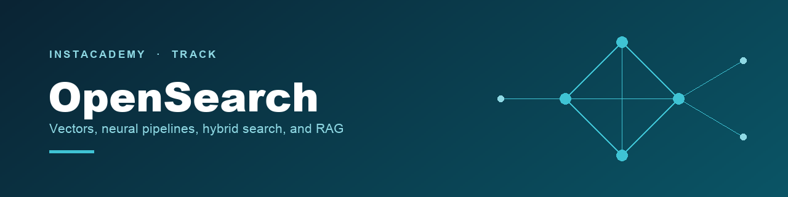

# InstAcademy · OpenSearch

`2 courses` · `9 chapters` · `108 steps` · `OpenSearch 3.5+ on a NetApp Instaclustr trial cluster`

Search, vectors, and retrieval on managed OpenSearch. Course 01 builds the index and makes it fast. Course 02 builds a full RAG system and measures every layer of it instead of trusting any of them.

## 📚 Courses

| # | Course | What you'll build | Level | Chapters |
|---|---|---|---|---|
| **01** | [Optimizing Vector Storage & Search](01-vector-storage-and-search/README.md) | HNSW and IVF indexes, a server-side embedding pipeline, hybrid search with normalization and RRF, a chunked `bookstore-rag` index, and an AI agent querying it over MCP | Intermediate to Advanced | 5 |
| **02** | [Advanced RAG with OpenSearch](02-advanced-rag/README.md) | Example Corp's internal support assistant: a measured knowledge base, a prompt that grounds every answer in evidence and cites it, hybrid retrieval picked on numbers, and conversation memory | Intermediate to Advanced | 4 |

> [!NOTE]
> Both courses are aimed at builders and machine learning engineers who already understand the basics of AI search. They are independent: each brings its own dataset and sets up its own cluster, so you can start with either. If you have not worked with vector search on OpenSearch before, **01** first will make **02** easier.

## Start here

| | |
|---|---|
| **Building or tuning vector search** | [**01 · Optimizing Vector Storage & Search**](01-vector-storage-and-search/README.md). Build a k-NN index by hand and learn what every knob does |
| **Here to build RAG** | [**02 · Advanced RAG with OpenSearch**](02-advanced-rag/README.md). Build a retrieval system and measure it instead of trusting it |

Either way, start with that course's `CLUSTER-SETUP.md`. It takes about 15 minutes.

## 🏅 Finished a course?

Badges are issued from the **InstAcademy library**. Once you've completed both the video series and the hands-on labs, [request your badge](https://github.com/instaclustr/instacademy/issues/new?template=course-completion.yml).

> [!NOTE]
> **What this costs: nothing.** The courses are free, and the NetApp Instaclustr platform the labs run on is provided as a free 30-day trial that covers either course. Anything still running when the trial ends is removed automatically.

---

🚀 **Next:** [01 · Optimizing Vector Storage & Search](01-vector-storage-and-search/README.md) · [02 · Advanced RAG](02-advanced-rag/README.md)
← [All tracks](../README.md)
