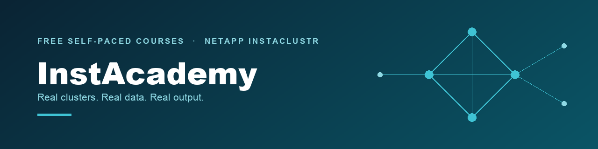
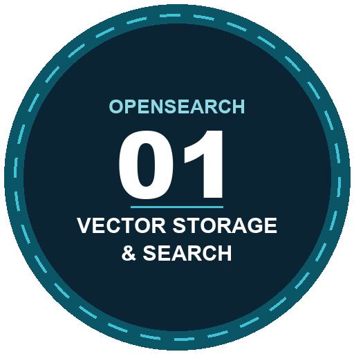
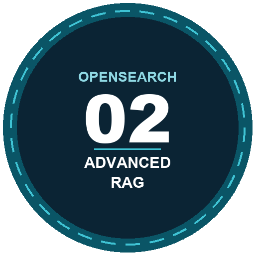

**Real clusters. Real data. Real output.**

Most AI search training ends in one of two places. Either you watched a course that never touched a real cluster, or you followed an open-ended tutorial that left you guessing whether your setup even worked. Neither helps when you need to size an index, choose between index types, tune retrieval, or debug a RAG pipeline that returns confident-sounding wrong answers.

InstAcademy closes that gap. Every video lesson pairs with a hands-on lab you run on your own NetApp Instaclustr cluster. Not a sandbox someone else configured, not a demo with canned responses. The labs ship with real data and the expected output, so you can check your work instead of hoping.

**This repository holds the labs.** The video lessons live in the [InstAcademy library](https://www.instaclustr.com/instacademy-courses/). [Create a free account](https://console2.instaclustr.com/signup?source=InstAcademy) to watch them.

> [!NOTE]
> **What this costs: nothing.** The courses are free, and the NetApp Instaclustr platform the labs run on is provided as a free 30-day trial. Signing up needs an email address, not a credit card or a cloud account. Anything still running when the trial ends is removed automatically, so there is no bill to avoid and nothing to cancel. Time left over at the end is yours: push the same technology harder, or spin up another open source technology Instaclustr supports.

## 📚 Tracks

| Track | Courses | You'll work with |
|---|---|---|
| [**OpenSearch**](opensearch/) | **2 live** | k-NN and HNSW, neural pipelines, hybrid search and RRF, RAG with grounded prompting and memory, cluster ops |

## Who these are for

Builders and machine learning engineers beyond the introductory stage. You know what RAG is but haven't tuned a retrieval pipeline under real constraints, or you need to design a vector search system for a production workload and want to defend the decisions. Some coding comfort helps, but every lab gives you the exact commands to run alongside the output to expect.

**Neither course is a prerequisite for the other.** Start with whichever problem is in front of you.

## How a course works

Watch the video. Run the lab. See exactly what your cluster does with the concept you just learned. Most learners have a cluster answering real queries inside the first hour.

| | |
|---|---|
| **`CLUSTER-SETUP.md`** | Create the cluster, add a firewall rule, collect connection details. About 15 minutes, done once per course |
| **`chapters/NN-slug/`** | The workshop. One page per chapter, numbered step by step, each ending in something that runs |
| **The fast path** | Course 01 ships a [Bruno](https://www.usebruno.com/) REST collection. Course 02 ships a Python runner. Either one re-runs a chapter in about a minute |
| **`assets/`** | The diagrams and console captures the chapters use |

> [!IMPORTANT]
> **Every `Expected` response printed in these labs is real output** from a live cluster on the version named in the course changelog, not an idealized example. If a step doesn't behave the way the page says, that's a bug worth reporting.

## 🏅 What you get when you finish

A verifiable **Credly badge**, shareable to LinkedIn. It is a credential that reflects work you actually did on a real cluster, not a multiple-choice certificate.

The confidence comes from the labs themselves. You built it. You ran it. You saw it work.

<!-- Badge artwork placeholders. Replace the PNGs in assets/badges/ with the real
     Credly images at the same filenames; no change is needed here. -->

### Optimizing OpenSearch Vector Storage and Search

Finished all five chapters of the video course and the hands-on labs?

1. Complete the course in the [InstAcademy library](https://www.instaclustr.com/instacademy-courses/)
1. Run every chapter's labs on your own cluster
1. [Request your badge](https://github.com/instaclustr/instacademy/issues/new?template=course-completion.yml)
1. Fill in the badge form it links to

 

### Advanced RAG with OpenSearch

Finished all four chapters of the video course and the hands-on labs?

1. Complete the course in the [InstAcademy library](https://www.instaclustr.com/instacademy-courses/)
1. Run every chapter's labs on your own cluster
1. [Request your badge](https://github.com/instaclustr/instacademy/issues/new?template=course-completion.yml)
1. Fill in the badge form it links to

 

> [!NOTE]
> Badges are issued from the InstAcademy library, so make sure you have an account there before you submit. Both steps are required: we can't issue a badge from the issue alone.

## Support and contributing

- Found a step that doesn't work? [Open an issue](https://github.com/instaclustr/instacademy/issues/new/choose). [`CONTRIBUTING.md`](CONTRIBUTING.md) lists what to include and the house rules for changes.
- Credential handling and the lab shortcuts that are *not* production practice: [`SECURITY.md`](SECURITY.md).

🚀 **Start here:** [OpenSearch track](opensearch/) · [Create a free account](https://console2.instaclustr.com/signup?source=InstAcademy)

Licensed under [Apache 2.0](LICENSE).
