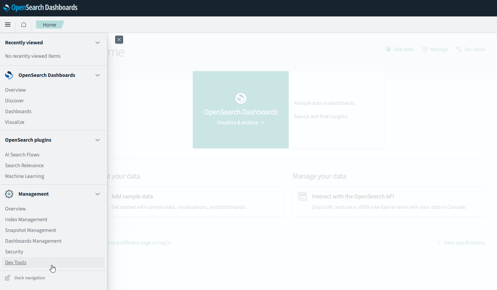
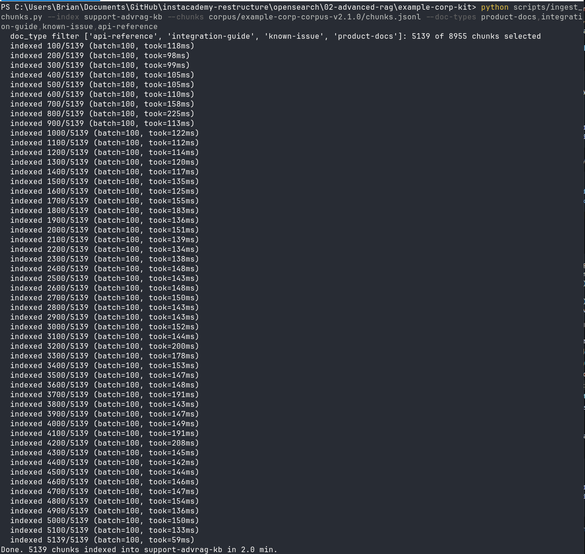

← **Previous:** [How to run the labs](../../HANDS-ON-GUIDE.md) · [Course index](../../README.md) · **Next:** [Chapter 2](../02-context-prompting-for-rag/README.md) →

# Chapter 1 — Simple RAG and hybrid search

🎯 Chapter 1 of 4 · 🧪 **11 steps** · 🔧 Dev Tools console, plus your terminal for Steps 9 and 11 

By the end of this chapter the internal AI support tool will have a knowledge base: an embedding model deployed inside your own cluster, an ingest pipeline that vectorizes every document as it lands, an index mapped for both k-NN vector search and metadata filtering, and Example Corp's five data assets loaded as 5,139 searchable chunks. Then you retrieve from it and measure how good that retrieval actually is, which is the number every later chapter has to beat.


| Section | Lesson | What you build |
|---------|--------|----------------|
| [1-1](#lesson-1-1--deploy-an-embedding-model-inside-the-cluster) | Deploy an embedding model inside the cluster | ML Commons settings, a model group, a registered and deployed `all-MiniLM-L6-v2`, and a smoke test that proves it returns vectors |
| [1-2](#lesson-1-2--wire-the-ingest-path) | Wire the ingest path | An ingest pipeline that embeds on arrival, and the k-NN index with the parent-child and filtering fields every later chapter depends on |
| [1-3](#lesson-1-3--load-the-corpus) | Load the corpus | Five documents by hand to read the chunking strategy in the data, then all 5,139 chunks with an idempotent loader |
| [1-4](#lesson-1-4--retrieve-then-measure-what-you-built) | Retrieve, then measure | Your first neural search, then hit rate, precision, and MRR on a 300-query golden set |

Work through the sections in order, because later steps reuse what earlier ones create.

## Let's get started.


**Open Dev Tools now.** It's the console built into OpenSearch Dashboards, where you'll run most of the requests in this chapter. Go to your Dashboards URL (port **5601**, from the Connection Info tab in the Instaclustr console), log in with your cluster username and password, then open the menu at the top left and choose **Dev Tools** under Management. 




The direct link looks like this:
```
https://opensearch-dashboards.<your-cluster-id>.cnodes.io:5601/app/dev_tools#/console
```

---

## Lesson 1-1 — Deploy an embedding model inside the cluster

### Step 1: Enable the ML Commons cluster settings

Four persistent settings make model deployment reliable on a managed cluster:

- `allow_registering_model_via_url` permits registering a model from a download URL. Step 3 registers from the built-in pretrained catalog, which works without this, but enabling it keeps the same register call open to your own model artifacts when you swap the corpus for real data later.
- `only_run_on_ml_node` is the one that matters most here: the Instaclustr trial cluster doesn't use dedicated ML nodes, so the model has to be allowed to run on the data nodes.
- `model_access_control_enabled` turns off role-based access control on model groups. This course runs as a single admin user, so there is nothing for that control to separate, and leaving it on would only add required access fields to the register calls in Steps 2 and 3.
- `native_memory_threshold` at 99 stops ML Commons from refusing to load the model when the node is already holding normal index memory.

**Request** - apply the four persistent settings:

```http
PUT _cluster/settings
{
  "persistent": {
    "plugins.ml_commons.allow_registering_model_via_url": true,
    "plugins.ml_commons.only_run_on_ml_node": false,
    "plugins.ml_commons.model_access_control_enabled": false,
    "plugins.ml_commons.native_memory_threshold": 99
  }
}
```

**Expected** - the four keys echoed back under `persistent`, acknowledged.

```json
{
  "acknowledged": true,
  "persistent": {
    "plugins": {
      "ml_commons": {
        "only_run_on_ml_node": "false",
        "model_access_control_enabled": "false",
        "native_memory_threshold": "99",
        "allow_registering_model_via_url": "true"
      }
    }
  },
  "transient": {}
}
```

> **There is a second memory guard that we are not touching.** `plugins.ml_commons.jvm_heap_memory_threshold` (default 85) refuses inference on any node whose JVM heap is above that mark. You will not touch it, because on a correctly paced workshop it never trips. If you do see it fire, the fix is to slow down or wait, not to raise the guard. Step 4 explains when it is most likely to happen and why waiting is the answer.

### Step 2: Register a model group

A model group is the container that tracks every version of a model.

**Request** - create the model group:

```http
POST _plugins/_ml/model_groups/_register
{
  "name": "advanced-rag-models",
  "description": "Embedding model for the support knowledge base"
}
```

**Expected** - a `model_group_id`. Yours will differ from the one printed here.

```json
{
  "model_group_id": "GWjacZ8Bm2xBXJdDbs1g",
  "status": "CREATED"
}
```

**Save** the `model_group_id`. Step 3 needs it.

### Step 3: Register the embedding model

This pulls `all-MiniLM-L6-v2` onto the cluster and assigns it a `model_id`. It is the model that will embed every chunk at ingest and every question at query time. It outputs **384-dimension** vectors, which is the number the index mapping in Step 7 has to match. Registration downloads the model, so it runs asynchronously and hands you a `task_id` immediately.

**Request** - register `all-MiniLM-L6-v2` into your model group. Replace `YOUR_MODEL_GROUP_ID`:

```http
POST _plugins/_ml/models/_register
{
  "name": "huggingface/sentence-transformers/all-MiniLM-L6-v2",
  "version": "1.0.2",
  "model_group_id": "YOUR_MODEL_GROUP_ID",
  "model_format": "TORCH_SCRIPT"
}
```

**Expected** - a `task_id` and a `CREATED` status. The work happens in the background.

```json
{
  "task_id": "G2jacZ8Bm2xBXJdDdMOh",
  "status": "CREATED"
}
```

Poll the task until it finishes. Registration usually takes a minute or two, because the cluster is downloading the model.

**Request** - poll the registration task. Replace `YOUR_TASK_ID` with the id from the response above:

```http
GET _plugins/_ml/tasks/YOUR_TASK_ID
```

**Expected** - `"state": "COMPLETED"` and a `model_id`. While it is still working the state reads `CREATED` and there is no `model_id` yet; wait a few seconds and run it again.

```json
{
  "model_id": "GmjacZ8Bm2xBXJdDdM23",
  "task_type": "REGISTER_MODEL",
  "function_name": "TEXT_EMBEDDING",
  "state": "COMPLETED",
  "worker_node": ["w5pYbppFT6-lxuh62xqkmw"],
  "create_time": 1783643191069,
  "last_update_time": 1783643224968,
  "is_async": true
}
```

**Save** the `model_id`. This is your `ML_MODEL_ID` for the rest of the course. Every neural query in Chapters 2, 3, and 4 needs it.

### Step 4: Deploy the model

Registering downloads the model. Deploying loads it into node memory so it can actually run. Let's take a look and see if it's deployed on all nodes.


**Request** - read the model back:

```http
GET _plugins/_ml/models/YOUR_MODEL_ID
```

**Expected** - `"model_state": "DEPLOYED"` with the worker count matching your data node count (3 of 3 on the trial cluster). Note `embedding_dimension: 384`, which is the number the index mapping in Step 7 has to match. As you can see below, the example came back with only 2 current_worker_nodes having the model deployed. If that happens to you, run the model deploy again and poll the model until the current_worker_node_count equals the total number of nodes you have (3).

```json
{
  "name": "huggingface/sentence-transformers/all-MiniLM-L6-v2",
  "model_group_id": "eA0fiKABQ5fd8iC7PjFM",
  "algorithm": "TEXT_EMBEDDING",
  "model_version": "1",
  "model_format": "TORCH_SCRIPT",
  "model_state": "PARTIALLY_DEPLOYED",
  "model_content_size_in_bytes": 91789778,
  "model_content_hash_value": "25e2858993cd477936f24e412a508b005aa6b59a308301cc69690e4b90cab439",
  "model_config": {
    "model_type": "bert",
    "embedding_dimension": 384,
    "framework_type": "SENTENCE_TRANSFORMERS",
    "pooling_mode": "MEAN",
    "normalize_result": true
  },
  "total_chunks": 10,
  "planning_worker_node_count": 3,
  "current_worker_node_count": 2,
  "planning_worker_nodes": [
    "hiZbRaIYSfK3KNJixx-JYw",
    "qrowht7ySYuiDqrScxjaIg",
    "5VcdJiqDRFaogL3baPWLNg"
  ],
  "deploy_to_all_nodes": true,
}
```
> To re-deploy again run:
```json
POST _plugins/_ml/models/YOUR_MODEL_ID/_deploy
```

then check the state again:
```json
GET _plugins/_ml/_models/YOUR_MODEL_ID
```

**Expected** 

```json
{
  "name": "huggingface/sentence-transformers/all-MiniLM-L6-v2",
  "model_group_id": "eA0fiKABQ5fd8iC7PjFM",
  "algorithm": "TEXT_EMBEDDING",
  "model_version": "1",
  "model_format": "TORCH_SCRIPT",
  "model_state": "DEPLOYED",
...
  "model_config": {
    "model_type": "bert",
    "embedding_dimension": 384,
    "framework_type": "SENTENCE_TRANSFORMERS",
  "planning_worker_node_count": 3,
  "current_worker_node_count": 3,
}
```

### Give the cluster a minute before you load anything

Deploying the model just pulled about 90 MB of weights into each data node's memory, and the heap runs hot for a short minute afterwards while that settles.

**Request** - check what the heap is actually doing:

```http
GET _cat/nodes?v&h=name,node.role,heap.percent
```

**Expected** - four lines: your three data nodes (`dimr`) and one coordinator-only node (`r`), which holds no data and never runs the model. It is the three data nodes we care about, and you want them comfortably below 85 percent before you start Step 8. Immediately after a deploy one can read 90; a minute later the validated run looked like this:

```text
name            node.role heap.percent
ip-10-2-65-149  dimr      26
ip-10-2-154-166 r         38
ip-10-2-35-116  dimr      43
ip-10-2-180-36  dimr      19
```

If a node is still above 85, wait and run it again. That is the remedy. The guard is not complaining about your workload, it is reporting that the node is busy.

### Step 5: Smoke-test the embedding

We want to prove the model returns vectors before you wire it into anything. This model is deterministic, so the same text always produces the same vector, which makes it an exact check rather than an approximate one.

**Request** - run one inference against the deployed model. Replace `YOUR_MODEL_ID`:

```http
POST _plugins/_ml/_predict/text_embedding/YOUR_MODEL_ID
{
  "text_docs": ["connector handshake failed"],
  "return_number": true,
  "target_response": ["sentence_embedding"]
}
```

**Expected** - one 384-float vector whose first three values are `-0.048449516, -0.019668244, 0.025217716`. If you see those exact numbers, the right model is deployed and working.

```json
{
  "inference_results": [
    {
      "output": [
        {
          "name": "sentence_embedding",
          "data_type": "FLOAT32",
          "shape": [384],
          "data": [-0.048449516, -0.019668244, 0.025217716, "... 381 more floats ..."]
        }
      ]
    }
  ]
}
```

---

## Lesson 1-2 — Wire the ingest path

You now have a model that turns text into vectors, Step 5 proved it works. What you will build next is the path that puts it to use for every document that comes into OpenSearch: the **ingest pipeline**. It's a set of processors OpenSearch runs on every document before indexing it. Yours has one processor, `text_embedding`, which calls the deployed model with the document's text and writes the resulting vector into a `knn_vector` field alongside it. 

Once that's created you'll wire that pipeline in as the index default, and embedding becomes automatic: every document that arrives is vectorized inside the cluster, on the way in. That is an intentional design decision. The alternative is computing vectors outside the cluster, and then every piece of code that ever writes a document (your loader, an application, someone's one-off script) has to remember to run not just the embedding model, but the right one if there are multiple, every time. Skip it once and nothing errors: the document indexes fine but it would not appear in any vector search again. Making the pipeline the index default removes that failure opportunity, because there won't be a way to write a document that skips embedding.

**ingest and query must use the same model.** A vector search is a distance measurement between the query's vector and the stored ones, and distance is only meaningful when both come from the same model. Each model defines its own vector space, so the same sentence embeds to completely different vectors under a different model, or even a different version of the same one. If you embed documents with one model and questions with another, every search will still return results; they are just quietly wrong. The way this lab enforces the rule is simple: the same `ML_MODEL_ID` goes into the pipeline here and into every search from Chapter 2 onward.

### Step 6: Create the ingest pipeline

This pipeline embeds a document's `text` field into a `text_embedding` field automatically as the document is indexed, so nothing outside the cluster ever has to compute a vector.

**Request** - create the ingest pipeline. Replace `YOUR_MODEL_ID`:

```http
PUT _ingest/pipeline/support-advrag-embed
{
  "description": "Embed the support knowledge base",
  "processors": [
    {
      "text_embedding": {
        "model_id": "YOUR_MODEL_ID",
        "field_map": { "text": "text_embedding" }
      }
    }
  ]
}
```

**Expected** - The pipeline is registered. Nothing is embedded yet. We'll need to create the base index and associate our default pipeline next.

```json
{ "acknowledged": true }
```

### Step 7: Create the knowledge base index

This is the mapping that carries everything the later chapters need: the vector, the metadata that pre-filtering depends on, and the parent-child fields that decide what the model actually reads. `default_pipeline` means every document is embedded on the way in without the loader having to ask.

**The chunking strategy is baked into these fields.** Chunking is how you split documents into the pieces that actually get embedded and retrieved, and there are four common strategies: **fixed-size** (cut every N tokens — simple, but blind to structure), **sentence-based** (cut on sentence boundaries — respects grammar, not topics), **semantic** (cut where the meaning shifts — better boundaries at more compute), and **parent-child** (embed small pieces for matching, but keep the larger section each piece came from for reading). The support tool leans hardest on parent-child, because a support answer needs both a precise match and its surrounding context. This corpus is chunked that way, and three fields carry it:

| Field | What it holds |
|---|---|
| `text` | the **child**: one small paragraph group, prefixed with its heading path. This is the field that gets embedded and searched |
| `parent_id` | the id of the section the child came from, like `DOC-00377#1`. Several children share one `parent_id` |
| `parent_text` | the **parent**: the whole section that child sits in. Never embedded, never searched. This is what you hand the model |

Small children match precisely, because a 50-word paragraph about one thing embeds into one clear meaning instead of a blurry average of a whole page. Large parents answer well, because the model gets the surrounding section rather than a fragment cut off mid-instruction. You search the child and you read the parent. Chapter 2 shows that happening on a live query.

Note the `"index": false` on `parent_text`. We are storing it and returning it but it's never indexed, so the parent only costs you disk space and nothing else. If both were searchable, a long parent would match on words the child never contained and you would lose the precision you split the chunks up to get.

The **engine** is `lucene`, which is suitable for an index this size and gives efficient filtering; Faiss is the choice at much larger scale. **`m` and `ef_construction`** shape the HNSW graph at index time, and 16 and 128 are sane defaults.

**Request** - create the index the rest of the course queries:

```http
PUT support-advrag-kb
{
  "settings": {
    "index.knn": true,
    "default_pipeline": "support-advrag-embed"
  },
  "mappings": {
    "properties": {
      "chunk_id": { "type": "keyword" },
      "parent_id": { "type": "keyword" },
      "source_id": { "type": "keyword" },
      "doc_type": { "type": "keyword" },
      "title": { "type": "text" },
      "section_heading": { "type": "text" },
      "section_path": { "type": "text" },
      "product_area": { "type": "keyword" },
      "product_version": { "type": "keyword" },
      "acl": { "type": "keyword" },
      "updated_at": { "type": "date" },
      "related_error_codes": { "type": "keyword" },
      "text": { "type": "text" },
      "parent_text": { "type": "text", "index": false },
      "text_embedding": {
        "type": "knn_vector",
        "dimension": 384,
        "method": {
          "engine": "lucene",
          "space_type": "cosinesimil",
          "name": "hnsw",
          "parameters": { "ef_construction": 128, "m": 16 }
        }
      }
    }
  }
}
```

**Expected** - the index is created with the mapping above and each property returns "True".

```json
{
  "acknowledged": true,
  "shards_acknowledged": true,
  "index": "support-advrag-kb"
}
```

---

## Lesson 1-3 — Load the corpus

Ingestion sets the retrieval quality up for success or failure: what you retrieve later is decided by what you write now. Two habits make a load trustworthy. **Idempotent writes on stable ids**: every chunk keeps the same `_id` forever, so re-running a load overwrites instead of duplicating, and an interrupted job can simply be run again. **Batch sizing that respects the cluster**: documents go in groups the nodes can absorb, and the producer slows down when they push back. This lesson loads Example Corp's assets using both. We'll first load a handful of documents manually so you can see the shape of the data, then we'll load the whole corpus with a batching loader script.

> Everything in these assets is fictitious and was generated for this course. That includes the real product names you will see on the integration guides, which are there only to make the corpus read like real documentation, and none of that content comes from or describes those actual products.

### Step 8: Index a sample and read the chunking strategy in the data

Before loading everything, We'll index five documents from the corpus so you can see what the chunker produced. Each line pair is an action and a document, and every field value below is copied from `chunks.jsonl`. Three fields the chunker also writes are left out here to keep the block readable: `section_path`, `product_area`, and `updated_at`. Step 9 loads the same five chunks again with every field present, and because each document's `_id` is its `chunk_id`, that load overwrites these rather than duplicating them. The pipeline embeds each `text` field for you.

**Request** - index five corpus documents in one bulk call:

```http
POST _bulk
{"index": {"_index": "support-advrag-kb", "_id": "KI-0001#0.0"}}
{"chunk_id": "KI-0001#0.0", "parent_id": "KI-0001#0", "source_id": "KI-0001", "doc_type": "known-issue", "title": "ERR-1102: Dashboard render timeout", "section_heading": "Known issue", "product_version": null, "acl": "public", "related_error_codes": ["ERR-1102"], "text": "ERR-1102: Dashboard render timeout\n\nSymptom: Users encounter ERR-1102 (dashboard render timeout).\nRoot cause: Widget query exceeded the 60 second render budget\nWorkaround: Reduce widget count or enable result caching on the underlying dataset\nAffected versions: 4.8, 4.9\nFixed in: 5.0", "parent_text": null}
{"index": {"_index": "support-advrag-kb", "_id": "DOC-00001#0.0"}}
{"chunk_id": "DOC-00001#0.0", "parent_id": "DOC-00001#0", "source_id": "DOC-00001", "doc_type": "product-docs", "title": "Dashboard Rendering overview", "section_heading": "Dashboard Rendering overview", "product_version": "4.8", "acl": "public", "related_error_codes": ["ERR-1102", "ERR-1147"], "text": "Dashboard Rendering overview > Dashboard Rendering overview\n\nDashboard Rendering lets your team reduce time to insight without leaving Example Corp BI Platform.", "parent_text": "Dashboard Rendering overview\n\nDashboard Rendering lets your team reduce time to insight without leaving Example Corp BI Platform."}
{"index": {"_index": "support-advrag-kb", "_id": "DOC-00142#0.0"}}
{"chunk_id": "DOC-00142#0.0", "parent_id": "DOC-00142#0", "source_id": "DOC-00142", "doc_type": "product-docs", "title": "Troubleshooting dashboard rendering", "section_heading": "Troubleshooting dashboard rendering", "product_version": "5.0", "acl": "public", "related_error_codes": ["ERR-1210"], "text": "Troubleshooting dashboard rendering > Troubleshooting dashboard rendering\n\nDashboard Rendering lets your team act on data faster without leaving Example Corp BI Platform.", "parent_text": "Troubleshooting dashboard rendering\n\nDashboard Rendering lets your team act on data faster without leaving Example Corp BI Platform."}
{"index": {"_index": "support-advrag-kb", "_id": "KI-0013#0.0"}}
{"chunk_id": "KI-0013#0.0", "parent_id": "KI-0013#0", "source_id": "KI-0013", "doc_type": "known-issue", "title": "ERR-6640: Signed embed URL expired", "section_heading": "Known issue", "product_version": null, "acl": "public", "related_error_codes": ["ERR-6640"], "text": "ERR-6640: Signed embed URL expired\n\nSymptom: Users encounter ERR-6640 (signed embed url expired).\nRoot cause: Embed URLs are valid for 10 minutes; the host page cached one longer\nWorkaround: Generate embed URLs server side per page load, never cache them\nAffected versions: 4.9, 5.0, 5.1\nFixed in: not yet fixed", "parent_text": null}
{"index": {"_index": "support-advrag-kb", "_id": "DOC-00377#1.0"}}
{"chunk_id": "DOC-00377#1.0", "parent_id": "DOC-00377#1", "source_id": "DOC-00377", "doc_type": "product-docs", "title": "Troubleshooting dashboard rendering", "section_heading": "Configuration", "product_version": "4.8", "acl": "public", "related_error_codes": ["ERR-1210", "ERR-1102"], "text": "Troubleshooting dashboard rendering > Configuration\n\nPerformance tip: dashboard rendering performs best when the underlying dataset uses incremental refresh. Full refreshes invalidate the associated cache.\n\nTo enable dashboard rendering, open the workspace settings panel and select the Dashboards tab. Changes apply within one refresh cycle and do not require a restart.", "parent_text": "Configuration\n\nPerformance tip: dashboard rendering performs best when the underlying dataset uses incremental refresh. Full refreshes invalidate the associated cache.\n\nTo enable dashboard rendering, open the workspace settings panel and select the Dashboards tab. Changes apply within one refresh cycle and do not require a restart.\n\nIf your organization uses SAML SSO, dashboard rendering inherits group membership from your identity provider on each login.\n\nAudit events for dashboard rendering are written to the workspace audit log within 60 seconds and retained for 13 months on the enterprise tier.\n\nWhen dashboard rendering is combined with row-level security, evaluation happens before aggregation. Plan calculated fields accordingly."}

```

**Expected** - `"errors": false`, with five `"result": "created"` items. Five documents are now indexed and embedded.

```json
{
  "took": 117,
  "ingest_took": 1974,
  "errors": false,
  "items": [
    {
      "index": {
        "_index": "support-advrag-kb",
        "_id": "KI-0001#0.0",
        "_version": 1,
        "result": "created",
        "_shards": { "total": 2, "successful": 2, "failed": 0 },
        "_seq_no": 0,
        "_primary_term": 1,
        "status": 201
      }
    },
    "... four more items, one per document, all result created / status 201 ..."
  ]
}
```

`"errors": false` is the line that really matters. If any single document failed, the batch would still return HTTP 200 but with `"errors": true` and the failure buried in that item's payload, which is why the loader in the next Step checks this field in addition to the status code.

Now look back at the bulk request you just sent — the five document lines you pasted, still sitting in the left pane of Dev Tools. The chunking strategy is visible directly in that data:

- **`DOC-00377#1.0` is the parent-child case.** Its `text` is 50 words, one performance tip and one enable instruction. Its `parent_text` is the whole 104-word Configuration section, which also covers SSO inheritance, audit retention, and row-level security. The `#1.0` in the id reads as "section 1, child 0," and `DOC-00377#1.1` is its sibling, the second child cut from that same section and pointing at the same `parent_id` (that one is not in your five; it arrives with the full load in Step 9).
- **The child `text` is prefixed with its heading path** (`Troubleshooting dashboard rendering > Configuration`). That prefix rides into the embedding, so a fragment still carries the section it came from and does not embed as an orphan sentence.
- **`KI-0001` and `KI-0013` have `parent_text: null`, on purpose.** The chunking strategy follows the document type, and a known issue is a single record with a symptom, a root cause, and a workaround. There is no larger section to fall back to, so the record is its own chunk. Anything that packs evidence has to handle that, which is why the rule is always **parent if there is one, otherwise the child**.

The strategy is not uniform across the corpus, and that is the point: a chunking strategy is chosen per document type, not once for everything. Product docs, integration guides, and the API reference are chunked parent-child on their headings; known issues are one record, one chunk.

### Step 9: Load the full knowledge base

The sample you uploaded last step proves the format. The rest of the course uses the whole corpus: **1,079 documents that chunk into 5,139 searchable pieces** (1,000 product-doc pages, 50 integration guides, 15 known issues, and the API reference). That is not a feasable copy/paste, so we'll load it with a script.

The loader sends documents in batches. The script is written in such a way that if any document fails, it tells us so we can re-load rather than leaving a chunk indexed without its embedding. Remember, a document indexed without a vector is invisible to vector search and nothing tells you after the load, so the best method here is to alert us on a partial failure.

The `--doc-types` filter is what makes the count come out at 5,139. The corpus file holds 8,955 chunks, but 3,816 of those are support tickets, and tickets stay out of the knowledge base on purpose: they are the source of the golden evaluation queries in Step 11, not answers.

**Request** - run the loader in your local terminal, not in Dev Tools (update the **OS_URL** line with the connection info for your cluster):

```bash
cd example-corp-kit
export OS_URL=https://<user>:<password>@<your-host>:9200

python3 scripts/ingest_chunks.py \
  --index support-advrag-kb \
  --chunks corpus/example-corp-corpus-v2.1.0/chunks.jsonl \
  --doc-types product-docs,integration-guide,known-issue,api-reference
```

> **Windows (PowerShell)** — Use this code if you are on Windows ([Windows rules](../../HANDS-ON-GUIDE.md#windows-users)):
>
> ```powershell
> cd example-corp-kit
> $env:OS_URL = "https://<user>:<password>@<your-host>:9200"
> python scripts/ingest_chunks.py --index support-advrag-kb --chunks corpus/example-corp-corpus-v2.1.0/chunks.jsonl --doc-types product-docs,integration-guide,known-issue,api-reference
> ```


**Expected** - the doc-type filter selects 5,139 of 8,955 chunks, then batches stream in. It takes a few minutes.



This generally takes about 2 minutes but can take longer if you have a slow internet upload speed. 

What matters is that it completes and that it does not report rejections. If the cluster does push back, you will see lines like `bulk rejection at 1200: backing off 10s, halving batch`. That is the loader applying the first rule of bulk ingestion: when you see rejections, slow the producer. It halves the batch, waits, and carries on.

If rejections are constant rather than occasional, stop and check the heap again before restarting, and pass a smaller batch explicitly:

```bash
python3 scripts/ingest_chunks.py \
  --index support-advrag-kb \
  --chunks corpus/example-corp-corpus-v2.1.0/chunks.jsonl \
  --doc-types product-docs,integration-guide,known-issue,api-reference \
  --batch-size 50
```

> **Windows (PowerShell)** — the one-line command from the note above, with `--batch-size 50` added to the end.

Smaller batches mean fewer documents embedded per request, so each request asks less of the node at once. The load is idempotent you can stop the interrupted run and restart with the smaller size without losing the chunks already indexed.

**Request** - count what landed:

```http
GET support-advrag-kb/_count
```

**Expected** - 5,139 chunks from 1,079 documents. If you get a smaller number, the loader was interrupted; run it again and it resumes.

```json
{
  "count": 5139,
  "_shards": {
    "total": 1,
    "successful": 1,
    "skipped": 0,
    "failed": 0
  }
}
```

---

## Lesson 1-4 — Retrieve, then measure what you built

Your knowledge base is loaded now, and it's tempting to just hook up a language model and start asking questions.

However, we need to ensure retrieval is accurate before passing it's results to a language model. We'll test retrieval by itself first, because when a RAG answer is bad, the problem could be the chunking, the retrieval, or the generation, so it's better to ensure this is accurate before adding additional factors. Either the right documents come back or they don't. We'll run our search, then measure it.


### Step 10: Your first vector search

A `neural` query embeds your question with the deployed model on the server side, so you paste the text and not a vector. A customer has reported `ERR-1102`. Ask the knowledge base about it.

**Request** - ask the knowledge base in plain English. Replace `YOUR_MODEL_ID`:

```http
POST support-advrag-kb/_search
{
  "size": 3,
  "_source": ["source_id", "doc_type", "title", "product_version"],
  "query": {
    "neural": {
      "text_embedding": {
        "query_text": "How do I fix ERR-1102 dashboard render timeout?",
        "model_id": "YOUR_MODEL_ID",
        "k": 3
      }
    }
  }
}
```

**Expected** - the known issue `KI-0001` leads as the top result at 0.8714, followed by two product documents. Notice that those two are written for different product versions, 4.9 and 5.1, while the customer who reported this is on 4.8. That version spread is a problem, and Chapter 2 will solve for it.

```json
{
  "hits": {
    "total": {
      "value": 3,
      "relation": "eq"
    },
    "max_score": 0.8714198,
    "hits": [
      {
        "_index": "support-advrag-kb",
        "_id": "KI-0001#0.0",
        "_score": 0.8714198,
        "_source": {
          "product_version": null,
          "doc_type": "known-issue",
          "source_id": "KI-0001",
          "title": "ERR-1102: Dashboard render timeout"
        }
      },
      {
        "_index": "support-advrag-kb",
        "_id": "DOC-00753#3.0",
        "_score": 0.8460486,
        "_source": {
          "product_version": "4.9",
          "doc_type": "product-docs",
          "source_id": "DOC-00753",
          "title": "How to configure dashboard rendering"
        }
      },
...
}
```

> **On ids and scores.** The expected blocks in this course show each hit's `source_id` and score, not its full `_id`. The `_id` carries a chunk number after `#` (like `KI-0001#0.0`), and when several chunks of a document tie on score, which one ranks first depends on internal index order, so that suffix can differ on your cluster. Match on `source_id` and score, which are stable. Absolute scores can move by a couple of hundredths run to run.

### Step 11: Score retrieval against the golden set

We need a **golden set**: a fixed list of questions where you have already labeled which chunks are the right answers, so any retriever can be scored against it. We look at three metrics to determine how good the results are:

- **Hit rate at 5** - what fraction of queries did at least one correct document land in the top 5 results? This is coverage. If it is low, the answer is not being found at all.
- **Precision at 5** - of the top 5 results, how many were correct? This is the purity of the context you pack for the model.
- **MRR** - how high did the first correct document rank? You can have a good hit rate and a poor MRR, which means the right chunk exists but it is buried.

The corpus ships a golden set of 300 queries built from Example Corp's resolved tickets, each labeled with the chunks that answer it. The scorer scopes every query to the knowledge base doc types, because the tickets are where the questions came from and retrieving them back would be circular.

**Request** - score the golden set in your terminal **Make sure to update your `MODEL_ID` along with the connection_info**:

```bash
cd example-corp-kit
export OS_URL=https://<user>:<password>@<your-host>:9200
export OS_INDEX=support-advrag-kb

python3 scripts/eval_retrieval.py \
  --mode neural --k 5 --kb-only \
  --model-id YOUR_MODEL_ID \
  --golden corpus/example-corp-corpus-v2.1.0/golden_set.jsonl
```

> **Windows (PowerShell)** — the same thing, with the last command on one line:
>
> ```powershell
> cd example-corp-kit
> $env:OS_URL = "https://<user>:<password>@<your-host>:9200"
> $env:OS_INDEX = "support-advrag-kb"
> python scripts/eval_retrieval.py --mode neural --k 5 --kb-only --model-id YOUR_MODEL_ID --golden corpus/example-corp-corpus-v2.1.0/golden_set.jsonl
> ```

**Expected** - the vector search baseline for this knowledge base. Write these three numbers down. 

> Your numbers may slightly vary from these.

```text
mode=neural pipeline=- kb_only=True k=5 queries=300
  hit_rate@5:  0.653
  precision@5: 0.154
  MRR:          0.369
```

That is the baseline, and it is the number Chapter 3 has to beat. A hit rate of 0.653 means that for roughly two questions in three, a correct document made the top five. It also means one in three came back without one, which is the gap hybrid search closes.

> **If the scorer stops with a circuit breaker error.** On a small trial cluster, 300 back to back neural queries can trip the ML Commons memory circuit breaker (`circuit_breaking_exception`, HTTP 429). It is transient. Wait a few seconds and run the command again. 

---

## 🏁 Chapter 1 wrap-up

### Congratulations! You've made it through the first and longest chapter!

You built the retrieval layer the rest of the course runs on. Here's what you learned along the way:

- **The ML Commons model lifecycle**: registered a model into a group, deployed onto nodes, verified it was `DEPLOYED` rather than `PARTIALLY_DEPLOYED`, and smoke-tested before wiring it into anything.
- **The manual embedding path**: a `text_embedding` processor in an ingest pipeline writes vectors into a `knn_vector` field, and the same `model_id` is used at ingest and at query, which is the rule that keeps the vector space consistent.
- **The index mapping is a design document**: HNSW `m` and `ef_construction`, the `lucene` engine choice, the metadata that pre-filtering will need, and the parent-child fields all get decided here.
- **Parent-child chunking in the data**: children are embedded and searched, parents are stored and read, and record types like known issues have no parent, so the packing rule is always parent if there is one, otherwise the child.
- **Idempotent ingestion**: stable `_id`s mean a re-run of a load overwrites instead of duplicating, so an interrupted load is safe to resume.
- **Measure retrieval before generation**: hit rate, precision, and MRR with a fixed golden set, so every later change is judged by our baseline numbers.

## 🚀 Next chapter

[Chapter 2 — Context prompting for RAG](../02-context-prompting-for-rag/README.md). Retrieval finds the evidence, but the prompt decides what the language model does with it. In Chapter 2 you hand a model the right evidence with sloppy instructions and watch it give a confident answer that is wrong for the customer asking. Then you'll rebuild the prompt as five structured blocks and watch the same model, with the same evidence, answer correctly, cite its sources, and decline when it should.

**Let's get started!**

---

← [How to run the labs](../../HANDS-ON-GUIDE.md) · [Course index](../../README.md) · [Report a problem with this chapter](https://github.com/instaclustr/instacademy/issues/new/choose) · [Chapter 2](../02-context-prompting-for-rag/README.md) →
