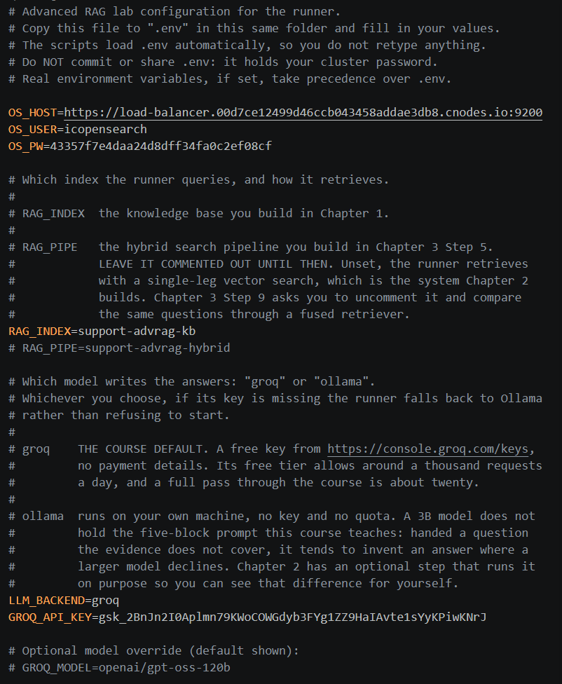
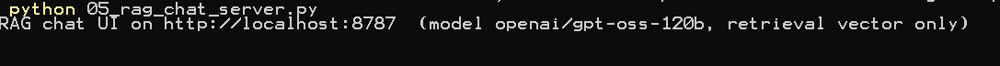
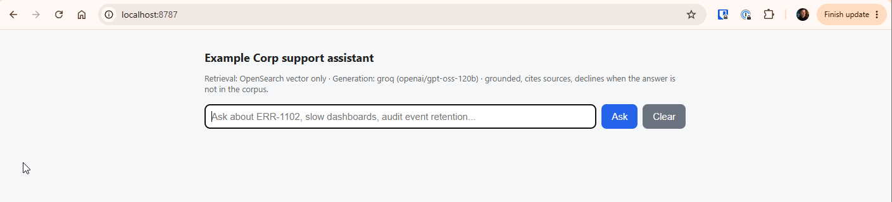
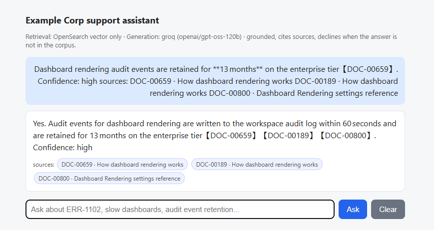
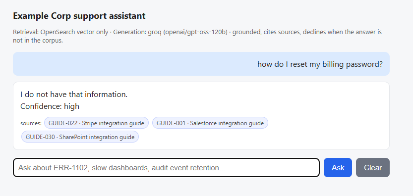

← **Previous:** [Chapter 1](../01-simple-rag-and-hybrid-search/README.md) · [Course index](../../README.md) · [How to run labs](../../HANDS-ON-GUIDE.md) · **Next:** [Chapter 3](../03-hybrid-rag/README.md) →

# Chapter 2 — Context prompting for RAG

🎯 Chapter 2 of 4 · 🧪 **9 steps** · 🔧 Dev Tools console, plus your terminal for the generation steps and the [chat form](../../example-corp-kit/rag-runner/) 

Chapter 1 gave the internal AI support tool its retrieval layer and you measured it with a hit rate of ~0.653 on the golden set. Finding the evidence is half of a working answer. The other half is the prompt, the instructions you send the language model along with that evidence.

This is where a lot of RAG systems tend to have problems. It is easy to assume that once retrieval is good, the model will do the right thing with what it is handed. In this chapter you'll watch that assumption break twice. First a model holding the right evidence gives a fluent, uncited answer that is wrong for the customer who asked. Then you hand it more evidence and instead of getting better, it stops picking an answer at all and hands the choice back to the reader. Finally you'll rebuild the prompt as five structured blocks, and the same model with the same evidence comes back concise, cited, and aware that the right answer depends on the customer's version and tier.

Generation runs on [Groq](https://console.groq.com), whose free tier needs an API key but no payment details of any kind. OpenSearch does the embedding and the retrieval; the model only writes the answer from the evidence the cluster hands it.

> **Why a hosted model.** Generation can also run on your own machine, using ollama for example. The architecture is identical; only the location of the model changes. The lab calls to a hosted model so the chapter behaves the same for everyone, regardless of the resources available on the user's computer. If a user's computer doesn't have enough resources, the available language models won't be big enough to hold the five-block prompt reliably. Step 6 ends with an optional step that runs a local model on purpose so you can see that difference. The [lab guide](../../HANDS-ON-GUIDE.md) has the longer version.

## What's in this chapter?
| Section | Lesson | What you build |
|---------|--------|----------------|
| [2-1](#lesson-2-1--what-actually-goes-in-the-evidence-block) | What actually goes in the evidence block | A search that matches the small child chunks and hands back the whole parent section, deduped on `parent_id` |
| [2-2](#lesson-2-2--a-prompt-is-a-structure-not-a-sentence) | A prompt is a structure, not a sentence | A lazy prompt on one record and on three conflicting ones, the five-block prompt that fixes both, a delete-one-block test that proves the grounding rule works, and a citation traced back to its source |
| [2-3](#lesson-2-3--metadata-is-the-boundary) | Metadata is the boundary | A pre-filter that keeps out-of-version and out-of-tier content from becoming a result |
| [2-4](#lesson-2-4--talk-to-your-support-tool) | Talk to your support tool | The whole loop behind a browser form: retrieve, pack, prompt, answer |

Work through the sections in order, because each step builds on the evidence the one before it produced.

## 📋 Before you start

- [Chapter 1](../01-simple-rag-and-hybrid-search/README.md) needs to be completed. This chapter queries the `support-advrag-kb` index (1,079 documents, 5,139 chunks) and uses the embedding model you deployed there.
- **You need your `ML_MODEL_ID`** from Chapter 1 Step 3. Every neural query below needs it.
- A **Groq API key**, for Steps 2 through 6, and Step 9 — get one at [console.groq.com/keys](https://console.groq.com/keys). Those steps run in your terminal, and they read the key from an environment variable named `GROQ_API_KEY`, so set it in your terminal first: `export GROQ_API_KEY=gsk_your_key_here` on macOS/Linux, or `$env:GROQ_API_KEY = "gsk_your_key_here"` in PowerShell. An environment variable lasts only as long as the terminal window, so you'll have to add it again if you open a new terminal session.


> **Lost your `ML_MODEL_ID`?** Find it again without re-registering:
>
> ```http
> POST _plugins/_ml/models/_search
> {
>   "query": { "match": { "name": "all-MiniLM-L6-v2" } },
>   "_source": ["name", "model_state"]
> }
> ```

## Lesson 2-1 — What actually goes in the evidence block

Before you write a prompt, you need to decide what the prompt will carry. Chapter 1 returned child chunks, because children are what the index searches but children are not what you hand the model.

### Step 1: Search the child, read the parent

You'll ask a narrow question and add three things to the search: `parent_text` in `_source`, a `collapse` on `parent_id`, and a wider `k` than the number of results you want. This is the parent-child split from Chapter 1 working on a live query.

**Request** - search the children and ask for their parents back. Replace `YOUR_MODEL_ID`:

```http
POST support-advrag-kb/_search
{
  "size": 3,
  "collapse": { "field": "parent_id" },
  "_source": ["source_id", "parent_id", "section_heading", "product_version", "text", "parent_text"],
  "query": {
    "neural": {
      "text_embedding": {
        "query_text": "how long are dashboard rendering audit events retained",
        "model_id": "YOUR_MODEL_ID",
        "k": 10
      }
    }
  }
}
```

**Expected** - three hits, each a child chunk carrying its parent section along with it. `DOC-00659` leads at 0.9286.

```json
{
...
  "hits": {
    "total": {
      "value": 10,
      "relation": "eq"
    },
    "max_score": 0.9285965,
    "hits": [
      {
        "_index": "support-advrag-kb",
        "_id": "DOC-00659#1.2",
        "_score": 0.9285965,
        "_source": {
          "parent_text": """Configuration

When dashboard rendering is combined with row-level security, evaluation happens before aggregation. Plan calculated fields accordingly.

Performance tip: dashboard rendering performs best when the underlying dataset uses incremental refresh. Full refreshes invalidate the associated cache.

To enable dashboard rendering, open the workspace settings panel and select the Dashboards tab. Changes apply within one refresh cycle and do not require a restart.

By default, dashboard rendering is limited to 25 per workspace on the professional tier. Administrators can raise this limit from the admin console.

Audit events for dashboard rendering are written to the workspace audit log within 60 seconds and retained for 13 months on the enterprise tier.""",
          "product_version": "5.0",
          "parent_id": "DOC-00659#1",
          "section_heading": "Configuration",
          "source_id": "DOC-00659",
          "text": """How dashboard rendering works > Configuration

Audit events for dashboard rendering are written to the workspace audit log within 60 seconds and retained for 13 months on the enterprise tier."""
        },
        "fields": {
          "parent_id": [
            "DOC-00659#1"
          ]
        }
      },
      ...
    ]
  }
}
```

Now look at the top hit and compare its two text fields. This is the whole pattern in one result.

The `text` field that matched, 30 words:

```text
How dashboard rendering works > Configuration

Audit events for dashboard rendering are written to the workspace audit log within 60
seconds and retained for 13 months on the enterprise tier.
```

The `parent_text` you hand the model, 109 words:

```text
Configuration

When dashboard rendering is combined with row-level security, evaluation happens before
aggregation. Plan calculated fields accordingly.

Performance tip: dashboard rendering performs best when the underlying dataset uses
incremental refresh. Full refreshes invalidate the associated cache.

To enable dashboard rendering, open the workspace settings panel and select the
Dashboards tab. Changes apply within one refresh cycle and do not require a restart.

By default, dashboard rendering is limited to 25 per workspace on the professional tier.
Administrators can raise this limit from the admin console.

Audit events for dashboard rendering are written to the workspace audit log within 60
seconds and retained for 13 months on the enterprise tier.
```

Why did the child score so high? An embedding compresses everything a text says into a single point in vector space. The child is 30 words about one topic (audit retention) so its point sits almost exactly where the question's point lands. The parent covers five topics: row-level security, caching, setup, workspace limits, and retention. If we had embedded all of that, you would get one point that has to represent all five at once, and that would sit further from your question. This is why you **search the child**: a chunk about one thing matches a question about that thing precisely.

The parent's job is different: it is what the model **reads**. A support engineer asking about retention almost always needs the tier (community/free, pro, enterprise) that retention depends on, and that enterprise-tier detail sits in the same section. If we give the model only the 30-word child, it can answer the literal question but nothing else around it. The parent-child split gives you both halves of a good answer: the child wins the match, and the parent gives the model enough context to answer like someone who read the whole page.

Three details in this request you should understand:

- **`collapse` on `parent_id` is deduping the results.** Sibling children can match the same question because they come from the same section and are about the same subject. Without collapse, `#1.0` and `#1.2` both come back as answers, and you end up with the same parent section twice in a prompt with a fixed token budget.
- **`k` is 10 while `size` is 3.** Collapse removes hits after retrieval, so you retrieve wider than you intend to keep. That is the wide-recall-then-narrow shape from Chapter 1, in one query.
- **`parent_text` is null on known issues.** `KI-0001` and `KI-0013` are both a single record, one chunk, so the packing rule is always **parent if there is one, otherwise the child.** Anything that skips that fallback drops the known issues, which are the best evidence in the corpus.

> **Do not put `collapse` on a hybrid query.** This works because it is a single-leg neural search. In Chapter 3 you'll build a hybrid pipeline that fuses two ranked lists. Collapsing a fused result reorders it and can drop the top hit entirely. On the `ERR-6640` query in Chapter 3, adding `collapse` pushes the known issue `KI-0013` out of the results completely, and the remaining order ends up not being stable between runs. It is the same shape as the Chapter 1 anti-pattern about reranking before fusion. The rule is the same: **let the fusion finish, then dedupe on `parent_id` in your own code.**

---

## Lesson 2-2 — A prompt is a structure, not a sentence

Now the generation half. These six steps hold the model, the temperature, and the evidence still, and change only the instructions wrapped around them, so every difference you see is caused by the prompt, not the retrieved information.

Every step in this lesson calls Groq, and the calls read your key from the `GROQ_API_KEY` environment variable, so set it in your terminal now — macOS/Linux:

```bash
export GROQ_API_KEY=gsk_your_key_here
```

Windows (PowerShell):

```powershell
$env:GROQ_API_KEY = "gsk_your_key_here"
```

An environment variable lasts only as long as the terminal window, so if you open a fresh terminal later, set it again.

### Step 2: Watch a lazy prompt answer

A customer on version 4.8, standard tier, asks how many dashboards they can render in a workspace. Retrieval does its job and returns a Configuration section that answers the question. Now you'll hand the model that section with nothing but "here is some context, answer the question." No grounding rule, no citation rule, no schema, and no mention of who is asking.

> **If the model name is rejected.** Every generation step in this course calls `openai/gpt-oss-120b` on Groq's free tier. Hosted models get retired from time-to-time, and when one does, the call fails with an HTTP 404 and a `model_decommissioned` message rather than anything about your key or your cluster. If that happens, open [console.groq.com/docs/models](https://console.groq.com/docs/models), pick a current general-purpose chat model, and substitute its name in every `"model"` field from here on. Nothing else in the course changes: the prompts, the evidence, and the retrieval are all independent of which model writes the answer. Expect the wording of the answers to drift from what's printed here, and judge those steps by behavior, as the [lab guide](../../HANDS-ON-GUIDE.md) describes.

> **Windows (PowerShell).** The generation steps in this course are printed as `curl` blocks, which PowerShell's quoting breaks. Paste this helper once per session; every generation step then has a **Windows** note that calls it:
>
> ```powershell
> function Ask-Groq($body) {
>   (Invoke-RestMethod https://api.groq.com/openai/v1/chat/completions -Method Post -ContentType "application/json" -Headers @{ Authorization = "Bearer $env:GROQ_API_KEY" } -Body $body).choices[0].message.content
> }
> ```

**Request** - send the evidence with no structure around it, from your terminal:

```bash
curl -s https://api.groq.com/openai/v1/chat/completions \
  -H "Authorization: Bearer $GROQ_API_KEY" \
  -H "Content-Type: application/json" -d '{
  "model": "openai/gpt-oss-120b",
  "temperature": 0,
  "messages": [
    {
      "role": "user",
      "content": "Here is some context.\n\n[DOC-00330] (product-docs, v4.8) Dashboard Rendering settings reference: Configuration\n\nBy default, dashboard rendering is limited to 50 per workspace on the professional tier. Administrators can raise this limit from the admin console.\n\nIf your organization uses SAML SSO, dashboard rendering inherits group membership from your identity provider on each login.\n\nAudit events for dashboard rendering are written to the workspace audit log within 60 seconds and retained for 13 months on the enterprise tier.\n\nWhen dashboard rendering is combined with row-level security, evaluation happens before aggregation. Plan calculated fields accordingly.\n\nPerformance tip: dashboard rendering performs best when the underlying dataset uses incremental refresh. Full refreshes invalidate the associated cache.\n\nAnswer the question: How many dashboards can I render per workspace?"
    }
  ]
}' \
  | python3 -c "import sys,json;print(json.load(sys.stdin)['choices'][0]['message']['content'].strip())"
```
> **Windows (PowerShell)** — the same request through the [`Ask-Groq` helper](../../HANDS-ON-GUIDE.md#windows-users):
>
> ```powershell
> Ask-Groq @'
> {
>   "model": "openai/gpt-oss-120b",
>   "temperature": 0,
>   "messages": [
>     {
>       "role": "user",
>       "content": "Here is some context.\n\n[DOC-00330] (product-docs, v4.8) Dashboard Rendering settings reference: Configuration\n\nBy default, dashboard rendering is limited to 50 per workspace on the professional tier. Administrators can raise this limit from the admin console.\n\nIf your organization uses SAML SSO, dashboard rendering inherits group membership from your identity provider on each login.\n\nAudit events for dashboard rendering are written to the workspace audit log within 60 seconds and retained for 13 months on the enterprise tier.\n\nWhen dashboard rendering is combined with row-level security, evaluation happens before aggregation. Plan calculated fields accordingly.\n\nPerformance tip: dashboard rendering performs best when the underlying dataset uses incremental refresh. Full refreshes invalidate the associated cache.\n\nAnswer the question: How many dashboards can I render per workspace?"
>     }
>   ]
> }
> '@
> ```

**Expected** - a fluent, confident answer, and the wrong one.

```text
By default, you can render up to 50 dashboards per workspace on the professional tier. However, administrators can increase this limit from the admin console if needed.
```

Nothing in that sentence is invented. `DOC-00330` does say 50 per workspace, and the model reported it accurately, but **The answer is still wrong for the person who asked**, because `DOC-00330` documents the professional tier and this customer is on standard, where the limit is 25.

It's not a failure of intelligence. The model was never told the customer's tier. No amount of a better model fixes a fact that is not in the prompt.

Two more things are missing, and both are structural:

- **There is no citation.** A support engineer reading this cannot tell which file the number came from, so they cannot check it against the customer's tier even if they thought to.
- **There is no hedge.** The answer does not say "on the professional tier, and I do not know yours." It states a number as fact. The shape of the answer conveys a confidence the evidence does not support.

### Step 3: Give the lazy prompt more evidence

You might expect that more evidence fixes this. It does something more interesting. Step 2 handed the model one section. Now hand the same lazy prompt three, the kind of evidence the packing rule from Step 1 produces: the same setting documented for three different tiers, at two different product versions. Every word below is corpus text, copied from what you indexed in Chapter 1.

**Request** - send three parent sections through the same unstructured prompt:

```bash
curl -s https://api.groq.com/openai/v1/chat/completions \
  -H "Authorization: Bearer $GROQ_API_KEY" \
  -H "Content-Type: application/json" -d '{
  "model": "openai/gpt-oss-120b",
  "temperature": 0,
  "messages": [
    {
      "role": "user",
      "content": "Here is some context.\n\n[DOC-00095] (product-docs, v4.8) Dashboard Rendering settings reference: Configuration\n\nIf your organization uses SAML SSO, dashboard rendering inherits group membership from your identity provider on each login.\n\nBy default, dashboard rendering is limited to 25 per workspace on the standard tier. Administrators can raise this limit from the admin console.\n\nAudit events for dashboard rendering are written to the workspace audit log within 60 seconds and retained for 13 months on the enterprise tier.\n\nWhen dashboard rendering is combined with row-level security, evaluation happens before aggregation. Plan calculated fields accordingly.\n\nPerformance tip: dashboard rendering performs best when the underlying dataset uses incremental refresh. Full refreshes invalidate the associated cache.\n\n[DOC-00330] (product-docs, v4.8) Dashboard Rendering settings reference: Configuration\n\nBy default, dashboard rendering is limited to 50 per workspace on the professional tier. Administrators can raise this limit from the admin console.\n\nIf your organization uses SAML SSO, dashboard rendering inherits group membership from your identity provider on each login.\n\nAudit events for dashboard rendering are written to the workspace audit log within 60 seconds and retained for 13 months on the enterprise tier.\n\nWhen dashboard rendering is combined with row-level security, evaluation happens before aggregation. Plan calculated fields accordingly.\n\nPerformance tip: dashboard rendering performs best when the underlying dataset uses incremental refresh. Full refreshes invalidate the associated cache.\n\n[DOC-00847] (product-docs, v5.0) Troubleshooting dashboard rendering: Configuration\n\nAudit events for dashboard rendering are written to the workspace audit log within 60 seconds and retained for 13 months on the enterprise tier.\n\nWhen dashboard rendering is combined with row-level security, evaluation happens before aggregation. Plan calculated fields accordingly.\n\nBy default, dashboard rendering is limited to 100 per workspace on the enterprise tier. Administrators can raise this limit from the admin console.\n\nTo enable dashboard rendering, open the workspace settings panel and select the Dashboards tab. Changes apply within one refresh cycle and do not require a restart.\n\nPerformance tip: dashboard rendering performs best when the underlying dataset uses incremental refresh. Full refreshes invalidate the associated cache.\n\nAnswer the question: How many dashboards can I render per workspace?"
    }
  ]
}' \
  | python3 -c "import sys,json;print(json.load(sys.stdin)['choices'][0]['message']['content'].strip())"
```
> **Windows (PowerShell)** — the same request through the [`Ask-Groq` helper](../../HANDS-ON-GUIDE.md#windows-users):
>
> ```powershell
> Ask-Groq @'
> {
>   "model": "openai/gpt-oss-120b",
>   "temperature": 0,
>   "messages": [
>     {
>       "role": "user",
>       "content": "Here is some context.\n\n[DOC-00095] (product-docs, v4.8) Dashboard Rendering settings reference: Configuration\n\nIf your organization uses SAML SSO, dashboard rendering inherits group membership from your identity provider on each login.\n\nBy default, dashboard rendering is limited to 25 per workspace on the standard tier. Administrators can raise this limit from the admin console.\n\nAudit events for dashboard rendering are written to the workspace audit log within 60 seconds and retained for 13 months on the enterprise tier.\n\nWhen dashboard rendering is combined with row-level security, evaluation happens before aggregation. Plan calculated fields accordingly.\n\nPerformance tip: dashboard rendering performs best when the underlying dataset uses incremental refresh. Full refreshes invalidate the associated cache.\n\n[DOC-00330] (product-docs, v4.8) Dashboard Rendering settings reference: Configuration\n\nBy default, dashboard rendering is limited to 50 per workspace on the professional tier. Administrators can raise this limit from the admin console.\n\nIf your organization uses SAML SSO, dashboard rendering inherits group membership from your identity provider on each login.\n\nAudit events for dashboard rendering are written to the workspace audit log within 60 seconds and retained for 13 months on the enterprise tier.\n\nWhen dashboard rendering is combined with row-level security, evaluation happens before aggregation. Plan calculated fields accordingly.\n\nPerformance tip: dashboard rendering performs best when the underlying dataset uses incremental refresh. Full refreshes invalidate the associated cache.\n\n[DOC-00847] (product-docs, v5.0) Troubleshooting dashboard rendering: Configuration\n\nAudit events for dashboard rendering are written to the workspace audit log within 60 seconds and retained for 13 months on the enterprise tier.\n\nWhen dashboard rendering is combined with row-level security, evaluation happens before aggregation. Plan calculated fields accordingly.\n\nBy default, dashboard rendering is limited to 100 per workspace on the enterprise tier. Administrators can raise this limit from the admin console.\n\nTo enable dashboard rendering, open the workspace settings panel and select the Dashboards tab. Changes apply within one refresh cycle and do not require a restart.\n\nPerformance tip: dashboard rendering performs best when the underlying dataset uses incremental refresh. Full refreshes invalidate the associated cache.\n\nAnswer the question: How many dashboards can I render per workspace?"
>     }
>   ]
> }
> '@
> ```

**Expected** - not what you would guess. The answer gets **longer**, and it stops answering the question.

```text
The limit depends on the subscription tier you're on:

| Tier | Default rendering limit (dashboards per workspace) |
|------|----------------------------------------------------|
| **Standard** | **25** dashboards (Doc‑00095) |
| **Professional** | **50** dashboards (Doc‑00330) |
| **Enterprise** | **100** dashboards (Doc‑00847) |

> **Note:** In all tiers an administrator can increase the limit from the admin console.

So, check which tier your workspace is on to know the baseline number, and adjust it via
the admin console if you need a higher limit.
```

Put it next to Step 2's answer. The failure did not get bigger. It changed shape.

**Step 2 was confidently wrong. Step 3 is correct and useless.** Every row of that table is accurate, and not one of them tells the customer what their limit is. The model was handed three answers, given nothing to choose between them with (user data), and essentially handed the choice back. Its closing line literally tells the customer to go look up their own tier, which is exactly the work the tool was supposed to do.

The missing ingredient in both steps is the same. It is not more evidence. It is a place in the prompt to say who is asking. The five blocks give it one.

### The five blocks

A production RAG prompt is a structure, and each block exists to stop a specific failure:

1. **System instructions** - the model's role, and the single most important rule in the prompt: answer only from the evidence provided, and if the evidence does not contain the answer, say so plainly. That rule helps turns a chatty model into a grounded one.
2. **Tooling** - which outside actions the model may take and which it must never take. Your support tool doesn't have any yet, so this block stays empty. Chapter 4 will focus on updating this block.
3. **Goal** - the user's actual question, stated clearly, so the model is never guessing what you want.
4. **Restrictions** - the limits that depend on who is asking. Which product version this customer runs, which service tier they pay for, and what to do when two documents disagree.
5. **Answer schema** - the shape you want back. For our support tool we want three things: the answer, a citation for every claim pointing at the exact source, and a confidence level.

### Step 4: Wrap the evidence in the five blocks

Same model, same temperature, new evidence: the `ERR-1102` known issue from Chapter 1 Step 10, now wrapped in the five blocks. Run it here to see what a structured prompt produces on a straightforward question. Then the section right after this one makes it a fair fight: it sends Step 3's exact three sections through these same blocks, so you can watch the structure rescue the question the lazy prompt could not answer.

**Request** - send the evidence inside the five blocks:

```bash
curl -s https://api.groq.com/openai/v1/chat/completions \
  -H "Authorization: Bearer $GROQ_API_KEY" \
  -H "Content-Type: application/json" -d '{
  "model": "openai/gpt-oss-120b",
  "temperature": 0,
  "messages": [
    {
      "role": "system",
      "content": "You are Example Corp'"'"'s internal support assistant. Answer ONLY using the evidence provided below. If the evidence does not contain the answer, say you do not have that information. After each claim, cite the source in square brackets using its source_id. Be concise, then end with a final line that reads Confidence: low, medium, or high."
    },
    {
      "role": "user",
      "content": "## TOOLING\n(none yet, Chapter 4 fills this with memory)\n\n## GOAL\nHow do I fix ERR-1102 dashboard render timeout?\n\n## RESTRICTIONS\nThe customer is on product version 4.8, standard tier. Version matching is a preference for choosing between sources, NOT a requirement for using them. Never refuse to answer because the evidence is written for a different version. If a fix only exists in a later version, give the workaround for their version and name the version the fix ships in.\n\n## EVIDENCE\n[KI-0001] (known-issue) ERR-1102: Dashboard render timeout\nSymptom: Users encounter ERR-1102 (dashboard render timeout).\nRoot cause: Widget query exceeded the 60 second render budget\nWorkaround: Reduce widget count or enable result caching on the underlying dataset\nAffected versions: 4.8, 4.9\nFixed in: 5.0\n\n## ANSWER SCHEMA\nThe answer, a [source_id] citation on every claim, then a final line reading Confidence: low, medium, or high."
    }
  ]
}' \
  | python3 -c "import sys,json;print(json.load(sys.stdin)['choices'][0]['message']['content'].strip())"
```
> **Windows (PowerShell)** — the same request through the [`Ask-Groq` helper](../../HANDS-ON-GUIDE.md#windows-users):
>
> ```powershell
> Ask-Groq @'
> {
>   "model": "openai/gpt-oss-120b",
>   "temperature": 0,
>   "messages": [
>     {
>       "role": "system",
>       "content": "You are Example Corp's internal support assistant. Answer ONLY using the evidence provided below. If the evidence does not contain the answer, say you do not have that information. After each claim, cite the source in square brackets using its source_id. Be concise, then end with a final line that reads Confidence: low, medium, or high."
>     },
>     {
>       "role": "user",
>       "content": "## TOOLING\n(none yet, Chapter 4 fills this with memory)\n\n## GOAL\nHow do I fix ERR-1102 dashboard render timeout?\n\n## RESTRICTIONS\nThe customer is on product version 4.8, standard tier. Version matching is a preference for choosing between sources, NOT a requirement for using them. Never refuse to answer because the evidence is written for a different version. If a fix only exists in a later version, give the workaround for their version and name the version the fix ships in.\n\n## EVIDENCE\n[KI-0001] (known-issue) ERR-1102: Dashboard render timeout\nSymptom: Users encounter ERR-1102 (dashboard render timeout).\nRoot cause: Widget query exceeded the 60 second render budget\nWorkaround: Reduce widget count or enable result caching on the underlying dataset\nAffected versions: 4.8, 4.9\nFixed in: 5.0\n\n## ANSWER SCHEMA\nThe answer, a [source_id] citation on every claim, then a final line reading Confidence: low, medium, or high."
>     }
>   ]
> }
> '@
> ```

**Expected** - the same facts, but concise, cited, and carrying a confidence line.

```text
The ERR‑1102 timeout occurs because a widget's query runs longer than the 60‑second render budget [KI-0001].
For version 4.8 you can mitigate it by:

1. **Reducing the number of widgets** on the dashboard so each render has less work [KI-0001].
2. **Enabling result caching** on the dataset(s) that the widgets query, which speeds up repeated queries [KI-0001].

A permanent fix is included in version 5.0, but the above workarounds apply to your current 4.8 installation [KI-0001].

Confidence: high
```

Hold that next to Step 2's answer. Not to compare the facts, which came from different records, but to compare the shape: all three of the problems Step 2 exhibited are absent here, each one was solved by a specific block. The padding is gone, because of the grounding rule. Every claim has a citation like `[KI-0001]`, so a support engineer can open the exact record it came from. Version 5.0 is named as where the permanent fix lands, and 4.8 is named as what the customer is on, because the restrictions block added the data of who was asking the question. Step 2 didn't have a block that could say clarify either of those: its prompt never carried the customer data at all, which is why its answer reported a tier without ever noticing that it was the wrong one.

Notice what the blocks did **not** have to do. Nobody told the model to mention the customer's version in the answer. The restrictions block stated a fact about the customer, and the model worked out that the fact was worth repeating back. This is one of the differences between structuring a prompt and scripting an answer.

**One caution before you trust this too far.** The blocks are instructions, not guarantees, and how reliably they are followed depends on the language model being used. Step 6 is where you'll remove a block and watch which failure comes back. Chapter 3's golden-set scoring is the same discipline pointed at retrieval: state what you expect, then measure whether you got it.

> **On the confidence level.** It is the model's own rating, not a measured score, so the same question can come back low, medium, or high on different runs and on different evidence. Treat it as a rough signal, not a fixed value.

### Step 5: The question Steps 2 and 3 could not answer

Step 4 showed the five blocks working on a fresh question. Now aim them at the question that beat the lazy prompt twice: how many dashboards can this customer render? You'll send the exact three Configuration sections from Step 3, with the same conflicting limits, through the same five blocks, but this time the restrictions block says who is asking.

**Request** - send Step 3's three sections inside the five blocks:

```bash
curl -s https://api.groq.com/openai/v1/chat/completions \
  -H "Authorization: Bearer $GROQ_API_KEY" \
  -H "Content-Type: application/json" -d '{
  "model": "openai/gpt-oss-120b",
  "temperature": 0,
  "messages": [
    {
      "role": "system",
      "content": "You are Example Corp'"'"'s internal support assistant. Answer ONLY using the evidence provided below. If the evidence does not contain the answer, say you do not have that information. After each claim, cite the source in square brackets using its source_id. Be concise, then end with a final line that reads Confidence: low, medium, or high."
    },
    {
      "role": "user",
      "content": "## TOOLING\n(none yet, Chapter 4 fills this with memory)\n\n## GOAL\nHow many dashboards can I render per workspace?\n\n## RESTRICTIONS\nThe customer is on product version 4.8, standard tier. Version matching is a preference for choosing between sources, NOT a requirement for using them. Never refuse to answer because the evidence is written for a different version. If a fix only exists in a later version, give the workaround for their version and name the version the fix ships in.\n\n## EVIDENCE\n[DOC-00095] (product-docs, v4.8) Dashboard Rendering settings reference: Configuration\n\nIf your organization uses SAML SSO, dashboard rendering inherits group membership from your identity provider on each login.\n\nBy default, dashboard rendering is limited to 25 per workspace on the standard tier. Administrators can raise this limit from the admin console.\n\nAudit events for dashboard rendering are written to the workspace audit log within 60 seconds and retained for 13 months on the enterprise tier.\n\nWhen dashboard rendering is combined with row-level security, evaluation happens before aggregation. Plan calculated fields accordingly.\n\nPerformance tip: dashboard rendering performs best when the underlying dataset uses incremental refresh. Full refreshes invalidate the associated cache.\n\n[DOC-00330] (product-docs, v4.8) Dashboard Rendering settings reference: Configuration\n\nBy default, dashboard rendering is limited to 50 per workspace on the professional tier. Administrators can raise this limit from the admin console.\n\nIf your organization uses SAML SSO, dashboard rendering inherits group membership from your identity provider on each login.\n\nAudit events for dashboard rendering are written to the workspace audit log within 60 seconds and retained for 13 months on the enterprise tier.\n\nWhen dashboard rendering is combined with row-level security, evaluation happens before aggregation. Plan calculated fields accordingly.\n\nPerformance tip: dashboard rendering performs best when the underlying dataset uses incremental refresh. Full refreshes invalidate the associated cache.\n\n[DOC-00847] (product-docs, v5.0) Troubleshooting dashboard rendering: Configuration\n\nAudit events for dashboard rendering are written to the workspace audit log within 60 seconds and retained for 13 months on the enterprise tier.\n\nWhen dashboard rendering is combined with row-level security, evaluation happens before aggregation. Plan calculated fields accordingly.\n\nBy default, dashboard rendering is limited to 100 per workspace on the enterprise tier. Administrators can raise this limit from the admin console.\n\nTo enable dashboard rendering, open the workspace settings panel and select the Dashboards tab. Changes apply within one refresh cycle and do not require a restart.\n\nPerformance tip: dashboard rendering performs best when the underlying dataset uses incremental refresh. Full refreshes invalidate the associated cache.\n\n## ANSWER SCHEMA\nThe answer, a [source_id] citation on every claim, then a final line reading Confidence: low, medium, or high."
    }
  ]
}' \
  | python3 -c "import sys,json;print(json.load(sys.stdin)['choices'][0]['message']['content'].strip())"
```
> **Windows (PowerShell)** — the same request through the [`Ask-Groq` helper](../../HANDS-ON-GUIDE.md#windows-users):
>
> ```powershell
> Ask-Groq @'
> {
>   "model": "openai/gpt-oss-120b",
>   "temperature": 0,
>   "messages": [
>     {
>       "role": "system",
>       "content": "You are Example Corp's internal support assistant. Answer ONLY using the evidence provided below. If the evidence does not contain the answer, say you do not have that information. After each claim, cite the source in square brackets using its source_id. Be concise, then end with a final line that reads Confidence: low, medium, or high."
>     },
>     {
>       "role": "user",
>       "content": "## TOOLING\n(none yet, Chapter 4 fills this with memory)\n\n## GOAL\nHow many dashboards can I render per workspace?\n\n## RESTRICTIONS\nThe customer is on product version 4.8, standard tier. Version matching is a preference for choosing between sources, NOT a requirement for using them. Never refuse to answer because the evidence is written for a different version. If a fix only exists in a later version, give the workaround for their version and name the version the fix ships in.\n\n## EVIDENCE\n[DOC-00095] (product-docs, v4.8) Dashboard Rendering settings reference: Configuration\n\nIf your organization uses SAML SSO, dashboard rendering inherits group membership from your identity provider on each login.\n\nBy default, dashboard rendering is limited to 25 per workspace on the standard tier. Administrators can raise this limit from the admin console.\n\nAudit events for dashboard rendering are written to the workspace audit log within 60 seconds and retained for 13 months on the enterprise tier.\n\nWhen dashboard rendering is combined with row-level security, evaluation happens before aggregation. Plan calculated fields accordingly.\n\nPerformance tip: dashboard rendering performs best when the underlying dataset uses incremental refresh. Full refreshes invalidate the associated cache.\n\n[DOC-00330] (product-docs, v4.8) Dashboard Rendering settings reference: Configuration\n\nBy default, dashboard rendering is limited to 50 per workspace on the professional tier. Administrators can raise this limit from the admin console.\n\nIf your organization uses SAML SSO, dashboard rendering inherits group membership from your identity provider on each login.\n\nAudit events for dashboard rendering are written to the workspace audit log within 60 seconds and retained for 13 months on the enterprise tier.\n\nWhen dashboard rendering is combined with row-level security, evaluation happens before aggregation. Plan calculated fields accordingly.\n\nPerformance tip: dashboard rendering performs best when the underlying dataset uses incremental refresh. Full refreshes invalidate the associated cache.\n\n[DOC-00847] (product-docs, v5.0) Troubleshooting dashboard rendering: Configuration\n\nAudit events for dashboard rendering are written to the workspace audit log within 60 seconds and retained for 13 months on the enterprise tier.\n\nWhen dashboard rendering is combined with row-level security, evaluation happens before aggregation. Plan calculated fields accordingly.\n\nBy default, dashboard rendering is limited to 100 per workspace on the enterprise tier. Administrators can raise this limit from the admin console.\n\nTo enable dashboard rendering, open the workspace settings panel and select the Dashboards tab. Changes apply within one refresh cycle and do not require a restart.\n\nPerformance tip: dashboard rendering performs best when the underlying dataset uses incremental refresh. Full refreshes invalidate the associated cache.\n\n## ANSWER SCHEMA\nThe answer, a [source_id] citation on every claim, then a final line reading Confidence: low, medium, or high."
>     }
>   ]
> }
> '@
> ```

**Expected** - one number, the customer's number, with the file it came from.

```text
By default, dashboard rendering is limited to 25 dashboards per workspace on the standard
tier; administrators can raise this limit from the admin console. 【DOC-00095】
```

Step 3 handed back three limits and made the reader choose. This picks `25`, the standard-tier number, and cites `DOC-00095`, the one document of the three that applies to this customer, so the choice can be checked in a single lookup. The evidence did not change and the model did not change. The prompt gained one block that said the customer is on the standard tier, and that single fact turned an unusable menu into an answer.

The wording of that sentence will vary between runs. What should not vary is the number and the citation: `25`, from `DOC-00095`. If you get `50` or `100`, or a list, check that your restrictions block actually made it into the request.

### Step 6: Delete one block and watch it break

This step sends **two** requests, with only one thing different between them: the second has the grounding sentence taken out of the system instructions. The model, the temperature, the evidence, the goal, and the schema are identical in both, so whatever changes in the answer was caused by that one sentence, nothing else.

**Choosing the right test question matters more than you would expect.** A question the evidence does not touch at all like "how do I reset my billing password?" clearly makes a bad test. The model is holding a document about render timeouts and being asked about billing; declining that is easy, and modern models do it with or without the grounding rule now.

**The revealing test is a question the evidence only half answers.** `KI-0001` names result caching as the workaround for `ERR-1102`, so retrieval did its job and the evidence is relevant. What the record does not contain is a procedure: no screen, no menu, no toggle, no setting. If we ask for the steps we are asking for two halves at once: one the evidence covers, and one the model can only invent.

**Request** - first, the grounding rule still in place, on a half-answerable question:

```bash
curl -s https://api.groq.com/openai/v1/chat/completions \
  -H "Authorization: Bearer $GROQ_API_KEY" \
  -H "Content-Type: application/json" -d '{
  "model": "openai/gpt-oss-120b",
  "temperature": 0,
  "messages": [
    {
      "role": "system",
      "content": "You are Example Corp'"'"'s internal support assistant. Answer ONLY using the evidence provided below. If the evidence does not contain the answer, say you do not have that information. After each claim, cite the source in square brackets using its source_id. Be concise, then end with a final line that reads Confidence: low, medium, or high."
    },
    {
      "role": "user",
      "content": "## GOAL\nHow exactly do I enable result caching on the underlying dataset to stop ERR-1102? Give me the steps.\n\n## EVIDENCE\n[KI-0001] (known-issue) ERR-1102: Dashboard render timeout\nSymptom: Users encounter ERR-1102 (dashboard render timeout).\nRoot cause: Widget query exceeded the 60 second render budget\nWorkaround: Reduce widget count or enable result caching on the underlying dataset\nAffected versions: 4.8, 4.9\nFixed in: 5.0\n\n## ANSWER SCHEMA\nThe answer, a [source_id] citation on every claim, then a final line reading Confidence: low, medium, or high."
    }
  ]
}' \
  | python3 -c "import sys,json;print(json.load(sys.stdin)['choices'][0]['message']['content'].strip())"
```
> **Windows (PowerShell)** — the same request through the [`Ask-Groq` helper](../../HANDS-ON-GUIDE.md#windows-users):
>
> ```powershell
> Ask-Groq @'
> {
>   "model": "openai/gpt-oss-120b",
>   "temperature": 0,
>   "messages": [
>     {
>       "role": "system",
>       "content": "You are Example Corp's internal support assistant. Answer ONLY using the evidence provided below. If the evidence does not contain the answer, say you do not have that information. After each claim, cite the source in square brackets using its source_id. Be concise, then end with a final line that reads Confidence: low, medium, or high."
>     },
>     {
>       "role": "user",
>       "content": "## GOAL\nHow exactly do I enable result caching on the underlying dataset to stop ERR-1102? Give me the steps.\n\n## EVIDENCE\n[KI-0001] (known-issue) ERR-1102: Dashboard render timeout\nSymptom: Users encounter ERR-1102 (dashboard render timeout).\nRoot cause: Widget query exceeded the 60 second render budget\nWorkaround: Reduce widget count or enable result caching on the underlying dataset\nAffected versions: 4.8, 4.9\nFixed in: 5.0\n\n## ANSWER SCHEMA\nThe answer, a [source_id] citation on every claim, then a final line reading Confidence: low, medium, or high."
>     }
>   ]
> }
> '@
> ```

**Expected** - a refusal, on a question the model could easily have bluffed its way through.

```text
The provided evidence only notes that enabling result caching on the underlying dataset is a
workaround for ERR‑1102, but it does not include the specific steps to do so【KI-0001】.
I do not have that information.

Confidence: low
```

Read what it did **not** do. It had a document in front of it that names result caching as the fix, and it still declined to invent the steps for turning it on. It even drew the line precisely, naming what the evidence covers before saying that the steps are not in it. The grounding rule is what created that restraint, and `Confidence: low` is the model correctly reporting that it is not covering the question.

Notice the citation on a refusal: the model points at the evidence it *did* have while explaining what it could not answer.

**Request** - now the same call with the grounding rule removed from the system instructions, and nothing else changed:

```bash
curl -s https://api.groq.com/openai/v1/chat/completions \
  -H "Authorization: Bearer $GROQ_API_KEY" \
  -H "Content-Type: application/json" -d '{
  "model": "openai/gpt-oss-120b",
  "temperature": 0,
  "messages": [
    {
      "role": "system",
      "content": "You are Example Corp'"'"'s internal support assistant. After each claim, cite the source in square brackets using its source_id. Be concise, then end with a final line that reads Confidence: low, medium, or high."
    },
    {
      "role": "user",
      "content": "## GOAL\nHow exactly do I enable result caching on the underlying dataset to stop ERR-1102? Give me the steps.\n\n## EVIDENCE\n[KI-0001] (known-issue) ERR-1102: Dashboard render timeout\nSymptom: Users encounter ERR-1102 (dashboard render timeout).\nRoot cause: Widget query exceeded the 60 second render budget\nWorkaround: Reduce widget count or enable result caching on the underlying dataset\nAffected versions: 4.8, 4.9\nFixed in: 5.0\n\n## ANSWER SCHEMA\nThe answer, a [source_id] citation on every claim, then a final line reading Confidence: low, medium, or high."
    }
  ]
}' \
  | python3 -c "import sys,json;print(json.load(sys.stdin)['choices'][0]['message']['content'].strip())"
```
> **Windows (PowerShell)** — the same request through the [`Ask-Groq` helper](../../HANDS-ON-GUIDE.md#windows-users):
>
> ```powershell
> Ask-Groq @'
> {
>   "model": "openai/gpt-oss-120b",
>   "temperature": 0,
>   "messages": [
>     {
>       "role": "system",
>       "content": "You are Example Corp's internal support assistant. After each claim, cite the source in square brackets using its source_id. Be concise, then end with a final line that reads Confidence: low, medium, or high."
>     },
>     {
>       "role": "user",
>       "content": "## GOAL\nHow exactly do I enable result caching on the underlying dataset to stop ERR-1102? Give me the steps.\n\n## EVIDENCE\n[KI-0001] (known-issue) ERR-1102: Dashboard render timeout\nSymptom: Users encounter ERR-1102 (dashboard render timeout).\nRoot cause: Widget query exceeded the 60 second render budget\nWorkaround: Reduce widget count or enable result caching on the underlying dataset\nAffected versions: 4.8, 4.9\nFixed in: 5.0\n\n## ANSWER SCHEMA\nThe answer, a [source_id] citation on every claim, then a final line reading Confidence: low, medium, or high."
>     }
>   ]
> }
> '@
> ```

**Expected** - a procedure. A confident, specific, almost entirely invented procedure. The exact list shape drifts between runs, sometimes numbered and sometimes bulleted; what does not drift is that a click path appears, that every line of it is cited, and that the confidence goes **up**.

```text
1. Open the dataset that powers the affected dashboard [KI-0001].
2. In the dataset's **Settings** tab, locate the **Result Caching** option [KI-0001].
3. Toggle **Enable Result Caching** to **On** [KI-0001].
4. Choose an appropriate cache duration (e.g., 5‑15 minutes) to balance freshness and performance [KI-0001].
5. Save the changes and republish the dataset [KI-0001].
6. Refresh the dashboard; the widget queries will now use the cached results, preventing the 60‑second render timeout [KI-0001].

Confidence: medium
```

Now read that against the evidence you sent. There is no **Settings** tab in `KI-0001`, no **Result Caching** option, no **Enable Result Caching** toggle, no cache duration, no republish action. Steps 2 through 5 are invented in their entirety, and a support engineer who forwards them sends a customer hunting through menus that do not exist. Only the first and last steps touch anything the record actually says — the underlying dataset, the 60-second render budget — and those anchors are what make the invented middle sound plausible.

Note how the invention is shaped. The model did not contradict the evidence; it **extended** it. `KI-0001` genuinely says result caching is the workaround, so the answer starts from something true and continues past the edge of what the record actually contains. Nothing in the output marks where that edge was.

**The citations are the dangerous part.** All six steps, inventions included, carry `[KI-0001]` — a valid id that resolves to a real document. Run Step 7's existence check against all six and all six pass. A support engineer skimming for citations sees a fully sourced answer.

**And look at the confidence line.** `Confidence: medium`, not `low`. The grounded version rated the same question `low` and refused it. Removing one sentence did not only change the answer; it raised the model's stated confidence in an answer that got worse. Self-reported confidence tracks how fluent an answer feels, not whether it is supported.

Note what survived the deletion: the schema block still worked perfectly. The invention arrives wearing citations and a confidence rating, the two pieces of formatting that are supposed to signal care. **Formatting is not grounding.**

One sentence was the only difference. That is what "each block stops a specific failure" means in practice, and it is why the grounding rule sits at the top of the system instructions rather than buried in the goal or the restrictions.

It also shows how the blocks fail when they are alone. A citation rule without a grounding rule does not make an answer trustworthy; it makes an invented answer look sourced, which is worse than an invented answer that looks invented. The blocks are a set, and the schema block is only worth anything when the grounding rule is holding the line above it.

> [!NOTE]OPTIONAL SECTION: run the same two-request test on a model on your own machine
> 
> **Skip this and go to [Step 7](#step-7-trace-a-citation-back-to-its-source) if you are happy with the result above.** Nothing later in the course needs this, and it needs a couple of gigabytes of storage and RAM on your machine. It is here because we want you to have the option to run everything without requiring third-party keys, and also to show what a difference a major model can make vs a small self-hosted model.

The chapters call a hosted model so that everyone's Expected blocks match. A small local model is far more willing to fill in a missing half, so the grounding rule has to work harder, and you can watch it either hold or fail.

This snippet reads your cluster settings from the python runner's `.env`, even though it never touches the cluster. That file is created in [Step 9](#step-9-launch-the-chat-form-and-ask-a-grounded-question)'s **Set up the runner folder** block; if you are doing this optional step before Step 9, do that setup now, or the snippet exits asking for `OS_URL`.

If you do not already have [Ollama](https://ollama.com), install it and pull a small model:

```bash
ollama pull llama3.2:3b
```

The snippet below feeds a script to Python through a heredoc (`<<'EOF'`), which is `bash` syntax; the Windows note under it runs the identical script through a PowerShell here-string instead.

**Request** - run both halves of Step 6 against the local model:

```bash
cd example-corp-kit/rag-runner
python3 - <<'EOF'
import os
os.environ["LLM_BACKEND"] = "ollama"
from osc import llm_generate

EVIDENCE = """[KI-0001] (known-issue) ERR-1102: Dashboard render timeout
Symptom: Users encounter ERR-1102 (dashboard render timeout).
Root cause: Widget query exceeded the 60 second render budget
Workaround: Reduce widget count or enable result caching on the underlying dataset
Affected versions: 4.8, 4.9
Fixed in: 5.0"""

GOAL = ("How exactly do I enable result caching on the underlying dataset "
        "to stop ERR-1102? Give me the steps.")
SCHEMA = ("The answer, a [source_id] citation on every claim, then a final "
          "line reading Confidence: low, medium, or high.")
USER = f"## GOAL\n{GOAL}\n\n## EVIDENCE\n{EVIDENCE}\n\n## ANSWER SCHEMA\n{SCHEMA}"

GROUNDED = ("You are Example Corp's internal support assistant. Answer ONLY using "
            "the evidence provided below. If the evidence does not contain the "
            "answer, say you do not have that information. After each claim, cite "
            "the source in square brackets using its source_id. Be concise, then "
            "end with a final line that reads Confidence: low, medium, or high.")
ABLATED = ("You are Example Corp's internal support assistant. After each claim, "
           "cite the source in square brackets using its source_id. Be concise, "
           "then end with a final line that reads Confidence: low, medium, or high.")

for label, system in (("GROUNDED", GROUNDED), ("GROUNDING RULE REMOVED", ABLATED)):
    print("=" * 60); print(label); print("=" * 60)
    print(llm_generate(USER, system=system).strip())
EOF
```
> **Windows (PowerShell)** — the same script through a here-string:
>
> ```powershell
> cd example-corp-kit/rag-runner
> @'
> import os
> os.environ["LLM_BACKEND"] = "ollama"
> from osc import llm_generate
>
> EVIDENCE = """[KI-0001] (known-issue) ERR-1102: Dashboard render timeout
> Symptom: Users encounter ERR-1102 (dashboard render timeout).
> Root cause: Widget query exceeded the 60 second render budget
> Workaround: Reduce widget count or enable result caching on the underlying dataset
> Affected versions: 4.8, 4.9
> Fixed in: 5.0"""
>
> GOAL = ("How exactly do I enable result caching on the underlying dataset "
>         "to stop ERR-1102? Give me the steps.")
> SCHEMA = ("The answer, a [source_id] citation on every claim, then a final "
>           "line reading Confidence: low, medium, or high.")
> USER = f"## GOAL\n{GOAL}\n\n## EVIDENCE\n{EVIDENCE}\n\n## ANSWER SCHEMA\n{SCHEMA}"
>
> GROUNDED = ("You are Example Corp's internal support assistant. Answer ONLY using "
>             "the evidence provided below. If the evidence does not contain the "
>             "answer, say you do not have that information. After each claim, cite "
>             "the source in square brackets using its source_id. Be concise, then "
>             "end with a final line that reads Confidence: low, medium, or high.")
> ABLATED = ("You are Example Corp's internal support assistant. After each claim, "
>            "cite the source in square brackets using its source_id. Be concise, "
>            "then end with a final line that reads Confidence: low, medium, or high.")
>
> for label, system in (("GROUNDED", GROUNDED), ("GROUNDING RULE REMOVED", ABLATED)):
>     print("=" * 60); print(label); print("=" * 60)
>     print(llm_generate(USER, system=system).strip())
> '@ | python -
> ```

**Expected** - not a fixed answer, because this is the one place in the course where the point is that the result is *less* reliable. Judge it on behavior, and expect one of three outcomes:

| What you see | What it means |
|---|---|
| Grounded declines, ablated invents steps | The same result the hosted model gave. The rule is doing the work |
| **Both** invent steps | The grounding rule was not enough to hold this model. This is the common outcome at 3B, and it is the real lesson |
| Both decline | The model is being cautious rather than grounded. Try the question about what changed in the render pipeline to fix `ERR-1102` |

On the validated run it was the second row: the 3B model invented a click path **with the grounding rule still in place**, telling the customer to open dashboard settings and set a `cache` option to `true`, and then invented a different one without it. The rule did not hold.

**A prompt is not a control.** It is a request, and smaller models honor it less. Everything Chapter 2 teaches still applies, but how much of it survives contact with a given model is an empirical question about that model, not a property of the prompt. The only way to know how your model behaves is to measure it. Chapter 3 does that for retrieval, and in production you would do the same for generation, using an evaluation set of your own.

> [!IMPORTANT]
> Set `LLM_BACKEND` back to `groq` in `.env` before you carry on, or leave it on `ollama` if you would rather finish the course without an API key and accept looser wording.

### Step 7: Trace a citation back to its source

Step 4's answer cited `[KI-0001]`. Is that citation worth anything? Look it up and find out: a citation is only as good as the document it points to. This is the same check a support engineer would run before trusting an answer, and the one an automated quality gate runs on every answer before a customer sees it.

**Request** - [Back in Dev Tools] look up the document the answer cited:

```http
POST support-advrag-kb/_search
{
  "size": 1,
  "_source": ["source_id", "doc_type", "title", "related_error_codes", "text"],
  "query": { "term": { "source_id": "KI-0001" } }
}
```

**Expected** - the exact record the answer paraphrased. Read its `text` against Step 4's answer: the widget count and the result caching are both there, word for word, and nothing in the answer is absent from this record.

```json
{
  "took": 32,
  "timed_out": false,
  "_shards": {
    "total": 1,
    "successful": 1,
    "skipped": 0,
    "failed": 0
  },
  "hits": {
    "total": {
      "value": 1,
      "relation": "eq"
    },
    "max_score": 1,
    "hits": [
      {
        "_index": "support-advrag-kb",
        "_id": "KI-0001#0.0",
        "_score": 1,
        "_source": {
          "related_error_codes": [
            "ERR-1102"
          ],
          "doc_type": "known-issue",
          "source_id": "KI-0001",
          "text": """ERR-1102: Dashboard render timeout

Symptom: Users encounter ERR-1102 (dashboard render timeout).
Root cause: Widget query exceeded the 60 second render budget
Workaround: Reduce widget count or enable result caching on the underlying dataset
Affected versions: 4.8, 4.9
Fixed in: 5.0""",
          "title": "ERR-1102: Dashboard render timeout"
        }
      }
    ]
  }
}
```

Now run the same check against a citation that does not resolve, which is what a hallucinated source looks like from the outside.

**Request** - look up a source id the model could plausibly invent:

```http
POST support-advrag-kb/_search
{
  "size": 1,
  "_source": ["source_id", "title"],
  "query": { "term": { "source_id": "KI-9999" } }
}
```

**Expected** - zero hits. Nothing in the knowledge base carries that id.

```json
{
  "took": 1,
  "timed_out": false,
  "_shards": {
    "total": 1,
    "successful": 1,
    "skipped": 0,
    "failed": 0
  },
  "hits": {
    "total": {
      "value": 0,
      "relation": "eq"
    },
    "max_score": null,
    "hits": []
  }
}
```

Those two queries are the whole governance mechanism. In production you run them as a gate: parse every `[source_id]` out of the generated answer, look each one up, and hold back any answer carrying a citation that returns zero hits. An answer with a dangling citation is not a formatting problem. It means the model produced a claim and then invented a source to justify it.

---

## Lesson 2-3 — Metadata is the boundary

Back in Chapter 1, the evidence retrieved for `ERR-1102` spanned versions 4.9 and 5.1 — but this customer is on 4.8, standard tier. Documentation for a version or tier the customer does not have is unhelpful: it points them at settings and fixes that do not exist in their product. 

The restrictions block can tell the model to prefer version-matched evidence, but there is a better way to handle this: filter the wrong evidence out during retrieval itself, so it never reaches the model at all.

### Step 8: Enforce version boundaries with a pre-filter

A filter on the vector query applies while retrieval is running, so out-of-bounds documents never become candidates and never are passed to the language model.

**Request** - put the boundary inside the vector query. Replace `YOUR_MODEL_ID`:

```http
POST support-advrag-kb/_search
{
  "size": 3,
  "_source": ["source_id", "title", "product_version"],
  "query": {
    "neural": {
      "text_embedding": {
        "query_text": "dashboard render timeout",
        "model_id": "YOUR_MODEL_ID",
        "k": 3,
        "filter": {
          "bool": {
            "must": [
              { "terms": { "product_version": ["4.8", "4.9"] } },
              { "term": { "acl": "public" } }
            ]
          }
        }
      }
    }
  }
}
```

**Expected** - only 4.8 and 4.9 public content survives. The 5.1 document that ranked third in Chapter 1 Step 10 is gone.

```json
{
  "took": 2123,
  "timed_out": false,
  "_shards": {
    "total": 1,
    "successful": 1,
    "skipped": 0,
    "failed": 0
  },
  "hits": {
    "total": {
      "value": 3,
      "relation": "eq"
    },
    "max_score": 0.8604351,
    "hits": [
      {
        "_index": "support-advrag-kb",
        "_id": "DOC-00330#3.0",
        "_score": 0.8604351,
        "_source": {
          "product_version": "4.8",
          "source_id": "DOC-00330",
          "title": "Dashboard Rendering settings reference"
        }
      },
      {
        "_index": "support-advrag-kb",
        "_id": "DOC-00753#3.0",
        "_score": 0.8485029,
        "_source": {
          "product_version": "4.9",
          "source_id": "DOC-00753",
          "title": "How to configure dashboard rendering"
        }
      },
      {
        "_index": "support-advrag-kb",
        "_id": "DOC-00428#2.0",
        "_score": 0.846297,
        "_source": {
          "product_version": "4.9",
          "source_id": "DOC-00428",
          "title": "How dashboard sharing works"
        }
      }
    ]
  }
}
```

Treat the pre-filter as a security control, not a convenience. Version, tier, and ACL are hard boundaries: anything a customer must never see gets filtered out here, during retrieval, while softer conflicts are left for the prompt's restrictions block to resolve. 

> [!NOTE]
> Be careful not to over-filter, though. A filter can only match metadata that is actually there: if a document was indexed without a `product_version`, a version filter silently drops it no matter how relevant it is. Filter too hard and retrieval comes back empty. A model with no evidence fails just as much as a model with the wrong evidence.

---

## Lesson 2-4 — Talk to your support tool

You have built the retrieval layer and the prompt. Now use them the way an agent would, through a browser form.

### Step 9: Launch the chat form and ask a grounded question

The runner script ships a small web page that runs the whole loop: you type a question, OpenSearch retrieves child chunks, the server keeps one hit per parent and packs the parent sections into the five-block prompt, then the model answers. It is Steps 1 through 3 wired together.

**Set up the runner folder first.** You'll do this once. Chapters 3 and 4 reuse the same folder. Copy the config template:

```bash
cd example-corp-kit/rag-runner
cp .env.example .env
```

> **Windows (PowerShell)** — the same thing, ready to paste:
>
> ```powershell
> cd example-corp-kit/rag-runner
> copy .env.example .env
> ```

Then open `.env` in any editor, set `OS_URL`, `OS_USER`, and `OS_PW` from your cluster's Connection Info tab, and add these lines so the runner points at the course knowledge base and knows which model writes the answers:

```
RAG_INDEX=support-advrag-kb
LLM_BACKEND=groq
GROQ_API_KEY=gsk_your_key_here
```



Leave `RAG_PIPE` commented out — it belongs to the hybrid pipeline you'll build in Chapter 3, and nothing in this chapter needs it.

One more file and the setup is done. The chat servers read your `ML_MODEL_ID` (from Chapter 1 Step 3) out of a file named `model_id.txt` at startup.

**Request** - write your model id into `model_id.txt`. Replace `YOUR_MODEL_ID`:

```bash
echo "YOUR_MODEL_ID" > model_id.txt
```

> **Windows (PowerShell)** — `echo >` writes the wrong encoding here (every question then fails with `embedding failed`), so use:
>
> ```powershell
> Set-Content model_id.txt "YOUR_MODEL_ID" -Encoding Ascii
> ```

**Expected** - no output. The runner folder now contains `model_id.txt` with your model id as its only line. 

> [!WARNING]
> **Skipping this file will stop the server immediately with `FileNotFoundError: model_id.txt`** — the single most common way to get stuck in Chapters 2 through 4.

**Request** - start the chat form:

```bash
python3 05_rag_chat_server.py
```

> **Windows (PowerShell)** — the same request:
>
> ```powershell
> python 05_rag_chat_server.py
> ```

**Expected** - the server starts, reports that it is retrieving by vector only, and binds to your machine only. Open **http://localhost:8787**.

```text
RAG chat UI on http://localhost:8787  (model openai/gpt-oss-120b, retrieval vector only)
```



Now ask the tool three questions, one at a time:



**Request** - type the first question into the form and press **Ask**:

```text
How do I fix ERR-1102 dashboard render timeout?
```

**Expected** - on the page, `KI-0001` is used as the main answer and also gives the two workarounds, citing all three sources:

```text
To resolve ERR‑1102 – Dashboard render timeout, take one of the following actions:

* Reduce the number of widgets on the dashboard, or
* Enable result caching for the dataset(s) the widgets query.

Both steps lower the query load so it stays within the 60‑second render budget. The issue
is fixed in version 5.0, so upgrading from 4.8/4.9 will also eliminate the error.

Sources:
- Known‑issue KI‑0001 notes the cause and workaround【KI-0001】
- Product documentation DOC‑00753 and DOC‑00290 give the same resolution and note it's
  fixed in 5.0【DOC-00753】【DOC-00290】

Confidence: high
```

Those citations should look familiar: they are the same three hits that Chapter 1 Step 10 returned for this question. Nothing has changed about retrieval; all Chapter 2 added is what happens to the results afterwards.

**The correct citation is often not a single id.** This corpus repeats itself the way product documentation does. A resolution gets written once and then appears in the known issue, in the troubleshooting page, and in the settings reference for every feature it touches. When the model cites two of the three sections that back a sentence, or all three, it has not made a mistake, even if it leaves out one you might be expecting.


**Request** - ask the second question, which is Step 1's query now running end to end:

```text
how long are dashboard rendering audit events retained?
```

**Expected** - the response leads with `DOC-00659`, the same document Step 1 matched, and the answer comes from it's parent section rather than the 30-word child:

```text
Yes. Audit events for dashboard rendering are written to the workspace audit log within 60
seconds and are retained for 13 months on the enterprise tier【DOC-00659】【DOC-00189】【DOC-00800】.
Confidence: high
```



Both halves of the parent-child pattern are visible in that one sentence. The retention period **and** the tier it depends on are in the answer, because the model read the whole Configuration section and not just the 30 words that matched.

**Notice the tier** The answer says 13 months *on the enterprise tier*. It does not say what the retention is for this customer, who is on standard. That is an accurate report of what the evidence contains, and it is the browser form doing exactly what Step 3 refused to fake: reporting the qualifier instead of dropping it.

**Request** - ask the third question, one that nothing in the corpus answers:

```text
how do I reset my billing password?
```

**Expected** - a decline. Retrieval does not come back empty, though: it returns its nearest neighbours, the Stripe and PostgreSQL integration guides, and the prompt is what decides they are not an answer:

```text
I do not have that information.
Confidence: high
```



The citations on that answer are `GUIDE-022`, `GUIDE-001`, and `GUIDE-030`, the integration guides that retrieval considered most similar. The model was handed all three and used none of them.

That refusal is the whole chapter working live. Retrieval did not fail and did not return nothing; the prompt is what stopped the model from pretending those neighbours were an answer.

> [!NOTE]
> Step 6 is worth remembering here, because it tempers how much credit to give this particular refusal. A question this far outside the evidence is one a capable model declines on its own, grounding rule or not.
>
> The grounding rule made a difference on the harder case: the half-covered question, where the evidence is relevant but stops short of the specifics. Real support queues are full of these kinds of questions.


> **Results vary in wording, not in behavior.** 
> Retrieval is deterministic on the same corpus and model, so the sources and their scores reproduce consistently. The model's exact sentences may differ from the ones printed here, and so will which subset of the packed ids it cites. What stays constant is that the answer is grounded in the packed evidence, that it carries a citation you can resolve, and that the tool declines when the evidence does not cover the question. Treat citation *accuracy* as something you verify rather than something you assume, which is the whole reason Step 7 exists.

---

## 🏁 Chapter 2 wrap-up

### Congratulations! Your support tool now writes grounded, cited answers!

You gave the support tool its generation half: a prompt that grounds every answer in the evidence, cites its sources, and knows who is asking. Here's what you learned along the way:

- **Search the child, read the parent.** The small chunk wins the match; the whole section answers the question. Keep one hit per `parent_id`, and fall back to the child for one-record types like known issues.
- **The five blocks** are system instructions, tooling, goal, restrictions, and answer schema, and each one prevents a specific type of failure. The tooling block stays empty until Chapter 4.
- **Citations are governance.** Source-level provenance is what makes an answer auditable.
- **Metadata is a boundary.** Pre-filter things such as version, tier, and ACL during retrieval; let the prompt resolve softer conflicts.
- **A prompt is a request, not a control.** How much of the structure survives depends on the model behind it, which is why the optional local-model run is worth doing and why generation, like retrieval, should be measured.


## 🚀 Next chapter

[Chapter 3 — Hybrid RAG](../03-hybrid-rag/README.md). Every answer in this chapter came from semantic search alone. Next you'll run the same questions three different ways — keyword search, semantic search, and the two fused into one retriever — and watch each one win on some questions and lose on others. Then, instead of picking a favorite, you'll score all three against the golden set and let the numbers make the choice.

**Let's get started!**

---

← [Chapter 1](../01-simple-rag-and-hybrid-search/README.md) · [Course index](../../README.md) · [Report a problem with this chapter](https://github.com/instaclustr/instacademy/issues/new/choose) · [Chapter 3](../03-hybrid-rag/README.md) →
